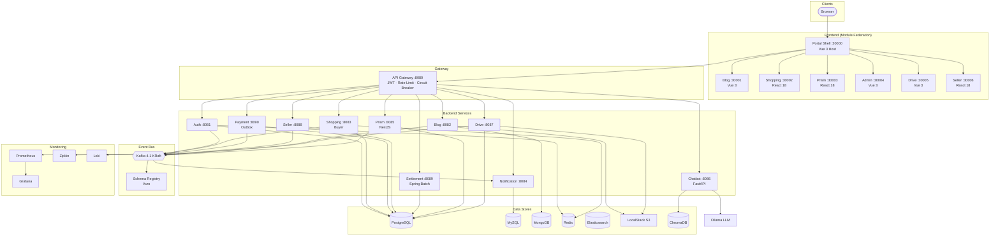

# Portal Universe

[](https://github.com/L-a-z-e/portal-universe/actions/workflows/java-ci.yml)
[](https://github.com/L-a-z-e/portal-universe/actions/workflows/frontend-ci.yml)
[](https://github.com/L-a-z-e/portal-universe/actions/workflows/prism-ci.yml)
[](https://github.com/L-a-z-e/portal-universe/actions/workflows/chatbot-ci.yml)
<br/>
[](https://opensource.org/licenses/MIT)


> A polyglot microservices portal platform — 11 backend services, 7 micro-frontend apps, 34 Kafka event topics, and a full observability stack — all wired together with Module Federation and event-driven architecture.

## Table of Contents

- [Features](#features)
- [Architecture](#architecture)
- [Tech Stack](#tech-stack)
- [Quick Start](#quick-start)
- [Project Structure](#project-structure)
- [Documentation](#documentation)
- [Development](#development)
- [License](#license)

## Features

- **Polyglot Microservices** — 11 services spanning Java 17 / Spring Boot 3.5.5, NestJS 11, and Python / FastAPI, communicating through Kafka and Feign
- **Micro-Frontend** — Module Federation with a Vue 3 Host + 3 React + 3 Vue Remotes, connected via a 2-Layer Bridge architecture
- **Event-Driven** — Kafka 4.1 (KRaft) with Avro Schema Registry, 34 event topics across 6 domain event modules, Transactional Outbox pattern
- **AI Integration** — Multi-provider support (Claude / GPT / Gemini / Ollama), RAG chatbot with LangChain + ChromaDB, AI task agent
- **Dual Design System** — 3-package architecture (design-core SSOT + 32 Vue components + 31 React components) with Storybook
- **Full Observability** — Prometheus, Grafana (9 dashboards), Zipkin, Loki, Alertmanager, cAdvisor, plus Redis / Kafka / MySQL exporters

## Architecture

### System Overview


```mermaid
graph TB
    subgraph Clients
        Browser([Browser])
    end

    subgraph Frontend["Frontend (Module Federation)"]
        Shell[Portal Shell :30000<br/>Vue 3 Host]
        BlogFE[Blog :30001<br/>Vue 3]
        ShopFE[Shopping :30002<br/>React 18]
        PrismFE[Prism :30003<br/>React 18]
        AdminFE[Admin :30004<br/>Vue 3]
        DriveFE[Drive :30005<br/>Vue 3]
        SellerFE[Seller :30006<br/>React 18]
    end

    subgraph Gateway
        GW[API Gateway :8080<br/>JWT · Rate Limit · Circuit Breaker]
    end

    subgraph Services["Backend Services"]
        Auth[Auth :8081]
        Blog[Blog :8082]
        Shop[Shopping :8083<br/>Buyer]
        Pay[Payment :8090<br/>Outbox]
        Seller[Seller :8088]
        Settle[Settlement :8089<br/>Spring Batch]
        Notif[Notification :8084]
        Prism[Prism :8085<br/>NestJS]
        Chat[Chatbot :8086<br/>FastAPI]
        Drive[Drive :8087]
    end

    subgraph EventBus["Event Bus"]
        Kafka{{Kafka 4.1 KRaft}}
        SR[Schema Registry<br/>Avro]
    end

    subgraph DataStores["Data Stores"]
        PG[(PostgreSQL)]
        MySQL[(MySQL)]
        Mongo[(MongoDB)]
        Redis[(Redis)]
        ES[(Elasticsearch)]
        S3[LocalStack S3]
        Chroma[(ChromaDB)]
    end

    subgraph Monitoring
        Prom[Prometheus]
        Graf[Grafana]
        Zip[Zipkin]
        Loki[Loki]
    end

    Browser --> Shell
    Shell --> BlogFE & ShopFE & PrismFE & AdminFE & DriveFE & SellerFE
    Shell --> GW

    GW --> Auth & Blog & Shop & Pay & Seller & Settle & Notif & Prism & Chat & Drive

    Auth & Shop & Pay & Seller & Settle & Prism & Drive --> PG
    Notif --> MySQL
    Blog --> Mongo
    Auth & Shop --> Redis
    Chat --> Chroma

    Auth & Shop & Pay & Seller & Blog & Drive & Prism --> Kafka
    Kafka --> SR
    Kafka --> Notif

    Blog & Drive --> S3
    Chat --> Ollama[Ollama LLM]

    Services --> Prom
    Services --> Zip
    Services --> Loki
    Prom --> Graf
```

<details>
<summary><strong>Backend Services</strong></summary>

| Service | Port | Tech | Key Features | Docs |
|---------|------|------|-------------|------|
| API Gateway | 8080 | Java / Spring | Routing, JWT validation, Circuit Breaker | — |
| Auth Service | 8081 | Java / Spring | OAuth2 / JWT, social login, hierarchical RBAC, membership | [API](docs/api/auth-service/) |
| Blog Service | 8082 | Java / Spring | Posts, series, comments, S3 uploads | [API](docs/api/blog-service/) |
| Shopping Service | 8083 | Java / Spring | Cart, orders, delivery, CQRS read model (Buyer) | [API](docs/api/shopping-service/) |
| Notification Service | 8084 | Java / Spring | Kafka consumer, real-time SSE | [API](docs/api/notification-service/) |
| Prism Service | 8085 | NestJS | AI task management, Kanban, AI execution | [Notion](https://www.notion.so/2f73df01028f81868293f88213d1a69c) |
| Chatbot Service | 8086 | Python / FastAPI | Multi-provider AI chatbot, RAG | [API](docs/api/chatbot-service/) |
| Drive Service | 8087 | Java / Spring | File storage and management | — |
| Shopping Seller | 8088 | Java / Spring | Seller, product, inventory, coupon, time-deal | [API](docs/api/shopping-seller-service/) |
| Shopping Settlement | 8089 | Java / Spring | Settlement batch processing | [API](docs/api/shopping-settlement-service/) |
| Payment Service | 8090 | Java / Spring | PaymentIntent, Transactional Outbox, Saga compensation | [API](docs/api/payment-service/) |

</details>

<details>
<summary><strong>Frontend Apps</strong></summary>

| App | Port | Tech | MF Role | Description |
|-----|------|------|---------|-------------|
| Portal Shell | 30000 | Vue 3 | Host | Main shell, auth, routing, shared API client |
| Blog | 30001 | Vue 3 | — | Blog with Markdown editor |
| Shopping | 30002 | React 18 | Remote | E-commerce storefront (Buyer) |
| Prism | 30003 | React 18 | Remote | AI task management, Kanban |
| Admin | 30004 | Vue 3 | Remote | Admin dashboard |
| Drive | 30005 | Vue 3 | Remote | File management |
| Shopping Seller | 30006 | React 18 | Remote | Seller management |

</details>

## Tech Stack

| Category | Technologies |
|----------|-------------|
| **Backend** | Java 17, Spring Boot 3.5.5, Spring Cloud 2025.0.0, NestJS 11, Python 3.11 / FastAPI |
| **Frontend** | Vue 3.5, React 18, Vite 7, Module Federation, TypeScript |
| **Design System** | design-core (tokens + variants SSOT) + design-vue + design-react, Storybook |
| **Database** | PostgreSQL 18, MySQL 8.0, MongoDB 8.0, Redis 7.4, ChromaDB |
| **Search** | Elasticsearch 8.18 |
| **Messaging** | Apache Kafka 4.1 (KRaft), Avro Schema Registry |
| **Monitoring** | Prometheus, Grafana, Zipkin, Loki, Alertmanager, Kibana, Dozzle, cAdvisor |
| **Infrastructure** | Docker, Kubernetes, LocalStack (S3 / SQS / EventBridge / Lambda), Terraform |
| **CI/CD** | GitHub Actions (8 workflows) |
| **AI** | Ollama (local LLM), LangChain, ChromaDB (RAG), multi-provider (Claude / GPT / Gemini) |

## Quick Start

### Prerequisites

- **Java 17** — SDKMAN recommended (`sdk install java 17-tem`)
- **Node.js 20+** — for frontend and prism-service
- **Python 3.11+** + **uv** — for chatbot-service
- **Docker & Docker Compose**

### Option A: Docker (Full Stack)

```bash
git clone https://github.com/L-a-z-e/portal-universe.git
cd portal-universe
docker compose up -d
```

| URL | Description |
|-----|-------------|
| http://localhost:30000 | Portal (main UI) |
| http://localhost:8080 | API Gateway |
| http://localhost:3000 | Grafana (`admin` / `password`) |

### Option B: Local Development

Start infrastructure via Docker, then run services individually with hot reload:

```bash
# 1. Infrastructure only
docker compose -f docker-compose-local.yml up -d

# 2. Backend (example: auth-service)
./gradlew services:auth-service:bootRun --args='--spring.profiles.active=local'

# 3. Frontend
cd frontend && npm install && npm run build:design && npm run build:libs && npm run dev
```

> **Full guide** with per-service commands, environment variables, and troubleshooting:
> [docs/guides/development/local-dev-setup.md](docs/guides/development/local-dev-setup.md)

<details>
<summary><strong>Port Map</strong></summary>

| Range | Services |
|-------|----------|
| 8080–8090 | Backend — API Gateway, Auth, Blog, Shopping, Notification, Prism, Chatbot, Drive, Seller, Settlement, Payment |
| 30000–30006 | Frontend — Shell, Blog, Shopping, Prism, Admin, Drive, Seller |
| 5432, 3307, 27017 | Databases — PostgreSQL, MySQL, MongoDB |
| 6379, 9092, 9200 | Redis, Kafka, Elasticsearch |
| 18081, 9000 | Schema Registry, AKHQ |
| 3000, 9090, 9411, 3100 | Monitoring — Grafana, Prometheus, Zipkin, Loki |
| 4566 | LocalStack (S3, SQS, EventBridge, Lambda) |

</details>

## Project Structure

<details>
<summary><strong>Full directory tree</strong></summary>

```
portal-universe/
├── services/                        # Backend microservices
│   ├── api-gateway/                 # Java/Spring — Routing, JWT, Circuit Breaker
│   ├── auth-service/                # Java/Spring — Auth, OAuth2, RBAC
│   ├── blog-service/                # Java/Spring — Blog, Markdown, S3
│   ├── shopping-service/            # Java/Spring — Cart, Order, Delivery, CQRS (Buyer)
│   ├── shopping-seller-service/     # Java/Spring — Seller, Product, Inventory
│   ├── shopping-settlement-service/ # Java/Spring — Settlement, Spring Batch
│   ├── payment-service/             # Java/Spring — Payment, Outbox, Saga
│   ├── notification-service/        # Java/Spring — Kafka consumer, SSE
│   ├── drive-service/               # Java/Spring — File storage
│   ├── prism-service/               # NestJS — AI tasks, Kanban
│   ├── chatbot-service/             # Python/FastAPI — AI chatbot, RAG
│   ├── common-library/              # Shared Java library
│   └── event-contracts/             # Avro event schemas (6 domains, 34 topics)
├── frontend/                        # Frontend applications
│   ├── portal-shell/                # Vue 3 — MF Host (:30000)
│   ├── blog-frontend/               # Vue 3 (:30001)
│   ├── shopping-frontend/           # React 18 — MF Remote (:30002)
│   ├── prism-frontend/              # React 18 — MF Remote (:30003)
│   ├── admin-frontend/              # Vue 3 — MF Remote (:30004)
│   ├── drive-frontend/              # Vue 3 — MF Remote (:30005)
│   ├── shopping-seller-frontend/    # React 18 — MF Remote (:30006)
│   ├── design-core/                 # Tokens, types, variant classes (SSOT)
│   ├── design-vue/                  # Vue component library (Storybook :6006)
│   ├── design-react/                # React component library (Storybook :6007)
│   ├── vue-bridge/                  # MF bridge for Vue remotes
│   ├── react-bridge/                # MF bridge for React remotes
│   └── react-bootstrap/             # React remote bootstrapper
├── docs/                            # Documentation hub
│   ├── adr/                         # Architecture Decision Records (57)
│   ├── api/                         # REST API specs per service
│   ├── architecture/                # System & service architecture
│   ├── contracts/                   # Event contract documentation
│   ├── guides/                      # Development & deployment guides
│   ├── runbooks/                    # Operational runbooks
│   └── troubleshooting/             # Issue resolution records
├── e2e-tests/                       # Playwright E2E tests (69 specs)
├── k8s/                             # Kubernetes manifests
├── monitoring/                      # Prometheus, Grafana, Loki configs
├── infrastructure/                  # DB init scripts, Docker configs
├── infra/                           # Terraform (LocalStack IaC)
├── lambda/                          # AWS Lambda functions
└── scripts/                         # Utility scripts
```

</details>

## Documentation

**[Portal Universe — Notion (full docs)](https://www.notion.so/l-a-z-e/Portal-Universe-2f73df01028f802cb03ff36054182571)**

| Category | Count | Link |
|----------|-------|------|
| Architecture Decision Records | 57 | [docs/adr/](docs/adr/) |
| API Specifications | per service | [docs/api/](docs/api/) |
| System & Service Architecture | — | [docs/architecture/](docs/architecture/) |
| Event Contracts | — | [docs/contracts/](docs/contracts/) |
| Development & Deployment Guides | — | [docs/guides/](docs/guides/) |
| Operational Runbooks | — | [docs/runbooks/](docs/runbooks/) |
| Troubleshooting Records | — | [docs/troubleshooting/](docs/troubleshooting/) |

<details>
<summary><strong>Key ADRs</strong></summary>

| ADR | Title |
|-----|-------|
| [ADR-041](docs/adr/ADR-041-shopping-service-decomposition.md) | Shopping service decomposition (Buyer / Seller / Settlement) |
| [ADR-043](docs/adr/ADR-043-design-system-package-consolidation.md) | Design system 3-package consolidation |
| [ADR-046](docs/adr/ADR-046-mysql-to-postgresql-migration.md) | MySQL → PostgreSQL migration |
| [ADR-047](docs/adr/ADR-047-avro-schema-registry-adoption.md) | Avro Schema Registry adoption |
| [ADR-048](docs/adr/ADR-048-k8s-ha-scaling-strategy.md) | Kubernetes HA & scaling strategy |
| [ADR-050](docs/adr/ADR-050-localstack-aws-services-expansion.md) | LocalStack AWS services expansion (SQS / EventBridge / Lambda) |
| [ADR-053](docs/adr/ADR-053-saga-cross-service-compensation.md) | Saga cross-service compensation |
| [ADR-054](docs/adr/ADR-054-event-stability-patterns.md) | Event stability — Outbox, resilient publisher |
| [ADR-055](docs/adr/ADR-055-payment-service-extraction.md) | Payment service extraction (:8090) |
| [ADR-056](docs/adr/ADR-056-instant-time-standardization.md) | Instant time standardization (LocalDateTime → Instant) |

</details>

## Development

### Git Convention

Branches: `feature/`, `fix/`, `refactor/`, `docs/`, `chore/`, `test/` — branched from `dev`.
Commits: `<type>(<scope>): <subject>` (e.g., `feat(auth): add social login`).

> Full guide: [docs/guides/development/git-convention.md](docs/guides/development/git-convention.md)
> Contributing: [docs/guides/development/contributing.md](docs/guides/development/contributing.md)

### Testing

- **E2E**: Playwright — 69 specs across all frontend apps ([e2e-tests/](e2e-tests/))
- **Backend**: JUnit 5 (Spring), Jest (NestJS), pytest (FastAPI)
- **Frontend**: Vitest (Vue), Jest (React)

<details>
<summary><strong>CI/CD Workflows</strong></summary>

| Workflow | Trigger | Description |
|----------|---------|-------------|
| [Java Backend CI](https://github.com/L-a-z-e/portal-universe/actions/workflows/java-ci.yml) | Push / PR to `main`, `dev` | Build & test Java services |
| [Frontend CI](https://github.com/L-a-z-e/portal-universe/actions/workflows/frontend-ci.yml) | Push / PR to `main`, `dev` | Lint, type-check, build frontend |
| [Prism Service CI](https://github.com/L-a-z-e/portal-universe/actions/workflows/prism-ci.yml) | Push / PR | NestJS build & test |
| [Chatbot Service CI](https://github.com/L-a-z-e/portal-universe/actions/workflows/chatbot-ci.yml) | Push / PR | Python lint & test |
| [Event Contract Check](https://github.com/L-a-z-e/portal-universe/actions/workflows/contract-check.yml) | Push / PR | Validate Avro event contracts |
| [E2E & Integration](https://github.com/L-a-z-e/portal-universe/actions/workflows/e2e.yml) | Push / PR | Playwright E2E tests |
| [Docker Build](https://github.com/L-a-z-e/portal-universe/actions/workflows/docker.yml) | Push / PR | Build Docker images |
| [Deploy](https://github.com/L-a-z-e/portal-universe/actions/workflows/deploy.yml) | Manual / Tag | Deploy to environment |

</details>

## License

MIT License — see [LICENSE](LICENSE) for details.
