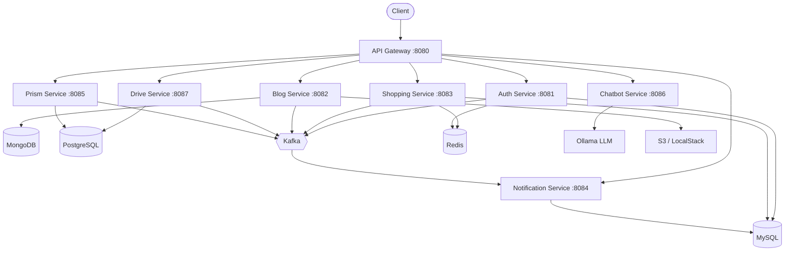
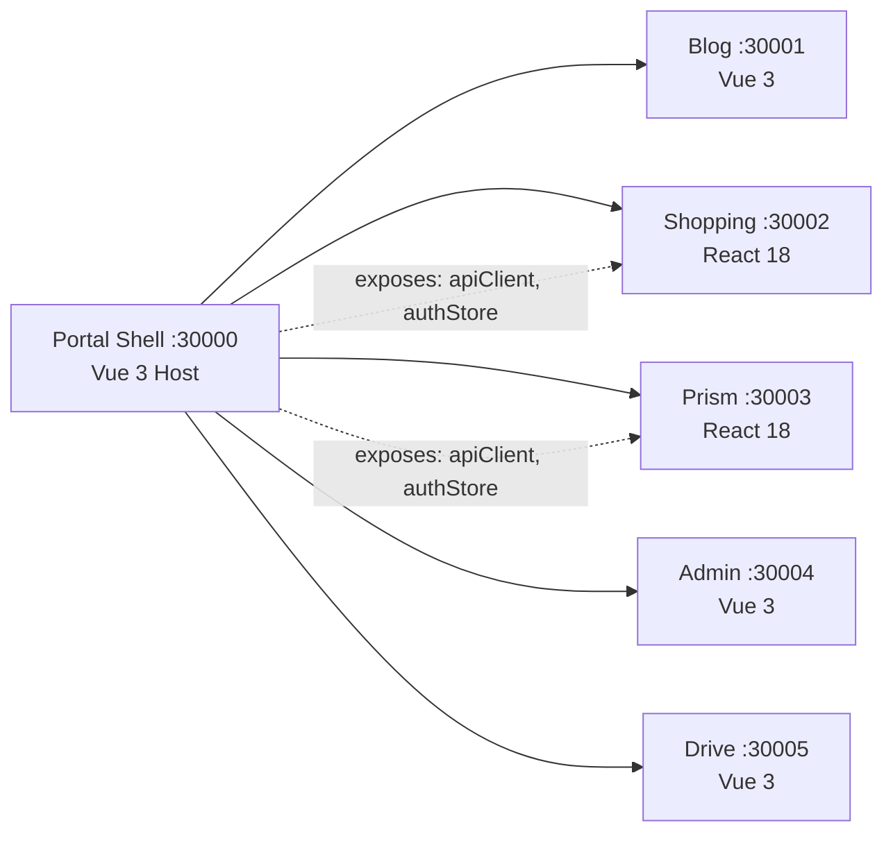

# Portal Universe

[](https://github.com/L-a-z-e/portal-universe/actions/workflows/java-ci.yml)
[](https://github.com/L-a-z-e/portal-universe/actions/workflows/frontend-ci.yml)
[](https://github.com/L-a-z-e/portal-universe/actions/workflows/prism-ci.yml)
[](https://github.com/L-a-z-e/portal-universe/actions/workflows/chatbot-ci.yml)
[](https://opensource.org/licenses/MIT)


> Polyglot microservices platform with Micro-Frontend architecture, Kafka event-driven communication, and full observability stack

## Overview

- **Polyglot Microservices**: 8 backend services across Java/Spring Boot, NestJS, and Python/FastAPI
- **Micro-Frontend**: Module Federation with Vue 3 Host + React 18 Remotes
- **Event-Driven**: Kafka-based async communication with JSON Schema event contracts
- **Full Observability**: Prometheus, Grafana, Zipkin, Loki, Kibana, Alertmanager
- **Dual Design System**: Shared design tokens powering both Vue and React component libraries

## Architecture

### Backend Services



### Micro-Frontend (Module Federation)



## Project Structure

```
portal-universe/
├── services/                    # Backend microservices
│   ├── api-gateway/             # Java/Spring - Routing, JWT, Circuit Breaker
│   ├── auth-service/            # Java/Spring - Auth, OAuth2, RBAC
│   ├── blog-service/            # Java/Spring - Blog, Markdown, S3
│   ├── shopping-service/        # Java/Spring - E-commerce, Saga, Queue
│   ├── notification-service/    # Java/Spring - Kafka consumer, SSE
│   ├── drive-service/           # Java/Spring - File storage
│   ├── prism-service/           # NestJS - AI task management, Kanban
│   ├── chatbot-service/         # Python/FastAPI - AI chatbot, RAG
│   ├── common-library/          # Shared Java library
│   ├── event-contracts/         # JSON Schema event contracts (SSOT)
│   ├── *-events/                # Per-service Kafka event modules (5)
│   └── load-tests/              # Performance test scripts
├── frontend/                    # Frontend applications
│   ├── portal-shell/            # Vue 3 - MF Host
│   ├── blog-frontend/           # Vue 3
│   ├── shopping-frontend/       # React 18 - MF Remote
│   ├── prism-frontend/          # React 18 - MF Remote
│   ├── admin-frontend/          # Vue 3 - MF Remote
│   ├── drive-frontend/          # Vue 3 - MF Remote
│   ├── design-system-vue/       # Vue component library (Storybook :6006)
│   ├── design-system-react/     # React component library (Storybook :6007)
│   ├── design-tokens/           # Shared design tokens
│   ├── design-types/            # Shared TypeScript types
│   ├── react-bridge/            # MF bridge for React remotes
│   └── react-bootstrap/         # React app bootstrapper
├── docs/                        # Documentation
│   ├── adr/                     # Architecture Decision Records (39)
│   ├── api/                     # API specifications
│   ├── architecture/            # System & service architecture
│   ├── guides/                  # Development & deployment guides
│   ├── runbooks/                # Operational runbooks
│   └── troubleshooting/         # Issue resolution records
├── e2e-tests/                   # Playwright E2E tests
├── k8s/                         # Kubernetes manifests
├── monitoring/                  # Prometheus, Grafana, Loki configs
└── infrastructure/              # DB init scripts, Docker configs
```

## Tech Stack

| Category | Technologies |
|----------|-------------|
| **Backend** | Java 17, Spring Boot 3.5.5, Spring Cloud 2025.0.0, NestJS 10, Python 3.11 / FastAPI |
| **Frontend** | Vue 3, React 18, Vite, Module Federation, TypeScript |
| **Design System** | Vue + React dual libraries, shared design tokens |
| **Database** | MySQL 8.0, PostgreSQL 18, MongoDB 8.0, Redis 7.4 |
| **Search** | Elasticsearch 8.18 |
| **Messaging** | Apache Kafka 4.1 (KRaft mode) |
| **Monitoring** | Prometheus, Grafana, Zipkin, Loki, Alertmanager, Kibana, Dozzle |
| **Infrastructure** | Docker, Kubernetes, LocalStack (S3) |
| **CI/CD** | GitHub Actions (8 workflows) |
| **AI** | Ollama (local LLM), RAG |

## Services

### Backend Services

| Service | Port | Tech | Description | API Docs |
|---------|------|------|-------------|----------|
| API Gateway | 8080 | Java/Spring | Routing, JWT validation, Circuit Breaker | - |
| Auth Service | 8081 | Java/Spring | OAuth2/JWT, social login, hierarchical RBAC, membership | [API](docs/api/auth-service/) |
| Blog Service | 8082 | Java/Spring | Posts, series, comments, S3 file upload | [API](docs/api/blog-service/) |
| Shopping Service | 8083 | Java/Spring | Products, cart, orders, Saga pattern, queue system | [API](docs/api/shopping-service/) |
| Notification Service | 8084 | Java/Spring | Kafka event consumer, real-time SSE notifications | [API](docs/api/notification-service/) |
| Prism Service | 8085 | NestJS | AI task management, Kanban board, AI execution | [Notion](https://www.notion.so/2f73df01028f81868293f88213d1a69c) |
| Chatbot Service | 8086 | Python/FastAPI | AI chatbot, RAG-based conversation | [API](docs/api/chatbot-service/) |
| Drive Service | 8087 | Java/Spring | File storage and management | - |

### Shared Libraries

| Module | Type | Description |
|--------|------|-------------|
| `common-library` | Java | Shared utilities, API response wrapper, error codes |
| `event-contracts` | JSON Schema | Polyglot event contract definitions (SSOT) |
| `auth-events` | Java | Auth domain Kafka event DTOs |
| `blog-events` | Java | Blog domain Kafka event DTOs |
| `shopping-events` | Java | Shopping domain Kafka event DTOs |
| `drive-events` | Java | Drive domain Kafka event DTOs |
| `prism-events` | Java | Prism domain Kafka event DTOs |
| `react-bridge` | TypeScript | Module Federation bridge for React remotes |
| `react-bootstrap` | TypeScript | Bootstrapper for React remote apps |

### Frontend Applications

| App | Port | Tech | MF Role | Description |
|-----|------|------|---------|-------------|
| Portal Shell | 30000 | Vue 3 | Host | Main shell, auth, routing, shared API client |
| Blog Frontend | 30001 | Vue 3 | - | Blog with Markdown editor |
| Shopping Frontend | 30002 | React 18 | Remote | E-commerce storefront + admin |
| Prism Frontend | 30003 | React 18 | Remote | AI task management, Kanban |
| Admin Frontend | 30004 | Vue 3 | Remote | Admin dashboard |
| Drive Frontend | 30005 | Vue 3 | Remote | File management |

### Design System

Dual component libraries with shared foundations:

- **design-tokens**: Platform-independent design tokens (colors, spacing, typography)
- **design-types**: Shared TypeScript type definitions
- **design-system-vue**: Vue 3 component library (Storybook on `:6006`)
- **design-system-react**: React 18 component library (Storybook on `:6007`)

### Infrastructure (docker-compose-local.yml)

| Service | Port | Description |
|---------|------|-------------|
| MySQL | 3307 | Auth, Shopping, Notification data |
| PostgreSQL | 5432 | Prism, Drive data |
| MongoDB | 27017 | Blog data |
| Redis | 6379 | Caching, coupon issuing, queue |
| Elasticsearch | 9200 | Search, Zipkin storage |
| Kafka | 9092 | Event messaging (KRaft) |
| LocalStack | 4566 | S3-compatible storage |
| Prometheus | 9090 | Metrics collection |
| Grafana | 3000 | Dashboards (admin/password) |
| Zipkin | 9411 | Distributed tracing |
| Loki | 3100 | Log aggregation |
| Alertmanager | 9094 | Alert management |
| Kibana | 5601 | Elasticsearch UI |
| Dozzle | 9999 | Container log viewer |

## Quick Start (Docker)

```bash
git clone https://github.com/L-a-z-e/portal-universe.git
cd portal-universe
docker compose up -d
```

| URL | Description |
|-----|-------------|
| http://localhost:30000 | Portal |
| http://localhost:8080 | API Gateway |
| http://localhost:3000 | Grafana (admin/password) |

## Local Development

### Prerequisites

- **Java 17** (SDKMAN recommended: `sdk install java 17-tem`)
- **Node.js 20+** (for frontend workspace and prism-service)
- **Python 3.11+** (for chatbot-service)
- **Docker & Docker Compose** (for infrastructure)

### 1. Start Infrastructure

Start only databases, messaging, and monitoring via Docker:

```bash
docker compose -f docker-compose-local.yml up -d
```

### 2. Backend Services

#### Java/Spring (6 services)

Run from project root using Gradle multi-module:

```bash
./gradlew services:api-gateway:bootRun --args='--spring.profiles.active=local'
./gradlew services:auth-service:bootRun --args='--spring.profiles.active=local'
./gradlew services:blog-service:bootRun --args='--spring.profiles.active=local'
./gradlew services:shopping-service:bootRun --args='--spring.profiles.active=local'
./gradlew services:notification-service:bootRun --args='--spring.profiles.active=local'
./gradlew services:drive-service:bootRun --args='--spring.profiles.active=local'
```

> **Warning**: `--spring.profiles.active=local` is **required**. Without it, `application-local.yml` won't load and DB connections will fail.

#### NestJS (prism-service)

```bash
cd services/prism-service
npm run start:dev    # Watch mode, auto-loads .env.local
```

#### Python (chatbot-service)

```bash
cd services/chatbot-service
uvicorn app.main:app --reload --port 8086
```

#### Environment Variables

| Service | Required File | Status |
|---------|--------------|--------|
| auth-service | `.env.local` (OAuth2 client ID/Secret) | Pre-configured |
| prism-service | `.env.local` (DB, Kafka, Redis, Encryption Key) | Pre-configured |
| chatbot-service | `.env` (AI Provider config) | See `.env.example` |

### 3. Frontend

All commands from `frontend/` directory:

```bash
cd frontend
npm install
```

**First-time build (required once):**

```bash
npm run build:design    # Design system
npm run build:libs      # React bridge + bootstrap
```

**Development:**

```bash
npm run dev             # All apps simultaneously
```

Or run individually:

| Command | App | Port |
|---------|----|------|
| `npm run dev:portal` | Portal Shell | 30000 |
| `npm run dev:blog` | Blog | 30001 |
| `npm run dev:shopping` | Shopping | 30002 |
| `npm run dev:prism` | Prism | 30003 |
| `npm run dev:admin` | Admin | 30004 |
| `npm run dev:drive` | Drive | 30005 |

> Hot reload is enabled for all frontend apps.

### 4. Port Map

| Range | Services |
|-------|----------|
| **8080-8087** | Backend (API Gateway, Auth, Blog, Shopping, Notification, Prism, Chatbot, Drive) |
| **30000-30005** | Frontend (Shell, Blog, Shopping, Prism, Admin, Drive) |
| **3307, 5432, 27017** | Databases (MySQL, PostgreSQL, MongoDB) |
| **6379, 9092, 9200** | Redis, Kafka, Elasticsearch |
| **3000, 9090, 9411, 5601** | Monitoring (Grafana, Prometheus, Zipkin, Kibana) |

### 5. Verify Setup

Open these URLs to confirm everything is running:

- **Portal**: http://localhost:30000
- **API Gateway**: http://localhost:8080
- **Grafana**: http://localhost:3000 (admin/password)
- **Prometheus**: http://localhost:9090
- **Zipkin**: http://localhost:9411
- **Kibana**: http://localhost:5601

## Documentation

### Notion (Full Documentation)

**[Portal Universe Documentation](https://www.notion.so/l-a-z-e/Portal-Universe-2f73df01028f802cb03ff36054182571)**

### GitHub Docs

| Category | Description | Link |
|----------|-------------|------|
| **ADR** | 39 Architecture Decision Records | [docs/adr/](docs/adr/) |
| **API** | REST API specifications per service | [docs/api/](docs/api/) |
| **Architecture** | System & service architecture | [docs/architecture/](docs/architecture/) |
| **Guides** | Development & deployment guides | [docs/guides/](docs/guides/) |
| **Runbooks** | Operational procedures | [docs/runbooks/](docs/runbooks/) |
| **Troubleshooting** | Issue resolution records | [docs/troubleshooting/](docs/troubleshooting/) |

## CI/CD

| Workflow | Trigger | Description |
|----------|---------|-------------|
| [Java Backend CI](https://github.com/L-a-z-e/portal-universe/actions/workflows/java-ci.yml) | Push/PR to `main`, `dev` | Build & test Java services |
| [Frontend CI](https://github.com/L-a-z-e/portal-universe/actions/workflows/frontend-ci.yml) | Push/PR to `main`, `dev` | Lint, type-check, build frontend |
| [Prism Service CI](https://github.com/L-a-z-e/portal-universe/actions/workflows/prism-ci.yml) | Push/PR | NestJS build & test |
| [Chatbot Service CI](https://github.com/L-a-z-e/portal-universe/actions/workflows/chatbot-ci.yml) | Push/PR | Python lint & test |
| [Event Contract Check](https://github.com/L-a-z-e/portal-universe/actions/workflows/contract-check.yml) | Push/PR | Validate event schema contracts |
| [E2E & Integration](https://github.com/L-a-z-e/portal-universe/actions/workflows/e2e.yml) | Push/PR | Playwright E2E tests |
| [Docker Build](https://github.com/L-a-z-e/portal-universe/actions/workflows/docker.yml) | Push/PR | Build Docker images |
| [Deploy](https://github.com/L-a-z-e/portal-universe/actions/workflows/deploy.yml) | Manual/Tag | Deploy to environment |

## Contributing

1. Create a feature branch from `dev`: `git checkout -b feature/your-feature`
2. Follow commit conventions: `<type>(<scope>): <subject>` (e.g., `feat(auth): add social login`)
3. Push and create a Pull Request to `dev`
4. Branch naming: `feature/`, `fix/`, `refactor/`, `docs/`, `chore/`, `test/`

## License

MIT License - see [LICENSE](LICENSE) for details.
