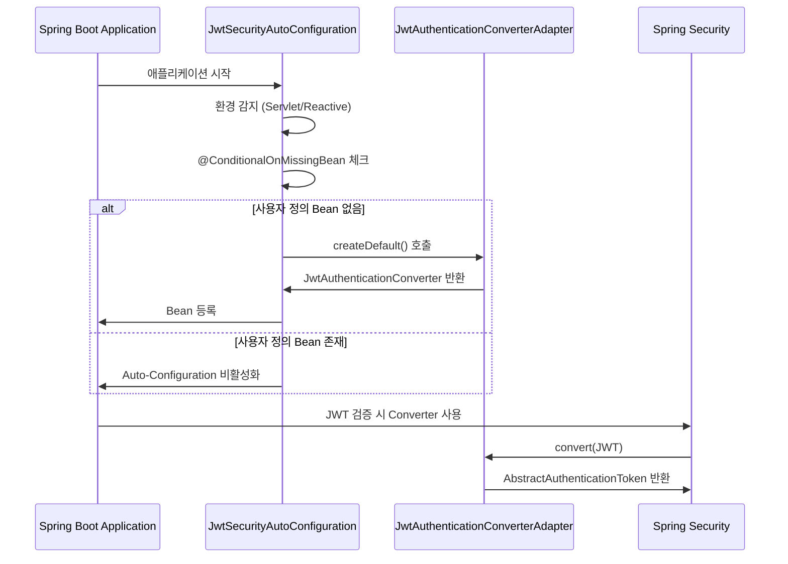

# ADR-004: JWT RBAC 자동 설정 전략

## 상태
Accepted

## 날짜
2026-01-19

---

## 컨텍스트

Portal Universe 마이크로서비스 아키텍처에서는 각 서비스(Auth, Blog, Shopping, Notification)가 JWT 기반 인증/인가를 구현해야 합니다. 특히 **JWT 토큰의 `roles` 클레임을 Spring Security의 `GrantedAuthority`로 변환**하는 작업은 모든 서비스에서 동일하게 필요합니다.

### 문제 상황

```java
// Blog Service의 SecurityConfig.java
@Bean
public JwtAuthenticationConverter jwtAuthenticationConverter() {
    JwtGrantedAuthoritiesConverter grantedAuthoritiesConverter =
        new JwtGrantedAuthoritiesConverter();
    grantedAuthoritiesConverter.setAuthoritiesClaimName("roles");
    grantedAuthoritiesConverter.setAuthorityPrefix("");

    JwtAuthenticationConverter converter = new JwtAuthenticationConverter();
    converter.setJwtGrantedAuthoritiesConverter(grantedAuthoritiesConverter);
    return converter;
}

// Shopping Service의 SecurityConfig.java
@Bean
public JwtAuthenticationConverter jwtAuthenticationConverter() {
    // 위와 동일한 코드 반복...
}

// Notification Service의 SecurityConfig.java
@Bean
public JwtAuthenticationConverter jwtAuthenticationConverter() {
    // 위와 동일한 코드 반복...
}
```

**반복되는 문제점**:
1. 동일한 JWT 권한 변환 로직이 각 서비스마다 중복 구현됨
2. Servlet(Spring MVC)와 Reactive(Spring WebFlux) 환경별로 다른 구현 필요
3. 설정 변경 시 모든 서비스에서 수정 필요
4. 신규 서비스 추가 시마다 보일러플레이트 코드 작성 필요

### 환경별 차이점

| 환경 | 사용 서비스 | 필요 컴포넌트 | 반환 타입 |
|------|------------|--------------|----------|
| **Servlet (Spring MVC)** | Auth, Blog, Shopping, Notification | `JwtAuthenticationConverter` | `AbstractAuthenticationToken` |
| **Reactive (Spring WebFlux)** | API Gateway | `Converter<Jwt, Mono<AbstractAuthenticationToken>>` | `Mono<AbstractAuthenticationToken>` |

---

## 결정

**Common Library에 Spring Boot Auto-Configuration을 추가**하여 JWT RBAC 설정을 자동화합니다.

### 구현 구조

```
services/common-library/
└── src/main/java/.../security/
    ├── config/
    │   └── JwtSecurityAutoConfiguration.java   # Auto-Configuration 클래스
    └── converter/
        ├── JwtAuthenticationConverterAdapter.java           # Servlet 환경용
        └── ReactiveJwtAuthenticationConverterAdapter.java   # Reactive 환경용
```

### 핵심 설계 원칙

#### 1. 환경별 자동 감지 및 Bean 등록

```java
@AutoConfiguration
@ConditionalOnClass(JwtAuthenticationConverter.class)
public class JwtSecurityAutoConfiguration {

    // Servlet 환경에서만 동작
    @Bean
    @ConditionalOnWebApplication(type = ConditionalOnWebApplication.Type.SERVLET)
    @ConditionalOnMissingBean(JwtAuthenticationConverter.class)
    public JwtAuthenticationConverter jwtAuthenticationConverter() {
        return JwtAuthenticationConverterAdapter.createDefault();
    }

    // Reactive 환경에서만 동작
    @Bean
    @ConditionalOnWebApplication(type = ConditionalOnWebApplication.Type.REACTIVE)
    @ConditionalOnMissingBean(name = "reactiveJwtAuthenticationConverter")
    public Converter<Jwt, Mono<AbstractAuthenticationToken>> reactiveJwtAuthenticationConverter() {
        return new ReactiveJwtAuthenticationConverterAdapter();
    }
}
```

#### 2. 커스터마이징 가능성 보장

`@ConditionalOnMissingBean` 어노테이션을 사용하여 **각 서비스에서 동일한 타입의 Bean을 정의하면 자동 설정이 비활성화**됩니다.

```java
// 특정 서비스에서 커스텀 설정이 필요한 경우
@Configuration
public class CustomSecurityConfig {

    @Bean
    public JwtAuthenticationConverter jwtAuthenticationConverter() {
        // 커스텀 로직 구현
        return JwtAuthenticationConverterAdapter.create("authorities", "ROLE_");
    }
}
// → Auto-Configuration의 Bean은 생성되지 않음
```

#### 3. 기본 권한 변환 규칙

```java
public static JwtAuthenticationConverter createDefault() {
    return create("roles", "");  // 클레임: "roles", 접두사: ""
}
```

**Auth-Service JWT 토큰 예시**:
```json
{
  "sub": "user123",
  "email": "user@example.com",
  "roles": ["ROLE_USER", "ROLE_ADMIN"],  // 이미 ROLE_ 접두사 포함
  "iat": 1737285600,
  "exp": 1737372000
}
```

Spring Security의 `GrantedAuthority`로 변환 시:
- `SimpleGrantedAuthority("ROLE_USER")`
- `SimpleGrantedAuthority("ROLE_ADMIN")`

### 동작 흐름



### 서비스별 적용 현황

| 서비스 | 환경 | 자동 설정 적용 | 커스터마이징 |
|--------|------|---------------|-------------|
| **API Gateway** | Reactive | ✅ `ReactiveJwtAuthenticationConverterAdapter` | ❌ 기본 설정 사용 |
| **Auth Service** | Servlet | ✅ `JwtAuthenticationConverterAdapter` | ❌ 기본 설정 사용 |
| **Blog Service** | Servlet | ✅ `JwtAuthenticationConverterAdapter` | ❌ 기본 설정 사용 |
| **Shopping Service** | Servlet | ✅ `JwtAuthenticationConverterAdapter` | ❌ 기본 설정 사용 |
| **Notification Service** | Servlet | ✅ `JwtAuthenticationConverterAdapter` | ❌ 기본 설정 사용 |

---

## 대안 검토

### 대안 1: 각 서비스마다 개별 구현 (기존 방식)

| 장점 | 단점 |
|------|------|
| ✅ 서비스 간 결합도 낮음 | ❌ 코드 중복 (5개 서비스 × 20줄 = 100줄) |
| ✅ 서비스별 완전한 자율성 | ❌ 설정 변경 시 모든 서비스 수정 필요 |
| | ❌ 신규 서비스 추가 시 보일러플레이트 작성 |
| | ❌ 실수로 인한 설정 불일치 가능성 |

**평가**: ❌ 유지보수 비용이 너무 높음

---

### 대안 2: Common Library에 유틸리티 클래스 제공

```java
public class JwtSecurityUtils {
    public static JwtAuthenticationConverter createDefaultConverter() {
        // ...
    }
}

// 각 서비스에서 사용
@Bean
public JwtAuthenticationConverter jwtAuthenticationConverter() {
    return JwtSecurityUtils.createDefaultConverter();
}
```

| 장점 | 단점 |
|------|------|
| ✅ 로직 재사용 가능 | ❌ 각 서비스에서 여전히 Bean 등록 코드 필요 |
| ✅ 설정 변경 시 Utils만 수정 | ❌ Servlet/Reactive 환경 구분 처리 불가 |
| | ❌ 개발자가 직접 Bean 등록을 잊어버릴 가능성 |

**평가**: ⚠️ 부분적 개선이나 근본적 해결책은 아님

---

### 대안 3: Spring Boot Auto-Configuration 사용 (선택됨)

| 장점 | 단점 |
|------|------|
| ✅ **Zero Configuration**: 의존성 추가만으로 자동 적용 | ❌ Common Library와 서비스 간 결합도 증가 |
| ✅ **환경별 자동 감지**: Servlet/Reactive 자동 구분 | ❌ Auto-Configuration 동작 원리 이해 필요 |
| ✅ **커스터마이징 가능**: `@ConditionalOnMissingBean` 활용 | ❌ 디버깅 시 Auto-Configuration 흐름 추적 필요 |
| ✅ **일관성 보장**: 모든 서비스에서 동일한 설정 적용 | |
| ✅ **유지보수 용이**: 중앙 집중식 관리 | |

**평가**: ✅ 가장 효율적이고 Spring Boot 철학에 부합

---

## 결과

### 긍정적 영향

#### 1. 코드 중복 제거
```diff
- Blog Service SecurityConfig.java (20줄)
- Shopping Service SecurityConfig.java (20줄)
- Notification Service SecurityConfig.java (20줄)
- API Gateway SecurityConfig.java (25줄)
+ JwtSecurityAutoConfiguration.java (55줄)
+ JwtAuthenticationConverterAdapter.java (50줄)
+ ReactiveJwtAuthenticationConverterAdapter.java (73줄)

총 85줄 → 178줄로 보이지만,
실제로는 각 서비스의 100줄 중복 제거 + 재사용 가능한 178줄 추가
순수 감소: 약 80줄 + 향후 신규 서비스에서도 추가 감소
```

#### 2. 일관된 보안 설정
- 모든 서비스에서 `roles` 클레임을 동일한 방식으로 처리
- 권한 검증 로직 통일 (`@PreAuthorize("hasRole('ADMIN')")` 등)

#### 3. 신규 서비스 개발 속도 향상
```java
// 기존: SecurityConfig에서 20줄 작성 필요
// 현재: dependencies에 common-library만 추가
dependencies {
    implementation project(':services:common-library')
}
// → JWT 권한 변환 자동 적용
```

#### 4. 유지보수 용이성
- JWT 클레임 이름 변경 시: `JwtAuthenticationConverterAdapter.createDefault()` 한 곳만 수정
- 권한 접두사 규칙 변경 시: 동일하게 한 곳만 수정

### 부정적 영향 (및 완화 방안)

#### 1. Common Library와 서비스 간 결합도 증가

**문제**: Common Library 변경 시 모든 서비스에 영향

**완화 방안**:
- Common Library는 안정적인 라이브러리로 관리
- Breaking Change 시 명확한 Migration Guide 제공
- Semantic Versioning 적용 (Major.Minor.Patch)

#### 2. Auto-Configuration 동작 원리 이해 필요

**문제**: 신규 개발자가 Bean이 어디서 등록되는지 혼란

**완화 방안**:
- `CLAUDE.md`에 Auto-Configuration 설명 추가
- IntelliJ 등 IDE의 Auto-Configuration 탐색 기능 활용
- 로그 레벨 `DEBUG`로 설정 시 Auto-Configuration 로그 확인 가능

#### 3. 디버깅 복잡도 증가

**문제**: 권한 검증 오류 발생 시 Auto-Configuration 흐름 추적 필요

**완화 방안**:
```yaml
# application-local.yml
logging:
  level:
    org.springframework.boot.autoconfigure: DEBUG
    com.portal.universe.commonlibrary.security: DEBUG
```

---

## 다음 단계

### 1. 문서화 작업
- [x] ADR-004 작성
- [ ] `CLAUDE.md`에 JWT 자동 설정 섹션 추가
- [ ] Common Library README에 사용 가이드 작성

### 2. 테스트 강화
- [ ] `JwtSecurityAutoConfigurationTest.java` 작성
  - Servlet 환경에서 Bean 자동 등록 검증
  - Reactive 환경에서 Bean 자동 등록 검증
  - `@ConditionalOnMissingBean` 동작 검증
- [ ] 각 서비스의 통합 테스트에서 권한 검증 테스트 추가

### 3. 모니터링 및 로깅
- [ ] Spring Boot Actuator로 등록된 Bean 확인
  ```bash
  curl http://localhost:8080/actuator/beans | jq '.contexts.application.beans | keys | .[] | select(contains("jwt"))'
  ```
- [ ] JWT 권한 변환 실패 시 명확한 에러 로그 추가

### 4. 추가 개선 고려사항
- [ ] JWT 클레임 이름을 `application.yml`에서 설정 가능하도록 `@ConfigurationProperties` 추가
  ```yaml
  security:
    jwt:
      authorities-claim-name: roles
      authority-prefix: ""
  ```
- [ ] 권한 변환 실패 시 Fallback 전략 구현

---

## 관련 문서

- [ADR-003: Admin 권한 검증 전략](./ADR-003-authorization-strategy.md)
- [Common Library 보안 설정 가이드](../../services/common-library/README.md)
- [JWT 인증/인가 아키텍처](../architecture/jwt-authentication-flow.md)

---

## 참조 소스 코드

| 파일 | 역할 |
|------|------|
| `services/common-library/.../security/config/JwtSecurityAutoConfiguration.java` | Auto-Configuration 클래스 |
| `services/common-library/.../security/converter/JwtAuthenticationConverterAdapter.java` | Servlet 환경용 Adapter |
| `services/common-library/.../security/converter/ReactiveJwtAuthenticationConverterAdapter.java` | Reactive 환경용 Adapter |

---

**작성자**: Documenter Agent
**최종 업데이트**: 2026-01-19
