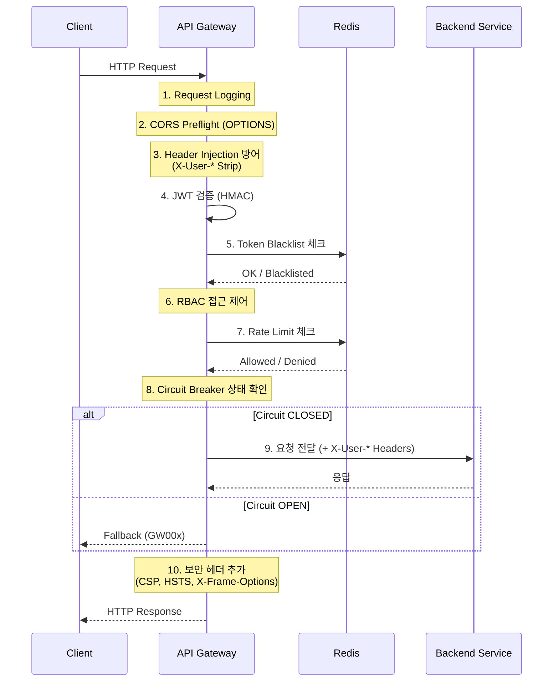

# API Gateway API Documentation

API Gateway의 라우팅, 보안, Rate Limiting, 장애 복원력, 모니터링 명세 문서입니다.

## 문서 목록

| 문서 | 설명 | 상태 |
|------|------|------|
| [routing-specification.md](./routing-specification.md) | 전체 23+ 라우트 테이블, CORS, 환경별 URL | current |
| [security-authentication.md](./security-authentication.md) | JWT Multi-key, RBAC, Token Blacklist, 보안 헤더 | current |
| [rate-limiting.md](./rate-limiting.md) | 5개 Rate Limiter, 3개 Key Resolver, 429 응답 | current |
| [resilience.md](./resilience.md) | Circuit Breaker, Fallback, Time Limiter | current |
| [health-monitoring.md](./health-monitoring.md) | 통합 Health API, Kubernetes, Prometheus, Zipkin | current |
| [error-reference.md](./error-reference.md) | 에러 코드 통합 (A001~GW004), 트러블슈팅 | current |

## 개요

| 항목 | 내용 |
|------|------|
| **Base URL** | `http://localhost:8080` |
| **기술** | Spring Cloud Gateway (WebFlux) |
| **인증** | HMAC Multi-key JWT 검증 |
| **Rate Limiting** | Redis Token Bucket (5개 Limiter) |
| **Circuit Breaker** | Resilience4j (5개 인스턴스) |
| **모니터링** | Prometheus, Zipkin, 통합 Health API |

## 요청 라이프사이클

## 필터 실행 순서

| 순서 | 필터 | 역할 |
|------|------|------|
| 1 | `RequestPathLoggingFilter` | 요청 경로/메서드 로깅 |
| 2 | `CorsWebFilter` | CORS Preflight 처리 |
| 3 | `SecurityHeadersFilter` | 보안 응답 헤더 (beforeCommit) |
| 4 | `JwtAuthenticationFilter` | JWT 검증, Blacklist, User Context |
| 5 | `SecurityFilterChain` | RBAC 접근 제어 |
| 6 | Route Filters | Rate Limiter, Circuit Breaker, StripPrefix, RewritePath |
| 7 | `RateLimitHeaderFilter` | Rate Limit 헤더 로깅 |

## 관련 문서

- [API Gateway Architecture](../../architecture/api-gateway/system-overview.md)

---

**최종 업데이트**: 2026-02-06
