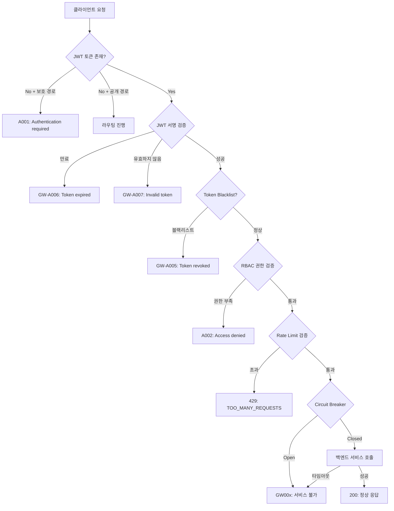

# API Gateway 에러 코드 레퍼런스

## 에러 코드 통합 테이블

| 코드 | HTTP Status | 메시지 | 발생 소스 | 트리거 |
|------|-------------|--------|-----------|--------|
| `A001` | 401 | Authentication required | CustomAuthenticationEntryPoint | 토큰 없이 보호된 경로 접근 |
| `A002` | 403 | Access denied | CustomAccessDeniedHandler | RBAC 권한 부족 |
| `GW-A005` | 401 | Token revoked | JwtAuthenticationFilter | 블랙리스트된 토큰 사용 |
| `GW-A006` | 401 | Token expired | JwtAuthenticationFilter | 만료된 JWT 토큰 |
| `GW-A007` | 401 | Invalid token | JwtAuthenticationFilter | 서명 검증 실패, 손상된 토큰 |
| `GW001` | 503 | 인증 서비스를 일시적으로 사용할 수 없습니다 | FallbackController | auth-service Circuit Breaker Open |
| `GW002` | 503 | 블로그 서비스를 일시적으로 사용할 수 없습니다 | FallbackController | blog-service Circuit Breaker Open |
| `GW003` | 503 | 쇼핑 서비스를 일시적으로 사용할 수 없습니다 | FallbackController | shopping-service Circuit Breaker Open |
| `GW004` | 503 | 알림 서비스를 일시적으로 사용할 수 없습니다 | FallbackController | notification-service Circuit Breaker Open |
| `TOO_MANY_REQUESTS` | 429 | 요청 한도를 초과했습니다 | RateLimitHeaderFilter | Rate Limit 초과 |

## 에러 응답 형식

API Gateway의 모든 에러는 통일된 `ApiResponse` 형식으로 반환됩니다.

### 인증 에러 (401)

**토큰 없이 보호된 경로 접근 (`A001`)**:
```json
{
  "success": false,
  "data": null,
  "error": {
    "code": "A001",
    "message": "Authentication required"
  }
}
```

**만료된 토큰 (`GW-A006`)**:
```json
{
  "success": false,
  "data": null,
  "error": {
    "code": "GW-A006",
    "message": "Token expired"
  }
}
```

**블랙리스트 토큰 (`GW-A005`)**:
```json
{
  "success": false,
  "data": null,
  "error": {
    "code": "GW-A005",
    "message": "Token revoked"
  }
}
```

**유효하지 않은 토큰 (`GW-A007`)**:
```json
{
  "success": false,
  "data": null,
  "error": {
    "code": "GW-A007",
    "message": "Invalid token"
  }
}
```

> 401 응답에는 `X-Auth-Error` 헤더도 포함됩니다 (값: 에러 메시지).

### 인가 에러 (403)

```json
{
  "success": false,
  "data": null,
  "error": {
    "code": "A002",
    "message": "Access denied"
  }
}
```

### 서비스 불가 에러 (503)

```json
{
  "success": false,
  "data": {},
  "error": {
    "code": "GW001",
    "message": "인증 서비스를 일시적으로 사용할 수 없습니다. 잠시 후 다시 시도해 주세요.",
    "timestamp": "2026-02-06T14:23:45.123"
  }
}
```

### Rate Limit 에러 (429)

```http
HTTP/1.1 429 Too Many Requests
Retry-After: 60
X-RateLimit-Remaining: 0
X-RateLimit-Replenish-Rate: 1
X-RateLimit-Burst-Capacity: 5
```

```json
{
  "success": false,
  "data": null,
  "error": {
    "code": "TOO_MANY_REQUESTS",
    "message": "요청 한도를 초과했습니다. 60초 후에 다시 시도해주세요."
  }
}
```

## 에러 처리 흐름



## 트러블슈팅 가이드

### A001: Authentication required

| 항목 | 내용 |
|------|------|
| **원인** | Authorization 헤더 없이 보호된 경로 접근 |
| **검증** | `curl -v` 로 요청 헤더 확인 |
| **해결** | `Authorization: Bearer <token>` 헤더 추가 |
| **참고** | 공개 경로인데 401이 발생하면 `gateway.public-paths` 설정 확인 |

### GW-A005: Token revoked

| 항목 | 내용 |
|------|------|
| **원인** | 로그아웃된 토큰 사용 (Redis Blacklist에 등록됨) |
| **검증** | Redis에서 `blacklist:{token}` 키 조회 |
| **해결** | 새 토큰 발급 (재로그인) |

### GW-A006: Token expired

| 항목 | 내용 |
|------|------|
| **원인** | JWT 토큰 만료 (exp 클레임 경과) |
| **검증** | JWT 디코딩하여 `exp` 클레임 확인 |
| **해결** | Refresh Token으로 새 Access Token 발급 |

### GW-A007: Invalid token

| 항목 | 내용 |
|------|------|
| **원인** | JWT 서명 검증 실패, 변조된 토큰, 알 수 없는 kid |
| **검증** | JWT 헤더의 `kid` 값이 Gateway 설정에 있는지 확인 |
| **해결** | 토큰 재발급. kid 불일치 시 Gateway JWT 설정 확인 |

### A002: Access denied

| 항목 | 내용 |
|------|------|
| **원인** | RBAC 권한 부족 (필요 역할 미보유) |
| **검증** | JWT 토큰의 `roles` 클레임 확인 |
| **해결** | 필요 권한 부여 또는 적절한 엔드포인트 사용 |

### GW001~GW004: 서비스 불가

| 항목 | 내용 |
|------|------|
| **원인** | 백엔드 서비스 장애 → Circuit Breaker Open |
| **검증** | `GET /api/health/services`로 대상 서비스 상태 확인 |
| **해결** | 백엔드 서비스 복구 후 Circuit Breaker 자동 복구 (10초 후 Half-Open) |
| **참고** | `wait-duration-in-open-state: 10s` |

### 429: TOO_MANY_REQUESTS

| 항목 | 내용 |
|------|------|
| **원인** | Rate Limit 초과 |
| **검증** | `X-RateLimit-Remaining` 응답 헤더 확인 |
| **해결** | `Retry-After` 헤더의 시간만큼 대기 후 재시도 |
| **참고** | Development 환경(local/docker)에서는 완화된 제한 적용 |

## 소스 파일 참조

| 파일 | 생성하는 에러 코드 |
|------|-------------------|
| `security/CustomAuthenticationEntryPoint.java` | A001 |
| `security/CustomAccessDeniedHandler.java` | A002 |
| `filter/JwtAuthenticationFilter.java` | GW-A005, GW-A006, GW-A007 |
| `controller/FallbackController.java` | GW001, GW002, GW003, GW004 |
| `filter/RateLimitHeaderFilter.java` | TOO_MANY_REQUESTS |

## 관련 문서

- [보안 및 인증](./security-authentication.md) - JWT 검증, RBAC, Token Blacklist
- [Rate Limiting](./rate-limiting.md) - Rate Limiter 설정, 429 응답
- [장애 복원력](./resilience.md) - Circuit Breaker, Fallback
