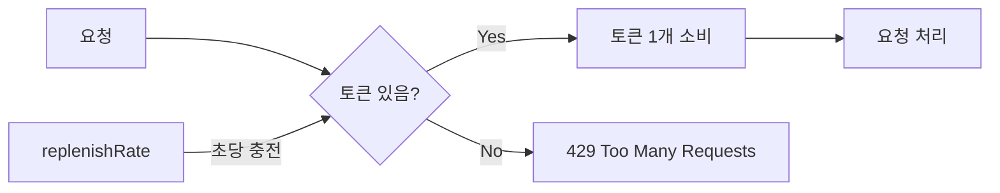

# API Gateway Rate Limiting

## 개요

API Gateway는 Redis 기반 Token Bucket 알고리즘으로 요청 속도를 제한합니다. 5가지 Rate Limiter와 3가지 Key Resolver를 조합하여 엔드포인트 특성에 맞는 제한을 적용합니다.

> **소스 파일**: `RateLimiterConfig.java`, `RateLimitHeaderFilter.java`

## Token Bucket 알고리즘

Spring Cloud Gateway의 `RedisRateLimiter`는 Token Bucket 알고리즘을 사용합니다.

```
파라미터:
- replenishRate: 초당 토큰 충전 속도 (sustained rate)
- burstCapacity: 최대 버스트 용량 (peak rate)
- requestedTokens: 요청당 소비 토큰 수 (기본 1)
```



## Rate Limiter 설정

### 5개 Rate Limiter

| Bean 이름 | 용도 | Production | Development (local/docker) |
|-----------|------|------------|---------------------------|
| `defaultRedisRateLimiter` | 기본값 | 10 req/s, burst 20 | 50 req/s, burst 200 |
| `strictRedisRateLimiter` | 로그인 (Brute Force 방어) | 1 req/s, burst 5 | 20 req/s, burst 50 |
| `signupRedisRateLimiter` | 회원가입 | 1 req/s, burst 3 | 20 req/s, burst 50 |
| `authenticatedRedisRateLimiter` | 인증 사용자 | 2 req/s, burst 100 | 50 req/s, burst 500 |
| `unauthenticatedRedisRateLimiter` | 비인증 사용자 | 1 req/s, burst 30 | 50 req/s, burst 200 |

> Development 프로파일(local, docker)에서는 개발/테스트를 위해 완화된 제한이 적용됩니다.

### Production 상세

| Rate Limiter | replenishRate | burstCapacity | 실효 제한 |
|--------------|--------------|---------------|-----------|
| strict | 1 | 5 | ~5 req/burst, 이후 초당 1 |
| signup | 1 | 3 | ~3 req/burst, 이후 초당 1 |
| authenticated | 2 | 100 | ~100 req/burst, 이후 초당 2 |
| unauthenticated | 1 | 30 | ~30 req/burst, 이후 초당 1 |
| default | 10 | 20 | ~20 req/burst, 이후 초당 10 |

## Key Resolver 설정

### 3가지 Key Resolver

| Bean 이름 | 키 생성 방식 | 용도 |
|-----------|-------------|------|
| `ipKeyResolver` (Primary) | 클라이언트 IP 주소 | 비인증 요청, 기본값 |
| `userKeyResolver` | `user:{X-User-Id}` (JWT 기반) | 인증된 요청 (미인증 시 IP 폴백) |
| `compositeKeyResolver` | `{IP}:{path}` | 로그인/회원가입 (경로별 IP 제한) |

### IP 추출 순서

```
1. X-Forwarded-For 헤더 (프록시 환경)
   → 첫 번째 IP 사용 (client, proxy1, proxy2)
2. RemoteAddress (직접 연결)
3. "unknown" (둘 다 없는 경우)
```

### User Key Resolver 폴백

```
1. X-User-Id 헤더 존재 → "user:{userId}"
2. X-User-Id 없음 → ipKeyResolver로 폴백 → "{clientIp}"
```

## Route-to-Limiter 매핑

### Auth Service

| Route ID | Rate Limiter | Key Resolver |
|----------|-------------|--------------|
| `auth-service-login` | strict | composite |
| `auth-service-signup` | signup | composite |
| `auth-service-api-prefixed` | unauthenticated | IP |
| `auth-service-profile` | authenticated | user |
| `auth-service-users` | unauthenticated | IP |
| `auth-service-api` | unauthenticated | IP |
| `auth-service-admin` | authenticated | user |
| `auth-service-memberships` | authenticated | user |
| `auth-service-seller` | authenticated | user |
| `auth-service-permissions` | authenticated | user |

### Blog Service

| Route ID | Rate Limiter | Key Resolver |
|----------|-------------|--------------|
| `blog-service-file-route` | authenticated | user |
| `blog-service-route` | unauthenticated | IP |

### Shopping Service

| Route ID | Rate Limiter | Key Resolver |
|----------|-------------|--------------|
| `shopping-service-route` | unauthenticated | IP |

### Notification Service

| Route ID | Rate Limiter | Key Resolver |
|----------|-------------|--------------|
| `notification-service-route` | authenticated | user |

### Chatbot Service

| Route ID | Rate Limiter | Key Resolver |
|----------|-------------|--------------|
| `chatbot-service-stream` | authenticated | user |
| `chatbot-service-documents` | authenticated | user |
| `chatbot-service-route` | authenticated | user |

### Prism Service

| Route ID | Rate Limiter | Key Resolver |
|----------|-------------|--------------|
| `prism-service-route` | authenticated | user |

### Rate Limiter 미적용 라우트

| Route ID | 이유 |
|----------|------|
| `*-actuator-health` | 모니터링 전용, 내부 접근 |
| `auth-service-oauth2-*` | OAuth2 프로토콜 흐름 |
| `notification-service-websocket` | WebSocket 연결 |
| `chatbot-service-health` | 헬스체크 |
| `prism-service-health` | 헬스체크 |
| `prism-service-sse` | SSE long-lived 연결 |

## 응답 헤더

### Rate Limit 정보 헤더

모든 Rate Limited 응답에는 다음 헤더가 포함됩니다 (RedisRateLimiter 기본 동작).

| 헤더 | 설명 |
|------|------|
| `X-RateLimit-Remaining` | 남은 요청 횟수 |
| `X-RateLimit-Replenish-Rate` | 초당 토큰 충전 속도 |
| `X-RateLimit-Burst-Capacity` | 최대 버스트 용량 |

### 429 Too Many Requests 응답

```http
HTTP/1.1 429 Too Many Requests
Content-Type: application/json
Retry-After: 60
X-RateLimit-Remaining: 0
X-RateLimit-Replenish-Rate: 1
X-RateLimit-Burst-Capacity: 5
```

```json
{
  "success": false,
  "data": null,
  "error": {
    "code": "TOO_MANY_REQUESTS",
    "message": "요청 한도를 초과했습니다. 60초 후에 다시 시도해주세요."
  }
}
```

### Retry-After 계산

| replenishRate | Retry-After |
|---------------|-------------|
| < 1 (예: 0.083) | `ceil(1 / rate)` (예: 12초) |
| >= 1 | 60초 (기본값) |

## Redis 의존성

Rate Limiting은 Redis에 의존합니다.

### 연결 설정

```yaml
spring:
  data:
    redis:
      host: ${REDIS_HOST:localhost}
      port: ${REDIS_PORT:6379}
      password: ${REDIS_PASSWORD:}
      timeout: 2000ms
      lettuce:
        pool:
          max-active: 8
          max-idle: 8
          min-idle: 0
```

### 환경별 Redis Host

| 환경 | Host |
|------|------|
| Local | `localhost` |
| Docker | `redis` |
| Kubernetes | `redis` |

### Redis 장애 시

Redis 연결 실패 시 Rate Limiting이 동작하지 않아 모든 요청이 통과됩니다. Rate Limiting은 **best-effort** 방식입니다.

## 소스 파일 참조

| 파일 | 역할 |
|------|------|
| `config/RateLimiterConfig.java` | 5개 Rate Limiter Bean, 3개 Key Resolver Bean |
| `filter/RateLimitHeaderFilter.java` | Rate Limit 헤더 로깅, 429 응답 커스터마이징 |
| `config/RedisConfig.java` | Redis 연결 설정 |

## 관련 문서

- [라우팅 명세](./routing-specification.md) - 라우트별 Rate Limiter 매핑
- [에러 코드 레퍼런스](./error-reference.md) - 429 응답 상세
