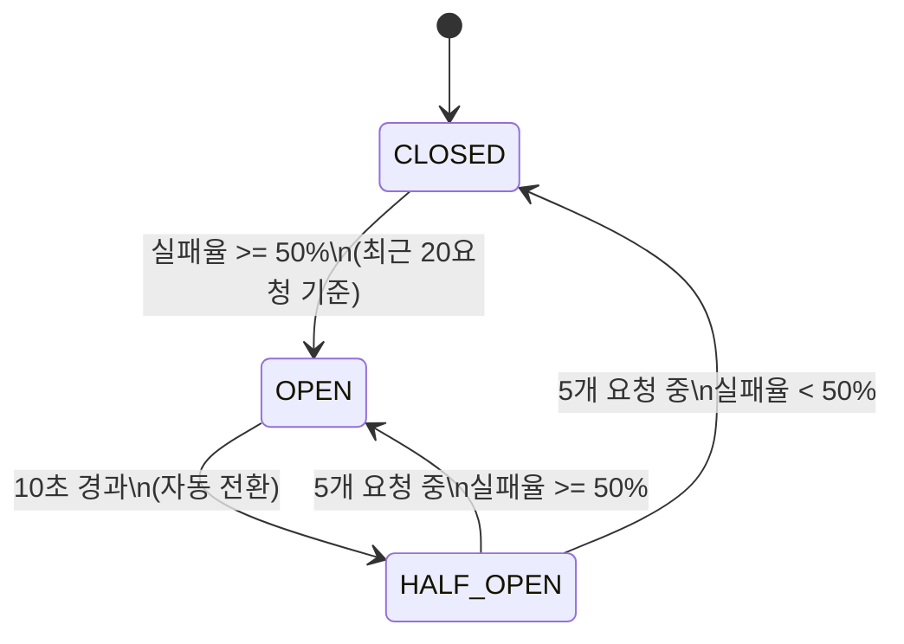

# API Gateway 장애 복원력

## 개요

API Gateway는 Resilience4j를 사용하여 백엔드 서비스 장애를 격리하고 연쇄 장애를 방지합니다.

- **Circuit Breaker**: 서비스별 독립 인스턴스, 실패율 기반 회로 차단
- **Time Limiter**: 서비스별 응답 타임아웃
- **Fallback**: 회로 Open 시 사용자 친화적 에러 응답

> **소스 파일**: `application.yml` (resilience4j 섹션), `FallbackController.java`

## Circuit Breaker

### 기본 설정 (default)

```yaml
resilience4j:
  circuitbreaker:
    configs:
      default:
        sliding-window-type: count_based
        sliding-window-size: 20
        failure-rate-threshold: 50
        wait-duration-in-open-state: 10s
        permitted-number-of-calls-in-half-open-state: 5
        automatic-transition-from-open-to-half-open-enabled: true
```

| 설정 | 값 | 설명 |
|------|-----|------|
| `sliding-window-type` | `count_based` | 요청 횟수 기반 윈도우 |
| `sliding-window-size` | `20` | 최근 20개 요청으로 실패율 계산 |
| `failure-rate-threshold` | `50%` | 실패율 50% 이상 시 회로 Open |
| `wait-duration-in-open-state` | `10s` | Open 상태 유지 시간 |
| `permitted-number-of-calls-in-half-open-state` | `5` | Half-Open 상태에서 허용 요청 수 |
| `automatic-transition-from-open-to-half-open-enabled` | `true` | 자동 Open → Half-Open 전환 |

### 인스턴스별 설정

모든 인스턴스는 `default` 설정을 상속합니다.

| 인스턴스 | 대상 서비스 | 커스텀 설정 |
|----------|-----------|-------------|
| `authCircuitBreaker` | auth-service | 기본값 사용 |
| `blogCircuitBreaker` | blog-service | 기본값 사용 |
| `shoppingCircuitBreaker` | shopping-service | 기본값 사용 |
| `prismCircuitBreaker` | prism-service | 기본값 사용 |
| `chatbotCircuitBreaker` | chatbot-service | 기본값 사용 |

### State Machine



**상태 설명**:

| 상태 | 동작 |
|------|------|
| **CLOSED** | 정상 동작. 모든 요청을 백엔드로 전달. 실패율 모니터링 중 |
| **OPEN** | 회로 차단. 모든 요청을 Fallback으로 즉시 응답 (503) |
| **HALF_OPEN** | 테스트 중. 5개 요청만 백엔드로 전달하여 복구 확인 |

## Time Limiter (타임아웃)

각 서비스의 응답 대기 시간 제한입니다.

```yaml
resilience4j:
  timelimiter:
    configs:
      default:
        timeout-duration: 5s
    instances:
      prismCircuitBreaker:
        timeout-duration: 60s    # AI 응답 대기
      chatbotCircuitBreaker:
        timeout-duration: 120s   # RAG + AI 응답 대기
```

| 인스턴스 | 타임아웃 | 이유 |
|----------|---------|------|
| `authCircuitBreaker` | 5s | 인증은 빠른 응답 필요 |
| `blogCircuitBreaker` | 5s | 일반 CRUD |
| `shoppingCircuitBreaker` | 5s | 일반 CRUD |
| `prismCircuitBreaker` | **60s** | AI Orchestration 응답 대기 |
| `chatbotCircuitBreaker` | **120s** | RAG 문서 검색 + AI 응답 생성 |

### 타임아웃 초과 시

타임아웃 초과 시 `TimeoutException`이 발생하여 Circuit Breaker의 실패 카운트에 포함됩니다. Fallback이 설정된 라우트는 Fallback 응답이 반환됩니다.

## Fallback Controller

> **소스 파일**: `FallbackController.java`

Circuit Breaker가 Open 상태이거나 타임아웃 발생 시 호출되는 Fallback 엔드포인트입니다.

### 구현된 Fallback

| Fallback URI | 에러 코드 | 메시지 | 대상 서비스 |
|--------------|-----------|--------|-------------|
| `/fallback/auth` | `GW001` | 인증 서비스를 일시적으로 사용할 수 없습니다 | auth-service |
| `/fallback/blog` | `GW002` | 블로그 서비스를 일시적으로 사용할 수 없습니다 | blog-service |
| `/fallback/shopping` | `GW003` | 쇼핑 서비스를 일시적으로 사용할 수 없습니다 | shopping-service |
| `/fallback/notification` | `GW004` | 알림 서비스를 일시적으로 사용할 수 없습니다 | notification-service |

### Fallback 응답 형식

```json
{
  "success": false,
  "data": {},
  "error": {
    "code": "GW001",
    "message": "인증 서비스를 일시적으로 사용할 수 없습니다. 잠시 후 다시 시도해 주세요.",
    "timestamp": "2026-02-06T14:23:45.123"
  }
}
```

### 주의: 미구현 Fallback

다음 서비스는 라우트에서 `fallbackUri`를 참조하지만 FallbackController에 대응하는 엔드포인트가 없습니다.

| 라우트의 fallbackUri | 상태 |
|---------------------|------|
| `forward:/fallback/chatbot` | **미구현** - chatbot-service 라우트에서 참조 |
| `forward:/fallback/prism` | **미구현** - prism-service 라우트에서 참조 |

> Circuit Breaker가 Open되면 Spring Cloud Gateway가 fallback URI로 포워딩을 시도하지만, 해당 엔드포인트가 없어 404가 반환될 수 있습니다.

## 라우트-Circuit Breaker 매핑

### Circuit Breaker 적용 라우트

| Circuit Breaker 인스턴스 | 적용 라우트 |
|--------------------------|------------|
| `authCircuitBreaker` | auth-service-login, signup, api-prefixed, profile, users, api, admin, memberships, seller, permissions |
| `blogCircuitBreaker` | blog-service-file-route, blog-service-route |
| `shoppingCircuitBreaker` | shopping-service-route |
| `chatbotCircuitBreaker` | chatbot-service-stream, documents, route |
| `prismCircuitBreaker` | prism-service-route |

### Circuit Breaker 미적용 라우트

| Route ID | 이유 |
|----------|------|
| `*-actuator-health` | 모니터링 전용 |
| `auth-service-oauth2-*` | OAuth2 프로토콜 |
| `notification-service-*` | notification-service는 CB 미적용 |
| `chatbot-service-health` | 헬스체크 |
| `prism-service-health` | 헬스체크 |
| `prism-service-sse` | SSE long-lived 연결 |

## 연결 타임아웃

서버 레벨의 연결 타임아웃입니다 (Circuit Breaker와 별도).

```yaml
server:
  netty:
    connection-timeout: 2s
```

## 소스 파일 참조

| 파일 | 역할 |
|------|------|
| `application.yml` (resilience4j) | Circuit Breaker, Time Limiter 설정 |
| `controller/FallbackController.java` | 4개 Fallback 엔드포인트 |

## 관련 문서

- [라우팅 명세](./routing-specification.md) - 라우트별 Circuit Breaker 매핑
- [에러 코드 레퍼런스](./error-reference.md) - GW001~GW004 에러 상세
- [헬스체크 및 모니터링](./health-monitoring.md) - 서비스 상태 모니터링
