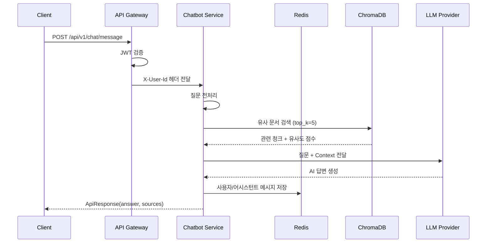
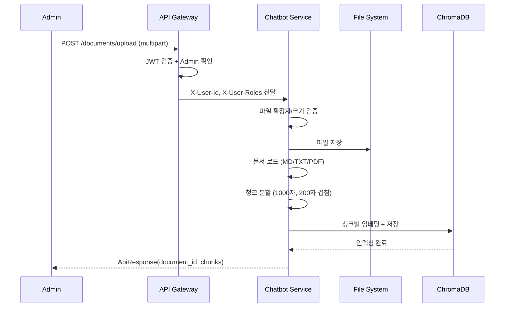

# Chatbot REST API

> RAG 기반 AI 채팅, 대화 관리, 문서 업로드/인덱싱 REST API 명세서. API Gateway를 통해 전달되는 `X-User-Id` 헤더 기반 사용자 식별.

---

## 개요

| 항목 | 내용 |
|------|------|
| **Base URL** | `http://localhost:8086` (로컬) / `http://chatbot-service:8086` (Docker/K8s) |
| **API Prefix** | `/api/v1/chat` |
| **인증 방식** | API Gateway에서 JWT 검증 후 `X-User-Id` 헤더 전달 |
| **총 Endpoints** | 10개 |
| **응답 형식** | `ApiResponse<T>` wrapper (Java 서비스 호환) |
| **스트리밍** | SSE (Server-Sent Events) |

---

## Endpoint Overview

### Chat

| Method | Endpoint | 설명 | 인증 |
|--------|----------|------|------|
| `POST` | `/api/v1/chat/message` | 동기 채팅 메시지 전송 | ✅ |
| `POST` | `/api/v1/chat/stream` | SSE 스트리밍 채팅 | ✅ |

### Conversation

| Method | Endpoint | 설명 | 인증 |
|--------|----------|------|------|
| `GET` | `/api/v1/chat/conversations` | 대화 목록 조회 | ✅ |
| `GET` | `/api/v1/chat/conversations/{conversation_id}` | 대화 이력 조회 | ✅ |
| `DELETE` | `/api/v1/chat/conversations/{conversation_id}` | 대화 삭제 | ✅ |

### Document

| Method | Endpoint | 설명 | 인증 |
|--------|----------|------|------|
| `POST` | `/api/v1/chat/documents/upload` | 문서 업로드 및 인덱싱 | ✅ ADMIN |
| `GET` | `/api/v1/chat/documents` | 인덱싱된 문서 목록 | ✅ |
| `DELETE` | `/api/v1/chat/documents/{document_id}` | 문서 삭제 | ✅ ADMIN |
| `POST` | `/api/v1/chat/documents/reindex` | 전체 문서 재인덱싱 | ✅ ADMIN |

### Health

| Method | Endpoint | 설명 | 인증 |
|--------|----------|------|------|
| `GET` | `/api/v1/chat/health` | 서비스 상태 확인 | - |

---

## 공통 헤더

모든 인증 필요 엔드포인트에 포함되는 헤더입니다.

| 헤더 | 타입 | 필수 | 설명 |
|------|------|------|------|
| `X-User-Id` | String | ✅ | 사용자 ID (API Gateway에서 JWT로부터 추출하여 전달) |
| `X-User-Email` | String | - | 사용자 이메일 (선택) |
| `X-User-Roles` | String | ADMIN 엔드포인트 | 콤마 구분 역할 목록 (`admin`, `role_admin`) |

---

## API Response Format

모든 API는 `ApiResponse<T>` wrapper를 사용합니다. Java 서비스의 응답 형식과 호환됩니다.

### Success Response

```json
{
  "success": true,
  "data": { ... }
}
```

### Error Response

```json
{
  "success": false,
  "error": {
    "code": "CB001",
    "message": "에러 메시지"
  }
}
```

---

## 1. 동기 채팅 메시지

RAG 기반으로 질문에 대한 답변을 동기적으로 반환합니다.

**`POST /api/v1/chat/message`**

### Request

```http
POST /api/v1/chat/message
Content-Type: application/json
X-User-Id: user-123
```

```json
{
  "message": "Spring Boot에서 트랜잭션 관리는 어떻게 하나요?",
  "conversation_id": "550e8400-e29b-41d4-a716-446655440000"
}
```

### Request Body

| 필드 | 타입 | 필수 | Validation | 설명 |
|------|------|------|-----------|------|
| `message` | string | ✅ | XSS 패턴 검증, 1-10000자 | 사용자 질문 |
| `conversation_id` | string | - | - | 대화 ID (없으면 서버에서 UUID 생성) |

### Validation 규칙

**message 필드**:
- **길이**: 1-10000자
- **XSS 방어**: `<script>`, `onclick=`, `javascript:`, `<iframe>` 패턴 차단
- **검증 실패 시**: 422 Unprocessable Entity

```json
{
  "detail": [
    {
      "loc": ["body", "message"],
      "msg": "Message contains XSS pattern",
      "type": "value_error"
    }
  ]
}
```

### Response (200 OK)

```json
{
  "success": true,
  "data": {
    "answer": "Spring Boot에서 트랜잭션 관리는 @Transactional 어노테이션을 사용합니다...",
    "sources": [
      {
        "document": "spring-guide.md",
        "chunk": "트랜잭션은 @Transactional 어노테이션을 통해 선언적으로 관리할 수 있습니다...",
        "relevance_score": 0.92
      }
    ],
    "conversation_id": "550e8400-e29b-41d4-a716-446655440000",
    "message_id": "6ba7b810-9dad-11d1-80b4-00c04fd430c8"
  }
}
```

### Response Fields

| 필드 | 타입 | 설명 |
|------|------|------|
| `answer` | string | RAG 기반 AI 답변 |
| `sources` | SourceInfo[] | 참조된 문서 소스 목록 |
| `conversation_id` | string | 대화 ID |
| `message_id` | string | 메시지 ID |

---

## 2. SSE 스트리밍 채팅

RAG 기반 답변을 SSE(Server-Sent Events)로 토큰 단위 스트리밍합니다.

**`POST /api/v1/chat/stream`**

### Request

```http
POST /api/v1/chat/stream
Content-Type: application/json
X-User-Id: user-123
```

```json
{
  "message": "Docker Compose 설정 방법을 알려주세요",
  "conversation_id": null
}
```

### SSE Event Stream

스트리밍 응답은 3가지 이벤트 타입으로 구성됩니다.

#### Token Event (답변 토큰)
```
data: {"type": "token", "content": "Docker"}
data: {"type": "token", "content": " Compose는"}
data: {"type": "token", "content": " 여러 컨테이너를"}
```

#### Sources Event (참조 문서)
```
data: {"type": "sources", "sources": [{"document": "docker-guide.md", "chunk": "Docker Compose는...", "relevance_score": 0.88}]}
```

#### Done Event (완료)
```
data: {"type": "done", "message_id": "uuid", "conversation_id": "uuid"}
```

### SSE Event Types

| type | 설명 | 포함 필드 |
|------|------|----------|
| `token` | 답변 토큰 (순차 전송) | `content` |
| `sources` | RAG 참조 소스 | `sources[]` |
| `done` | 스트리밍 완료 | `message_id`, `conversation_id` |

---

## 3. 대화 목록 조회

사용자의 대화 목록을 최신순으로 조회합니다.

**`GET /api/v1/chat/conversations`**

### Request

```http
GET /api/v1/chat/conversations
X-User-Id: user-123
```

### Response (200 OK)

```json
{
  "success": true,
  "data": [
    {
      "conversation_id": "550e8400-e29b-41d4-a716-446655440000",
      "title": "Spring Boot에서 트랜잭션 관리는 어떻게 하나요",
      "message_count": 4,
      "created_at": "2026-02-06T10:00:00+00:00",
      "updated_at": "2026-02-06T10:15:00+00:00"
    },
    {
      "conversation_id": "6ba7b810-9dad-11d1-80b4-00c04fd430c8",
      "title": "Kafka 이벤트 처리 패턴에 대해 알려주세요",
      "message_count": 6,
      "created_at": "2026-02-05T14:00:00+00:00",
      "updated_at": "2026-02-05T14:30:00+00:00"
    }
  ]
}
```

### Response Fields (ConversationSummary)

| 필드 | 타입 | 설명 |
|------|------|------|
| `conversation_id` | string | 대화 고유 ID |
| `title` | string | 대화 제목 (첫 사용자 메시지의 앞 50자) |
| `message_count` | int | 총 메시지 수 |
| `created_at` | string (ISO 8601) | 생성 시각 |
| `updated_at` | string (ISO 8601) | 마지막 활동 시각 |

---

## 4. 대화 이력 조회

특정 대화의 전체 메시지 이력을 시간순으로 조회합니다.

**`GET /api/v1/chat/conversations/{conversation_id}`**

### Request

```http
GET /api/v1/chat/conversations/550e8400-e29b-41d4-a716-446655440000
X-User-Id: user-123
```

### Path Parameters

| 파라미터 | 타입 | 필수 | 설명 |
|----------|------|------|------|
| `conversation_id` | string | ✅ | 대화 ID |

### Response (200 OK)

```json
{
  "success": true,
  "data": [
    {
      "message_id": "msg-001",
      "role": "user",
      "content": "Spring Boot에서 트랜잭션 관리는 어떻게 하나요?",
      "sources": null,
      "created_at": "2026-02-06T10:00:00+00:00"
    },
    {
      "message_id": "msg-002",
      "role": "assistant",
      "content": "Spring Boot에서 트랜잭션 관리는 @Transactional 어노테이션을 사용합니다...",
      "sources": [
        {
          "document": "spring-guide.md",
          "chunk": "트랜잭션은 @Transactional 어노테이션으로...",
          "relevance_score": 0.92
        }
      ],
      "created_at": "2026-02-06T10:00:05+00:00"
    }
  ]
}
```

### Response Fields (ConversationMessage)

| 필드 | 타입 | Nullable | 설명 |
|------|------|----------|------|
| `message_id` | string | - | 메시지 고유 ID |
| `role` | string | - | 발화자 (`user` \| `assistant`) |
| `content` | string | - | 메시지 내용 |
| `sources` | SourceInfo[] | ✅ | RAG 참조 소스 (assistant 메시지에만 포함) |
| `created_at` | string (ISO 8601) | - | 생성 시각 |

---

## 5. 대화 삭제

특정 대화와 관련 메시지를 모두 삭제합니다.

**`DELETE /api/v1/chat/conversations/{conversation_id}`**

### Request

```http
DELETE /api/v1/chat/conversations/550e8400-e29b-41d4-a716-446655440000
X-User-Id: user-123
```

### Response (200 OK)

```json
{
  "success": true,
  "data": {
    "deleted": "550e8400-e29b-41d4-a716-446655440000"
  }
}
```

---

## 6. 문서 업로드

문서를 업로드하고 RAG 인덱싱을 수행합니다. 관리자 권한이 필요합니다.

**`POST /api/v1/chat/documents/upload`**

### Request

```http
POST /api/v1/chat/documents/upload
Content-Type: multipart/form-data
X-User-Id: admin-user
X-User-Roles: admin
```

### Form Data

| 필드 | 타입 | 필수 | 설명 |
|------|------|------|------|
| `file` | File | ✅ | 업로드 파일 |

### 파일 제한

| 항목 | 제한 |
|------|------|
| 허용 확장자 | `.md`, `.txt`, `.pdf` |
| 최대 파일 크기 | 10MB |

### Response (200 OK)

```json
{
  "success": true,
  "data": {
    "document_id": "uuid-string",
    "filename": "spring-guide.md",
    "chunks": 15,
    "status": "indexed"
  }
}
```

### Response Fields (DocumentInfo)

| 필드 | 타입 | 설명 |
|------|------|------|
| `document_id` | string | 문서 고유 ID |
| `filename` | string | 원본 파일명 |
| `chunks` | int | 생성된 청크 수 |
| `status` | string | 인덱싱 상태 (`indexed`) |

### Error Response (400 Bad Request)

```json
{
  "detail": "Unsupported file type: .docx. Allowed: {'.md', '.txt', '.pdf'}"
}
```

```json
{
  "detail": "File too large. Max: 10MB"
}
```

---

## 7. 문서 목록 조회

인덱싱된 문서 목록을 조회합니다.

**`GET /api/v1/chat/documents`**

### Request

```http
GET /api/v1/chat/documents
X-User-Id: user-123
```

### Response (200 OK)

```json
{
  "success": true,
  "data": {
    "documents": [
      {
        "document_id": "spring-guide",
        "filename": "spring-guide.md",
        "size_bytes": 25600
      },
      {
        "document_id": "docker-manual",
        "filename": "docker-manual.pdf",
        "size_bytes": 1048576
      }
    ],
    "total": 2
  }
}
```

---

## 8. 문서 삭제

문서와 관련 벡터 데이터를 삭제합니다. 관리자 권한이 필요합니다.

**`DELETE /api/v1/chat/documents/{document_id}`**

### Request

```http
DELETE /api/v1/chat/documents/spring-guide
X-User-Id: admin-user
X-User-Roles: admin
```

### Path Parameters

| 파라미터 | 타입 | 필수 | 설명 |
|----------|------|------|------|
| `document_id` | string | ✅ | 문서 ID 또는 파일명 |

### Response (200 OK)

```json
{
  "success": true,
  "data": {
    "deleted": "spring-guide",
    "filename": "spring-guide.md"
  }
}
```

### Error Response (404 Not Found)

```json
{
  "detail": "Document not found"
}
```

---

## 9. 전체 문서 재인덱싱

모든 문서를 재인덱싱합니다. 관리자 권한이 필요합니다.

**`POST /api/v1/chat/documents/reindex`**

### Request

```http
POST /api/v1/chat/documents/reindex
X-User-Id: admin-user
X-User-Roles: admin
```

### Response (200 OK)

```json
{
  "success": true,
  "data": {
    "reindexed": [
      {
        "filename": "spring-guide.md",
        "document_id": "uuid-1",
        "chunks": 15
      },
      {
        "filename": "docker-manual.pdf",
        "document_id": "uuid-2",
        "chunks": 42
      }
    ],
    "total": 2
  }
}
```

---

## 10. Health Check

서비스 상태와 연결 정보를 확인합니다. 인증 불필요.

**`GET /api/v1/chat/health`**

### Response (200 OK)

```json
{
  "status": "healthy",
  "provider": "ollama",
  "model": "llama3",
  "vectorstore": "chroma",
  "documents_count": 127
}
```

> Health Check 응답은 `ApiResponse` wrapper를 사용하지 않고 직접 JSON을 반환합니다.

---

## SourceInfo DTO

RAG 검색 결과의 소스 정보를 나타내는 공통 DTO입니다.

| 필드 | 타입 | 설명 |
|------|------|------|
| `document` | string | 원본 문서 파일명 |
| `chunk` | string | 관련 텍스트 청크 (최대 200자) |
| `relevance_score` | float | 유사도 점수 (0.0 ~ 1.0, threshold: 0.7) |

---

## Error Codes

### Chatbot Service 전용

| Code | HTTP Status | 설명 |
|------|-------------|------|
| `CB001` | 401 Unauthorized | 인증 필요 (`X-User-Id` 헤더 누락) |
| `CB002` | 403 Forbidden | 관리자 권한 필요 (`X-User-Roles`에 admin 없음) |
| `CB003` | 400 Bad Request | 지원하지 않는 파일 형식 |
| `CB004` | 400 Bad Request | 파일 크기 초과 (10MB) |
| `CB005` | 404 Not Found | 문서를 찾을 수 없음 |
| `CB006` | 500 Internal Server Error | RAG 엔진 초기화 실패 |
| `CB007` | 500 Internal Server Error | LLM Provider 응답 실패 |

### 공통 에러

| Code | HTTP Status | 설명 |
|------|-------------|------|
| `C001` | 401 Unauthorized | 인증 실패 (X-User-Id 헤더 누락) |
| `C002` | 403 Forbidden | 권한 없음 |
| `C003` | 400 Bad Request | 잘못된 요청 (Validation 실패) |

> 현재 코드에서는 FastAPI의 `HTTPException`을 사용하여 에러를 직접 반환합니다. `ApiResponse.fail()`을 통한 에러 코드 체계는 향후 에러 핸들러 통합 시 적용 예정입니다.

---

## 비즈니스 규칙

### 대화 관리

- **새 대화 시작**: `conversation_id` 없이 요청 시 서버에서 UUID 자동 생성
- **기존 대화 계속**: `conversation_id` 포함 요청 시 해당 대화에 메시지 추가
- **대화 제목**: 첫 번째 사용자 메시지의 앞 50자로 자동 설정
- **대화 만료**: 7일간 활동 없으면 Redis TTL에 의해 자동 삭제

### RAG 파이프라인

- **유사도 검색**: 질문과 관련된 상위 5개 문서 청크 검색 (`rag_top_k=5`)
- **Score Threshold**: 유사도 0.7 미만 결과는 자동 제외 (`rag_score_threshold=0.7`)
- **검색 실패**: 관련 문서가 없으면 "해당 정보를 찾을 수 없습니다" 고정 메시지 반환
- **질문 전처리**: 불필요한 공백 제거, 물음표 정규화

### 문서 관리

- **업로드/삭제/재인덱싱**: 관리자(`X-User-Roles: admin`) 권한 필요
- **문서 목록 조회**: 일반 사용자도 가능
- **삭제 시**: 파일 시스템 파일 + ChromaDB 벡터 데이터 모두 삭제

---

## 워크플로우

### RAG 질의 플로우



### 문서 업로드/인덱싱 플로우



---

## 사용 예시

### 동기 채팅

```typescript
async function sendMessage(userId: string, message: string, conversationId?: string) {
  const response = await apiClient.post('/api/v1/chat/message', {
    message,
    conversation_id: conversationId,
  }, {
    headers: { 'X-User-Id': userId }
  });
  return response.data.data; // ChatResponse
}
```

### SSE 스트리밍 채팅

```typescript
function streamChat(userId: string, message: string) {
  const eventSource = new EventSource('/api/v1/chat/stream', {
    method: 'POST',
    headers: { 'X-User-Id': userId, 'Content-Type': 'application/json' },
    body: JSON.stringify({ message }),
  });

  eventSource.onmessage = (event) => {
    const data = JSON.parse(event.data);
    switch (data.type) {
      case 'token':
        appendToChat(data.content);
        break;
      case 'sources':
        showSources(data.sources);
        break;
      case 'done':
        finishChat(data.message_id, data.conversation_id);
        break;
    }
  };
}
```

### 문서 업로드 (Admin)

```typescript
async function uploadDocument(userId: string, file: File) {
  const formData = new FormData();
  formData.append('file', file);

  const response = await apiClient.post('/api/v1/chat/documents/upload', formData, {
    headers: {
      'X-User-Id': userId,
      'X-User-Roles': 'admin',
      'Content-Type': 'multipart/form-data',
    }
  });
  return response.data.data; // DocumentInfo
}
```

---

## 관련 문서

- [Chatbot Service Architecture](../../architecture/chatbot-service/system-overview.md)
- [Chatbot Service Data Store Schema](../../architecture/database/chatbot-service-schema.md)
- [API Gateway API](../api-gateway/api-gateway-api.md)

---

## 변경 이력

### v1.0.0 (2026-02-06)
- 코드베이스 기반 초기 버전 작성
- Chat, Conversation, Document, Health 4개 도메인 10개 엔드포인트 문서화
- SSE 스트리밍 이벤트 형식 문서화
- RAG 질의 및 문서 인덱싱 워크플로우 다이어그램

### v1.1.0 (2026-02-13)
- message 필드 XSS 검증 규칙 추가 (Pydantic field_validator)
- 문서 삭제 Path Traversal 방어 명시
- Validation 에러 응답 형식 추가

---

**최종 업데이트**: 2026-02-13
