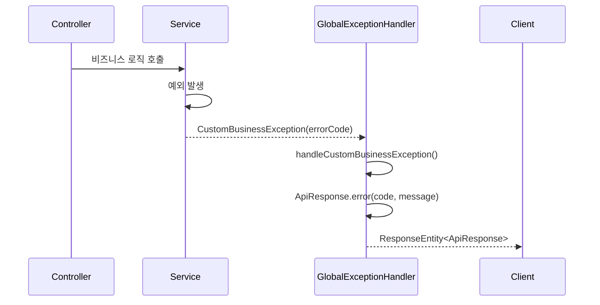

# Common Library - Core API 명세

> Portal Universe 마이크로서비스의 표준 응답 포맷과 예외 처리 시스템을 정의합니다.

---

## 개요

| 항목 | 내용 |
|------|------|
| **라이브러리명** | common-library |
| **버전** | 0.0.1-SNAPSHOT |
| **Java 버전** | 17 |
| **Spring Boot** | 3.5.5 |
| **패키지** | `com.portal.universe.commonlibrary` |

common-library는 모든 마이크로서비스에서 공통으로 사용하는 컴포넌트를 제공합니다:

| 분류 | 문서 | 설명 |
|------|------|------|
| **Core** | 이 문서 (API-001) | 응답 포맷, 예외 처리 |
| **인증** | [API-002](./API-002-security-auth.md) | JWT, Gateway 필터, 사용자 컨텍스트, 상수 |
| **입력 검증** | [API-003](./API-003-security-validation.md) | XSS/SQL Injection 방어, 유틸리티 |
| **감사 로그** | [API-004](./API-004-security-audit.md) | 보안 감사 이벤트 추적 |

---

## 목차

- [응답 (Response)](#응답-response)
  - [ApiResponse\<T\>](#apiresponset)
  - [ErrorResponse](#errorresponse)
- [예외 (Exception)](#예외-exception)
  - [ErrorCode (Interface)](#errorcode-interface)
  - [CommonErrorCode](#commonerrorcode)
  - [CustomBusinessException](#custombusinessexception)
  - [GlobalExceptionHandler](#globalexceptionhandler)

---

## 응답 (Response)

### ApiResponse\<T\>

모든 REST API 응답의 표준 래퍼 클래스입니다.

**위치:** `com.portal.universe.commonlibrary.response.ApiResponse`

#### 클래스 시그니처

```java
@Getter
@JsonInclude(JsonInclude.Include.NON_NULL)
public class ApiResponse<T> {
    private final boolean success;
    private final T data;
    private final ErrorResponse error;
}
```

#### 필드

| 필드 | 타입 | 필수 | 설명 |
|------|------|------|------|
| `success` | boolean | O | 요청 성공 여부 |
| `data` | T | - | 성공 시 반환 데이터 (null이면 JSON에서 제외) |
| `error` | ErrorResponse | - | 실패 시 에러 정보 (null이면 JSON에서 제외) |

#### 정적 팩토리 메서드

##### success(T data)

성공 응답을 생성합니다.

```java
public static <T> ApiResponse<T> success(T data)
```

**파라미터:** `data` - 클라이언트에게 전달할 데이터

**반환:** `success=true`, `data=전달된 데이터`, `error=null`

**사용 예시:**

```java
@GetMapping("/{id}")
public ResponseEntity<ApiResponse<ProductResponse>> getProduct(@PathVariable Long id) {
    ProductResponse product = productService.getProduct(id);
    return ResponseEntity.ok(ApiResponse.success(product));
}
```

**응답 예시:**

```json
{
  "success": true,
  "data": {
    "id": 1,
    "name": "Product A",
    "price": 29.99
  }
}
```

##### error(String code, String message)

실패 응답을 생성합니다.

```java
public static <T> ApiResponse<T> error(String code, String message)
```

**파라미터:**
- `code` - 애플리케이션 에러 코드 (예: "C001", "S001")
- `message` - 클라이언트에게 보여줄 에러 메시지

**반환:** `success=false`, `data=null`, `error=ErrorResponse`

**응답 예시:**

```json
{
  "success": false,
  "error": {
    "code": "C002",
    "message": "Invalid Input Value",
    "timestamp": "2026-02-06T10:30:00"
  }
}
```

##### errorWithDetails(ErrorResponse errorResponse)

상세 에러 정보를 포함한 실패 응답을 생성합니다. Validation 에러 등 필드별 상세 정보가 필요한 경우 사용됩니다.

```java
public static <T> ApiResponse<T> errorWithDetails(ErrorResponse errorResponse)
```

**파라미터:** `errorResponse` - 상세 에러 정보를 담은 ErrorResponse 객체

**반환:** `success=false`, `data=null`, `error=전달된 ErrorResponse`

**응답 예시:**

```json
{
  "success": false,
  "error": {
    "code": "C002",
    "message": "Invalid Input Value",
    "timestamp": "2026-02-06T10:30:00",
    "path": "/api/v1/products",
    "details": [
      {
        "field": "name",
        "message": "이름은 필수입니다",
        "rejectedValue": null
      },
      {
        "field": "price",
        "message": "가격은 양수여야 합니다",
        "rejectedValue": -100
      }
    ]
  }
}
```

---

### ErrorResponse

API 실패 응답 시 에러 정보를 담는 DTO 클래스입니다.

**위치:** `com.portal.universe.commonlibrary.response.ErrorResponse`

#### 클래스 시그니처

```java
@Getter
@JsonInclude(JsonInclude.Include.NON_NULL)
public class ErrorResponse {
    private final String code;
    private final String message;
    private final LocalDateTime timestamp;
    private final String path;
    private final List<FieldError> details;
}
```

#### 필드

| 필드 | 타입 | 필수 | 설명 |
|------|------|------|------|
| `code` | String | O | 에러 코드 (예: "C001", "A001", "S001") |
| `message` | String | O | 에러 메시지 |
| `timestamp` | LocalDateTime | O | 에러 발생 시간 (자동 설정) |
| `path` | String | - | 에러가 발생한 요청 경로 (null이면 JSON에서 제외) |
| `details` | List\<FieldError\> | - | 필드별 검증 에러 상세 (null이면 JSON에서 제외) |

#### 생성자

##### 기본 에러 응답

```java
public ErrorResponse(String code, String message)
```

단순한 비즈니스 에러에 사용됩니다. `timestamp`는 `LocalDateTime.now()`로 자동 설정됩니다.

##### 상세 에러 응답

```java
public ErrorResponse(String code, String message, String path, List<FieldError> details)
```

Validation 에러 등 상세 정보가 필요한 경우 사용됩니다.

#### FieldError (내부 클래스)

```java
@Getter
@JsonInclude(JsonInclude.Include.NON_NULL)
public static class FieldError {
    private final String field;
    private final String message;
    private final Object rejectedValue;
}
```

| 필드 | 타입 | 설명 |
|------|------|------|
| `field` | String | 검증 실패한 필드명 |
| `message` | String | 검증 에러 메시지 |
| `rejectedValue` | Object | 거부된 값 |

**팩토리 메서드:**

```java
public static FieldError from(org.springframework.validation.FieldError fieldError)
```

Spring의 `FieldError`를 변환합니다.

---

## 예외 (Exception)

### ErrorCode (Interface)

모든 서비스에서 사용될 오류 코드의 공통 규약입니다.

**위치:** `com.portal.universe.commonlibrary.exception.ErrorCode`

#### 인터페이스 시그니처

```java
public interface ErrorCode {
    HttpStatus getStatus();
    String getCode();
    String getMessage();
}
```

#### 메서드

| 메서드 | 반환 타입 | 설명 |
|--------|----------|------|
| `getStatus()` | HttpStatus | HTTP 상태 코드 |
| `getCode()` | String | 애플리케이션 에러 코드 |
| `getMessage()` | String | 클라이언트용 에러 메시지 |

#### 에러 코드 명명 규칙

| 서비스 | 접두사 | 예시 |
|--------|--------|------|
| Common | C | C001~C008 |
| Auth | A | A001, A002, ... |
| Blog | B | B001, B002, ... |
| Shopping | S | S001, S002, ... |

#### 구현 예시

```java
@Getter
public enum ShoppingErrorCode implements ErrorCode {
    PRODUCT_NOT_FOUND(HttpStatus.NOT_FOUND, "S001", "Product not found"),
    DUPLICATE_PRODUCT(HttpStatus.CONFLICT, "S002", "Duplicate product name"),
    INSUFFICIENT_STOCK(HttpStatus.BAD_REQUEST, "S003", "Insufficient stock");

    private final HttpStatus status;
    private final String code;
    private final String message;

    ShoppingErrorCode(HttpStatus status, String code, String message) {
        this.status = status;
        this.code = code;
        this.message = message;
    }
}
```

---

### CommonErrorCode

여러 서비스에서 공통으로 발생할 수 있는 기본 오류 코드입니다.

**위치:** `com.portal.universe.commonlibrary.exception.CommonErrorCode`

**구현:** `ErrorCode`

#### Enum 상수

| 상수 | HTTP Status | 코드 | 메시지 | 용도 |
|------|-------------|------|--------|------|
| `INTERNAL_SERVER_ERROR` | 500 | C001 | Internal Server Error | 예상치 못한 서버 오류 |
| `INVALID_INPUT_VALUE` | 400 | C002 | Invalid Input Value | 유효하지 않은 요청 값 |
| `NOT_FOUND` | 404 | C003 | Not Found | 리소스 없음 |
| `FORBIDDEN` | 403 | C004 | Forbidden | 권한 없음 |
| `UNAUTHORIZED` | 401 | C005 | Unauthorized | 인증 실패 (토큰 없음/만료/무효) |
| `XSS_DETECTED` | 400 | C006 | Potential XSS attack detected | XSS 공격 감지 |
| `SQL_INJECTION_DETECTED` | 400 | C007 | Potential SQL Injection detected | SQL Injection 감지 |
| `INVALID_HTML_CONTENT` | 400 | C008 | Invalid HTML content | 허용되지 않은 HTML 태그 |

#### 사용 예시

```java
throw new CustomBusinessException(CommonErrorCode.NOT_FOUND);
throw new CustomBusinessException(CommonErrorCode.FORBIDDEN);
throw new CustomBusinessException(CommonErrorCode.XSS_DETECTED);
```

---

### CustomBusinessException

시스템 전반에서 사용될 커스텀 비즈니스 예외입니다.

**위치:** `com.portal.universe.commonlibrary.exception.CustomBusinessException`

**상속:** `RuntimeException`

#### 클래스 시그니처

```java
@Getter
public class CustomBusinessException extends RuntimeException {
    private final ErrorCode errorCode;
    private final String[] messageParams;
}
```

#### 필드

| 필드 | 타입 | 설명 |
|------|------|------|
| `errorCode` | ErrorCode | 발생한 예외에 해당하는 ErrorCode |
| `messageParams` | String[] | 메시지 포맷팅 파라미터 |

#### 생성자

##### 기본 생성자

```java
public CustomBusinessException(ErrorCode errorCode)
```

**예시:**

```java
throw new CustomBusinessException(ShoppingErrorCode.PRODUCT_NOT_FOUND);
```

##### 메시지 파라미터 생성자

```java
public CustomBusinessException(ErrorCode errorCode, String... messageParams)
```

에러 메시지에 동적 값을 삽입할 때 사용합니다. `{0}`, `{1}` 형태의 플레이스홀더를 파라미터로 치환합니다.

**예시:**

ErrorCode의 메시지가 `"상품 '{0}'을 찾을 수 없습니다"` 인 경우:

```java
throw new CustomBusinessException(ShoppingErrorCode.PRODUCT_NOT_FOUND_WITH_NAME, "상품A");
// → getMessage() = "상품 '상품A'을 찾을 수 없습니다"
```

---

### GlobalExceptionHandler

애플리케이션 전역에서 발생하는 예외를 처리하는 핸들러입니다.

**위치:** `com.portal.universe.commonlibrary.exception.GlobalExceptionHandler`

**어노테이션:** `@RestControllerAdvice`

#### 처리 우선순위

| 순위 | 예외 | HTTP Status | 에러 코드 | 설명 |
|------|------|-------------|----------|------|
| 1 | `CustomBusinessException` | ErrorCode별 상이 | ErrorCode별 상이 | 비즈니스 로직 예외 |
| 2 | `MethodArgumentNotValidException` | 400 | C002 | `@Valid` 검증 실패 (필드별 상세 포함) |
| 3 | `ConstraintViolationException` | 400 | C002 | `@Validated` 검증 실패 (필드별 상세 포함) |
| 4 | `HttpMessageNotReadableException` | 400 | C002 | JSON 파싱 오류 |
| 5 | `MissingServletRequestParameterException` | 400 | C002 | 필수 파라미터 누락 |
| 6 | `MethodArgumentTypeMismatchException` | 400 | C002 | 파라미터 타입 불일치 |
| 7 | `IllegalArgumentException` | 400 | C002 | 잘못된 인자 |
| 8 | `IllegalStateException` | 403 | C004 | 잘못된 상태 (권한 부족 등) |
| 9 | `NoResourceFoundException` | 404 | C003 | 리소스 없음 |
| 10 | `Exception` | 500 | C001 | 기타 모든 예외 |

#### 상세 응답 예시

##### CustomBusinessException (비즈니스 에러)

```json
HTTP/1.1 400 Bad Request

{
  "success": false,
  "error": {
    "code": "S003",
    "message": "Insufficient stock",
    "timestamp": "2026-02-06T10:30:00"
  }
}
```

##### MethodArgumentNotValidException (@Valid 검증 실패)

필드별 상세 에러 정보를 포함합니다.

```json
HTTP/1.1 400 Bad Request

{
  "success": false,
  "error": {
    "code": "C002",
    "message": "Invalid Input Value",
    "timestamp": "2026-02-06T10:30:00",
    "path": "/api/v1/products",
    "details": [
      {
        "field": "name",
        "message": "이름은 필수입니다",
        "rejectedValue": null
      },
      {
        "field": "price",
        "message": "가격은 양수여야 합니다",
        "rejectedValue": -100
      }
    ]
  }
}
```

##### MissingServletRequestParameterException (필수 파라미터 누락)

```json
HTTP/1.1 400 Bad Request

{
  "success": false,
  "error": {
    "code": "C002",
    "message": "Required parameter 'keyword' is missing",
    "timestamp": "2026-02-06T10:30:00"
  }
}
```

##### MethodArgumentTypeMismatchException (타입 불일치)

```json
HTTP/1.1 400 Bad Request

{
  "success": false,
  "error": {
    "code": "C002",
    "message": "Parameter 'id' should be of type 'Long'",
    "timestamp": "2026-02-06T10:30:00"
  }
}
```

##### NoResourceFoundException (404)

```json
HTTP/1.1 404 Not Found

{
  "success": false,
  "error": {
    "code": "C003",
    "message": "Not Found",
    "timestamp": "2026-02-06T10:30:00"
  }
}
```

##### Exception (500)

```json
HTTP/1.1 500 Internal Server Error

{
  "success": false,
  "error": {
    "code": "C001",
    "message": "Internal Server Error",
    "timestamp": "2026-02-06T10:30:00"
  }
}
```

#### 예외 처리 흐름



---

## 관련 문서

- [API-002: 인증 시스템](./API-002-security-auth.md) - JWT, Gateway, 사용자 컨텍스트
- [API-003: 입력 검증](./API-003-security-validation.md) - XSS, SQL Injection 방어
- [API-004: 감사 로그](./API-004-security-audit.md) - 보안 이벤트 추적

---

**최종 수정:** 2026-02-06
**API 버전:** v2
**문서 버전:** 2.0
