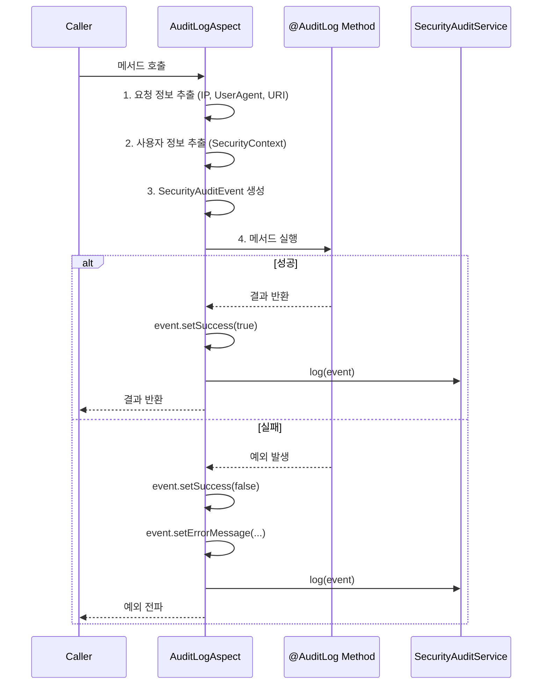

# Common Library - Security Audit API 명세

> 로그인, 접근 제어, 관리자 작업 등 보안 관련 이벤트를 추적하는 감사 로그 시스템을 제공합니다.

---

## 목차

- [@AuditLog](#auditlog)
- [AuditLogAspect](#auditlogaspect)
- [SecurityAuditEvent](#securityauditevent)
- [SecurityAuditEventType](#securityauditeventtype)
- [SecurityAuditService](#securityauditservice)
- [SecurityAuditServiceImpl](#securityauditserviceimpl)

---

## @AuditLog

메서드에 보안 감사 로그를 자동으로 기록하도록 하는 어노테이션입니다. AOP를 통해 메서드 실행 전후에 로그가 기록됩니다.

**위치:** `com.portal.universe.commonlibrary.security.audit.AuditLog`

```java
@Target(ElementType.METHOD)
@Retention(RetentionPolicy.RUNTIME)
public @interface AuditLog {
    SecurityAuditEventType eventType();
    String description() default "";
}
```

#### 속성

| 속성 | 타입 | 필수 | 기본값 | 설명 |
|------|------|------|--------|------|
| `eventType` | SecurityAuditEventType | O | - | 감사 이벤트 유형 |
| `description` | String | - | `""` | 이벤트 상세 설명 |

#### 사용 예시

```java
@AuditLog(eventType = SecurityAuditEventType.ADMIN_ACTION,
          description = "사용자 권한 변경")
public void updateUserRole(String userId, String newRole) {
    // 비즈니스 로직
}

@AuditLog(eventType = SecurityAuditEventType.SENSITIVE_DATA_ACCESS,
          description = "회원 개인정보 조회")
public UserDetailResponse getUserPersonalInfo(String userId) {
    // 개인정보 조회
}

@AuditLog(eventType = SecurityAuditEventType.PERMISSION_CHANGED)
public void grantSellerPermission(String userId) {
    // 판매자 권한 부여
}
```

---

## AuditLogAspect

`@AuditLog` 어노테이션이 적용된 메서드에 대해 감사 로그를 자동 기록하는 AOP Aspect입니다.

**위치:** `com.portal.universe.commonlibrary.security.audit.AuditLogAspect`

**어노테이션:** `@Aspect`, `@Component`

#### 동작 방식



#### 자동 수집 정보

| 정보 | 출처 | 설명 |
|------|------|------|
| IP 주소 | `X-Forwarded-For` 헤더 체인 | 프록시 환경 대응 |
| User-Agent | `User-Agent` 헤더 | 브라우저 정보 |
| 요청 URI | `HttpServletRequest` | 요청 경로 |
| HTTP 메서드 | `HttpServletRequest` | GET, POST 등 |
| 사용자 ID | `SecurityContextHolder` | 인증된 사용자 (미인증 시 "anonymous") |
| 메서드 정보 | `ProceedingJoinPoint` | 클래스명, 메서드명 |

---

## SecurityAuditEvent

보안 감사 이벤트를 나타내는 모델 클래스입니다.

**위치:** `com.portal.universe.commonlibrary.security.audit.SecurityAuditEvent`

#### 클래스 시그니처

```java
@Getter
@Builder
@NoArgsConstructor
@AllArgsConstructor
public class SecurityAuditEvent {
    @Builder.Default
    private String eventId = UUID.randomUUID().toString();

    private SecurityAuditEventType eventType;

    @Builder.Default
    private LocalDateTime timestamp = LocalDateTime.now();

    private String userId;
    private String username;
    private String ipAddress;
    private String userAgent;
    private String requestUri;
    private String requestMethod;

    @Builder.Default
    private Map<String, Object> details = new HashMap<>();

    private boolean success;
    private String errorMessage;
}
```

#### 필드

| 필드 | 타입 | 기본값 | 설명 |
|------|------|--------|------|
| `eventId` | String | `UUID.randomUUID()` | 고유 이벤트 ID |
| `eventType` | SecurityAuditEventType | - | 이벤트 유형 |
| `timestamp` | LocalDateTime | `LocalDateTime.now()` | 발생 시각 |
| `userId` | String | - | 사용자 ID |
| `username` | String | - | 사용자명 |
| `ipAddress` | String | - | 클라이언트 IP |
| `userAgent` | String | - | 브라우저 정보 |
| `requestUri` | String | - | 요청 URI |
| `requestMethod` | String | - | HTTP 메서드 |
| `details` | Map\<String, Object\> | `new HashMap<>()` | 추가 상세 정보 |
| `success` | boolean | - | 성공 여부 |
| `errorMessage` | String | - | 실패 시 에러 메시지 |

#### 메서드

| 메서드 | 설명 |
|--------|------|
| `addDetail(String key, Object value)` | 추가 정보를 details 맵에 추가 |
| `setSuccess(boolean success)` | 성공 여부 설정 |
| `setErrorMessage(String errorMessage)` | 에러 메시지 설정 |

#### JSON 출력 예시

```json
{
  "eventId": "a1b2c3d4-e5f6-7890-abcd-ef1234567890",
  "eventType": "LOGIN_SUCCESS",
  "timestamp": "2026-02-06T10:30:00",
  "userId": "user-uuid-123",
  "username": "user-uuid-123",
  "ipAddress": "192.168.1.100",
  "userAgent": "Mozilla/5.0 ...",
  "requestUri": "/api/v1/auth/login",
  "requestMethod": "POST",
  "details": {},
  "success": true,
  "errorMessage": null
}
```

---

## SecurityAuditEventType

보안 감사 이벤트 유형을 정의하는 Enum입니다.

**위치:** `com.portal.universe.commonlibrary.security.audit.SecurityAuditEventType`

#### Enum 상수

| 상수 | 설명 | 사용 예시 |
|------|------|----------|
| `LOGIN_SUCCESS` | 로그인 성공 | 사용자 로그인 |
| `LOGIN_FAILURE` | 로그인 실패 | 잘못된 비밀번호 |
| `LOGOUT` | 로그아웃 | 사용자 로그아웃 |
| `TOKEN_REFRESH` | JWT 토큰 갱신 | Access Token 재발급 |
| `TOKEN_REVOKED` | JWT 토큰 폐기 | 강제 로그아웃 |
| `PASSWORD_CHANGED` | 비밀번호 변경 | 비밀번호 재설정 |
| `ACCOUNT_LOCKED` | 계정 잠금 | 로그인 5회 실패 |
| `ACCOUNT_UNLOCKED` | 계정 잠금 해제 | 관리자 수동 해제 |
| `ACCESS_DENIED` | 접근 거부 | 권한 부족 |
| `PERMISSION_CHANGED` | 권한 변경 | 관리자 권한 부여 |
| `SENSITIVE_DATA_ACCESS` | 민감 데이터 접근 | 개인정보 조회 |
| `ADMIN_ACTION` | 관리자 작업 | 사용자 상태 변경 |

---

## SecurityAuditService

보안 감사 로그를 기록하는 서비스 인터페이스입니다.

**위치:** `com.portal.universe.commonlibrary.security.audit.SecurityAuditService`

#### 메서드

| 메서드 | 파라미터 | 설명 |
|--------|---------|------|
| `log(event)` | SecurityAuditEvent | 범용 이벤트 로깅 |
| `logLoginSuccess(userId, username, ip, userAgent)` | String x 4 | 로그인 성공 |
| `logLoginFailure(username, ip, reason)` | String x 3 | 로그인 실패 |
| `logLogout(userId, ip)` | String x 2 | 로그아웃 |
| `logAccessDenied(userId, uri, requiredRole)` | String x 3 | 접근 거부 |
| `logAdminAction(adminId, action, targetResource)` | String x 3 | 관리자 작업 |
| `logTokenRefresh(userId, ip)` | String x 2 | 토큰 갱신 |
| `logPasswordChanged(userId, ip)` | String x 2 | 비밀번호 변경 |
| `logSensitiveDataAccess(userId, resourceType, resourceId)` | String x 3 | 민감 데이터 접근 |

#### 사용 예시

```java
@Service
@RequiredArgsConstructor
public class AuthServiceImpl implements AuthService {

    private final SecurityAuditService auditService;

    @Override
    public TokenResponse login(LoginRequest request, String clientIp) {
        try {
            // 로그인 로직
            User user = userRepository.findByEmail(request.email())
                .orElseThrow(() -> new CustomBusinessException(AuthErrorCode.USER_NOT_FOUND));

            if (!passwordEncoder.matches(request.password(), user.getPassword())) {
                auditService.logLoginFailure(request.email(), clientIp, "Invalid password");
                throw new CustomBusinessException(AuthErrorCode.INVALID_PASSWORD);
            }

            TokenResponse token = jwtProvider.generateToken(user);
            auditService.logLoginSuccess(user.getId(), user.getEmail(), clientIp, null);
            return token;
        } catch (CustomBusinessException e) {
            throw e;
        }
    }

    @Override
    public void logout(String userId, String clientIp) {
        // 로그아웃 로직
        auditService.logLogout(userId, clientIp);
    }
}
```

---

## SecurityAuditServiceImpl

`SecurityAuditService`의 기본 구현체입니다. SLF4J를 통해 JSON 형식으로 로그를 출력합니다.

**위치:** `com.portal.universe.commonlibrary.security.audit.SecurityAuditServiceImpl`

**어노테이션:** `@Service`

#### 로그 출력 형식

```
INFO  SECURITY_AUDIT: {"eventId":"...","eventType":"LOGIN_SUCCESS","timestamp":"2026-02-06T10:30:00",...}
```

- `ObjectMapper` + `JavaTimeModule`을 사용하여 JSON 직렬화
- 직렬화 실패 시 ERROR 레벨로 원본 이벤트를 기록

#### 커스터마이징

`SecurityAuditService` 인터페이스를 직접 구현하여 다른 저장소(DB, Elasticsearch 등)에 로그를 저장할 수 있습니다. `@Service` 어노테이션이 붙은 Bean이 있으면 기본 구현체가 대체됩니다.

```java
@Service
@Primary
public class ElasticsearchAuditService implements SecurityAuditService {
    @Override
    public void log(SecurityAuditEvent event) {
        // Elasticsearch에 이벤트 저장
    }
    // ... 나머지 메서드 구현
}
```

---

## 관련 문서

- [API-001: Core](./API-001-common-library.md) - 응답 포맷, 예외 처리
- [API-002: 인증 시스템](./API-002-security-auth.md) - JWT, Gateway, 사용자 컨텍스트
- [API-003: 입력 검증](./API-003-security-validation.md) - XSS, SQL Injection 방어

---

**최종 수정:** 2026-02-06
**API 버전:** v1
**문서 버전:** 1.0
