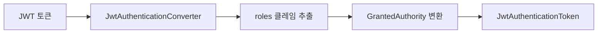
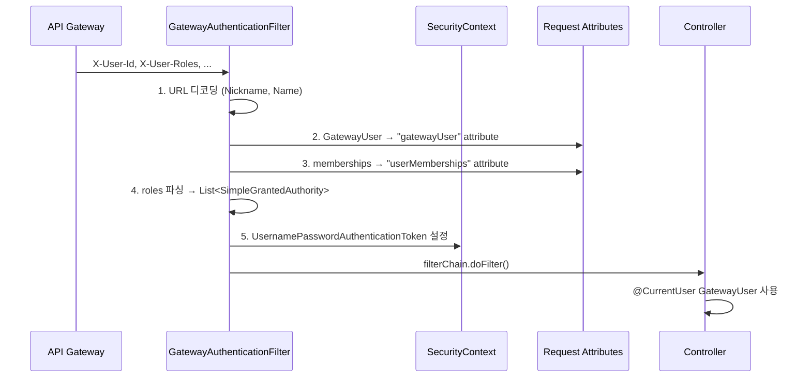

# Common Library - Security Authentication API 명세

> JWT 인증, Gateway 사용자 컨텍스트, 권한 검사 유틸리티를 제공합니다.

---

## 목차

- [JWT Auto Configuration](#jwt-auto-configuration)
  - [JwtSecurityAutoConfiguration](#jwtsecurityautoconfiguration)
  - [JwtAuthenticationConverterAdapter](#jwtauthenticationconverteradapter)
  - [ReactiveJwtAuthenticationConverterAdapter](#reactivejwtauthenticationconverteradapter)
- [Gateway 인증](#gateway-인증)
  - [GatewayAuthenticationFilter](#gatewayauthenticationfilter)
  - [GatewayUserWebConfig](#gatewayuserwebconfig)
- [사용자 컨텍스트](#사용자-컨텍스트)
  - [@CurrentUser](#currentuser)
  - [CurrentUserArgumentResolver](#currentuserargumentresolver)
  - [GatewayUser](#gatewayuser)
  - [SecurityUtils](#securityutils)
  - [MembershipContext](#membershipcontext)
- [인증 상수](#인증-상수)
  - [AuthConstants](#authconstants)

---

## JWT Auto Configuration

### JwtSecurityAutoConfiguration

JWT 관련 보안 설정을 자동으로 구성하는 Auto-Configuration 클래스입니다.

**위치:** `com.portal.universe.commonlibrary.security.config.JwtSecurityAutoConfiguration`

**어노테이션:** `@AutoConfiguration`

#### 활성화 조건

- `JwtAuthenticationConverter` 클래스가 클래스패스에 존재
- Spring Boot 시작 시 자동 로드

#### 제공 Bean

| 환경 | Bean 타입 | 조건 |
|------|----------|------|
| Servlet (Spring MVC) | `JwtAuthenticationConverter` | `@ConditionalOnWebApplication(SERVLET)` + `@ConditionalOnMissingBean` |
| Reactive (Spring WebFlux) | `Converter<Jwt, Mono<AbstractAuthenticationToken>>` | `@ConditionalOnWebApplication(REACTIVE)` + `@ConditionalOnMissingBean` |

> 각 마이크로서비스에서 동일한 타입의 Bean을 직접 정의한 경우, 이 자동 설정은 동작하지 않습니다.

---

### JwtAuthenticationConverterAdapter

**Spring MVC 환경**에서 JWT의 `roles` 클레임을 권한으로 변환하는 어댑터입니다.

**위치:** `com.portal.universe.commonlibrary.security.converter.JwtAuthenticationConverterAdapter`

#### 정적 팩토리 메서드

##### create(String authoritiesClaimName, String authorityPrefix)

커스텀 설정을 사용하여 JwtAuthenticationConverter를 생성합니다.

```java
public static JwtAuthenticationConverter create(
    String authoritiesClaimName,
    String authorityPrefix)
```

**파라미터:**
- `authoritiesClaimName` - JWT에서 권한을 담은 클레임 이름 (예: "roles", "scope")
- `authorityPrefix` - 각 권한에 추가할 접두사 (예: "ROLE_")

##### createDefault()

기본 설정으로 JwtAuthenticationConverter를 생성합니다.

```java
public static JwtAuthenticationConverter createDefault()
```

**기본 설정:**
- 클레임 이름: `"roles"`
- 권한 접두사: `""` (없음, Auth-Service에서 이미 `ROLE_USER` 형태로 전달)

#### 처리 흐름



---

### ReactiveJwtAuthenticationConverterAdapter

**Spring WebFlux 환경**에서 JWT의 `roles` 클레임을 권한으로 변환하는 Reactive 컨버터입니다.

**위치:** `com.portal.universe.commonlibrary.security.converter.ReactiveJwtAuthenticationConverterAdapter`

**구현:** `Converter<Jwt, Mono<AbstractAuthenticationToken>>`

#### 생성자

```java
// 커스텀 설정
public ReactiveJwtAuthenticationConverterAdapter(
    String authoritiesClaimName,
    String authorityPrefix)

// 기본 설정 (roles, 접두사 없음)
public ReactiveJwtAuthenticationConverterAdapter()
```

#### convert(Jwt jwt)

```java
@Override
public Mono<AbstractAuthenticationToken> convert(Jwt jwt)
```

1. JWT에서 `roles` 클레임을 문자열 컬렉션으로 추출
2. `GrantedAuthority` 객체로 변환
3. `JwtAuthenticationToken` 생성 및 `Mono`로 반환

---

## Gateway 인증

### GatewayAuthenticationFilter

API Gateway에서 전달한 사용자 정보 헤더를 읽어 `SecurityContext`를 설정하는 필터입니다.

**위치:** `com.portal.universe.commonlibrary.security.filter.GatewayAuthenticationFilter`

**상속:** `OncePerRequestFilter`

#### 처리하는 헤더

| 헤더 | 설명 | 예시 |
|------|------|------|
| `X-User-Id` | 사용자 UUID | `550e8400-e29b-41d4-a716-446655440000` |
| `X-User-Roles` | 사용자 권한 (쉼표 구분) | `ROLE_USER,ROLE_SELLER` |
| `X-User-Memberships` | 서비스별 멤버십 JSON | `{"shopping":"PREMIUM"}` |
| `X-User-Nickname` | URL 인코딩된 닉네임 | `%ED%99%8D%EA%B8%B8%EB%8F%99` |
| `X-User-Name` | URL 인코딩된 사용자명 | `%ED%99%8D%EA%B8%B8%EB%8F%99` |

#### 처리 흐름



#### 설정 방법

`SecurityFilterChain`에 추가:

```java
@Bean
public SecurityFilterChain securityFilterChain(HttpSecurity http) throws Exception {
    http.addFilterBefore(
        new GatewayAuthenticationFilter(),
        UsernamePasswordAuthenticationFilter.class
    );
    return http.build();
}
```

---

### GatewayUserWebConfig

`CurrentUserArgumentResolver`를 Spring MVC에 자동 등록하는 configuration입니다.

**위치:** `com.portal.universe.commonlibrary.security.config.GatewayUserWebConfig`

```java
@Configuration
public class GatewayUserWebConfig implements WebMvcConfigurer {
    @Override
    public void addArgumentResolvers(List<HandlerMethodArgumentResolver> resolvers) {
        resolvers.add(new CurrentUserArgumentResolver());
    }
}
```

> common-library를 의존성에 추가하면 자동으로 활성화됩니다.

---

## 사용자 컨텍스트

### @CurrentUser

Controller 메서드 파라미터에 선언하면 `GatewayUser`를 자동 주입합니다.

**위치:** `com.portal.universe.commonlibrary.security.context.CurrentUser`

```java
@Target(ElementType.PARAMETER)
@Retention(RetentionPolicy.RUNTIME)
public @interface CurrentUser {}
```

#### 사용 예시

```java
@GetMapping("/me")
public ResponseEntity<ApiResponse<UserResponse>> me(@CurrentUser GatewayUser user) {
    return ResponseEntity.ok(ApiResponse.success(
        new UserResponse(user.uuid(), user.name(), user.nickname())
    ));
}

@PostMapping("/orders")
public ResponseEntity<ApiResponse<OrderResponse>> createOrder(
        @CurrentUser GatewayUser user,
        @Valid @RequestBody OrderRequest request) {
    OrderResponse order = orderService.create(user.uuid(), request);
    return ResponseEntity.status(HttpStatus.CREATED)
        .body(ApiResponse.success(order));
}
```

> `GatewayAuthenticationFilter`가 request attribute `"gatewayUser"`에 사용자 정보를 저장하고, `CurrentUserArgumentResolver`가 이를 꺼내 주입합니다.

---

### CurrentUserArgumentResolver

`@CurrentUser` 어노테이션이 붙은 파라미터에 `GatewayUser`를 주입하는 resolver입니다.

**위치:** `com.portal.universe.commonlibrary.security.context.CurrentUserArgumentResolver`

**구현:** `HandlerMethodArgumentResolver`

| 상수 | 값 | 설명 |
|------|---|------|
| `GATEWAY_USER_ATTRIBUTE` | `"gatewayUser"` | Request attribute 키 |

#### 지원 조건

`@CurrentUser` 어노테이션이 있고, 파라미터 타입이 `GatewayUser`인 경우에만 동작합니다.

---

### GatewayUser

API Gateway에서 전달한 사용자 정보를 담는 record입니다.

**위치:** `com.portal.universe.commonlibrary.security.context.GatewayUser`

```java
public record GatewayUser(
    String uuid,      // 사용자 UUID (X-User-Id)
    String name,       // 사용자명 (X-User-Name, URL 디코딩 완료)
    String nickname    // 닉네임 (X-User-Nickname, URL 디코딩 완료)
) {}
```

#### 필드

| 필드 | 타입 | 헤더 출처 | 설명 |
|------|------|----------|------|
| `uuid` | String | X-User-Id | 사용자 UUID |
| `name` | String | X-User-Name | 사용자명 (URL 디코딩 완료) |
| `nickname` | String | X-User-Nickname | 닉네임 (URL 디코딩 완료) |

---

### SecurityUtils

SecurityContext 기반 권한 검사 유틸리티입니다.

**위치:** `com.portal.universe.commonlibrary.security.context.SecurityUtils`

#### 메서드

##### hasAnyAuthority(String... authorities)

현재 인증된 사용자가 지정된 Authority 중 하나 이상을 보유하는지 확인합니다.

```java
public static boolean hasAnyAuthority(String... authorities)
```

**사용 예시:**

```java
// 관리자 bypass 패턴
if (!post.getAuthorId().equals(userId)
    && !SecurityUtils.hasAnyAuthority("ROLE_BLOG_ADMIN", "ROLE_SUPER_ADMIN")) {
    throw new CustomBusinessException(BlogErrorCode.POST_UPDATE_FORBIDDEN);
}
```

##### isSuperAdmin()

현재 사용자가 시스템 관리자(`ROLE_SUPER_ADMIN`)인지 확인합니다.

```java
public static boolean isSuperAdmin()
```

##### isServiceAdmin(String service)

현재 사용자가 특정 서비스의 관리자인지 확인합니다.

```java
public static boolean isServiceAdmin(String service)
```

`ROLE_{SERVICE}_ADMIN` 또는 `ROLE_SUPER_ADMIN`이면 `true`를 반환합니다.

**사용 예시:**

```java
if (SecurityUtils.isServiceAdmin("BLOG")) {
    // 블로그 관리자 또는 시스템 관리자
}

if (SecurityUtils.isServiceAdmin("SHOPPING")) {
    // 쇼핑 관리자 또는 시스템 관리자
}
```

---

### MembershipContext

Gateway에서 전달된 멤버십 정보를 하위 서비스에서 쉽게 사용하기 위한 유틸리티입니다.

**위치:** `com.portal.universe.commonlibrary.security.context.MembershipContext`

#### 티어 순서

| 티어 | 레벨 |
|------|------|
| FREE | 0 |
| BASIC | 1 |
| PREMIUM | 2 |
| VIP | 3 |

#### 메서드

##### getMemberships(HttpServletRequest request)

전체 멤버십 맵을 추출합니다.

```java
public static Map<String, String> getMemberships(HttpServletRequest request)
```

**반환:** 서비스명 → 티어키 맵 (예: `{"shopping": "PREMIUM", "blog": "FREE"}`)

##### getTier(HttpServletRequest request, String serviceName)

특정 서비스의 멤버십 티어를 조회합니다.

```java
public static String getTier(HttpServletRequest request, String serviceName)
```

**반환:** 티어 키 (예: `"PREMIUM"`), 없으면 `"FREE"`

##### hasTierOrAbove(HttpServletRequest request, String serviceName, String requiredTier)

특정 서비스에서 지정 티어 이상인지 확인합니다.

```java
public static boolean hasTierOrAbove(
    HttpServletRequest request, String serviceName, String requiredTier)
```

**사용 예시:**

```java
@GetMapping("/premium-content")
public ResponseEntity<ApiResponse<Content>> getPremiumContent(
        HttpServletRequest request,
        @CurrentUser GatewayUser user) {

    if (!MembershipContext.hasTierOrAbove(request, "shopping", "PREMIUM")) {
        throw new CustomBusinessException(CommonErrorCode.FORBIDDEN);
    }

    return ResponseEntity.ok(ApiResponse.success(contentService.getPremiumContent()));
}
```

---

## 인증 상수

### AuthConstants

인증/인가 관련 상수를 중앙 관리합니다. Gateway, Auth-service 등 여러 서비스에서 공통으로 사용됩니다.

**위치:** `com.portal.universe.commonlibrary.security.constants.AuthConstants`

#### Headers

| 상수 | 값 | 설명 |
|------|---|------|
| `BEARER_PREFIX` | `"Bearer "` | JWT 토큰 접두사 |
| `USER_ID` | `"X-User-Id"` | 사용자 UUID 헤더 |
| `USER_ROLES` | `"X-User-Roles"` | 사용자 권한 헤더 |
| `USER_MEMBERSHIPS` | `"X-User-Memberships"` | 멤버십 JSON 헤더 |
| `USER_NICKNAME` | `"X-User-Nickname"` | 닉네임 헤더 |
| `USER_NAME` | `"X-User-Name"` | 사용자명 헤더 |
| `AUTH_ERROR` | `"X-Auth-Error"` | 인증 에러 헤더 |

#### RedisKeys

| 상수 | 값 | 설명 |
|------|---|------|
| `REFRESH_TOKEN_PREFIX` | `"refresh_token:"` | Refresh 토큰 저장 키 |
| `BLACKLIST_PREFIX` | `"blacklist:"` | 블랙리스트 토큰 키 |
| `LOGIN_ATTEMPT_COUNT_PREFIX` | `"login_attempt:count:"` | 로그인 시도 횟수 키 |
| `LOGIN_ATTEMPT_LOCK_PREFIX` | `"login_attempt:lock:"` | 로그인 잠금 키 |

#### Claims

| 상수 | 값 | 설명 |
|------|---|------|
| `ROLES` | `"roles"` | 권한 클레임 |
| `MEMBERSHIPS` | `"memberships"` | 멤버십 클레임 |
| `EMAIL` | `"email"` | 이메일 클레임 |
| `NICKNAME` | `"nickname"` | 닉네임 클레임 |
| `USERNAME` | `"username"` | 사용자명 클레임 |

#### Roles

| 상수 | 값 | 설명 |
|------|---|------|
| `ROLE_USER` | `"ROLE_USER"` | 일반 사용자 |
| `ROLE_ADMIN` | `"ROLE_ADMIN"` | 관리자 |
| `ROLE_SUPER_ADMIN` | `"ROLE_SUPER_ADMIN"` | 시스템 관리자 |
| `ROLE_SELLER` | `"ROLE_SELLER"` | 판매자 |

#### Cookies

| 상수 | 값 | 설명 |
|------|---|------|
| `REFRESH_TOKEN_NAME` | `"portal_refresh_token"` | Refresh 토큰 쿠키명 |
| `REFRESH_TOKEN_PATH` | `"/api/v1/auth"` | Refresh 토큰 쿠키 경로 |

---

## 관련 문서

- [Core](./core-api.md) - 응답 포맷, 예외 처리
- [입력 검증](./security-validation.md) - XSS, SQL Injection 방어
- [감사 로그](./security-audit.md) - 보안 이벤트 추적
- [인증 시스템 설계](../../architecture/system/auth-system-design.md)

---

**최종 수정:** 2026-02-06
**API 버전:** v1
**문서 버전:** 1.0
