```mermaid
flowchart TB
    subgraph initTheme
        A[initTheme 호출] --> B{localStorage에 테마 있음?}
        B -->|Yes| C[저장된 테마 적용]
        B -->|No| D{시스템 다크모드?}
        D -->|Yes| E[Dark 모드 적용]
        D -->|No| F[Light 모드 적용]
        C --> G[시스템 설정 변경 감지 리스너 등록]
        E --> G
        F --> G
    end

    subgraph setTheme
        H[setTheme 호출] --> I[currentTheme 업데이트]
        I --> J[document.documentElement에 data-theme 설정]
        J --> K[localStorage에 저장]
    end

    subgraph setService
        L[setService 호출] --> M[currentService 업데이트]
        M --> N[document.documentElement에 data-service 설정]
    end
```

# Composables API

> useTheme, useToast, useApiError - Vue 3 Composition API 유틸리티

---

## 📋 개요

Design System은 Vue 3 Composition API 기반의 재사용 가능한 Composables를 제공합니다.

| Composable | 용도 | 상태 관리 |
|------------|------|----------|
| useTheme | 테마 관리 (Light/Dark, 서비스별) | 전역 |
| useToast | 토스트 알림 관리 | 전역 |
| useApiError | API 에러 처리 및 메시지 추출 | 없음 |

---

## 1️⃣ useTheme

테마 상태 관리 Composable

### Import

```typescript
import { useTheme } from '@portal/design-system'
import type { ThemeMode, ServiceType } from '@portal/design-system'
```

### 반환 값

```typescript
interface UseThemeReturn {
  // 상태 (Reactive)
  currentTheme: Ref<ThemeMode>      // 'light' | 'dark'
  currentService: Ref<ServiceType>   // 'portal' | 'blog' | 'shopping'
  isDark: ComputedRef<boolean>       // 다크 모드 여부
  isLight: ComputedRef<boolean>      // 라이트 모드 여부

  // 메서드
  setTheme: (mode: ThemeMode) => void
  toggleTheme: () => void
  setService: (service: ServiceType) => void
  initTheme: () => void
}
```

### Types

```typescript
type ThemeMode = 'light' | 'dark'
type ServiceType = 'portal' | 'blog' | 'shopping'
```

### 메서드 상세

| Method | Parameters | Description |
|--------|------------|-------------|
| `setTheme` | `mode: ThemeMode` | 테마 모드 설정 |
| `toggleTheme` | - | Light ↔ Dark 토글 |
| `setService` | `service: ServiceType` | 서비스 테마 설정 |
| `initTheme` | - | 테마 초기화 (localStorage + 시스템 설정) |

### 기본 사용 예시

```vue
<script setup lang="ts">
import { useTheme } from '@portal/design-system'

const {
  currentTheme,
  currentService,
  isDark,
  setTheme,
  toggleTheme,
  setService
} = useTheme()
</script>

<template>
  <div>
    <p>현재 테마: {{ currentTheme }}</p>
    <p>현재 서비스: {{ currentService }}</p>
    <p>다크 모드: {{ isDark ? '예' : '아니오' }}</p>

    <!-- 테마 토글 버튼 -->
    <button @click="toggleTheme">
      {{ isDark ? '☀️ Light' : '🌙 Dark' }}
    </button>

    <!-- 명시적 테마 설정 -->
    <button @click="setTheme('light')">Light</button>
    <button @click="setTheme('dark')">Dark</button>

    <!-- 서비스 전환 -->
    <button @click="setService('blog')">Blog</button>
    <button @click="setService('shopping')">Shopping</button>
  </div>
</template>
```

### 루트 컴포넌트 초기화

```vue
<!-- App.vue -->
<script setup lang="ts">
import { onMounted } from 'vue'
import { useTheme } from '@portal/design-system'

const { initTheme } = useTheme()

onMounted(() => {
  // localStorage에서 저장된 테마 복원
  // 없으면 시스템 설정(prefers-color-scheme) 반영
  // 시스템 설정 변경 감지 리스너 등록
  initTheme()
})
</script>

<template>
  <router-view />
</template>
```

### 라우트 기반 서비스 전환

```vue
<!-- App.vue (Portal Shell) -->
<script setup lang="ts">
import { watch } from 'vue'
import { useRoute } from 'vue-router'
import { useTheme } from '@portal/design-system'

const route = useRoute()
const { setService, initTheme } = useTheme()

// 초기화
onMounted(() => initTheme())

// 라우트 변경 시 서비스 테마 자동 전환
watch(
  () => route.path,
  (newPath) => {
    if (newPath.startsWith('/blog')) {
      setService('blog')
    } else if (newPath.startsWith('/shopping')) {
      setService('shopping')
    } else {
      setService('portal')
    }
  },
  { immediate: true }
)
</script>
```

### 테마 토글 컴포넌트

```vue
<script setup lang="ts">
import { useTheme } from '@portal/design-system'
import { Button, Switch } from '@portal/design-system'

const { isDark, toggleTheme } = useTheme()
</script>

<template>
  <!-- 버튼 방식 -->
  <Button variant="ghost" @click="toggleTheme">
    <span v-if="isDark">☀️</span>
    <span v-else>🌙</span>
  </Button>

  <!-- 스위치 방식 -->
  <Switch
    :modelValue="isDark"
    @update:modelValue="toggleTheme"
    label="다크 모드"
  />
</template>
```

### 내부 동작



---

## 2️⃣ useToast

토스트 알림 관리 Composable

### Import

```typescript
import { useToast } from '@portal/design-system'
import type { ToastOptions, ToastInstance } from '@portal/design-system'
```

### 반환 값

```typescript
interface UseToastReturn {
  // 상태 (Reactive)
  toasts: Ref<ToastInstance[]>

  // 메서드
  add: (options: ToastOptions) => string    // 토스트 ID 반환
  remove: (id: string) => void
  clear: () => void
  success: (message: string, options?: Partial<ToastOptions>) => string
  error: (message: string, options?: Partial<ToastOptions>) => string
  warning: (message: string, options?: Partial<ToastOptions>) => string
  info: (message: string, options?: Partial<ToastOptions>) => string
}
```

### Types

```typescript
interface ToastOptions {
  type: 'success' | 'error' | 'warning' | 'info'
  message: string
  title?: string
  duration?: number       // ms, 기본값 3000, 0이면 자동 닫힘 없음
  closable?: boolean      // 기본값 true
  action?: {
    label: string
    onClick: () => void
  }
}

interface ToastInstance extends ToastOptions {
  id: string
  createdAt: number
}
```

### 메서드 상세

| Method | Parameters | Description |
|--------|------------|-------------|
| `add` | `ToastOptions` | 새 토스트 추가, ID 반환 |
| `remove` | `id: string` | 특정 토스트 제거 |
| `clear` | - | 모든 토스트 제거 |
| `success` | `message, options?` | 성공 토스트 단축 메서드 |
| `error` | `message, options?` | 오류 토스트 단축 메서드 |
| `warning` | `message, options?` | 경고 토스트 단축 메서드 |
| `info` | `message, options?` | 정보 토스트 단축 메서드 |

### 기본 사용 예시

```vue
<script setup lang="ts">
import { useToast } from '@portal/design-system'
import { Button } from '@portal/design-system'

const toast = useToast()

// 기본 add 메서드
const showBasicToast = () => {
  toast.add({
    type: 'success',
    message: '저장되었습니다!',
    duration: 3000
  })
}

// 단축 메서드
const showSuccess = () => toast.success('성공!')
const showError = () => toast.error('오류가 발생했습니다.')
const showWarning = () => toast.warning('주의하세요.')
const showInfo = () => toast.info('참고 정보입니다.')

// 제목이 있는 토스트
const showWithTitle = () => {
  toast.add({
    type: 'error',
    title: '저장 실패',
    message: '네트워크 오류로 저장에 실패했습니다.',
    duration: 5000
  })
}

// 액션이 있는 토스트
const showWithAction = () => {
  toast.add({
    type: 'warning',
    message: '변경사항이 저장되지 않았습니다.',
    duration: 0,  // 자동 닫힘 없음
    action: {
      label: '저장하기',
      onClick: () => {
        saveChanges()
        toast.clear()
      }
    }
  })
}

// 특정 토스트 제거
const showRemovable = () => {
  const id = toast.info('이 토스트는 3초 후 프로그래밍적으로 제거됩니다.', {
    duration: 0
  })

  setTimeout(() => {
    toast.remove(id)
  }, 3000)
}
</script>

<template>
  <div class="flex gap-2">
    <Button @click="showSuccess">성공</Button>
    <Button @click="showError">오류</Button>
    <Button @click="showWarning">경고</Button>
    <Button @click="showInfo">정보</Button>
    <Button @click="showWithTitle">제목 포함</Button>
    <Button @click="showWithAction">액션 포함</Button>
    <Button @click="toast.clear">모두 지우기</Button>
  </div>
</template>
```

### ToastProvider 설정

루트 컴포넌트에서 ToastProvider를 설정해야 합니다.

```vue
<!-- App.vue -->
<script setup lang="ts">
import { ToastProvider } from '@portal/design-system'
</script>

<template>
  <ToastProvider
    position="top-right"
    :max="5"
    :offset="16"
  >
    <router-view />
  </ToastProvider>
</template>
```

### ToastProvider Props

| Prop | Type | Default | Description |
|------|------|---------|-------------|
| `position` | `'top-left' \| 'top-right' \| 'top-center' \| 'bottom-left' \| 'bottom-right' \| 'bottom-center'` | `'top-right'` | 토스트 표시 위치 |
| `max` | `number` | `5` | 동시 표시 최대 개수 |
| `offset` | `number` | `16` | 화면 가장자리로부터의 간격 (px) |

### API 호출과 함께 사용

```vue
<script setup lang="ts">
import { ref } from 'vue'
import { useToast } from '@portal/design-system'
import { Button } from '@portal/design-system'

const toast = useToast()
const isLoading = ref(false)

const saveData = async () => {
  isLoading.value = true

  try {
    await api.saveData(formData)
    toast.success('데이터가 저장되었습니다.')
  } catch (error) {
    if (error.response?.status === 401) {
      toast.error('인증이 만료되었습니다. 다시 로그인해주세요.')
    } else if (error.response?.status === 403) {
      toast.warning('이 작업을 수행할 권한이 없습니다.')
    } else {
      toast.error('저장 중 오류가 발생했습니다.', {
        action: {
          label: '재시도',
          onClick: saveData
        }
      })
    }
  } finally {
    isLoading.value = false
  }
}
</script>

<template>
  <Button :loading="isLoading" @click="saveData">
    저장
  </Button>
</template>
```

### 폼 유효성 검사와 함께 사용

```vue
<script setup lang="ts">
import { useToast } from '@portal/design-system'

const toast = useToast()

const validateAndSubmit = () => {
  const errors: string[] = []

  if (!formData.name) errors.push('이름을 입력하세요')
  if (!formData.email) errors.push('이메일을 입력하세요')
  if (!formData.password) errors.push('비밀번호를 입력하세요')

  if (errors.length > 0) {
    errors.forEach(error => {
      toast.warning(error)
    })
    return
  }

  submitForm()
}
</script>
```

---

## 3️⃣ useApiError

API 에러 처리 및 메시지 추출 Composable

### Import

```typescript
import { useApiError } from '@portal/design-system'
import type { ApiErrorInfo, FieldError } from '@portal/design-system'
```

### 반환 값

```typescript
interface UseApiErrorReturn {
  // 메서드
  handleError: (error: unknown, fallbackMessage?: string) => ApiErrorInfo
  getErrorMessage: (error: unknown, fallback?: string) => string
  getErrorCode: (error: unknown) => string | null
  getFieldErrors: (error: unknown) => Record<string, string>
}
```

### Types

```typescript
interface ApiErrorInfo {
  message: string
  code: string | null
  details: FieldError[]
}

interface FieldError {
  field: string
  message: string
}
```

### 메서드 상세

| Method | Parameters | Description | Return Type |
|--------|------------|-------------|-------------|
| `handleError` | `error: unknown, fallbackMessage?: string` | 에러 처리 및 토스트 표시, 에러 정보 반환 | `ApiErrorInfo` |
| `getErrorMessage` | `error: unknown, fallback?: string` | 에러 메시지 추출 (토스트 미표시) | `string` |
| `getErrorCode` | `error: unknown` | 에러 코드 추출 (예: "U001") | `string \| null` |
| `getFieldErrors` | `error: unknown` | 필드별 유효성 검사 에러 추출 | `Record<string, string>` |

### 기본 사용 예시

```vue
<script setup lang="ts">
import { ref } from 'vue'
import { useApiError } from '@portal/design-system'
import { Button } from '@portal/design-system'

const { handleError } = useApiError()
const isLoading = ref(false)

const saveData = async () => {
  isLoading.value = true

  try {
    await api.saveData(formData)
    toast.success('저장되었습니다.')
  } catch (error) {
    // 에러 처리 + 토스트 자동 표시
    // Backend ErrorDetails 있으면 message/code 자동 추출
    handleError(error, '저장에 실패했습니다.')
  } finally {
    isLoading.value = false
  }
}
</script>

<template>
  <Button :loading="isLoading" @click="saveData">
    저장
  </Button>
</template>
```

### API 호출 에러 처리

```vue
<script setup lang="ts">
import { useApiError } from '@portal/design-system'

const { handleError, getErrorCode } = useApiError()

const fetchUser = async (userId: string) => {
  try {
    const response = await api.getUser(userId)
    return response.data
  } catch (error) {
    // 에러 정보를 받아서 추가 처리 가능
    const errorInfo = handleError(error, '사용자 정보를 불러올 수 없습니다.')

    // 에러 코드 기반 특정 처리
    if (errorInfo.code === 'U404') {
      console.warn('User not found:', userId)
      router.push('/users')
    }

    return null
  }
}
</script>
```

### 폼 유효성 검사 에러 표시

```vue
<script setup lang="ts">
import { ref, reactive } from 'vue'
import { useApiError } from '@portal/design-system'
import { Input, Button } from '@portal/design-system'

const { handleError, getFieldErrors } = useApiError()

const formData = reactive({
  email: '',
  password: '',
  name: ''
})

const fieldErrors = ref<Record<string, string>>({})

const submitForm = async () => {
  fieldErrors.value = {}

  try {
    await api.register(formData)
    toast.success('회원가입이 완료되었습니다.')
  } catch (error) {
    // 1. 전체 에러 메시지 토스트 표시
    handleError(error, '회원가입에 실패했습니다.')

    // 2. 필드별 에러 메시지 추출 (form 하단에 표시)
    const errors = getFieldErrors(error)
    if (Object.keys(errors).length > 0) {
      fieldErrors.value = errors
    }
  }
}
</script>

<template>
  <form @submit.prevent="submitForm">
    <Input
      v-model="formData.email"
      label="이메일"
      type="email"
      :error="fieldErrors.email"
    />
    <Input
      v-model="formData.name"
      label="이름"
      :error="fieldErrors.name"
    />
    <Input
      v-model="formData.password"
      label="비밀번호"
      type="password"
      :error="fieldErrors.password"
    />
    <Button type="submit">가입하기</Button>
  </form>
</template>
```

### 에러 코드 기반 분기 처리

```vue
<script setup lang="ts">
import { useApiError } from '@portal/design-system'
import { useRouter } from 'vue-router'

const { handleError, getErrorCode } = useApiError()
const router = useRouter()

const deleteItem = async (itemId: string) => {
  try {
    await api.deleteItem(itemId)
    toast.success('삭제되었습니다.')
  } catch (error) {
    const errorInfo = handleError(error, '삭제에 실패했습니다.')

    // 에러 코드별 후속 처리
    switch (errorInfo.code) {
      case 'AUTH401':
        // 인증 만료 → 로그인 페이지로
        router.push('/login')
        break
      case 'AUTH403':
        // 권한 없음 → 이전 페이지로
        router.back()
        break
      case 'ITEM404':
        // 이미 삭제된 항목 → 목록 새로고침
        refreshList()
        break
      default:
        // 기타 에러는 이미 토스트로 표시됨
        break
    }
  }
}
</script>
```

### 에러 메시지만 추출 (토스트 미표시)

```vue
<script setup lang="ts">
import { ref } from 'vue'
import { useApiError } from '@portal/design-system'

const { getErrorMessage } = useApiError()
const errorMessage = ref<string | null>(null)

const checkAvailability = async (username: string) => {
  try {
    await api.checkUsername(username)
    errorMessage.value = null
  } catch (error) {
    // 토스트는 표시하지 않고 에러 메시지만 추출
    // (form 하단에 인라인으로 표시)
    errorMessage.value = getErrorMessage(error, '중복 확인에 실패했습니다.')
  }
}
</script>

<template>
  <div>
    <Input
      v-model="username"
      @blur="checkAvailability(username)"
    />
    <p v-if="errorMessage" class="text-red-600 text-sm mt-1">
      {{ errorMessage }}
    </p>
  </div>
</template>
```

### 내부 동작



```mermaid
sequenceDiagram
    participant C as Component
    participant A as useApiError
    participant T as useToast
    participant E as extractErrorDetails

    C->>A: handleError(error)
    A->>E: extractErrorDetails(error)

    alt error.errorDetails 존재
        E-->>A: ErrorDetails
    else error.response.data.error 존재
        E-->>A: ErrorDetails
    else 그 외
        E-->>A: null
    end

    A->>A: getErrorMessage(ErrorDetails)
    A->>A: getErrorCode(ErrorDetails)
    A->>A: getFieldErrors(ErrorDetails)

    alt code 존재
        A->>T: error("메시지 (코드)")
    else code 없음
        A->>T: error("메시지")
    end

    A-->>C: { message, code, details }
```

### 주의사항

#### Backend ErrorDetails 형식

`useApiError`는 Backend에서 다음 형식의 에러 응답을 예상합니다:

```typescript
// ApiResponse wrapper 구조
{
  success: false,
  error: {
    code: "U001",           // 에러 코드 (선택)
    message: "이메일이 중복됩니다.",  // 사용자 메시지
    details: [              // 필드별 에러 (선택)
      { field: "email", message: "이미 사용 중인 이메일입니다." }
    ]
  }
}

// 또는 Axios 인터셉터에서 error.errorDetails에 주입된 경우
error.errorDetails = {
  code: "U001",
  message: "이메일이 중복됩니다.",
  details: [...]
}
```

#### fallbackMessage 사용

```typescript
// ✅ Good: 사용자 친화적 fallback 메시지 제공
handleError(error, '저장에 실패했습니다.')

// ❌ Bad: fallback 없이 사용 → "알 수 없는 오류가 발생했습니다." 표시
handleError(error)
```

#### 토스트 표시 여부 선택

```typescript
// 토스트 자동 표시 + 에러 정보 반환
const errorInfo = handleError(error, '오류가 발생했습니다.')

// 토스트 표시 없이 메시지만 추출 (인라인 표시용)
const message = getErrorMessage(error, '오류가 발생했습니다.')
```

---

## 🔄 Composable 조합

여러 Composable을 함께 사용하는 패턴:

```vue
<script setup lang="ts">
import { useTheme, useToast } from '@portal/design-system'
import { Button } from '@portal/design-system'

const { toggleTheme, isDark } = useTheme()
const toast = useToast()

const handleThemeToggle = () => {
  toggleTheme()
  toast.info(isDark.value ? '다크 모드로 전환했습니다.' : '라이트 모드로 전환했습니다.')
}
</script>

<template>
  <Button @click="handleThemeToggle">
    {{ isDark ? '☀️ Light 모드로' : '🌙 Dark 모드로' }}
  </Button>
</template>
```

---

## 🔗 관련 문서

- [테마 가이드](../guides/theming-guide.md) - 테마 시스템 상세 가이드
- [테마 아키텍처](../architecture/theming.md) - 테마 시스템 아키텍처
- [피드백 컴포넌트](./components-feedback.md) - Toast 컴포넌트 상세

---

**최종 업데이트**: 2026-02-06
