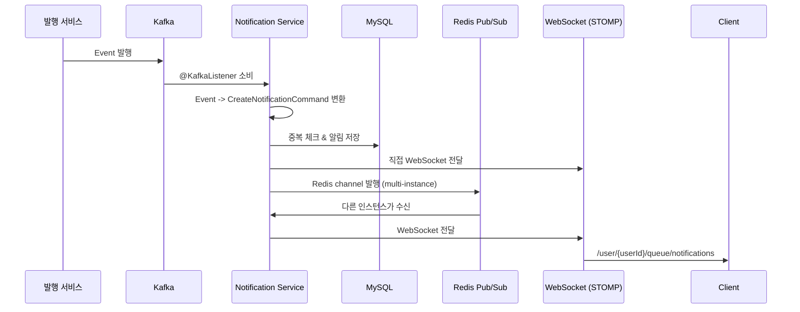

# Notification Events & Real-time Push

> Kafka 이벤트 소비, WebSocket 실시간 알림, Redis Pub/Sub 멀티 인스턴스 지원 명세서.

---

## 개요

Notification Service는 다른 서비스에서 발행한 Kafka 이벤트를 소비하여 알림을 생성하고, WebSocket + Redis Pub/Sub을 통해 사용자에게 실시간으로 전달합니다.



---

## Kafka Event Consumers

### Consumer Group 설정

| 설정 | 값 | 설명 |
|------|-----|------|
| **Group ID** | `notification-group` | Consumer Group 식별자 |
| **Auto Offset Reset** | `earliest` | 새 Consumer Group일 때 처음부터 읽기 |
| **Auto Commit** | `false` | 수동 커밋 (RECORD 단위) |
| **Trusted Packages** | `com.portal.universe.*` | JSON 역직렬화 허용 패키지 |
| **Deserializer** | `ErrorHandlingDeserializer` + `JsonDeserializer` | 역직렬화 실패 시 Consumer 중단 방지 |

---

### Auth Domain Events

#### user-signup

| 항목 | 내용 |
|------|------|
| **Topic** | `user-signup` |
| **Event Class** | `UserSignedUpEvent` |
| **알림 유형** | `SYSTEM` |
| **대상** | 가입한 사용자 본인 |

| 이벤트 필드 | 타입 | 설명 |
|-------------|------|------|
| `userId` | String | 사용자 ID |
| `name` | String | 사용자 이름 |

**생성되는 알림 예시:**

| 필드 | 값 |
|------|-----|
| title | 환영합니다! |
| message | {name}님, Portal Universe에 가입해주셔서 감사합니다. |
| type | `SYSTEM` |

---

### Shopping Domain Events

#### shopping.order.created

| 항목 | 내용 |
|------|------|
| **Topic** | `shopping.order.created` |
| **Event Class** | `OrderCreatedEvent` |
| **알림 유형** | `ORDER_CREATED` |
| **대상** | 주문한 사용자 |

| 이벤트 필드 | 타입 | 설명 |
|-------------|------|------|
| `userId` | String | 사용자 ID |
| `orderNumber` | String | 주문번호 |
| `itemCount` | int | 상품 수량 |
| `totalAmount` | BigDecimal | 총 금액 |

**생성되는 알림:**

| 필드 | 값 |
|------|-----|
| title | 주문이 접수되었습니다 |
| message | {itemCount}개 상품, {totalAmount}원 결제 대기중 |
| link | `/shopping/orders/{orderNumber}` |
| referenceId | `{orderNumber}` |
| referenceType | `order` |

---

#### shopping.order.cancelled

| 항목 | 내용 |
|------|------|
| **Topic** | `shopping.order.cancelled` |
| **Event Class** | `OrderCancelledEvent` |
| **알림 유형** | `ORDER_CANCELLED` |
| **대상** | 주문한 사용자 |

| 이벤트 필드 | 타입 | 설명 |
|-------------|------|------|
| `userId` | String | 사용자 ID |
| `orderNumber` | String | 주문번호 |
| `cancelReason` | String | 취소 사유 |

**생성되는 알림:**

| 필드 | 값 |
|------|-----|
| title | 주문이 취소되었습니다 |
| message | 주문번호: {orderNumber} - {cancelReason} |
| link | `/shopping/orders/{orderNumber}` |
| referenceId | `{orderNumber}` |
| referenceType | `order` |

---

#### shopping.payment.completed

| 항목 | 내용 |
|------|------|
| **Topic** | `shopping.payment.completed` |
| **Event Class** | `PaymentCompletedEvent` |
| **알림 유형** | `PAYMENT_COMPLETED` |
| **대상** | 결제한 사용자 |

| 이벤트 필드 | 타입 | 설명 |
|-------------|------|------|
| `userId` | String | 사용자 ID |
| `paymentNumber` | String | 결제번호 |
| `orderNumber` | String | 주문번호 |
| `amount` | BigDecimal | 결제 금액 |

**생성되는 알림:**

| 필드 | 값 |
|------|-----|
| title | 결제가 완료되었습니다 |
| message | {amount}원 결제 완료 |
| link | `/shopping/orders/{orderNumber}` |
| referenceId | `{paymentNumber}` |
| referenceType | `payment` |

---

#### shopping.payment.failed

| 항목 | 내용 |
|------|------|
| **Topic** | `shopping.payment.failed` |
| **Event Class** | `PaymentFailedEvent` |
| **알림 유형** | `PAYMENT_FAILED` |
| **대상** | 결제 시도한 사용자 |

| 이벤트 필드 | 타입 | 설명 |
|-------------|------|------|
| `userId` | String | 사용자 ID |
| `paymentNumber` | String | 결제번호 |
| `orderNumber` | String | 주문번호 |
| `failureReason` | String | 실패 사유 |

**생성되는 알림:**

| 필드 | 값 |
|------|-----|
| title | 결제가 실패했습니다 |
| message | 사유: {failureReason} (최대 50자 truncate) |
| link | `/shopping/orders/{orderNumber}` |
| referenceId | `{paymentNumber}` |
| referenceType | `payment` |

---

#### shopping.delivery.shipped

| 항목 | 내용 |
|------|------|
| **Topic** | `shopping.delivery.shipped` |
| **Event Class** | `DeliveryShippedEvent` |
| **알림 유형** | `DELIVERY_STARTED` |
| **대상** | 주문한 사용자 |

| 이벤트 필드 | 타입 | 설명 |
|-------------|------|------|
| `userId` | String | 사용자 ID |
| `orderNumber` | String | 주문번호 |
| `trackingNumber` | String | 운송장번호 |
| `carrier` | String | 배송업체 |

**생성되는 알림:**

| 필드 | 값 |
|------|-----|
| title | 배송이 시작되었습니다 |
| message | 운송장번호: {trackingNumber} ({carrier}) |
| link | `/shopping/orders/{orderNumber}` |
| referenceId | `{trackingNumber}` |
| referenceType | `delivery` |

---

#### shopping.coupon.issued

| 항목 | 내용 |
|------|------|
| **Topic** | `shopping.coupon.issued` |
| **Event Class** | `CouponIssuedEvent` |
| **알림 유형** | `COUPON_ISSUED` |
| **대상** | 쿠폰 발급 사용자 |

| 이벤트 필드 | 타입 | 설명 |
|-------------|------|------|
| `userId` | Long | 사용자 ID (String 변환) |
| `couponCode` | String | 쿠폰 코드 |
| `couponName` | String | 쿠폰 이름 |
| `discountValue` | int | 할인 값 |
| `discountType` | String | 할인 유형 (`PERCENTAGE` / `FIXED`) |

**생성되는 알림:**

| 필드 | 값 |
|------|-----|
| title | 쿠폰이 발급되었습니다 |
| message | {couponName} - {discountValue}% 또는 {discountValue}원 할인 |
| link | `/shopping/coupons` |
| referenceId | `{couponCode}` |
| referenceType | `coupon` |

---

#### shopping.timedeal.started

| 항목 | 내용 |
|------|------|
| **Topic** | `shopping.timedeal.started` |
| **Event Class** | `TimeDealStartedEvent` |
| **알림 유형** | `TIMEDEAL_STARTED` |
| **대상** | Broadcast (특정 사용자 없음) |
| **현재 상태** | **미구현** - 구독/관심 기능 추가 시 구현 예정 |

| 이벤트 필드 | 타입 | 설명 |
|-------------|------|------|
| `timeDealId` | Long | 타임딜 ID |

> 현재 이 이벤트는 수신만 하고 알림을 생성하지 않습니다. 향후 사용자별 관심 상품/카테고리 구독 모델 도입 시 구현됩니다.

---

### Blog Domain Events

#### blog.post.liked

| 항목 | 내용 |
|------|------|
| **Topic** | `blog.post.liked` |
| **Event Class** | `PostLikedEvent` |
| **알림 유형** | `BLOG_LIKE` |
| **대상** | 게시글 작성자 (`authorId`) |

| 이벤트 필드 | 타입 | 설명 |
|-------------|------|------|
| `authorId` | String | 게시글 작성자 ID (알림 수신자) |
| `postId` | String | 게시글 ID |
| `postTitle` | String | 게시글 제목 |
| `likerId` | String | 좋아요 누른 사용자 ID |
| `likerName` | String | 좋아요 누른 사용자 이름 |
| `likeId` | String | 좋아요 ID |

**생성되는 알림:**

| 필드 | 값 |
|------|-----|
| title | 게시글에 좋아요가 달렸습니다 |
| message | "{postTitle}"에 {likerName}님이 좋아요를 눌렀습니다 |
| link | `/blog/{postId}` |
| referenceId | `{likeId}` |
| referenceType | `like` |

---

#### blog.post.commented

| 항목 | 내용 |
|------|------|
| **Topic** | `blog.post.commented` |
| **Event Class** | `CommentCreatedEvent` |
| **알림 유형** | `BLOG_COMMENT` |
| **대상** | 게시글 작성자 (`authorId`) |

| 이벤트 필드 | 타입 | 설명 |
|-------------|------|------|
| `authorId` | String | 게시글 작성자 ID (알림 수신자) |
| `postId` | String | 게시글 ID |
| `postTitle` | String | 게시글 제목 |
| `commenterId` | String | 댓글 작성자 ID |
| `commenterName` | String | 댓글 작성자 이름 |
| `commentId` | String | 댓글 ID |
| `content` | String | 댓글 내용 |

**생성되는 알림:**

| 필드 | 값 |
|------|-----|
| title | 게시글에 새 댓글이 달렸습니다 |
| message | "{postTitle}"에 {commenterName}님이 댓글을 달았습니다: {content} |
| link | `/blog/{postId}` |
| referenceId | `{commentId}` |
| referenceType | `comment` |

---

#### blog.comment.replied

| 항목 | 내용 |
|------|------|
| **Topic** | `blog.comment.replied` |
| **Event Class** | `CommentRepliedEvent` |
| **알림 유형** | `BLOG_REPLY` |
| **대상** | 원 댓글 작성자 (`parentCommentAuthorId`) |

| 이벤트 필드 | 타입 | 설명 |
|-------------|------|------|
| `parentCommentAuthorId` | String | 원 댓글 작성자 ID (알림 수신자) |
| `postId` | String | 게시글 ID |
| `parentCommentId` | String | 원 댓글 ID |
| `replierId` | String | 답글 작성자 ID |
| `replierName` | String | 답글 작성자 이름 |
| `replyId` | String | 답글 ID |
| `content` | String | 답글 내용 |

**생성되는 알림:**

| 필드 | 값 |
|------|-----|
| title | 댓글에 답글이 달렸습니다 |
| message | {replierName}님이 회원님의 댓글에 답글을 달았습니다: {content} |
| link | `/blog/{postId}#comment-{parentCommentId}` |
| referenceId | `{replyId}` |
| referenceType | `reply` |

---

#### blog.user.followed

| 항목 | 내용 |
|------|------|
| **Topic** | `blog.user.followed` |
| **Event Class** | `UserFollowedEvent` |
| **알림 유형** | `BLOG_FOLLOW` |
| **대상** | 팔로우 당한 사용자 (`followeeId`) |

| 이벤트 필드 | 타입 | 설명 |
|-------------|------|------|
| `followeeId` | String | 팔로우 당한 사용자 ID (알림 수신자) |
| `followerId` | String | 팔로우한 사용자 ID |
| `followerName` | String | 팔로우한 사용자 이름 |
| `followId` | String | 팔로우 관계 ID |

**생성되는 알림:**

| 필드 | 값 |
|------|-----|
| title | 새 팔로워가 생겼습니다 |
| message | {followerName}님이 회원님을 팔로우하기 시작했습니다 |
| link | `/blog/users/{followeeId}/followers` |
| referenceId | `{followId}` |
| referenceType | `follow` |

---

### Prism Domain Events

#### prism.task.completed

| 항목 | 내용 |
|------|------|
| **Topic** | `prism.task.completed` |
| **Event Class** | `PrismTaskCompletedEvent` |
| **알림 유형** | `PRISM_TASK_COMPLETED` |
| **대상** | 태스크 요청 사용자 (`userId`) |

| 이벤트 필드 | 타입 | 설명 |
|-------------|------|------|
| `userId` | String | 사용자 ID |
| `taskId` | Long | 태스크 ID |
| `boardId` | Long | 보드 ID |
| `title` | String | 태스크 제목 |
| `agentName` | String | AI 에이전트 이름 |

**생성되는 알림:**

| 필드 | 값 |
|------|-----|
| title | AI 태스크가 완료되었습니다 |
| message | "{title}" 태스크가 {agentName} 에이전트에 의해 완료되었습니다 |
| link | `/prism/boards/{boardId}/tasks/{taskId}` |
| referenceId | `{taskId}` |
| referenceType | `task` |

---

#### prism.task.failed

| 항목 | 내용 |
|------|------|
| **Topic** | `prism.task.failed` |
| **Event Class** | `PrismTaskFailedEvent` |
| **알림 유형** | `PRISM_TASK_FAILED` |
| **대상** | 태스크 요청 사용자 (`userId`) |

| 이벤트 필드 | 타입 | 설명 |
|-------------|------|------|
| `userId` | String | 사용자 ID |
| `taskId` | Long | 태스크 ID |
| `boardId` | Long | 보드 ID |
| `title` | String | 태스크 제목 |
| `errorMessage` | String | 에러 메시지 |

**생성되는 알림:**

| 필드 | 값 |
|------|-----|
| title | AI 태스크가 실패했습니다 |
| message | "{title}" 태스크 실행 실패: {errorMessage} |
| link | `/prism/boards/{boardId}/tasks/{taskId}` |
| referenceId | `{taskId}` |
| referenceType | `task` |

---

## Kafka Topic Summary

| Topic | Event Class | 알림 유형 | 대상 |
|-------|------------|-----------|------|
| `user-signup` | `UserSignedUpEvent` | `SYSTEM` | 가입 사용자 |
| `shopping.order.created` | `OrderCreatedEvent` | `ORDER_CREATED` | 주문 사용자 |
| `shopping.order.cancelled` | `OrderCancelledEvent` | `ORDER_CANCELLED` | 주문 사용자 |
| `shopping.payment.completed` | `PaymentCompletedEvent` | `PAYMENT_COMPLETED` | 결제 사용자 |
| `shopping.payment.failed` | `PaymentFailedEvent` | `PAYMENT_FAILED` | 결제 시도 사용자 |
| `shopping.delivery.shipped` | `DeliveryShippedEvent` | `DELIVERY_STARTED` | 주문 사용자 |
| `shopping.coupon.issued` | `CouponIssuedEvent` | `COUPON_ISSUED` | 쿠폰 발급 사용자 |
| `shopping.timedeal.started` | `TimeDealStartedEvent` | `TIMEDEAL_STARTED` | **미구현** (broadcast) |
| `blog.post.liked` | `PostLikedEvent` | `BLOG_LIKE` | 게시글 작성자 |
| `blog.post.commented` | `CommentCreatedEvent` | `BLOG_COMMENT` | 게시글 작성자 |
| `blog.comment.replied` | `CommentRepliedEvent` | `BLOG_REPLY` | 원 댓글 작성자 |
| `blog.user.followed` | `UserFollowedEvent` | `BLOG_FOLLOW` | 팔로우 당한 사용자 |
| `prism.task.completed` | `PrismTaskCompletedEvent` | `PRISM_TASK_COMPLETED` | 태스크 요청자 |
| `prism.task.failed` | `PrismTaskFailedEvent` | `PRISM_TASK_FAILED` | 태스크 요청자 |

> **참고**: `shopping.order.confirmed` 토픽은 상수로 정의되어 있으나 현재 Consumer가 구현되어 있지 않습니다.

---

## Dead Letter Queue (DLQ)

처리 실패한 메시지는 Dead Letter Queue로 이동됩니다.

### 설정

| 설정 | 값 | 설명 |
|------|-----|------|
| **DLQ Topic 네이밍** | `{원본토픽}.DLT` | 예: `shopping.order.created.DLT` |
| **재시도 간격** | 1,000ms (설정 변경 가능) | `app.kafka.retry.interval-ms` |
| **최대 재시도 횟수** | 3 (설정 변경 가능) | `app.kafka.retry.max-attempts` |
| **AckMode** | `RECORD` | 각 레코드 처리 후 offset 커밋 |

### 재시도하지 않는 예외

다음 예외는 재시도해도 실패하므로 즉시 DLQ로 이동합니다:

- `IllegalArgumentException` - 잘못된 이벤트 데이터
- `NullPointerException` - 필수 필드 누락

### 처리 흐름

```
이벤트 수신 -> 처리 실패
  -> 1초 후 재시도 (1회)
  -> 1초 후 재시도 (2회)
  -> 1초 후 재시도 (3회)
  -> DLQ ({topic}.DLT)로 이동 + 로깅
```

---

## WebSocket (STOMP)

클라이언트가 실시간 알림을 받기 위한 WebSocket 연결 설정입니다.

### 연결 정보

| 항목 | 값 |
|------|-----|
| **Endpoint** | `/ws/notifications` |
| **프로토콜** | STOMP over SockJS |
| **Application Prefix** | `/app` |
| **User Prefix** | `/user` |
| **Broker Prefixes** | `/topic`, `/queue` |
| **Allowed Origins** | 설정 변경 가능 (`app.websocket.allowed-origins`, 기본: `*`) |

### 구독 채널

| 채널 | 설명 |
|------|------|
| `/user/{userId}/queue/notifications` | 사용자별 개인 알림 채널 |

### 메시지 형식

구독 채널로 전달되는 메시지는 `NotificationResponse` DTO와 동일한 JSON 형식입니다.

```json
{
  "id": 42,
  "userId": "user-123",
  "type": "ORDER_CREATED",
  "title": "주문이 접수되었습니다",
  "message": "2개 상품, 45,000원 결제 대기중",
  "link": "/shopping/orders/ORD-20260206-001",
  "status": "UNREAD",
  "referenceId": "ORD-20260206-001",
  "referenceType": "order",
  "createdAt": "2026-02-06T10:00:00",
  "readAt": null
}
```

### 클라이언트 연결 예시

```typescript
import SockJS from 'sockjs-client';
import { Client } from '@stomp/stompjs';

const client = new Client({
  webSocketFactory: () => new SockJS('http://localhost:8084/ws/notifications'),
  onConnect: () => {
    // 사용자별 알림 구독
    client.subscribe(`/user/${userId}/queue/notifications`, (message) => {
      const notification = JSON.parse(message.body);
      console.log('New notification:', notification);
      // 알림 UI 업데이트
    });
  },
  onStompError: (frame) => {
    console.error('STOMP error:', frame.headers['message']);
  },
});

client.activate();
```

---

## Redis Pub/Sub (Multi-instance 지원)

여러 Notification Service 인스턴스가 실행되는 환경(K8s 등)에서 모든 인스턴스의 WebSocket 클라이언트에게 알림을 전달하기 위해 Redis Pub/Sub을 사용합니다.

### 동작 방식

1. 알림 생성 시 **직접 WebSocket 전달** + **Redis channel 발행**
2. 다른 인스턴스의 `NotificationRedisSubscriber`가 Redis message를 수신
3. 수신한 인스턴스가 자신에게 연결된 WebSocket 클라이언트에게 전달

### Redis Channel

| 항목 | 값 |
|------|-----|
| **Channel Prefix** | `notification:` |
| **Channel Pattern** | `notification:{userId}` |
| **구독 Pattern** | `notification:*` (모든 사용자 채널) |

### Serialization

| 항목 | 값 |
|------|-----|
| **Key Serializer** | `StringRedisSerializer` |
| **Value Serializer** | `GenericJackson2JsonRedisSerializer` |
| **ObjectMapper** | `JavaTimeModule` 등록 (LocalDateTime 처리) |

---

## 알림 생성 파이프라인

```
Kafka Event 수신
  |
  v
NotificationConsumer
  |-- Event 타입별 핸들러 호출
  |-- NotificationEventConverter.convert(event) -> CreateNotificationCommand
  |
  v
NotificationServiceImpl.create(cmd)
  |-- 중복 체크 (referenceId + referenceType + userId)
  |   |-- 중복이면 기존 알림 반환 (skip)
  |   |-- 새로우면 DB 저장
  |
  v
NotificationPushService.push(notification)
  |-- SimpMessagingTemplate: WebSocket 직접 전달
  |-- RedisTemplate: Redis channel 발행
  |
  v
NotificationRedisSubscriber.onMessage() [다른 인스턴스]
  |-- JSON 역직렬화
  |-- SimpMessagingTemplate: WebSocket 전달
```

---

## 환경별 설정

### application.yml (공통)

```yaml
spring:
  kafka:
    bootstrap-servers: ${KAFKA_BOOTSTRAP_SERVERS:localhost:9092}
    consumer:
      group-id: notification-group
      auto-offset-reset: earliest
      enable-auto-commit: false
  data:
    redis:
      host: ${REDIS_HOST:localhost}
      port: ${REDIS_PORT:6379}
```

### DLQ 재시도 설정 (커스텀)

```yaml
app:
  kafka:
    retry:
      interval-ms: 1000     # 재시도 간격 (ms)
      max-attempts: 3        # 최대 재시도 횟수
  websocket:
    allowed-origins: "*"     # WebSocket CORS 설정
```

---

## 관련 문서

- [Notification REST API](./notification-api.md)
- [Notification Service Architecture](../../architecture/notification-service/system-overview.md)
- [Shopping Service API](../shopping-service/)
- [Blog Service API](../blog-service/)

---

## 변경 이력

### v1.0.0 (2026-02-06)
- 초기 버전: Kafka Events 14개 토픽 문서화
- WebSocket (STOMP over SockJS) 연결 명세
- Redis Pub/Sub 멀티 인스턴스 지원 명세
- Dead Letter Queue 설정 문서화
- 알림 생성 파이프라인 다이어그램

---

**최종 업데이트**: 2026-02-06
