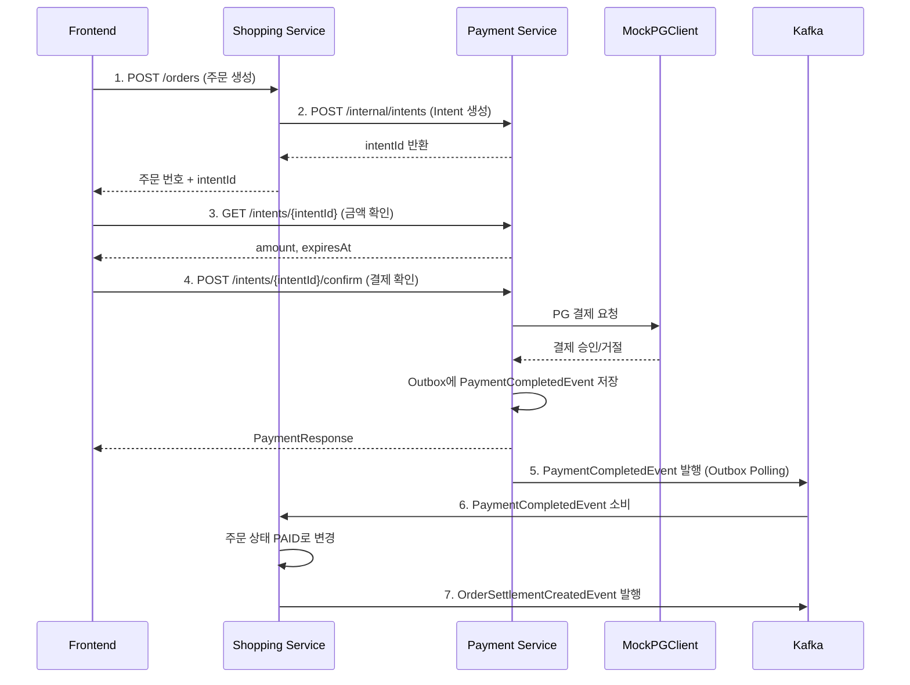

# Payment Service API

> 결제 의향(Intent) 생성 및 결제 처리 API. 독립 결제 플랫폼 서비스.

---

## 개요

| 항목 | 내용 |
|------|------|
| **Base URL** | `/api/payment` (API Gateway 경유) |
| **Internal URL** | `/internal` (서비스 간 통신 전용) |
| **포트** | :8090 |
| **인증** | Bearer JWT (Public API), Internal Token Header (Internal API) |
| **버전** | v1 |

---

## API 목록

### Public API (사용자 직접 호출)

| Method | Endpoint | 설명 | 권한 |
|--------|----------|------|------|
| GET | `/intents/{intentId}` | Intent 조회 | USER |
| POST | `/intents/{intentId}/confirm` | 결제 확인 (Intent 기반) | USER |
| GET | `/payments/{paymentNumber}` | 결제 조회 | USER |
| POST | `/payments/{paymentNumber}/cancel` | 결제 취소 | USER |
| POST | `/payments/{paymentNumber}/refund` | 결제 환불 (관리자 전용) | ADMIN |

### Internal API (서비스 간 통신 전용)

| Method | Endpoint | 설명 | 호출자 |
|--------|----------|------|--------|
| POST | `/internal/intents` | Intent 생성 | shopping-service |
| POST | `/internal/refund/{orderNumber}` | Saga 보상 환불 | shopping-service |

---

## Public API 상세

### GET /intents/{intentId}

Intent를 조회합니다.

**Path Parameters**:

| 파라미터 | 타입 | 필수 | 설명 |
|---------|------|------|------|
| `intentId` | string (UUID) | Y | Payment Intent ID |

**Response (200)**:

```json
{
  "success": true,
  "data": {
    "intentId": "550e8400-e29b-41d4-a716-446655440000",
    "orderNumber": "ORD-20260228-A1B2C3D4",
    "userId": "user123",
    "amount": 70000,
    "status": "REQUIRES_PAYMENT",
    "expiresAt": "2026-02-28T11:30:00Z",
    "createdAt": "2026-02-28T11:00:00Z"
  }
}
```

**Intent Status**:

| Status | 설명 |
|--------|------|
| `REQUIRES_PAYMENT` | 결제 대기 (결제 가능 상태) |
| `PROCESSING` | 결제 진행 중 |
| `SUCCEEDED` | 결제 성공 |
| `FAILED` | 결제 실패 |
| `CANCELLED` | 취소됨 |
| `EXPIRED` | 만료됨 (기본 30분) |

**Error**:

| Code | HTTP | 설명 |
|------|------|------|
| `PM010` | 404 | Intent를 찾을 수 없음 |

---

### POST /intents/{intentId}/confirm

Intent를 기반으로 결제를 확인합니다. 서버가 확정한 금액으로만 결제가 진행됩니다.

**Path Parameters**:

| 파라미터 | 타입 | 필수 | 설명 |
|---------|------|------|------|
| `intentId` | string (UUID) | Y | Payment Intent ID |

**Headers**:

| 헤더 | 필수 | 설명 |
|------|------|------|
| `Authorization` | Y | Bearer JWT |
| `X-User-Id` | Y | API Gateway가 주입하는 사용자 ID |

**Request Body**:

```json
{
  "paymentMethod": "CARD",
  "cardNumber": "1234-5678-9012-3456",
  "cardExpiry": "12/28",
  "cardCvv": "123"
}
```

**Request Fields**:

| 필드 | 타입 | 필수 | 설명 | 제약조건 |
|------|------|------|------|----------|
| `paymentMethod` | string | Y | 결제 수단 | CARD, BANK_TRANSFER, KAKAO_PAY, NAVER_PAY |
| `cardNumber` | string | N | 카드 번호 | CARD 결제 시 사용 |
| `cardExpiry` | string | N | 카드 유효기간 | CARD 결제 시 사용 |
| `cardCvv` | string | N | CVC 코드 | CARD 결제 시 사용 |

**Response (200)**:

```json
{
  "success": true,
  "data": {
    "paymentNumber": "PAY-A1B2C3D4",
    "intentId": "550e8400-e29b-41d4-a716-446655440000",
    "orderNumber": "ORD-20260228-A1B2C3D4",
    "userId": "user123",
    "amount": 70000,
    "status": "COMPLETED",
    "paymentMethod": "CARD",
    "pgTransactionId": "PG-A1B2C3D4E5F6",
    "paidAt": "2026-02-28T11:05:00Z",
    "refundedAt": null,
    "createdAt": "2026-02-28T11:05:00Z"
  }
}
```

**Error**:

| Code | HTTP | 설명 |
|------|------|------|
| `PM010` | 404 | Intent를 찾을 수 없음 |
| `PM011` | 409 | Intent가 결제 가능 상태가 아님 |
| `PM012` | 410 | Intent가 만료됨 |
| `PM013` | 403 | Intent가 이 사용자에 속하지 않음 |
| `PM022` | 500 | 결제 처리 실패 (PG 오류) |

---

### GET /payments/{paymentNumber}

결제 번호로 결제를 조회합니다.

**Path Parameters**:

| 파라미터 | 타입 | 필수 | 설명 |
|---------|------|------|------|
| `paymentNumber` | string | Y | 결제 번호 (예: PAY-A1B2C3D4) |

**Response (200)**: `/intents/{intentId}/confirm` 응답과 동일한 PaymentResponse 구조

**Error**:

| Code | HTTP | 설명 |
|------|------|------|
| `PM020` | 404 | 결제를 찾을 수 없음 |
| `PM025` | 403 | 결제가 이 사용자에 속하지 않음 |

---

### POST /payments/{paymentNumber}/cancel

결제를 취소합니다.

**Path Parameters**:

| 파라미터 | 타입 | 필수 | 설명 |
|---------|------|------|------|
| `paymentNumber` | string | Y | 결제 번호 |

**Response (200)**: 취소된 PaymentResponse (`status: "CANCELLED"`)

**Error**:

| Code | HTTP | 설명 |
|------|------|------|
| `PM023` | 409 | 취소 불가능한 상태 (이미 완료/환불/취소됨) |
| `PM025` | 403 | 결제가 이 사용자에 속하지 않음 |

---

### POST /payments/{paymentNumber}/refund

결제를 환불합니다. 관리자(ADMIN) 전용입니다.

**Path Parameters**:

| 파라미터 | 타입 | 필수 | 설명 |
|---------|------|------|------|
| `paymentNumber` | string | Y | 결제 번호 |

**Response (200)**: 환불된 PaymentResponse (`status: "REFUNDED"`)

**Error**:

| Code | HTTP | 설명 |
|------|------|------|
| `PM024` | 500 | 환불 실패 |

---

## Internal API 상세

> 서비스 간 통신 전용. `X-Internal-Token` 헤더로 인증합니다.

### POST /internal/intents

Intent를 생성합니다. shopping-service가 주문 생성 시 호출합니다.

**Headers**:

| 헤더 | 필수 | 설명 |
|------|------|------|
| `X-Internal-Token` | Y | 서비스 간 통신 토큰 |

**Request Body**:

```json
{
  "orderNumber": "ORD-20260228-A1B2C3D4",
  "userId": "user123",
  "amount": 70000,
  "metadata": "{\"items\": [{\"productId\": 1, \"quantity\": 2}]}"
}
```

**Response (200)**:

```json
{
  "success": true,
  "data": {
    "intentId": "550e8400-e29b-41d4-a716-446655440000",
    "orderNumber": "ORD-20260228-A1B2C3D4",
    "userId": "user123",
    "amount": 70000,
    "status": "REQUIRES_PAYMENT",
    "expiresAt": "2026-02-28T11:30:00Z",
    "createdAt": "2026-02-28T11:00:00Z"
  }
}
```

**Error**:

| Code | HTTP | 설명 |
|------|------|------|
| `PM015` | 409 | 해당 주문의 Intent가 이미 존재함 |
| `PM090` | 401 | 유효하지 않은 내부 토큰 |

---

### POST /internal/refund/{orderNumber}

Saga 보상 트랜잭션에서 환불을 처리합니다.

**Path Parameters**:

| 파라미터 | 타입 | 필수 | 설명 |
|---------|------|------|------|
| `orderNumber` | string | Y | 주문 번호 |

**Response (200)**:

```json
{
  "success": true,
  "data": null
}
```

---

## 결제 워크플로우

### Payment Intent 기반 결제 흐름



### Saga 보상 환불 흐름

```
1. Shopping Service → Saga 보상 시작
2. POST /internal/refund/{orderNumber}
3. Payment Service → 해당 주문의 결제 조회
4. PG 환불 처리 (MockPGClient.refundPayment)
5. Payment 상태 REFUNDED로 변경
6. PaymentCancelledEvent 발행 (Outbox)
```

---

## 에러 코드

| Code | HTTP Status | 설명 |
|------|-------------|------|
| `PM010` | 404 | Payment intent not found |
| `PM011` | 409 | Payment intent is not in payable state |
| `PM012` | 410 | Payment intent has expired |
| `PM013` | 403 | Payment intent does not belong to this user |
| `PM014` | 409 | Payment intent cannot be cancelled |
| `PM015` | 409 | Payment intent already exists for this order |
| `PM020` | 404 | Payment not found |
| `PM021` | 409 | Payment has already been completed |
| `PM022` | 500 | Payment processing failed |
| `PM023` | 409 | Payment cannot be cancelled |
| `PM024` | 500 | Payment refund failed |
| `PM025` | 403 | Payment does not belong to this user |
| `PM090` | 401 | Invalid internal service token |

---

## 관련 문서

- [Payment Service Architecture](../../architecture/payment-service/system-overview.md)
- [Shopping Service Order API](../shopping-service/order-api.md)
- [ADR-055: Payment Service Extraction](../../adr/ADR-055-payment-service-extraction.md)

---

## 변경 이력

| 버전 | 날짜 | 변경 내용 | 작성자 |
|------|------|-----------|--------|
| v1.0 | 2026-02-28 | 초기 버전 (payment-service 독립 분리) | Laze |

---

**마지막 업데이트**: 2026-02-28
