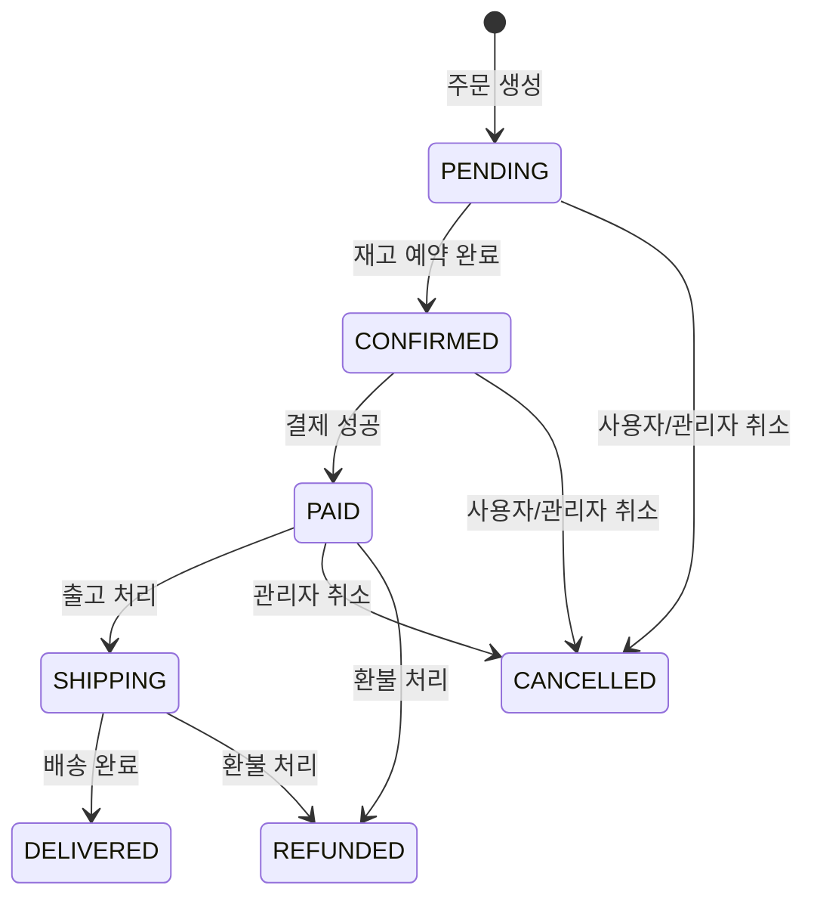

# Admin Order API

> 관리자용 주문 관리 API (조회, 상태 변경)

---

## 📋 개요

| 항목 | 내용 |
|------|------|
| **Base URL** | `/api/shopping/admin/orders` |
| **인증** | Bearer Token 필요 (ADMIN 전용) |
| **권한** | `ROLE_SHOPPING_ADMIN` 또는 `ROLE_SUPER_ADMIN` |
| **버전** | v1 |

---

## 📑 API 목록

| Method | Endpoint | 설명 |
|--------|----------|------|
| GET | `/` | 전체 주문 목록 조회 (필터/검색) |
| GET | `/{orderNumber}` | 주문 상세 조회 |
| PUT | `/{orderNumber}/status` | 주문 상태 변경 |

---

## 🔹 전체 주문 목록 조회

모든 주문을 페이징으로 조회합니다. 상태 필터링 또는 키워드 검색이 가능합니다.

### Request

```http
GET /api/shopping/admin/orders?status=CONFIRMED&page=0&size=20
Authorization: Bearer {token}
```

```http
GET /api/shopping/admin/orders?keyword=ORD-20260206&page=0&size=20
Authorization: Bearer {token}
```

### Query Parameters

| 파라미터 | 타입 | 필수 | 설명 | 기본값 |
|----------|------|------|------|--------|
| `status` | string | ❌ | 주문 상태 필터 (아래 표 참조) | - |
| `keyword` | string | ❌ | 검색어 (주문번호 또는 사용자 ID) | - |
| `page` | integer | ❌ | 페이지 번호 (0부터) | 0 |
| `size` | integer | ❌ | 페이지 크기 | 20 |

> `status`와 `keyword`를 동시에 지정하면 `status`가 우선 적용됩니다.

### Response (200 OK)

```json
{
  "success": true,
  "data": {
    "content": [
      {
        "id": 150,
        "orderNumber": "ORD-20260206-A1B2C3D4",
        "userId": "user123",
        "status": "CONFIRMED",
        "totalAmount": 70000.00,
        "discountAmount": 5000.00,
        "finalAmount": 65000.00,
        "appliedUserCouponId": 501,
        "shippingAddress": {
          "receiverName": "홍길동",
          "receiverPhone": "010-1234-5678",
          "zipCode": "06134",
          "address1": "서울시 강남구 테헤란로 123",
          "address2": "4층 401호"
        },
        "items": [
          {
            "id": 301,
            "productId": 10,
            "productName": "Spring Boot 완벽 가이드",
            "price": 35000.00,
            "quantity": 2,
            "subtotal": 70000.00
          }
        ],
        "cancelReason": null,
        "cancelledAt": null,
        "createdAt": "2026-02-06T10:00:00Z",
        "updatedAt": "2026-02-06T10:05:00Z"
      }
    ],
    "page": {
      "number": 0,
      "size": 20,
      "totalElements": 150,
      "totalPages": 8
    }
  },
  "timestamp": "2026-02-06T14:00:00Z"
}
```

### Order Response Fields

| 필드 | 타입 | 설명 |
|------|------|------|
| `id` | long | 주문 ID |
| `orderNumber` | string | 주문 번호 (ORD-YYYYMMDD-XXXXXXXX) |
| `userId` | string | 주문자 ID |
| `status` | string | 주문 상태 |
| `totalAmount` | decimal | 총 주문 금액 (할인 전) |
| `discountAmount` | decimal | 할인 금액 |
| `finalAmount` | decimal | 최종 결제 금액 |
| `appliedUserCouponId` | long | 적용된 사용자 쿠폰 ID (null 가능) |
| `shippingAddress` | object | 배송 주소 |
| `items` | array | 주문 항목 목록 |
| `cancelReason` | string | 취소 사유 (취소 시) |
| `cancelledAt` | string | 취소일시 (취소 시) |
| `createdAt` | string | 주문일시 |
| `updatedAt` | string | 최종 수정일시 |

### Order Item Fields

| 필드 | 타입 | 설명 |
|------|------|------|
| `id` | long | 항목 ID |
| `productId` | long | 상품 ID |
| `productName` | string | 상품명 (스냅샷) |
| `price` | decimal | 단가 (스냅샷) |
| `quantity` | integer | 수량 |
| `subtotal` | decimal | 소계 (단가 x 수량) |

---

## 🔹 주문 상세 조회

특정 주문의 상세 정보를 조회합니다.

### Request

```http
GET /api/shopping/admin/orders/{orderNumber}
Authorization: Bearer {token}
```

### Path Parameters

| 파라미터 | 타입 | 필수 | 설명 |
|----------|------|------|------|
| `orderNumber` | string | ✅ | 주문 번호 |

### Response (200 OK)

```json
{
  "success": true,
  "data": {
    "id": 150,
    "orderNumber": "ORD-20260206-A1B2C3D4",
    "userId": "user123",
    "status": "CONFIRMED",
    "totalAmount": 70000.00,
    "discountAmount": 5000.00,
    "finalAmount": 65000.00,
    "appliedUserCouponId": 501,
    "shippingAddress": {
      "receiverName": "홍길동",
      "receiverPhone": "010-1234-5678",
      "zipCode": "06134",
      "address1": "서울시 강남구 테헤란로 123",
      "address2": "4층 401호"
    },
    "items": [
      {
        "id": 301,
        "productId": 10,
        "productName": "Spring Boot 완벽 가이드",
        "price": 35000.00,
        "quantity": 2,
        "subtotal": 70000.00
      }
    ],
    "cancelReason": null,
    "cancelledAt": null,
    "createdAt": "2026-02-06T10:00:00Z",
    "updatedAt": "2026-02-06T10:05:00Z"
  },
  "timestamp": "2026-02-06T14:00:00Z"
}
```

### Error Response

```json
{
  "success": false,
  "code": "S201",
  "message": "주문을 찾을 수 없습니다.",
  "timestamp": "2026-02-06T14:00:00Z"
}
```

---

## 🔹 주문 상태 변경

관리자가 주문 상태를 직접 변경합니다.

### Request

```http
PUT /api/shopping/admin/orders/{orderNumber}/status
Content-Type: application/json
Authorization: Bearer {token}

{
  "status": "SHIPPING"
}
```

### Path Parameters

| 파라미터 | 타입 | 필수 | 설명 |
|----------|------|------|------|
| `orderNumber` | string | ✅ | 주문 번호 |

### Request Body

| 필드 | 타입 | 필수 | 설명 | 제약조건 |
|------|------|------|------|----------|
| `status` | string | ✅ | 변경할 주문 상태 | OrderStatus enum 값 |

### Response (200 OK)

```json
{
  "success": true,
  "data": {
    "id": 150,
    "orderNumber": "ORD-20260206-A1B2C3D4",
    "userId": "user123",
    "status": "SHIPPING",
    "totalAmount": 70000.00,
    "discountAmount": 5000.00,
    "finalAmount": 65000.00,
    "appliedUserCouponId": 501,
    "shippingAddress": {
      "receiverName": "홍길동",
      "receiverPhone": "010-1234-5678",
      "zipCode": "06134",
      "address1": "서울시 강남구 테헤란로 123",
      "address2": "4층 401호"
    },
    "items": [
      {
        "id": 301,
        "productId": 10,
        "productName": "Spring Boot 완벽 가이드",
        "price": 35000.00,
        "quantity": 2,
        "subtotal": 70000.00
      }
    ],
    "cancelReason": null,
    "cancelledAt": null,
    "createdAt": "2026-02-06T10:00:00Z",
    "updatedAt": "2026-02-06T14:30:00Z"
  },
  "timestamp": "2026-02-06T14:30:00Z"
}
```

---

## 🔄 주문 상태 전환



### 주문 상태 (OrderStatus)

| 값 | 설명 | 취소 가능 | 환불 가능 |
|----|------|:---------:|:---------:|
| `PENDING` | 대기 중 (주문 생성됨) | ✅ | ❌ |
| `CONFIRMED` | 확정됨 (재고 예약 완료) | ✅ | ❌ |
| `PAID` | 결제 완료 | ✅ | ✅ |
| `SHIPPING` | 배송 중 | ❌ | ✅ |
| `DELIVERED` | 배송 완료 | ❌ | ❌ |
| `CANCELLED` | 취소됨 | - | - |
| `REFUNDED` | 환불됨 | - | - |

---

## ⚠️ 에러 코드

| Code | HTTP Status | 설명 |
|------|-------------|------|
| `S201` | 404 | 주문을 찾을 수 없습니다 |
| `S202` | 400 | 이미 취소된 주문입니다 |
| `S203` | 400 | 현재 상태에서 취소할 수 없습니다 |
| `S209` | 400 | 잘못된 주문 상태 전환입니다 |
| `C001` | 401 | 인증이 필요합니다 |
| `C002` | 403 | 권한이 없습니다 |

---

## 🔗 관련 문서

- [Order API](./order-api.md) (사용자용)
- [Payment API](./payment-api.md)
- [Delivery API](./delivery-api.md)

---

**최종 업데이트**: 2026-02-06
