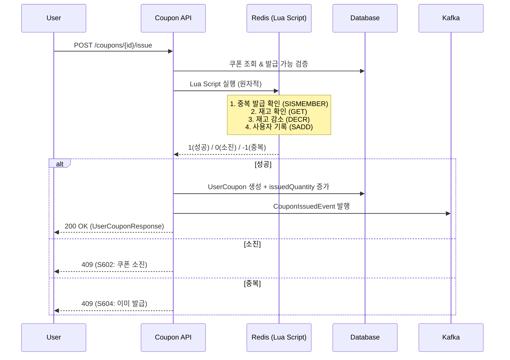

# Coupon API

> 사용자 쿠폰 조회, 선착순 발급 및 보유 쿠폰 관리 API

---

## 📋 개요

| 항목 | 내용 |
|------|------|
| **Base URL** | `/api/shopping/coupons` |
| **인증** | 목록/상세 조회: PUBLIC / 발급, 내 쿠폰: Bearer Token 필요 |
| **버전** | v1 |

---

## 📑 API 목록

| Method | Endpoint | 설명 | 인증 |
|--------|----------|------|------|
| GET | `/` | 발급 가능한 쿠폰 목록 조회 | PUBLIC |
| GET | `/{couponId}` | 쿠폰 상세 조회 | PUBLIC |
| POST | `/{couponId}/issue` | 선착순 쿠폰 발급 | USER |
| GET | `/my` | 내 쿠폰 전체 목록 | USER |
| GET | `/my/available` | 내 사용 가능 쿠폰 목록 | USER |

---

## 🔹 발급 가능 쿠폰 목록 조회

현재 발급 가능한 쿠폰 목록을 조회합니다. ACTIVE 상태이고, 발급 기간 내이며, 재고가 남은 쿠폰만 반환됩니다.

### Request

```http
GET /api/shopping/coupons
```

### Response (200 OK)

```json
{
  "success": true,
  "data": [
    {
      "id": 1,
      "code": "WELCOME2026",
      "name": "신규 가입 환영 쿠폰",
      "description": "첫 주문 시 사용 가능한 10% 할인 쿠폰",
      "discountType": "PERCENTAGE",
      "discountValue": 10.00,
      "minimumOrderAmount": 30000.00,
      "maximumDiscountAmount": 5000.00,
      "totalQuantity": 1000,
      "issuedQuantity": 350,
      "remainingQuantity": 650,
      "status": "ACTIVE",
      "startsAt": "2026-01-01T00:00:00Z",
      "expiresAt": "2026-03-31T23:59:59Z",
      "createdAt": "2025-12-20T10:00:00Z"
    },
    {
      "id": 2,
      "code": "FLAT3000",
      "name": "3,000원 할인 쿠폰",
      "description": "전 상품 3,000원 할인",
      "discountType": "FIXED",
      "discountValue": 3000.00,
      "minimumOrderAmount": 15000.00,
      "maximumDiscountAmount": null,
      "totalQuantity": 500,
      "issuedQuantity": 120,
      "remainingQuantity": 380,
      "status": "ACTIVE",
      "startsAt": "2026-02-01T00:00:00Z",
      "expiresAt": "2026-02-28T23:59:59Z",
      "createdAt": "2026-01-25T09:00:00Z"
    }
  ],
  "timestamp": "2026-02-06T10:00:00Z"
}
```

### Response Fields

| 필드 | 타입 | 설명 |
|------|------|------|
| `id` | long | 쿠폰 ID |
| `code` | string | 쿠폰 코드 |
| `name` | string | 쿠폰명 |
| `description` | string | 쿠폰 설명 |
| `discountType` | string | 할인 유형 (FIXED: 정액, PERCENTAGE: 정률) |
| `discountValue` | decimal | 할인값 (FIXED: 금액, PERCENTAGE: %) |
| `minimumOrderAmount` | decimal | 최소 주문 금액 |
| `maximumDiscountAmount` | decimal | 최대 할인 금액 (PERCENTAGE일 때 상한) |
| `totalQuantity` | integer | 총 발급 수량 |
| `issuedQuantity` | integer | 발급된 수량 |
| `remainingQuantity` | integer | 남은 수량 |
| `status` | string | 쿠폰 상태 (아래 표 참조) |
| `startsAt` | string | 발급 시작일시 |
| `expiresAt` | string | 발급 만료일시 |
| `createdAt` | string | 생성일시 |

### 쿠폰 상태 (CouponStatus)

| 값 | 설명 |
|----|------|
| `ACTIVE` | 발급 가능 |
| `EXHAUSTED` | 소진됨 (재고 0) |
| `EXPIRED` | 만료됨 |
| `INACTIVE` | 비활성화 (관리자 처리) |

---

## 🔹 쿠폰 상세 조회

특정 쿠폰의 상세 정보를 조회합니다.

### Request

```http
GET /api/shopping/coupons/{couponId}
```

### Path Parameters

| 파라미터 | 타입 | 필수 | 설명 |
|----------|------|------|------|
| `couponId` | long | ✅ | 쿠폰 ID |

### Response (200 OK)

```json
{
  "success": true,
  "data": {
    "id": 1,
    "code": "WELCOME2026",
    "name": "신규 가입 환영 쿠폰",
    "description": "첫 주문 시 사용 가능한 10% 할인 쿠폰",
    "discountType": "PERCENTAGE",
    "discountValue": 10.00,
    "minimumOrderAmount": 30000.00,
    "maximumDiscountAmount": 5000.00,
    "totalQuantity": 1000,
    "issuedQuantity": 350,
    "remainingQuantity": 650,
    "status": "ACTIVE",
    "startsAt": "2026-01-01T00:00:00Z",
    "expiresAt": "2026-03-31T23:59:59Z",
    "createdAt": "2025-12-20T10:00:00Z"
  },
  "timestamp": "2026-02-06T10:00:00Z"
}
```

### Error Response

```json
{
  "success": false,
  "code": "S601",
  "message": "쿠폰을 찾을 수 없습니다.",
  "timestamp": "2026-02-06T10:00:00Z"
}
```

---

## 🔹 선착순 쿠폰 발급

쿠폰을 발급받습니다. Redis Lua Script를 사용한 원자적 처리로 동시성을 보장합니다.

### Request

```http
POST /api/shopping/coupons/{couponId}/issue
Authorization: Bearer {token}
```

### Path Parameters

| 파라미터 | 타입 | 필수 | 설명 |
|----------|------|------|------|
| `couponId` | long | ✅ | 발급받을 쿠폰 ID |

### Response (200 OK)

```json
{
  "success": true,
  "data": {
    "id": 501,
    "couponId": 1,
    "couponCode": "WELCOME2026",
    "couponName": "신규 가입 환영 쿠폰",
    "discountType": "PERCENTAGE",
    "discountValue": 10.00,
    "minimumOrderAmount": 30000.00,
    "maximumDiscountAmount": 5000.00,
    "status": "AVAILABLE",
    "issuedAt": "2026-02-06T10:05:00Z",
    "expiresAt": "2026-03-31T23:59:59Z",
    "usedAt": null,
    "usedOrderId": null
  },
  "timestamp": "2026-02-06T10:05:00Z"
}
```

### UserCoupon Response Fields

| 필드 | 타입 | 설명 |
|------|------|------|
| `id` | long | 사용자 쿠폰 ID |
| `couponId` | long | 원본 쿠폰 ID |
| `couponCode` | string | 쿠폰 코드 |
| `couponName` | string | 쿠폰명 |
| `discountType` | string | 할인 유형 |
| `discountValue` | decimal | 할인값 |
| `minimumOrderAmount` | decimal | 최소 주문 금액 |
| `maximumDiscountAmount` | decimal | 최대 할인 금액 |
| `status` | string | 사용자 쿠폰 상태 (아래 표 참조) |
| `issuedAt` | string | 발급일시 |
| `expiresAt` | string | 만료일시 |
| `usedAt` | string | 사용일시 (미사용 시 null) |
| `usedOrderId` | long | 사용된 주문 ID (미사용 시 null) |

### 사용자 쿠폰 상태 (UserCouponStatus)

| 값 | 설명 |
|----|------|
| `AVAILABLE` | 사용 가능 |
| `USED` | 사용 완료 |
| `EXPIRED` | 만료됨 |

### Error Responses

```json
{
  "success": false,
  "code": "S601",
  "message": "쿠폰을 찾을 수 없습니다.",
  "timestamp": "2026-02-06T10:05:00Z"
}
```

```json
{
  "success": false,
  "code": "S602",
  "message": "쿠폰이 모두 소진되었습니다.",
  "timestamp": "2026-02-06T10:05:00Z"
}
```

```json
{
  "success": false,
  "code": "S604",
  "message": "이미 발급받은 쿠폰입니다.",
  "timestamp": "2026-02-06T10:05:00Z"
}
```

```json
{
  "success": false,
  "code": "S606",
  "message": "쿠폰이 활성 상태가 아닙니다.",
  "timestamp": "2026-02-06T10:05:00Z"
}
```

---

## 🔹 내 쿠폰 전체 목록

현재 사용자가 보유한 모든 쿠폰 (사용 완료, 만료 포함)을 조회합니다.

### Request

```http
GET /api/shopping/coupons/my
Authorization: Bearer {token}
```

### Response (200 OK)

```json
{
  "success": true,
  "data": [
    {
      "id": 501,
      "couponId": 1,
      "couponCode": "WELCOME2026",
      "couponName": "신규 가입 환영 쿠폰",
      "discountType": "PERCENTAGE",
      "discountValue": 10.00,
      "minimumOrderAmount": 30000.00,
      "maximumDiscountAmount": 5000.00,
      "status": "AVAILABLE",
      "issuedAt": "2026-02-06T10:05:00Z",
      "expiresAt": "2026-03-31T23:59:59Z",
      "usedAt": null,
      "usedOrderId": null
    },
    {
      "id": 300,
      "couponId": 5,
      "couponCode": "JAN2026",
      "couponName": "1월 프로모션 쿠폰",
      "discountType": "FIXED",
      "discountValue": 2000.00,
      "minimumOrderAmount": 10000.00,
      "maximumDiscountAmount": null,
      "status": "USED",
      "issuedAt": "2026-01-05T14:00:00Z",
      "expiresAt": "2026-01-31T23:59:59Z",
      "usedAt": "2026-01-20T16:30:00Z",
      "usedOrderId": 12345
    }
  ],
  "timestamp": "2026-02-06T10:10:00Z"
}
```

---

## 🔹 내 사용 가능 쿠폰 목록

현재 사용 가능한 쿠폰만 조회합니다. AVAILABLE 상태이고 만료되지 않은 쿠폰만 반환됩니다.

### Request

```http
GET /api/shopping/coupons/my/available
Authorization: Bearer {token}
```

### Response (200 OK)

```json
{
  "success": true,
  "data": [
    {
      "id": 501,
      "couponId": 1,
      "couponCode": "WELCOME2026",
      "couponName": "신규 가입 환영 쿠폰",
      "discountType": "PERCENTAGE",
      "discountValue": 10.00,
      "minimumOrderAmount": 30000.00,
      "maximumDiscountAmount": 5000.00,
      "status": "AVAILABLE",
      "issuedAt": "2026-02-06T10:05:00Z",
      "expiresAt": "2026-03-31T23:59:59Z",
      "usedAt": null,
      "usedOrderId": null
    }
  ],
  "timestamp": "2026-02-06T10:10:00Z"
}
```

---

## 🔄 쿠폰 발급 워크플로우



## 💡 할인 계산 규칙

```
1. 최소 주문금액 미달 → 할인 0원
2. 할인 계산:
   - FIXED:      할인액 = discountValue
   - PERCENTAGE: 할인액 = 주문금액 × discountValue / 100
3. 최대 할인액 제한:
   - maximumDiscountAmount 설정 시, 초과분은 절삭
4. 주문금액 초과 방지:
   - 할인액 > 주문금액이면 주문금액으로 제한
```

---

## ⚠️ 에러 코드

| Code | HTTP Status | 설명 |
|------|-------------|------|
| `S601` | 404 | 쿠폰을 찾을 수 없습니다 |
| `S602` | 409 | 쿠폰이 모두 소진되었습니다 |
| `S603` | 400 | 쿠폰이 만료되었습니다 |
| `S604` | 409 | 이미 발급받은 쿠폰입니다 |
| `S605` | 400 | 쿠폰 발급 기간이 아닙니다 |
| `S606` | 400 | 쿠폰이 활성 상태가 아닙니다 |
| `S608` | 404 | 사용자 쿠폰을 찾을 수 없습니다 |
| `S609` | 400 | 이미 사용된 쿠폰입니다 |
| `S610` | 400 | 사용자 쿠폰이 만료되었습니다 |
| `S611` | 400 | 최소 주문 금액 미달입니다 |
| `C001` | 401 | 인증이 필요합니다 |

---

## 🔗 관련 문서

- [Admin Coupon API](./admin-coupon-api.md)
- [Order API](./order-api.md)
- [Cart API](./cart-api.md)

---

**최종 업데이트**: 2026-02-06
