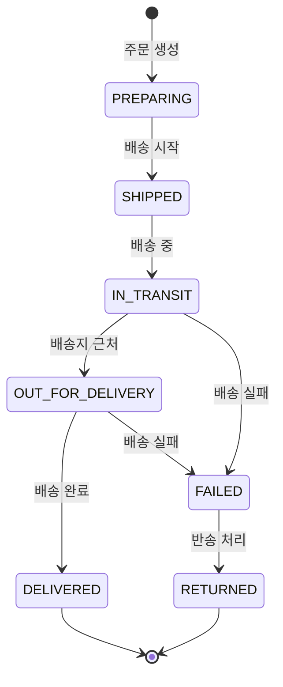

# Delivery API

> 배송 관리 API (조회, 상태 변경)

---

## 📋 개요

| 항목 | 내용 |
|------|------|
| **Base URL** | `/api/shopping/deliveries` |
| **인증** | Bearer Token 필요 (공개 조회는 불필요) |
| **버전** | v1 |

---

## 📑 API 목록

| Method | Endpoint | 설명 | 권한 |
|--------|----------|------|------|
| GET | `/{trackingNumber}` | 운송장 번호로 조회 | PUBLIC |
| GET | `/order/{orderNumber}` | 주문 번호로 조회 | USER |
| PUT | `/{trackingNumber}/status` | 상태 변경 | ADMIN |

---

## 🔹 운송장 번호로 조회

운송장 번호로 배송을 조회합니다. 인증이 필요하지 않습니다.

### Request

```http
GET /api/shopping/deliveries/{trackingNumber}
```

### Path Parameters

| 파라미터 | 타입 | 필수 | 설명 |
|----------|------|------|------|
| `trackingNumber` | string | ✅ | 운송장 번호 (예: TRK-20260118-001) |

### Response (200 OK)

```json
{
  "success": true,
  "data": {
    "trackingNumber": "TRK-20260118-001",
    "orderNumber": "ORD-20260118-001",
    "courier": "CJ대한통운",
    "status": "IN_TRANSIT",
    "recipient": {
      "name": "홍길동",
      "phone": "010-1234-5678",
      "address": "서울시 강남구 테헤란로 123, 456호"
    },
    "timeline": [
      {
        "status": "PREPARING",
        "description": "상품 준비 중",
        "timestamp": "2026-01-18T11:00:00Z"
      },
      {
        "status": "SHIPPED",
        "description": "배송 시작",
        "location": "서울 물류센터",
        "timestamp": "2026-01-18T14:00:00Z"
      },
      {
        "status": "IN_TRANSIT",
        "description": "배송 중",
        "location": "강남 배송센터",
        "timestamp": "2026-01-18T16:00:00Z"
      }
    ],
    "estimatedDelivery": "2026-01-19T18:00:00Z",
    "createdAt": "2026-01-18T11:00:00Z",
    "updatedAt": "2026-01-18T16:00:00Z"
  },
  "timestamp": "2026-01-18T17:00:00Z"
}
```

### Delivery Status

| Status | 설명 |
|--------|------|
| `PREPARING` | 상품 준비 중 |
| `SHIPPED` | 배송 시작 |
| `IN_TRANSIT` | 배송 중 |
| `OUT_FOR_DELIVERY` | 배송지 근처 도착 |
| `DELIVERED` | 배송 완료 |
| `FAILED` | 배송 실패 |
| `RETURNED` | 반송 |

### Error Response

```json
{
  "success": false,
  "code": "S013",
  "message": "배송 정보를 찾을 수 없습니다.",
  "timestamp": "2026-01-18T17:00:00Z"
}
```

---

## 🔹 주문 번호로 조회

주문 번호로 배송을 조회합니다. 인증이 필요합니다.

### Request

```http
GET /api/shopping/deliveries/order/{orderNumber}
Authorization: Bearer {token}
```

### Path Parameters

| 파라미터 | 타입 | 필수 | 설명 |
|----------|------|------|------|
| `orderNumber` | string | ✅ | 주문 번호 (예: ORD-20260118-001) |

### Response (200 OK)

```json
{
  "success": true,
  "data": {
    "trackingNumber": "TRK-20260118-001",
    "orderNumber": "ORD-20260118-001",
    "courier": "CJ대한통운",
    "status": "IN_TRANSIT",
    "recipient": {
      "name": "홍길동",
      "phone": "010-1234-5678",
      "address": "서울시 강남구 테헤란로 123, 456호"
    },
    "timeline": [
      {
        "status": "PREPARING",
        "description": "상품 준비 중",
        "timestamp": "2026-01-18T11:00:00Z"
      },
      {
        "status": "SHIPPED",
        "description": "배송 시작",
        "location": "서울 물류센터",
        "timestamp": "2026-01-18T14:00:00Z"
      },
      {
        "status": "IN_TRANSIT",
        "description": "배송 중",
        "location": "강남 배송센터",
        "timestamp": "2026-01-18T16:00:00Z"
      }
    ],
    "estimatedDelivery": "2026-01-19T18:00:00Z",
    "createdAt": "2026-01-18T11:00:00Z",
    "updatedAt": "2026-01-18T16:00:00Z"
  },
  "timestamp": "2026-01-18T17:00:00Z"
}
```

### Error Response

```json
{
  "success": false,
  "code": "S006",
  "message": "주문을 찾을 수 없습니다.",
  "timestamp": "2026-01-18T17:00:00Z"
}
```

---

## 🔹 배송 상태 변경 (관리자 전용)

배송 상태를 변경합니다. 관리자만 사용 가능합니다.

### Request

```http
PUT /api/shopping/deliveries/{trackingNumber}/status
Content-Type: application/json
Authorization: Bearer {admin_token}

{
  "status": "DELIVERED",
  "location": "수령 완료",
  "notes": "문 앞에 안전하게 배송 완료"
}
```

### Path Parameters

| 파라미터 | 타입 | 필수 | 설명 |
|----------|------|------|------|
| `trackingNumber` | string | ✅ | 운송장 번호 |

### Request Body

| 필드 | 타입 | 필수 | 설명 | 제약조건 |
|------|------|------|------|----------|
| `status` | string | ✅ | 변경할 상태 | Delivery Status 참조 |
| `location` | string | ❌ | 현재 위치 | 최대 100자 |
| `notes` | string | ❌ | 메모 | 최대 500자 |

### Response (200 OK)

```json
{
  "success": true,
  "data": {
    "trackingNumber": "TRK-20260118-001",
    "orderNumber": "ORD-20260118-001",
    "status": "DELIVERED",
    "timeline": [
      {
        "status": "PREPARING",
        "description": "상품 준비 중",
        "timestamp": "2026-01-18T11:00:00Z"
      },
      {
        "status": "SHIPPED",
        "description": "배송 시작",
        "location": "서울 물류센터",
        "timestamp": "2026-01-18T14:00:00Z"
      },
      {
        "status": "IN_TRANSIT",
        "description": "배송 중",
        "location": "강남 배송센터",
        "timestamp": "2026-01-18T16:00:00Z"
      },
      {
        "status": "DELIVERED",
        "description": "배송 완료",
        "location": "수령 완료",
        "notes": "문 앞에 안전하게 배송 완료",
        "timestamp": "2026-01-19T10:30:00Z"
      }
    ],
    "updatedAt": "2026-01-19T10:30:00Z"
  },
  "timestamp": "2026-01-19T10:30:00Z"
}
```

### Error Response

```json
{
  "success": false,
  "code": "S014",
  "message": "유효하지 않은 상태 전환입니다.",
  "timestamp": "2026-01-19T10:30:00Z"
}
```

---

## 🔄 배송 상태 전환 규칙



### 상태 전환 제약

- `PREPARING` → `SHIPPED` 만 가능
- `SHIPPED` → `IN_TRANSIT` 또는 `FAILED`
- `IN_TRANSIT` → `OUT_FOR_DELIVERY` 또는 `FAILED`
- `OUT_FOR_DELIVERY` → `DELIVERED` 또는 `FAILED`
- `FAILED` → `RETURNED`

---

## ⚠️ 에러 코드

| Code | HTTP Status | 설명 |
|------|-------------|------|
| `S006` | 404 | 주문을 찾을 수 없습니다 |
| `S013` | 404 | 배송 정보를 찾을 수 없습니다 |
| `S014` | 400 | 유효하지 않은 상태 전환입니다 |
| `C001` | 401 | 인증 필요 |
| `C002` | 403 | 권한 없음 (ADMIN 전용) |

---

## 📦 택배사 코드

| 코드 | 택배사 |
|------|--------|
| `CJ` | CJ대한통운 |
| `HANJIN` | 한진택배 |
| `LOTTE` | 롯데택배 |
| `LOGEN` | 로젠택배 |
| `KDEXP` | 경동택배 |

---

## 🔗 관련 문서

- [Order API](./order-api.md)

---

**최종 업데이트**: 2026-01-18
