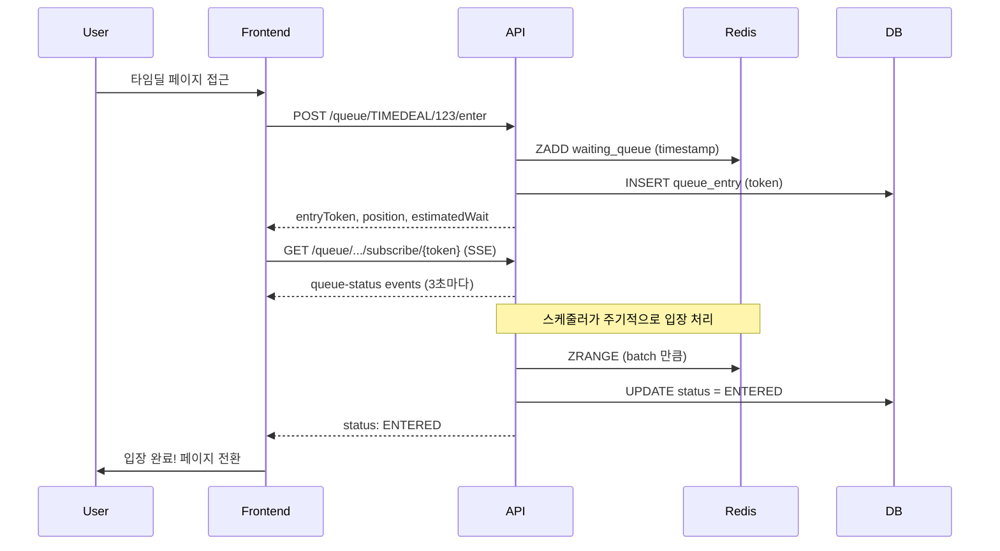
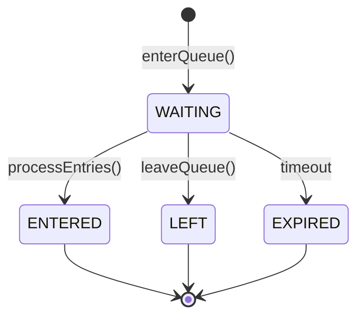

# Queue API

> 대기열 관리 API (진입, 상태 조회, 실시간 구독, 이탈)

---

## 📋 개요

| 항목 | 내용 |
|------|------|
| **Base URL** | `/api/shopping/queue` |
| **인증** | Bearer Token 필요 (User ID 헤더 필수) |
| **버전** | v1 |
| **실시간 통신** | SSE (Server-Sent Events) 지원 |

---

## 📑 API 목록

### 일반 사용자 API

| Method | Endpoint | 설명 | 인증 |
|--------|----------|------|------|
| POST | `/{eventType}/{eventId}/enter` | 대기열 진입 | ✅ |
| GET | `/{eventType}/{eventId}/status` | 대기열 상태 조회 | ✅ |
| GET | `/token/{entryToken}` | 토큰으로 상태 조회 | ✅ |
| GET | `/{eventType}/{eventId}/subscribe/{entryToken}` | 실시간 구독 (SSE) | ✅ |
| DELETE | `/{eventType}/{eventId}/leave` | 대기열 이탈 | ✅ |
| DELETE | `/token/{entryToken}` | 토큰으로 이탈 | ✅ |

---

## 🔹 대기열 진입

특정 이벤트(타임딜 등)의 대기열에 진입합니다.

### Request

```http
POST /api/shopping/queue/{eventType}/{eventId}/enter
Authorization: Bearer {token}
X-User-Id: {userId}
```

### Path Parameters

| 파라미터 | 타입 | 필수 | 설명 | 예시 |
|----------|------|------|------|------|
| `eventType` | string | ✅ | 이벤트 유형 | `TIMEDEAL`, `FLASH_SALE` |
| `eventId` | long | ✅ | 이벤트 ID | 타임딜 ID |

### Headers

| 헤더 | 필수 | 설명 |
|------|------|------|
| `X-User-Id` | ✅ | 사용자 ID (Gateway에서 주입) |

### Response (200 OK)

```json
{
  "success": true,
  "data": {
    "entryToken": "f47ac10b-58cc-4372-a567-0e02b2c3d479",
    "status": "WAITING",
    "position": 125,
    "estimatedWaitSeconds": 375,
    "totalWaiting": 500,
    "message": "현재 125번째 대기 중입니다. 예상 대기 시간: 375초"
  },
  "timestamp": "2026-01-19T14:30:00Z"
}
```

### Response Fields

| 필드 | 타입 | 설명 |
|------|------|------|
| `entryToken` | string | 대기열 엔트리 고유 토큰 (UUID) |
| `status` | string | 대기 상태 (`WAITING`, `ENTERED`, `EXPIRED`, `LEFT`) |
| `position` | long | 현재 대기 순번 (1부터 시작) |
| `estimatedWaitSeconds` | long | 예상 대기 시간 (초) |
| `totalWaiting` | long | 전체 대기 인원 |
| `message` | string | 사용자 친화적 메시지 |

---

## 🔹 대기열 상태 조회

현재 사용자의 대기 상태를 조회합니다.

### Request

```http
GET /api/shopping/queue/{eventType}/{eventId}/status
Authorization: Bearer {token}
X-User-Id: {userId}
```

### Path Parameters

| 파라미터 | 타입 | 필수 | 설명 |
|----------|------|------|------|
| `eventType` | string | ✅ | 이벤트 유형 |
| `eventId` | long | ✅ | 이벤트 ID |

### Response (200 OK)

```json
{
  "success": true,
  "data": {
    "entryToken": "f47ac10b-58cc-4372-a567-0e02b2c3d479",
    "status": "WAITING",
    "position": 98,
    "estimatedWaitSeconds": 294,
    "totalWaiting": 500,
    "message": "현재 98번째 대기 중입니다. 예상 대기 시간: 294초"
  },
  "timestamp": "2026-01-19T14:31:00Z"
}
```

### 상태별 응답 예시

#### 입장 완료 (ENTERED)
```json
{
  "entryToken": "f47ac10b-58cc-4372-a567-0e02b2c3d479",
  "status": "ENTERED",
  "position": 0,
  "estimatedWaitSeconds": 0,
  "totalWaiting": 0,
  "message": "입장이 완료되었습니다."
}
```

#### 만료 (EXPIRED)
```json
{
  "entryToken": "f47ac10b-58cc-4372-a567-0e02b2c3d479",
  "status": "EXPIRED",
  "position": 0,
  "estimatedWaitSeconds": 0,
  "totalWaiting": 0,
  "message": "대기열이 만료되었습니다."
}
```

---

## 🔹 토큰으로 상태 조회

Entry Token을 사용하여 대기 상태를 조회합니다. 토큰 소유자 본인만 조회 가능합니다.

### Request

```http
GET /api/shopping/queue/token/{entryToken}
Authorization: Bearer {accessToken}
X-User-Id: {userId}
```

### Path Parameters

| 파라미터 | 타입 | 필수 | 설명 |
|----------|------|------|------|
| `entryToken` | string | ✅ | 대기열 엔트리 토큰 (UUID) |

> **인증 필수**: Gateway가 JWT에서 추출한 `X-User-Id`와 entryToken 소유자를 비교하여 불일치 시 403을 반환합니다.

### Response (200 OK)

응답 형식은 [대기열 상태 조회](#🔹-대기열-상태-조회)와 동일합니다.

### Error Response

```json
{
  "success": false,
  "code": "S010",
  "message": "대기열 엔트리를 찾을 수 없습니다.",
  "timestamp": "2026-01-19T14:30:00Z"
}
```

---

## 🔹 실시간 구독 (SSE)

Server-Sent Events를 통해 대기열 상태를 실시간으로 수신합니다. 토큰 소유자 본인만 구독 가능합니다.

### Request

```http
GET /api/shopping/queue/{eventType}/{eventId}/subscribe/{entryToken}
Accept: text/event-stream
Authorization: Bearer {accessToken}
X-User-Id: {userId}
```

> **인증 필수**: Gateway가 JWT에서 추출한 `X-User-Id`와 entryToken 소유자를 비교하여 불일치 시 403을 반환합니다.

### Path Parameters

| 파라미터 | 타입 | 필수 | 설명 |
|----------|------|------|------|
| `eventType` | string | ✅ | 이벤트 유형 |
| `eventId` | long | ✅ | 이벤트 ID |
| `entryToken` | string | ✅ | 대기열 엔트리 토큰 |

### Response (SSE Stream)

#### Connection Established
```
HTTP/1.1 200 OK
Content-Type: text/event-stream
Cache-Control: no-cache
Connection: keep-alive
```

#### Event Stream
```
event: queue-status
data: {"entryToken":"f47ac10b-58cc...","status":"WAITING","position":125,"estimatedWaitSeconds":375,"totalWaiting":500,"message":"현재 125번째 대기 중입니다..."}

event: queue-status
data: {"entryToken":"f47ac10b-58cc...","status":"WAITING","position":98,"estimatedWaitSeconds":294,"totalWaiting":500,"message":"현재 98번째 대기 중입니다..."}

event: queue-status
data: {"entryToken":"f47ac10b-58cc...","status":"ENTERED","position":0,"estimatedWaitSeconds":0,"totalWaiting":0,"message":"입장이 완료되었습니다."}
```

### 연결 특성

| 항목 | 값 | 설명 |
|------|-----|------|
| **타임아웃** | 300초 (5분) | 연결 자동 종료 |
| **업데이트 주기** | 3초 | 상태 업데이트 간격 |
| **자동 종료 조건** | `ENTERED`, `EXPIRED`, `LEFT` | 상태 변경 시 연결 종료 |

### JavaScript 예시

```javascript
const eventSource = new EventSource(
  `/api/shopping/queue/TIMEDEAL/123/subscribe/${entryToken}`
);

eventSource.addEventListener('queue-status', (event) => {
  const status = JSON.parse(event.data);
  console.log('Position:', status.position);
  console.log('Message:', status.message);

  if (status.status === 'ENTERED') {
    eventSource.close();
    // 입장 완료 처리
  }
});

eventSource.onerror = (error) => {
  console.error('SSE connection error:', error);
  eventSource.close();
};
```

---

## 🔹 대기열 이탈

대기열에서 나갑니다.

### Request

```http
DELETE /api/shopping/queue/{eventType}/{eventId}/leave
Authorization: Bearer {token}
X-User-Id: {userId}
```

### Path Parameters

| 파라미터 | 타입 | 필수 | 설명 |
|----------|------|------|------|
| `eventType` | string | ✅ | 이벤트 유형 |
| `eventId` | long | ✅ | 이벤트 ID |

### Response (200 OK)

```json
{
  "success": true,
  "data": null,
  "timestamp": "2026-01-19T14:35:00Z"
}
```

---

## 🔹 토큰으로 이탈

Entry Token을 사용하여 대기열에서 나갑니다. 토큰 소유자 본인만 이탈 가능합니다.

### Request

```http
DELETE /api/shopping/queue/token/{entryToken}
Authorization: Bearer {accessToken}
X-User-Id: {userId}
```

> **인증 필수**: Gateway가 JWT에서 추출한 `X-User-Id`와 entryToken 소유자를 비교하여 불일치 시 403을 반환합니다.

### Path Parameters

| 파라미터 | 타입 | 필수 | 설명 |
|----------|------|------|------|
| `entryToken` | string | ✅ | 대기열 엔트리 토큰 |

### Response (200 OK)

```json
{
  "success": true,
  "data": null,
  "timestamp": "2026-01-19T14:35:00Z"
}
```

---

## 🔄 워크플로우

### 일반적인 대기열 흐름



### 대기열 상태 전이



---

## ⚠️ 에러 코드

| Code | HTTP Status | 설명 |
|------|-------------|------|
| `S009` | 400 | 대기열이 활성화되지 않았습니다 |
| `S010` | 404 | 대기열 엔트리를 찾을 수 없습니다 |
| `S011` | 409 | 이미 대기열에 진입했습니다 |
| `S012` | 400 | 잘못된 대기열 상태입니다 |
| `S807` | 403 | 대기열 토큰 소유자가 아닙니다 (다른 사용자의 토큰) |
| `C001` | 401 | 인증 필요 (X-User-Id 헤더 누락) |

---

## 📊 Redis 기반 구현

### Redis Sorted Set 구조

대기열은 Redis Sorted Set을 사용하여 순서를 보장합니다.

```redis
Key: queue:TIMEDEAL:123:waiting
Score: timestamp (joinedAt)
Member: entryToken (UUID)

예시:
ZADD queue:TIMEDEAL:123:waiting 1737292800 "f47ac10b-58cc-4372-a567-0e02b2c3d479"
ZADD queue:TIMEDEAL:123:waiting 1737292801 "a1b2c3d4-1234-5678-9abc-def012345678"
```

### 주요 Redis 연산

| 연산 | 설명 |
|------|------|
| `ZADD` | 대기열 진입 (timestamp 기준 정렬) |
| `ZRANK` | 현재 순번 조회 |
| `ZCARD` | 전체 대기 인원 조회 |
| `ZRANGE` | 입장 대상 조회 (배치 크기만큼) |
| `ZREM` | 대기열 이탈 |

---

## 🔧 성능 고려사항

### SSE vs WebSocket 비교

| 항목 | SSE (채택) | WebSocket |
|------|-----------|-----------|
| **방향** | 단방향 (서버 → 클라이언트) | 양방향 |
| **구현 복잡도** | 낮음 | 높음 |
| **재연결** | 자동 | 수동 구현 필요 |
| **브라우저 지원** | 모든 모던 브라우저 | IE 미지원 |
| **사용 사례** | 대기열 상태 푸시 (적합) | 실시간 채팅 |

### 스케일링 전략

1. **Redis 클러스터링**: 대규모 트래픽 대응
2. **SSE 연결 분산**: 여러 인스턴스로 SSE 연결 분산
3. **배치 처리 최적화**: `entryBatchSize` 조정

---

## 📌 비즈니스 규칙

### 대기열 진입 조건
- 대기열이 활성화(`isActive = true`) 상태여야 함
- 동일 사용자는 하나의 이벤트에 중복 진입 불가
- 진입 시 Redis Sorted Set에 자동 등록

### 입장 처리
- 스케줄러가 `entryIntervalSeconds` 주기로 자동 실행
- `entryBatchSize` 만큼씩 입장 처리
- 입장 후 `ENTERED` 상태로 변경

### 대기열 만료
- 입장 완료 후 일정 시간(예: 10분) 내 활동 없으면 `EXPIRED`
- 만료된 엔트리는 자동으로 대기열에서 제거

### 예상 대기 시간 계산
```
estimatedWaitSeconds =
    (position / entryBatchSize) * entryIntervalSeconds
```

---

## 🔗 관련 문서

- [Admin Queue API](./admin-queue-api.md) (관리자용 대기열 관리)
- [TimeDeal API](./timedeal-api.md)
- [ADR-002: Queue System Design](../adr/ADR-002-queue-system-design.md)

---

**최종 업데이트**: 2026-01-19
