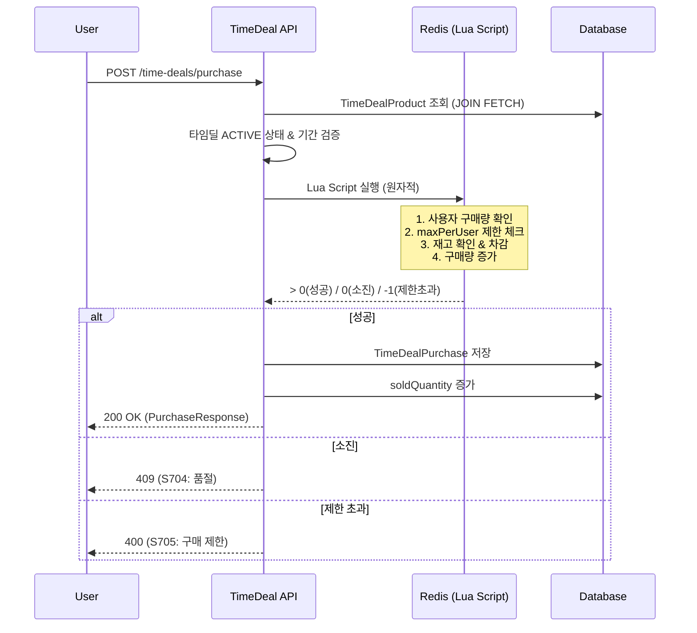
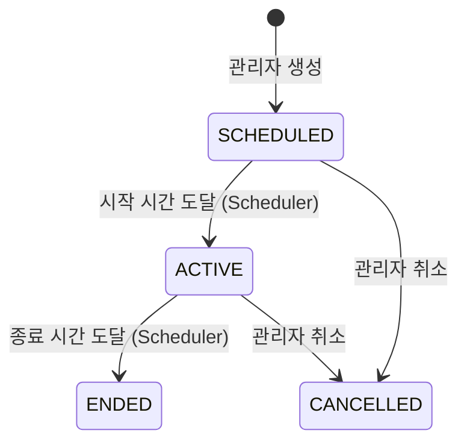

# TimeDeal API

> 타임딜 조회 및 구매 API (사용자용)

---

## 📋 개요

| 항목 | 내용 |
|------|------|
| **Base URL** | `/api/shopping/time-deals` |
| **인증** | 목록/상세 조회: PUBLIC / 구매, 내역: Bearer Token 필요 |
| **버전** | v1 |

---

## 📑 API 목록

| Method | Endpoint | 설명 | 인증 |
|--------|----------|------|------|
| GET | `/` | 진행중인 타임딜 목록 조회 | PUBLIC |
| GET | `/{timeDealId}` | 타임딜 상세 조회 | PUBLIC |
| POST | `/purchase` | 타임딜 상품 구매 | USER |
| GET | `/my/purchases` | 내 구매 내역 조회 | USER |

---

## 🔹 진행중인 타임딜 목록 조회

현재 ACTIVE 상태이고 진행 기간 내인 타임딜 목록을 조회합니다.

### Request

```http
GET /api/shopping/time-deals
```

### Response (200 OK)

```json
{
  "success": true,
  "data": [
    {
      "id": 1,
      "name": "2월 특가 타임딜",
      "description": "인기 상품 최대 50% 할인",
      "status": "ACTIVE",
      "startsAt": "2026-02-06T10:00:00Z",
      "endsAt": "2026-02-06T22:00:00Z",
      "products": [
        {
          "id": 10,
          "productId": 100,
          "productName": "Spring Boot 완벽 가이드",
          "originalPrice": 35000.00,
          "dealPrice": 17500.00,
          "discountRate": 50.00,
          "dealQuantity": 100,
          "soldQuantity": 42,
          "remainingQuantity": 58,
          "maxPerUser": 2,
          "available": true
        },
        {
          "id": 11,
          "productId": 101,
          "productName": "Kubernetes 핸즈온",
          "originalPrice": 42000.00,
          "dealPrice": 29400.00,
          "discountRate": 30.00,
          "dealQuantity": 50,
          "soldQuantity": 50,
          "remainingQuantity": 0,
          "maxPerUser": 1,
          "available": false
        }
      ],
      "createdAt": "2026-02-01T09:00:00Z"
    }
  ],
  "timestamp": "2026-02-06T14:00:00Z"
}
```

### TimeDeal Response Fields

| 필드 | 타입 | 설명 |
|------|------|------|
| `id` | long | 타임딜 ID |
| `name` | string | 타임딜명 |
| `description` | string | 설명 |
| `status` | string | 상태 (아래 표 참조) |
| `startsAt` | string | 시작일시 |
| `endsAt` | string | 종료일시 |
| `products` | array | 타임딜 상품 목록 |
| `createdAt` | string | 생성일시 |

### TimeDeal Product Fields

| 필드 | 타입 | 설명 |
|------|------|------|
| `id` | long | 타임딜 상품 ID (구매 시 사용) |
| `productId` | long | 원본 상품 ID |
| `productName` | string | 상품명 |
| `originalPrice` | decimal | 원래 가격 |
| `dealPrice` | decimal | 타임딜 가격 |
| `discountRate` | decimal | 할인율 (%) |
| `dealQuantity` | integer | 총 할인 수량 |
| `soldQuantity` | integer | 판매된 수량 |
| `remainingQuantity` | integer | 남은 수량 |
| `maxPerUser` | integer | 1인당 최대 구매 수량 |
| `available` | boolean | 구매 가능 여부 |

### 타임딜 상태 (TimeDealStatus)

| 값 | 설명 |
|----|------|
| `SCHEDULED` | 예정됨 (시작 전) |
| `ACTIVE` | 진행중 |
| `ENDED` | 종료됨 |
| `CANCELLED` | 취소됨 (관리자 처리) |

---

## 🔹 타임딜 상세 조회

특정 타임딜의 상세 정보를 조회합니다.

### Request

```http
GET /api/shopping/time-deals/{timeDealId}
```

### Path Parameters

| 파라미터 | 타입 | 필수 | 설명 |
|----------|------|------|------|
| `timeDealId` | long | ✅ | 타임딜 ID |

### Response (200 OK)

```json
{
  "success": true,
  "data": {
    "id": 1,
    "name": "2월 특가 타임딜",
    "description": "인기 상품 최대 50% 할인",
    "status": "ACTIVE",
    "startsAt": "2026-02-06T10:00:00Z",
    "endsAt": "2026-02-06T22:00:00Z",
    "products": [
      {
        "id": 10,
        "productId": 100,
        "productName": "Spring Boot 완벽 가이드",
        "originalPrice": 35000.00,
        "dealPrice": 17500.00,
        "discountRate": 50.00,
        "dealQuantity": 100,
        "soldQuantity": 42,
        "remainingQuantity": 58,
        "maxPerUser": 2,
        "available": true
      }
    ],
    "createdAt": "2026-02-01T09:00:00Z"
  },
  "timestamp": "2026-02-06T14:00:00Z"
}
```

### Error Response

```json
{
  "success": false,
  "code": "S701",
  "message": "타임딜을 찾을 수 없습니다.",
  "timestamp": "2026-02-06T14:00:00Z"
}
```

---

## 🔹 타임딜 상품 구매

타임딜 상품을 구매합니다. Redis Lua Script를 사용한 원자적 처리로 재고 차감과 구매 제한을 동시에 검증합니다.

### Request

```http
POST /api/shopping/time-deals/purchase
Content-Type: application/json
Authorization: Bearer {token}

{
  "timeDealProductId": 10,
  "quantity": 1
}
```

### Request Body

| 필드 | 타입 | 필수 | 설명 | 제약조건 |
|------|------|------|------|----------|
| `timeDealProductId` | long | ✅ | 타임딜 상품 ID | 목록 조회의 `products[].id` 값 |
| `quantity` | integer | ✅ | 구매 수량 | 1 이상 |

### Response (200 OK)

```json
{
  "success": true,
  "data": {
    "id": 501,
    "timeDealProductId": 10,
    "productName": "Spring Boot 완벽 가이드",
    "quantity": 1,
    "purchasePrice": 17500.00,
    "totalPrice": 17500.00,
    "purchasedAt": "2026-02-06T14:05:00Z"
  },
  "timestamp": "2026-02-06T14:05:00Z"
}
```

### Purchase Response Fields

| 필드 | 타입 | 설명 |
|------|------|------|
| `id` | long | 구매 ID |
| `timeDealProductId` | long | 타임딜 상품 ID |
| `productName` | string | 상품명 |
| `quantity` | integer | 구매 수량 |
| `purchasePrice` | decimal | 구매 단가 (타임딜 가격) |
| `totalPrice` | decimal | 총 구매 금액 (단가 x 수량) |
| `purchasedAt` | string | 구매일시 |

### Error Responses

```json
{
  "success": false,
  "code": "S706",
  "message": "타임딜 상품을 찾을 수 없습니다.",
  "timestamp": "2026-02-06T14:05:00Z"
}
```

```json
{
  "success": false,
  "code": "S702",
  "message": "타임딜이 진행중이 아닙니다.",
  "timestamp": "2026-02-06T14:05:00Z"
}
```

```json
{
  "success": false,
  "code": "S704",
  "message": "타임딜 상품이 모두 판매되었습니다.",
  "timestamp": "2026-02-06T14:05:00Z"
}
```

```json
{
  "success": false,
  "code": "S705",
  "message": "1인당 구매 수량을 초과했습니다.",
  "timestamp": "2026-02-06T14:05:00Z"
}
```

---

## 🔹 내 구매 내역 조회

현재 사용자의 타임딜 구매 내역을 조회합니다.

### Request

```http
GET /api/shopping/time-deals/my/purchases
Authorization: Bearer {token}
```

### Response (200 OK)

```json
{
  "success": true,
  "data": [
    {
      "id": 501,
      "timeDealProductId": 10,
      "productName": "Spring Boot 완벽 가이드",
      "quantity": 1,
      "purchasePrice": 17500.00,
      "totalPrice": 17500.00,
      "purchasedAt": "2026-02-06T14:05:00Z"
    },
    {
      "id": 480,
      "timeDealProductId": 8,
      "productName": "Docker & Kubernetes 입문",
      "quantity": 2,
      "purchasePrice": 15000.00,
      "totalPrice": 30000.00,
      "purchasedAt": "2026-02-03T11:20:00Z"
    }
  ],
  "timestamp": "2026-02-06T14:10:00Z"
}
```

---

## 🔄 타임딜 구매 워크플로우



## 🔄 타임딜 상태 전환



- **Scheduler**: 1분 간격으로 상태 전환 실행 (분산 락으로 중복 방지)
- **Redis 초기화**: ACTIVE 전환 시 재고를 Redis에 세팅
- **Redis 정리**: ENDED/CANCELLED 전환 시 Redis 캐시 삭제
- **서버 재시작 시**: `ApplicationReadyEvent`에서 ACTIVE 타임딜의 Redis 재고 복원

---

## ⚠️ 에러 코드

| Code | HTTP Status | 설명 |
|------|-------------|------|
| `S701` | 404 | 타임딜을 찾을 수 없습니다 |
| `S702` | 400 | 타임딜이 진행중이 아닙니다 |
| `S703` | 400 | 타임딜이 만료되었습니다 |
| `S704` | 409 | 타임딜 상품이 모두 판매되었습니다 |
| `S705` | 400 | 1인당 구매 수량을 초과했습니다 |
| `S706` | 404 | 타임딜 상품을 찾을 수 없습니다 |
| `C001` | 401 | 인증이 필요합니다 |

---

## 🔗 관련 문서

- [Admin TimeDeal API](./admin-timedeal-api.md)
- [Product API](./product-api.md)
- [Order API](./order-api.md)

---

**최종 업데이트**: 2026-02-06
