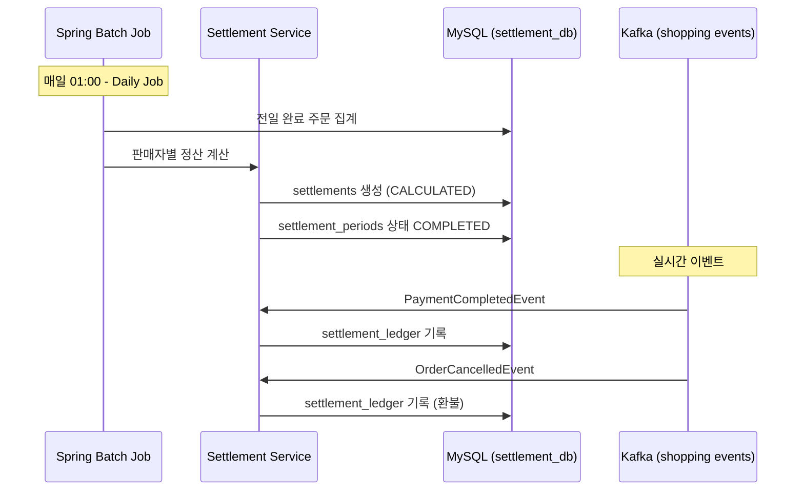
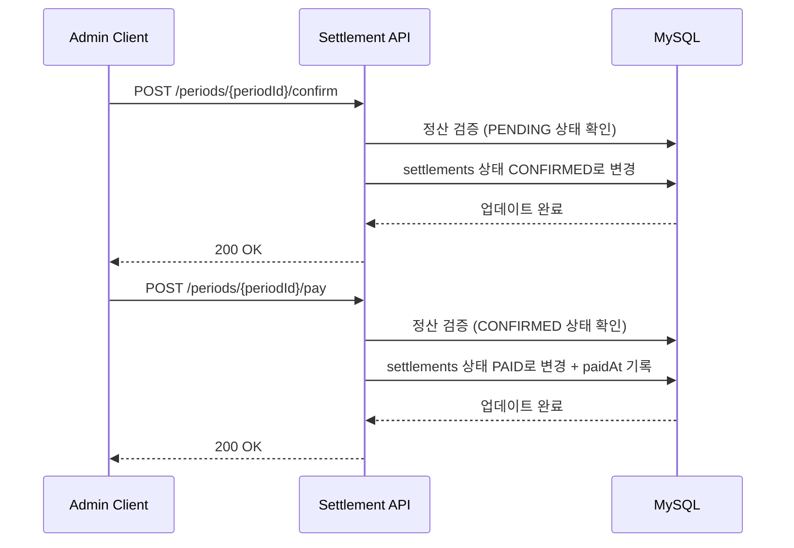

# Shopping Settlement Service API Documentation

> Shopping Settlement Service의 모든 API 엔드포인트 명세서입니다.

---

## 📋 개요

**Shopping Settlement Service는 2026-02-14 서비스 분해를 통해 Shopping Service에서 독립된 정산 전용 서비스입니다.**

| 항목 | 내용 |
|------|------|
| **Base URL** | `/api/settlement` |
| **역할** | 판매자 정산 처리 (Spring Batch 기반 배치 집계, 정산 확정/지급, 정산 원장 관리) |
| **인증** | Bearer Token (JWT) |
| **버전** | v1 |
| **포트** | 8089 |
| **응답 형식** | JSON |
| **에러 코드 Prefix** | `ST` (Settlement) |

**관련 서비스**:
- [Shopping Service](../shopping-service/README.md) - 주문/결제 이벤트 발행 (:8083)
- [Shopping Seller Service](../shopping-seller-service/README.md) - 판매자/상품 정보 (:8088)

---

## 🔐 인증

모든 API는 JWT Bearer Token 인증이 필요하며, ADMIN 또는 SELLER 권한이 필요합니다.

```http
Authorization: Bearer {access_token}
```

### 토큰 획득
Auth Service의 OAuth2 인증을 통해 토큰을 발급받아야 합니다.

### 권한 레벨
- `ADMIN`: 전체 정산 관리 (확정, 지급 처리 권한)
- `SELLER`: 본인 정산 내역 조회만 가능

---

## 📊 공통 응답 형식

### 성공 응답

```json
{
  "success": true,
  "data": { ... },
  "code": null,
  "message": null,
  "timestamp": "2026-02-14T10:30:00Z"
}
```

### 에러 응답

```json
{
  "success": false,
  "data": null,
  "code": "ST001",
  "message": "에러 메시지",
  "timestamp": "2026-02-14T10:30:00Z"
}
```

---

## 🔍 Quick Reference

### Settlement (정산 관리)

| Method | Endpoint | 설명 | 권한 |
|--------|----------|------|------|
| GET | /periods | 정산 주기 목록 조회 | ADMIN/SELLER |
| GET | /periods/{periodId} | 정산 주기 상세 조회 | ADMIN/SELLER |
| GET | /sellers/{sellerId} | 판매자별 정산 목록 조회 | ADMIN/SELLER |
| POST | /periods/{periodId}/confirm | 정산 확정 (PENDING → CONFIRMED) | ADMIN |
| POST | /periods/{periodId}/pay | 정산 지급 처리 (CONFIRMED → PAID) | ADMIN |

---

## 📌 자주 사용하는 API

### 정산 주기 목록 조회 (페이징)

```bash
curl -X GET "http://localhost:8089/api/settlement/periods?periodType=DAILY&page=1&size=20" \
  -H "Authorization: Bearer $TOKEN"
```

**Query Parameters**:
- `periodType`: DAILY | WEEKLY | MONTHLY (기본값: DAILY)
- `page`: 페이지 번호 (1부터 시작)
- `size`: 페이지 크기

> **참고**: `page` 파라미터는 1부터 시작합니다 (ADR-031).

### 판매자별 정산 조회

```bash
curl -X GET "http://localhost:8089/api/settlement/sellers/123?page=1&size=20" \
  -H "Authorization: Bearer $TOKEN"
```

### 정산 확정 (ADMIN Only)

```bash
curl -X POST "http://localhost:8089/api/settlement/periods/456/confirm" \
  -H "Authorization: Bearer $TOKEN"
```

### 정산 지급 처리 (ADMIN Only)

```bash
curl -X POST "http://localhost:8089/api/settlement/periods/456/pay" \
  -H "Authorization: Bearer $TOKEN"
```

---

## ⚠️ 에러 코드

| Code | HTTP Status | 설명 |
|------|-------------|------|
| `C001` | 401 | 인증 필요 (토큰 없음 또는 만료) |
| `C002` | 403 | 권한 없음 |
| `C003` | 404 | 리소스를 찾을 수 없음 |
| `C004` | 400 | 잘못된 요청 (Validation 실패) |
| `ST001` | 404 | 정산 주기를 찾을 수 없음 |
| `ST002` | 404 | 정산 내역을 찾을 수 없음 |
| `ST003` | 400 | 이미 확정된 정산 주기 |
| `ST004` | 400 | 확정되지 않은 정산 주기 (지급 불가) |
| `ST005` | 403 | 타인의 정산 내역 접근 금지 |

---

## 📚 Detailed API Documentation

<details>
<summary><b>📊 Settlement Period API (정산 주기 관리)</b></summary>

### GET /periods

정산 주기 목록을 조회합니다.

**Query Parameters**:
| 파라미터 | 타입 | 필수 | 설명 | 기본값 |
|---------|------|------|------|--------|
| `periodType` | string | N | 정산 주기 타입 (DAILY, WEEKLY, MONTHLY) | DAILY |
| `page` | number | N | 페이지 번호 (1부터) | 1 |
| `size` | number | N | 페이지 크기 | 20 |

**Response (200)**:
```json
{
  "success": true,
  "data": [
    {
      "id": 1,
      "periodType": "DAILY",
      "startDate": "2026-02-13",
      "endDate": "2026-02-13",
      "status": "COMPLETED",
      "createdAt": "2026-02-14T01:00:00Z"
    },
    {
      "id": 2,
      "periodType": "DAILY",
      "startDate": "2026-02-14",
      "endDate": "2026-02-14",
      "status": "PENDING",
      "createdAt": "2026-02-15T01:00:00Z"
    }
  ],
  "timestamp": "2026-02-14T10:00:00Z"
}
```

**Field 설명**:
| 필드 | 타입 | 설명 |
|------|------|------|
| `id` | number | 정산 주기 ID |
| `periodType` | string | 정산 주기 타입 (DAILY, WEEKLY, MONTHLY) |
| `startDate` | string | 시작일 (ISO 8601 date) |
| `endDate` | string | 종료일 (ISO 8601 date) |
| `status` | string | 상태 (PENDING, PROCESSING, COMPLETED, FAILED) |
| `createdAt` | string | 생성 시각 (ISO 8601) |

---

### GET /periods/{periodId}

정산 주기 상세 정보를 조회합니다.

**Path Parameters**:
| 파라미터 | 타입 | 필수 | 설명 |
|---------|------|------|------|
| `periodId` | number | Y | 정산 주기 ID |

**Response (200)**:
```json
{
  "success": true,
  "data": {
    "id": 1,
    "periodType": "DAILY",
    "startDate": "2026-02-13",
    "endDate": "2026-02-13",
    "status": "COMPLETED",
    "createdAt": "2026-02-14T01:00:00Z"
  },
  "timestamp": "2026-02-14T10:00:00Z"
}
```

**Error (404)**:
```json
{
  "success": false,
  "code": "ST001",
  "message": "정산 주기를 찾을 수 없습니다"
}
```

---

### POST /periods/{periodId}/confirm

정산 주기를 확정합니다 (PENDING → CONFIRMED).

**권한**: ADMIN Only

**Path Parameters**:
| 파라미터 | 타입 | 필수 | 설명 |
|---------|------|------|------|
| `periodId` | number | Y | 정산 주기 ID |

**Response (200)**:
```json
{
  "success": true,
  "data": null,
  "timestamp": "2026-02-14T10:00:00Z"
}
```

**Error (400)** - Already Confirmed:
```json
{
  "success": false,
  "code": "ST003",
  "message": "이미 확정된 정산 주기입니다"
}
```

**Error (403)** - Forbidden:
```json
{
  "success": false,
  "code": "C002",
  "message": "권한이 없습니다"
}
```

---

### POST /periods/{periodId}/pay

정산 지급을 처리합니다 (CONFIRMED → PAID).

**권한**: ADMIN Only

**Path Parameters**:
| 파라미터 | 타입 | 필수 | 설명 |
|---------|------|------|------|
| `periodId` | number | Y | 정산 주기 ID |

**Response (200)**:
```json
{
  "success": true,
  "data": null,
  "timestamp": "2026-02-14T10:00:00Z"
}
```

**Error (400)** - Not Confirmed:
```json
{
  "success": false,
  "code": "ST004",
  "message": "확정되지 않은 정산 주기입니다"
}
```

</details>

<details>
<summary><b>💰 Settlement API (판매자별 정산 내역)</b></summary>

### GET /sellers/{sellerId}

판매자별 정산 내역을 조회합니다.

**Path Parameters**:
| 파라미터 | 타입 | 필수 | 설명 |
|---------|------|------|------|
| `sellerId` | number | Y | 판매자 ID |

**Query Parameters**:
| 파라미터 | 타입 | 필수 | 설명 | 기본값 |
|---------|------|------|------|--------|
| `page` | number | N | 페이지 번호 (1부터) | 1 |
| `size` | number | N | 페이지 크기 | 20 |

**Response (200)**:
```json
{
  "success": true,
  "data": {
    "items": [
      {
        "id": 123,
        "periodId": 1,
        "sellerId": 5,
        "totalSales": 1500000.00,
        "totalOrders": 45,
        "totalRefunds": 50000.00,
        "commissionAmount": 150000.00,
        "netAmount": 1300000.00,
        "status": "CONFIRMED",
        "paidAt": null,
        "createdAt": "2026-02-14T01:10:00Z"
      }
    ],
    "page": 1,
    "size": 20,
    "totalElements": 1,
    "totalPages": 1
  },
  "timestamp": "2026-02-14T10:00:00Z"
}
```

**Field 설명**:
| 필드 | 타입 | 설명 |
|------|------|------|
| `id` | number | 정산 ID |
| `periodId` | number | 정산 주기 ID |
| `sellerId` | number | 판매자 ID |
| `totalSales` | number | 총 매출액 (KRW) |
| `totalOrders` | number | 총 주문 건수 |
| `totalRefunds` | number | 총 환불액 (KRW) |
| `commissionAmount` | number | 수수료 (KRW) |
| `netAmount` | number | 순 정산액 (totalSales - totalRefunds - commissionAmount) |
| `status` | string | 정산 상태 (CALCULATED, CONFIRMED, PAID, DISPUTED) |
| `paidAt` | string \| null | 지급 시각 (ISO 8601, PAID 상태일 때만) |
| `createdAt` | string | 생성 시각 (ISO 8601) |

**Error (403)** - Unauthorized Seller:
```json
{
  "success": false,
  "code": "ST005",
  "message": "본인의 정산 내역만 조회할 수 있습니다"
}
```

> **참고**: SELLER 권한 사용자는 본인의 sellerId로만 조회 가능. ADMIN은 모든 판매자 조회 가능.

</details>

---

## 🔄 워크플로우

### 정산 배치 워크플로우



### 관리자 정산 확정 워크플로우



---

## 🕐 Spring Batch Jobs

### Daily Settlement Job

| 항목 | 내용 |
|------|------|
| **실행 주기** | 매일 01:00 (KST) |
| **역할** | 전일 완료된 주문 기준 판매자별 매출 집계 |
| **처리 범위** | 전일 00:00:00 ~ 23:59:59 |
| **출력** | settlements (판매자별), settlement_details (주문별) |

**처리 흐름**:
1. settlement_periods 생성 (periodType=DAILY, status=PENDING)
2. settlement_ledger에서 전일 이벤트 읽기
3. 판매자별 집계 (totalSales, totalOrders, totalRefunds, commission 계산)
4. settlements 생성 (status=CALCULATED)
5. settlement_periods 상태 COMPLETED로 변경

### Weekly Settlement Job

| 항목 | 내용 |
|------|------|
| **실행 주기** | 매주 월요일 02:00 (KST) |
| **역할** | 주간 정산 확정 + 수수료 재계산 |
| **처리 범위** | 직전 주 월~일 (7일) |
| **출력** | settlement_periods (periodType=WEEKLY) |

### Monthly Settlement Job

| 항목 | 내용 |
|------|------|
| **실행 주기** | 매월 1일 03:00 (KST) |
| **역할** | 월간 정산 리포트 생성 |
| **처리 범위** | 직전 월 전체 |
| **출력** | settlement_periods (periodType=MONTHLY) |

---

## 📡 Kafka Events (구독)

### 1. shopping.payment.completed

**Topic**: `shopping.payment.completed`
**Event**: `PaymentCompletedEvent`
**Consumer Group**: `shopping-settlement-service`

**역할**: 결제 완료 시 정산 원장에 매출 기록

**Event Schema**:
```json
{
  "orderNumber": "ORD-20260214-12345",
  "amount": 50000.00,
  "paidAt": "2026-02-14T10:30:00Z"
}
```

### 2. shopping.order.cancelled

**Topic**: `shopping.order.cancelled`
**Event**: `OrderCancelledEvent`
**Consumer Group**: `shopping-settlement-service`

**역할**: 주문 취소 시 정산 원장에 환불 기록

**Event Schema**:
```json
{
  "orderNumber": "ORD-20260214-12345",
  "totalAmount": 50000.00,
  "cancelledAt": "2026-02-14T11:00:00Z"
}
```

---

## 🗄️ Database

### shopping_settlement_db (MySQL)

**주요 테이블**:

| 테이블 | 설명 |
|--------|------|
| `settlement_periods` | 정산 주기 (DAILY/WEEKLY/MONTHLY) |
| `settlements` | 판매자별 정산 내역 (매출, 수수료, 순액) |
| `settlement_details` | 주문 단위 정산 상세 |
| `settlement_ledger` | 정산 원장 (실시간 이벤트 기록) |
| `batch_*` | Spring Batch 메타 테이블 (자동 생성) |

**Read-Only 접근**:
- `shopping_db`: 주문/결제 데이터 참조
- `shopping_seller_db`: 판매자/상품 정보 참조

---

## 🧪 테스트

### 로컬 환경 설정

```bash
# Docker 인프라 실행
cd /Users/laze/Laze/Project/portal-universe
docker-compose -f docker-compose.infra.yml up -d mysql kafka

# shopping-settlement-service 실행
cd services/shopping-settlement-service
./gradlew bootRun --args='--spring.profiles.active=local'
```

### 테스트 계정

- **ADMIN**: `admin@example.com` (정산 확정/지급 권한)
- **SELLER**: `seller@example.com` (본인 정산 조회만)

### API 테스트

```bash
# 환경 변수 설정
export API_BASE_URL=http://localhost:8089
export AUTH_TOKEN=[발급받은_토큰]

# 정산 주기 목록 조회
curl -X GET "$API_BASE_URL/api/settlement/periods?periodType=DAILY&page=1&size=20" \
  -H "Authorization: Bearer $AUTH_TOKEN"

# 판매자별 정산 조회
curl -X GET "$API_BASE_URL/api/settlement/sellers/5?page=1" \
  -H "Authorization: Bearer $AUTH_TOKEN"
```

---

## 📖 관련 문서

- [Shopping Settlement Service Architecture](../../architecture/shopping-settlement-service/system-overview.md)
- [Shopping Service API](../shopping-service/README.md)
- [Shopping Seller Service API](../shopping-seller-service/README.md)
- [Auth Service API](../auth-service/README.md)

---

## 📝 변경 이력

| 버전 | 날짜 | 변경 내용 | 작성자 |
|------|------|-----------|--------|
| v1.0 | 2026-02-14 | Shopping Service에서 분리, Settlement 전용 서비스 초기 버전 | Laze |

---

**마지막 업데이트**: 2026-02-14
