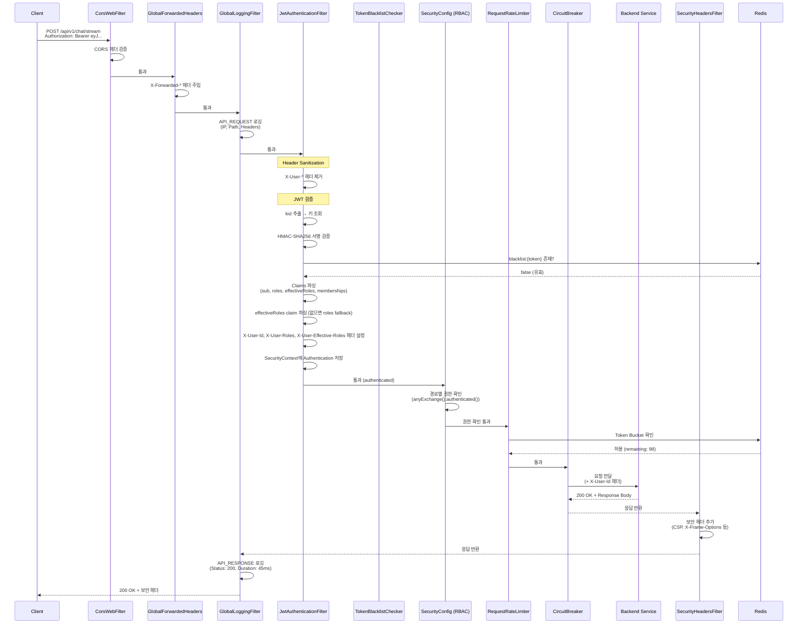
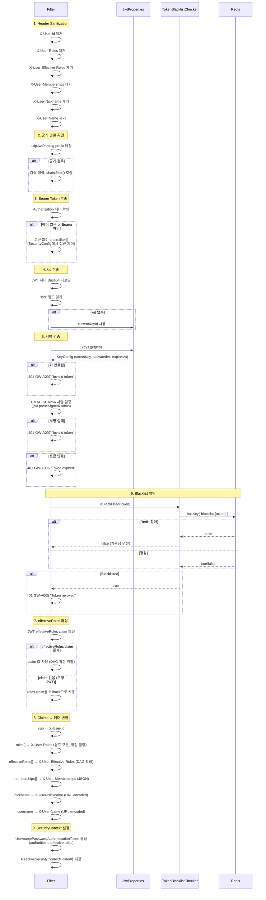
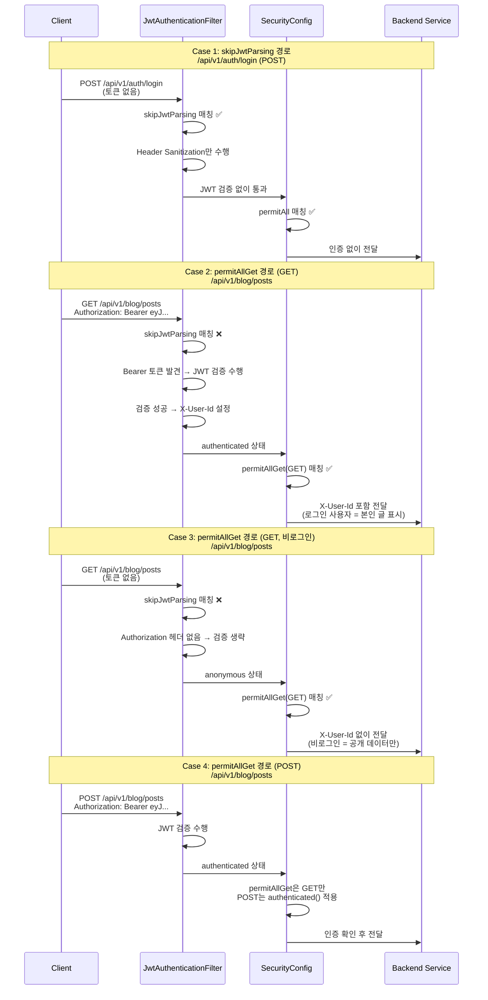
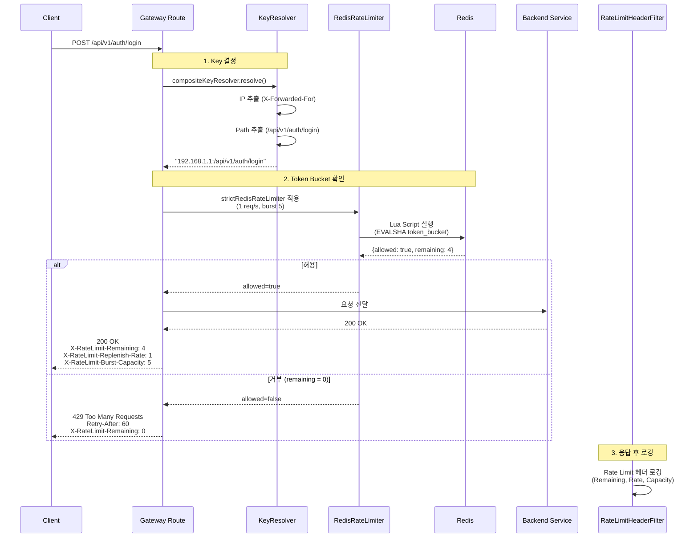
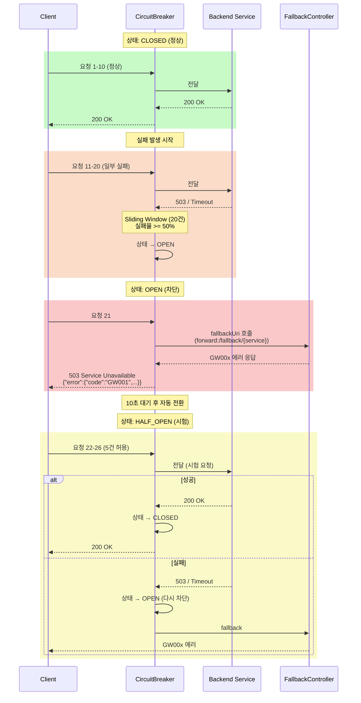
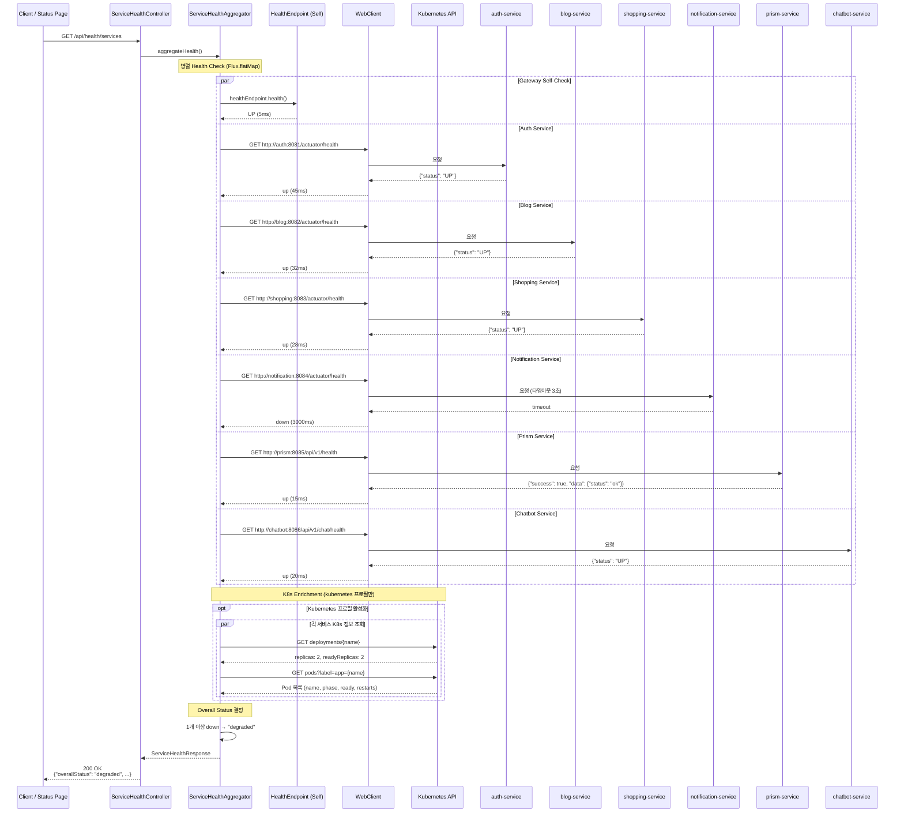

# API Gateway Data Flow

## 개요

API Gateway의 주요 데이터 흐름을 설명합니다. 모든 요청은 필터 체인을 거쳐 처리되며, JWT 검증, Rate Limiting, Circuit Breaker 등이 순서대로 적용됩니다.

### 핵심 컴포넌트

- **JwtAuthenticationFilter**: HMAC-SHA256 JWT 검증 + Header Sanitization
- **TokenBlacklistChecker**: Redis 기반 로그아웃 토큰 확인
- **RateLimiterConfig**: Redis Token Bucket Rate Limiting
- **SecurityConfig**: RBAC 기반 접근 제어
- **ServiceHealthAggregator**: 병렬 Health Check + K8s enrichment

---

## 1. 인증된 API 요청 흐름

인증이 필요한 API 요청(예: `POST /api/v1/chat/stream`)의 전체 필터 체인 통과 과정입니다.

---

## 2. JWT 토큰 검증 상세 흐름

`JwtAuthenticationFilter`의 내부 검증 로직입니다.

---

## 3. 공개 경로 요청 흐름

공개 경로의 3가지 카테고리별 동작 차이입니다.

---

## 4. Rate Limiting 흐름

Redis Token Bucket 알고리즘 기반의 속도 제한 처리 흐름입니다.

### Rate Limiter 적용 매핑

| 엔드포인트 | Rate Limiter | Key Resolver |
|-----------|-------------|-------------|
| `POST /api/v1/auth/login` | strict (1/s, burst 5) | composite (IP:path) |
| `POST /api/v1/users/signup` | signup (1/s, burst 3) | composite (IP:path) |
| `/auth-service/api/v1/auth/**` | unauthenticated (1/s, burst 30) | ip |
| `/api/v1/shopping/**` | unauthenticated (1/s, burst 30) | ip |
| `/api/v1/chat/**` (authenticated) | authenticated (2/s, burst 100) | user |
| `/api/v1/prism/**` (authenticated) | authenticated (2/s, burst 100) | user |

---

## 5. Circuit Breaker 상태 전이

Resilience4j Circuit Breaker의 상태 전이와 Fallback 처리 흐름입니다.

### 서비스별 타임아웃

```mermaid
gantt
    title Circuit Breaker Timeout 비교
    dateFormat X
    axisFormat %s초

    section 기본 (5s)
    auth-service     :0, 5
    blog-service     :0, 5
    shopping-service :0, 5

    section AI 서비스
    prism-service    :0, 60
    chatbot-service  :0, 120
```

---

## 6. Health Aggregation 흐름

`ServiceHealthAggregator`의 병렬 Health Check 및 Kubernetes enrichment 흐름입니다.

### Overall Status 결정 로직

| 조건 | Overall Status |
|------|---------------|
| 모든 서비스 UP | `up` |
| 모든 서비스 DOWN | `down` |
| 혼합 (일부 UP, 일부 DOWN) | `degraded` |
| 서비스 목록 비어있음 | `unknown` |

### Health 응답 형식 호환성

| 형식 | 예시 | 대상 서비스 |
|------|------|-----------|
| Spring Boot Actuator | `{"status": "UP"}` | auth, blog, shopping, notification |
| Custom (NestJS/Python) | `{"success": true, "data": {"status": "ok"}}` | prism, chatbot |

---

## 참고 자료

- [System Overview](./system-overview.md) - 컴포넌트 상세 설명
- [Routing Specification](../../api/api-gateway/routing-specification.md) - 라우팅 규칙 상세
- [Security & Authentication](../../api/api-gateway/security-authentication.md) - JWT 검증 상세
- [Rate Limiting](../../api/api-gateway/rate-limiting.md) - Rate Limiting 설정 상세
- [Resilience](../../api/api-gateway/resilience.md) - Circuit Breaker 설정 상세

---

## 변경 이력

| 날짜 | 작성자 | 변경 내용 |
|------|--------|-----------|
| 2026-02-06 | Laze | 코드베이스 기준 신규 작성 (24개 Java 파일, application.yml 검증) |
| 2026-02-18 | Laze | RoleHierarchyResolver 제거 → JWT effectiveRoles claim 직접 파싱 (ADR-044) |
