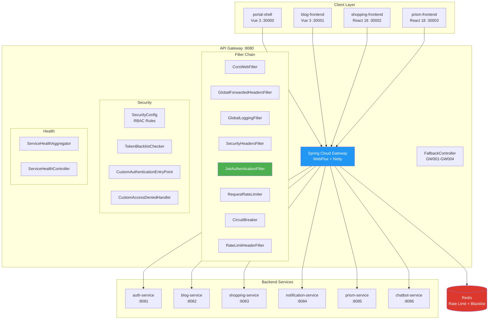
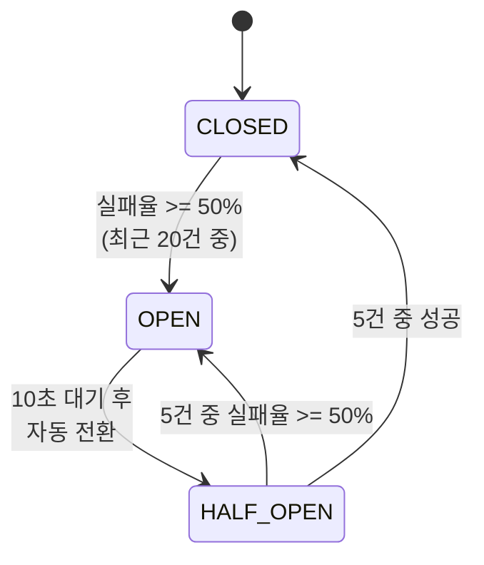

# API Gateway System Overview

## 1. 개요

API Gateway는 Portal Universe 플랫폼의 **단일 진입점(Single Entry Point)**으로, Spring Cloud Gateway WebFlux 기반의 비동기 논블로킹 게이트웨이입니다. 7개 백엔드 서비스로의 라우팅, 인증/인가, Rate Limiting, 장애 격리 등을 담당합니다.

### 핵심 역할

| # | 역할 | 설명 |
|---|------|------|
| 1 | **라우팅** | 27개 라우트를 통해 7개 백엔드 서비스로 요청 분배 |
| 2 | **JWT 인증** | HMAC-SHA256 서명 검증, 다중 키 로테이션 지원 |
| 3 | **RBAC 인가** | 역할 기반 접근 제어 (SUPER_ADMIN, SHOPPING_ADMIN, BLOG_ADMIN, SELLER) |
| 4 | **Rate Limiting** | Redis Token Bucket 기반 5단계 속도 제한 |
| 5 | **Circuit Breaker** | Resilience4j로 5개 서비스별 장애 격리 |
| 6 | **보안 헤더** | CSP, HSTS, X-Frame-Options 등 8종 보안 헤더 주입 |
| 7 | **Token Blacklist** | Redis 기반 로그아웃 토큰 무효화 |
| 8 | **Health Aggregation** | 7개 서비스 + Kubernetes 통합 상태 모니터링 |
| 9 | **요청/응답 로깅** | 구조화 로깅 (IP, 메서드, 경로, 응답시간) |

### 서비스 정보

- **Port**: 8080
- **Base Path**: `/api/v1/*` (서비스별 prefix)
- **Health Check**: `http://localhost:8080/actuator/health`
- **Health Dashboard**: `http://localhost:8080/api/health/services`

---

## 2. 핵심 특징

### 1. 비동기 논블로킹 아키텍처
Spring WebFlux + Netty 기반으로 높은 처리량을 달성합니다. 모든 필터와 서비스 호출이 Reactive 스트림으로 처리됩니다.

### 2. 커스텀 JWT 인증 (HMAC-SHA256)
OAuth2 Resource Server가 아닌 **직접 구현한 `JwtAuthenticationFilter`**로 JWT를 검증합니다. Auth Service와 동일한 HMAC secret key를 공유하며, `kid` 헤더를 통한 키 로테이션을 지원합니다.

### 3. 3단계 공개 경로 관리
`PublicPathProperties`를 통해 공개 경로를 3가지 레벨로 분류합니다:
- **permitAll**: 모든 HTTP 메서드에 인증 없이 접근 가능
- **permitAllGet**: GET만 인증 없이 접근 가능 (POST/PUT 등은 인증 필요)
- **skipJwtParsing**: JWT 파싱 자체를 건너뛰는 경로 (공개 경로여도 JWT가 있으면 파싱하여 사용자 정보 추출)

### 4. Header Sanitization
외부에서 주입된 `X-User-*` 헤더를 필터 진입 시 제거하여 **Header Injection 공격**을 방지합니다. JWT 검증 후 게이트웨이가 직접 `X-User-Id`, `X-User-Roles`, `X-User-Memberships`, `X-User-Nickname`, `X-User-Name` 헤더를 설정합니다.

### 5. Redis 기반 Rate Limiting
5종의 `RedisRateLimiter`와 3종의 `KeyResolver`를 조합하여 엔드포인트별 차별화된 속도 제한을 적용합니다. 개발 환경(local/docker)에서는 자동으로 완화된 제한을 적용합니다.

### 6. Kubernetes 네이티브 Health Aggregation
`ServiceHealthAggregator`가 7개 서비스의 상태를 WebClient로 병렬 조회하고, K8s 프로필에서는 Fabric8 클라이언트를 통해 Deployment/Pod 정보를 보강합니다.

---

## 3. High-Level Architecture



---

## 4. 핵심 컴포넌트

### 4.1 SecurityConfig
**패키지**: `config.SecurityConfig`

Spring Security WebFlux 보안 필터 체인을 구성합니다.

**주요 기능**:
- `PublicPathProperties` 기반 동적 경로 접근 제어
- RBAC 규칙 (역할별 경로 접근 제한)
- `JwtAuthenticationFilter`를 `AUTHENTICATION` 단계에 등록
- CorsWebFilter (HIGHEST_PRECEDENCE + 1)
- 기본 인증 비활성화 (httpBasic, formLogin, csrf 모두 disabled)
- 커스텀 에러 핸들러 등록 (401/403)

**RBAC 규칙**:

| 경로 패턴 | 필요 권한 |
|----------|----------|
| `/api/v1/admin/seller/**` | SHOPPING_ADMIN, SUPER_ADMIN |
| `/api/v1/admin/**` | SUPER_ADMIN |
| `/api/v1/shopping/admin/**` | SHOPPING_ADMIN, SUPER_ADMIN |
| `/api/v1/blog/admin/**` | BLOG_ADMIN, SUPER_ADMIN |
| `/api/v1/shopping/seller/**` | SELLER, SHOPPING_ADMIN, SUPER_ADMIN |
| 나머지 | authenticated (로그인 필요) |

### 4.2 JwtAuthenticationFilter
**패키지**: `filter.JwtAuthenticationFilter`

커스텀 JWT 검증 WebFilter입니다. Spring Security의 `AUTHENTICATION` 단계에서 실행됩니다.

**검증 흐름**:
1. 외부 주입된 `X-User-*` 헤더 제거 (Header Sanitization)
2. `skipJwtParsing` 공개 경로 확인 → 공개 경로면 검증 생략
3. `Authorization: Bearer` 헤더에서 토큰 추출
4. JWT 헤더의 `kid`(Key ID) 추출 → 해당 키로 HMAC-SHA256 서명 검증
5. Redis Token Blacklist 확인 (reactive)
6. Claims에서 `roles`, `memberships`, `nickname`, `username` 추출
7. `UsernamePasswordAuthenticationToken` 생성 (복수 Authority 지원)
8. 하위 서비스 전달 헤더 설정: `X-User-Id`, `X-User-Roles`, `X-User-Memberships`, `X-User-Nickname`, `X-User-Name`

**에러 응답**:

| 에러 코드 | 메시지 | 상황 |
|----------|--------|------|
| GW-A005 | Token revoked | Blacklist에 등록된 토큰 |
| GW-A006 | Token expired | 만료된 토큰 |
| GW-A007 | Invalid token | 서명 검증 실패 등 |

### 4.3 PublicPathProperties
**패키지**: `config.PublicPathProperties`

`gateway.public-paths` YAML 설정과 매핑되는 Properties 클래스입니다. YAML이 Single Source of Truth이며, Java 코드에 기본값이 없습니다.

**3가지 카테고리**:

| 카테고리 | 용도 | 예시 |
|---------|------|------|
| `permitAll` | 모든 메서드 인증 불필요 | `/api/v1/auth/**`, `/actuator/**` |
| `permitAllGet` | GET만 인증 불필요 | `/api/v1/blog/**` (조회는 공개, 작성은 인증 필요) |
| `skipJwtParsing` | JWT 파싱 자체 생략 | `/api/v1/auth/`, `/actuator/` |

> **permitAll과 skipJwtParsing의 차이**: `/api/v1/blog/**`은 `permitAllGet`이지만 `skipJwtParsing`에 없으므로, JWT가 있으면 파싱하여 사용자 정보(X-User-Id 등)를 추출합니다. 이를 통해 비로그인 사용자도 블로그를 읽되, 로그인 사용자는 본인 글 여부를 확인할 수 있습니다.

### 4.4 TokenBlacklistChecker
**패키지**: `service.TokenBlacklistChecker`

Redis에서 블랙리스트 토큰을 조회합니다. Auth Service의 `TokenBlacklistService`와 동일한 키 패턴(`blacklist:{accessToken}`)을 사용합니다.

- **Redis 장애 시**: 토큰을 허용 (가용성 우선 정책)
- **Reactive**: `ReactiveRedisTemplate` 사용

### 4.5 RateLimiterConfig
**패키지**: `config.RateLimiterConfig`

Redis Token Bucket 알고리즘 기반 Rate Limiting을 구성합니다.

**5종 Rate Limiter**:

| Bean 이름 | 용도 | Production | Dev(local/docker) |
|----------|------|-----------|-------------------|
| `defaultRedisRateLimiter` | 기본 | 10 req/s, burst 20 | 50 req/s, burst 200 |
| `strictRedisRateLimiter` | 로그인 (Brute Force 방어) | 1 req/s, burst 5 | 20 req/s, burst 50 |
| `signupRedisRateLimiter` | 회원가입 | 1 req/s, burst 3 | 20 req/s, burst 50 |
| `authenticatedRedisRateLimiter` | 인증된 사용자 | 2 req/s, burst 100 | 50 req/s, burst 500 |
| `unauthenticatedRedisRateLimiter` | 비인증 사용자 | 1 req/s, burst 30 | 50 req/s, burst 200 |

**3종 KeyResolver**:

| Bean 이름 | 키 형식 | 설명 |
|----------|--------|------|
| `ipKeyResolver` (Primary) | `{clientIP}` | X-Forwarded-For 우선, RemoteAddress fallback |
| `userKeyResolver` | `user:{userId}` | X-User-Id 헤더 기반, 비인증 시 IP fallback |
| `compositeKeyResolver` | `{clientIP}:{path}` | IP + 엔드포인트 조합 (로그인 등 특정 경로별 제한) |

### 4.6 SecurityHeadersFilter
**패키지**: `config.SecurityHeadersFilter`

모든 응답에 보안 헤더를 추가하는 GlobalFilter입니다.

**추가되는 헤더**:

| 헤더 | 값 | 설정 키 |
|------|---|---------|
| X-Content-Type-Options | `nosniff` | `security.headers.content-type-options` |
| X-Frame-Options | `DENY` | `security.headers.frame-options` |
| X-XSS-Protection | `1; mode=block` | `security.headers.xss-protection` |
| Referrer-Policy | `strict-origin-when-cross-origin` | `security.headers.referrer-policy` |
| Permissions-Policy | `geolocation=(), microphone=(), camera=()` | `security.headers.permissions-policy` |
| Content-Security-Policy | `default-src 'self'; ...` | `security.headers.csp.policy` |
| Strict-Transport-Security | `max-age=31536000; includeSubDomains` | `security.headers.hsts.*` (HTTPS만) |
| Cache-Control | `no-store, no-cache, must-revalidate` | 인증 관련 경로에만 적용 |

### 4.7 GlobalLoggingFilter
**패키지**: `config.GlobalLoggingFilter`

모든 요청/응답을 구조화된 형식으로 로깅합니다. `XForwardedRemoteAddressResolver`로 실제 클라이언트 IP를 추출하며, `authorization`, `cookie` 헤더는 마스킹합니다.

**로그 형식**:
```
API_REQUEST - Method: GET, Path: /api/v1/blog/posts, IP: 192.168.1.1, Headers: {...}
API_RESPONSE - Path: /api/v1/blog/posts, Status: 200, Duration: 45ms
```

### 4.8 GlobalForwardedHeadersFilter
**패키지**: `config.GlobalForwardedHeadersFilter`

`FrontendProperties` 기반으로 모든 요청에 `X-Forwarded-*` 헤더를 주입합니다.

**주입 헤더**:
- `X-Forwarded-Host`: FrontendProperties.host (예: `portal-universe:30000`)
- `X-Forwarded-Proto`: FrontendProperties.scheme (예: `https`)
- `X-Forwarded-Port`: FrontendProperties.port (예: `30000`)
- `X-Forwarded-For`: 클라이언트 IP (X-Forwarded-For → X-Real-IP → RemoteAddress 순)

### 4.9 ServiceHealthAggregator
**패키지**: `health.ServiceHealthAggregator`

7개 서비스의 Health Check를 **병렬**로 수행하고 결과를 집계합니다.

**기능**:
- WebClient로 각 서비스의 health endpoint 호출 (타임아웃 3초)
- Gateway 자체는 `HealthEndpoint`를 직접 호출 (self-call timeout 방지)
- Spring Boot Actuator 형식(`{"status": "UP"}`) 및 커스텀 형식(`{"success": true}`) 모두 지원
- Kubernetes 프로필에서 Fabric8 클라이언트로 Deployment replicas, Pod 상태 보강

**모니터링 대상**:

| 서비스 | Health Path | K8s Deployment |
|--------|-----------|----------------|
| api-gateway | /actuator/health | api-gateway |
| auth-service | /actuator/health | auth-service |
| blog-service | /actuator/health | blog-service |
| shopping-service | /actuator/health | shopping-service |
| notification-service | /actuator/health | notification-service |
| prism-service | /api/v1/health | prism-service |
| chatbot-service | /api/v1/chat/health | chatbot-service |

### 4.10 FallbackController
**패키지**: `controller.FallbackController`

Circuit Breaker가 OPEN 상태일 때 클라이언트에게 `ApiResponse` 형식의 Fallback 응답을 반환합니다.

| 경로 | 에러 코드 | 메시지 |
|------|----------|--------|
| `/fallback/auth` | GW001 | 인증 서비스를 일시적으로 사용할 수 없습니다 |
| `/fallback/blog` | GW002 | 블로그 서비스를 일시적으로 사용할 수 없습니다 |
| `/fallback/shopping` | GW003 | 쇼핑 서비스를 일시적으로 사용할 수 없습니다 |
| `/fallback/notification` | GW004 | 알림 서비스를 일시적으로 사용할 수 없습니다 |

### 4.11 Custom Error Handlers

**CustomAuthenticationEntryPoint** (`security.CustomAuthenticationEntryPoint`):
- 인증 실패 시 JSON 응답 반환 (`401 Unauthorized`)
- Spring Security 기본 `WWW-Authenticate` 헤더를 제거하여 브라우저 Basic Auth 팝업 방지
- 에러 코드: `A001`

**CustomAccessDeniedHandler** (`security.CustomAccessDeniedHandler`):
- 권한 부족 시 JSON 응답 반환 (`403 Forbidden`)
- 에러 코드: `A002`

### 4.12 RateLimitHeaderFilter
**패키지**: `filter.RateLimitHeaderFilter`

Rate Limiting 응답 헤더를 로깅하고, 429 응답 시 `Retry-After` 헤더와 ApiResponse 형식의 에러 응답을 제공합니다.

**응답 헤더** (RedisRateLimiter 기본 제공):
- `X-RateLimit-Remaining`: 남은 요청 횟수
- `X-RateLimit-Replenish-Rate`: 초당 토큰 충전 속도
- `X-RateLimit-Burst-Capacity`: 최대 버스트 용량

---

## 5. 필터 체인 실행 순서

### Request 필터 (요청 처리 순서)

| 순서 | 필터 | 타입 | Order | 설명 |
|------|------|------|-------|------|
| 1 | `requestPathLoggingFilter` | WebFilter | HIGHEST_PRECEDENCE | 요청 경로/메서드 디버그 로깅 |
| 2 | `CorsWebFilter` | WebFilter | HIGHEST_PRECEDENCE + 1 | CORS Preflight 처리 |
| 3 | `GlobalForwardedHeadersFilter` | GlobalFilter | HIGHEST_PRECEDENCE + 1 | X-Forwarded-* 헤더 주입 |
| 4 | `GlobalLoggingFilter` | GlobalFilter | HIGHEST_PRECEDENCE + 2 | 요청 로깅 (IP, Headers) |
| 5 | `SecurityHeadersFilter` | GlobalFilter | HIGHEST_PRECEDENCE | 보안 헤더 추가 (beforeCommit) |
| 6 | `JwtAuthenticationFilter` | WebFilter | AUTHENTICATION | JWT 검증 + X-User-* 헤더 설정 |
| 7 | SecurityConfig RBAC | - | - | 경로별 권한 확인 |
| 8 | `RequestRateLimiter` | Route Filter | - | Redis Rate Limiting |
| 9 | `CircuitBreaker` | Route Filter | - | 서비스 호출 + 장애 감지 |

### Response 필터 (응답 처리 순서)

| 순서 | 필터 | 설명 |
|------|------|------|
| 1 | Route Filters | 라우트별 응답 처리 |
| 2 | `SecurityHeadersFilter` | 보안 헤더 추가 (beforeCommit 콜백) |
| 3 | `RateLimitHeaderFilter` | Rate Limit 헤더 로깅 |
| 4 | `DedupeResponseHeader` | 중복 CORS 헤더 제거 |
| 5 | `GlobalLoggingFilter` | 응답 로깅 (Status, Duration) |

---

## 6. 보안 모델

### 6.1 JWT 인증

| 항목 | 값 |
|------|---|
| 알고리즘 | **HMAC-SHA256** (HS256) |
| 라이브러리 | jjwt v0.12.6 |
| 키 공유 | Auth Service와 동일한 secret key |
| 키 로테이션 | `jwt.keys` 맵으로 다중 키 지원, `kid` 헤더로 식별 |
| 키 만료 | `expiresAt` 설정 시 자동 거부 |

**JWT Claims → 헤더 매핑**:

| JWT Claim | 전달 헤더 | 비고 |
|----------|----------|------|
| `sub` | X-User-Id | UUID |
| `roles` | X-User-Roles | 쉼표 구분 (예: `ROLE_USER,ROLE_SELLER`) |
| `memberships` | X-User-Memberships | JSON 문자열 (예: `{"shopping":"PREMIUM"}`) |
| `nickname` | X-User-Nickname | URL 인코딩 |
| `username` | X-User-Name | URL 인코딩 |

### 6.2 Token Blacklist

- **저장소**: Redis
- **키 패턴**: `blacklist:{accessToken}`
- **동작**: Auth Service의 로그아웃 시 Redis에 토큰 저장 → Gateway에서 조회
- **장애 처리**: Redis 연결 실패 시 토큰 허용 (가용성 우선)

### 6.3 Header Sanitization

JwtAuthenticationFilter 진입 시 외부 주입된 헤더를 제거합니다:
- `X-User-Id`, `X-User-Roles`, `X-User-Memberships`, `X-User-Nickname`, `X-User-Name`

이를 통해 악의적인 클라이언트가 직접 X-User-Id 헤더를 설정하여 다른 사용자로 위장하는 것을 방지합니다.

### 6.4 CORS 정책

| 항목 | 값 |
|------|---|
| 허용 Origins | `http://localhost:30000`, `https://localhost:30000`, `http://localhost:8080`, `https://portal-universe:30000` |
| 허용 Methods | GET, POST, PUT, PATCH, DELETE, OPTIONS |
| 허용 Headers | Authorization, Content-Type, Accept, Origin, X-Requested-With, Cache-Control |
| Credentials | true |
| Preflight 캐시 | 3600초 (1시간) |

---

## 7. 라우팅 규칙

### 7.1 서비스별 라우트 요약

총 **27개 라우트**가 정의되어 있습니다. 서비스 URL은 환경별 프로필(`application-{local,docker,kubernetes}.yml`)에서 `services.*.url`로 정의됩니다.

#### Actuator Health Routes (외부 접근 허용 - health/info만)

| Route ID | Path | 대상 | 필터 |
|----------|------|------|------|
| auth-service-actuator-health | `/api/v1/auth/actuator/{health,info}` | auth-service | RewritePath |
| blog-service-actuator-health | `/api/v1/blog/actuator/{health,info}` | blog-service | RewritePath |
| shopping-service-actuator-health | `/api/v1/shopping/actuator/{health,info}` | shopping-service | RewritePath |

#### Auth Service (12 routes)

| Route ID | Path | Method | Rate Limiter | Key Resolver |
|----------|------|--------|-------------|-------------|
| auth-service-login | `/api/v1/auth/login` | POST | strict (1/s, burst 5) | composite |
| auth-service-signup | `/api/v1/users/signup` | POST | signup (1/s, burst 3) | composite |
| auth-service-oauth2-authorization | `/auth-service/oauth2/authorization/**` | ALL | - | - |
| auth-service-oauth2-callback | `/auth-service/login/oauth2/code/**` | ALL | - | - |
| auth-service-api-prefixed | `/auth-service/api/v1/auth/**` | ALL | unauthenticated | ip |
| auth-service-profile | `/auth-service/api/v1/profile/**` | ALL | authenticated | user |
| auth-service-users | `/api/v1/users/**` | ALL | unauthenticated | ip |
| auth-service-api | `/api/v1/auth/**` | ALL | unauthenticated | ip |
| auth-service-admin | `/api/v1/admin/{rbac,memberships,seller}/**` | ALL | authenticated | user |
| auth-service-memberships | `/api/v1/memberships/**` | ALL | authenticated | user |
| auth-service-seller | `/api/v1/seller/**` | ALL | authenticated | user |
| auth-service-permissions | `/api/v1/permissions/**` | ALL | authenticated | user |

#### Blog Service (2 routes)

| Route ID | Path | 필터 | 비고 |
|----------|------|------|------|
| blog-service-file-route | `/api/v1/blog/file/**` | StripPrefix=3, RequestSize=100MB | 파일 업로드 |
| blog-service-route | `/api/v1/blog/**` | StripPrefix=3 | 일반 API |

#### Shopping Service (1 route)

| Route ID | Path | 필터 |
|----------|------|------|
| shopping-service-route | `/api/v1/shopping/**` | StripPrefix=3, unauthenticated rate limiter |

#### Notification Service (2 routes)

| Route ID | Path | 비고 |
|----------|------|------|
| notification-service-websocket | `/notification/ws/**` | WebSocket, StripPrefix=1 |
| notification-service-route | `/notification/api/v1/notifications/**`, `/api/v1/notifications/**` | REST API |

#### Chatbot Service (4 routes)

| Route ID | Path | 비고 |
|----------|------|------|
| chatbot-service-health | `/api/v1/chat/health` | 공개, CB 없음 |
| chatbot-service-stream | `/api/v1/chat/stream` (POST) | SSE, authenticated |
| chatbot-service-documents | `/api/v1/chat/documents/**` | Admin 문서 관리 |
| chatbot-service-route | `/api/v1/chat/**` | 일반 채팅 API |

#### Prism Service (3 routes)

| Route ID | Path | 비고 |
|----------|------|------|
| prism-service-health | `/api/v1/prism/{health,ready}` | 공개, RewritePath |
| prism-service-sse | `/api/v1/prism/sse/**` | SSE, Rate Limit 없음 |
| prism-service-route | `/api/v1/prism/**` | 일반 API, RewritePath |

### 7.2 경로 변환 규칙

| 패턴 | 변환 | 대상 서비스 |
|------|------|-----------|
| `/api/v1/blog/**` | StripPrefix=3 → `/**` | blog-service |
| `/api/v1/shopping/**` | StripPrefix=3 → `/**` | shopping-service |
| `/auth-service/**` | StripPrefix=1 → `/**` | auth-service |
| `/api/v1/prism/**` | RewritePath → `/api/v1/**` | prism-service |
| `/api/v1/*/actuator/**` | RewritePath → `/actuator/**` | 각 서비스 |

### 7.3 서비스 URL (환경별)

| 서비스 | Local | Docker | Kubernetes |
|--------|-------|--------|------------|
| auth | localhost:8081 | auth-service:8081 | auth-service:8081 |
| blog | localhost:8082 | blog-service:8082 | blog-service:8082 |
| shopping | localhost:8083 | shopping-service:8083 | shopping-service:8083 |
| notification | localhost:8084 | notification-service:8084 | notification-service:8084 |
| prism | localhost:8085 | prism-service:8085 | prism-service:8085 |
| chatbot | localhost:8086 | chatbot-service:8086 | chatbot-service:8086 |

---

## 8. 기술 스택

### 핵심 의존성 (build.gradle)

| 카테고리 | 의존성 | 버전 | 용도 |
|---------|--------|-----|------|
| **Gateway** | spring-cloud-starter-gateway-server-webflux | Spring Cloud 2025.0.0 | 비동기 API Gateway |
| **Circuit Breaker** | spring-cloud-starter-circuitbreaker-reactor-resilience4j | Spring Cloud 2025.0.0 | 장애 격리 |
| **Security** | spring-boot-starter-security | Spring Boot 3.5.5 | WebFlux Security |
| **JWT** | jjwt-api / jjwt-impl / jjwt-jackson | 0.12.6 | HMAC JWT 검증 |
| **Redis** | spring-boot-starter-data-redis-reactive | Spring Boot 3.5.5 | Rate Limiting + Blacklist |
| **Actuator** | spring-boot-starter-actuator | Spring Boot 3.5.5 | Health Check, Metrics |
| **Prometheus** | micrometer-registry-prometheus | - | Prometheus 메트릭 노출 |
| **Tracing** | micrometer-tracing-bridge-brave | - | 분산 추적 |
| **Zipkin** | zipkin-reporter-brave | - | Trace 리포팅 |
| **Kubernetes** | kubernetes-client (Fabric8) | 6.13.4 | K8s API 연동 |
| **Logging** | logstash-logback-encoder | 8.0 | 구조화 JSON 로깅 |

### 미사용 (문서 정정)

다음은 이전 문서에 기재되어 있었으나 **실제 코드에 없는** 의존성입니다:
- ~~Eureka Client~~ → 서비스 디스커버리 미사용, 직접 URL 라우팅
- ~~Spring Cloud Config Client~~ → 로컬 YAML 설정 사용
- ~~OAuth2 Resource Server~~ → 커스텀 JwtAuthenticationFilter 사용
- ~~`lb://` URI~~ → 직접 서비스 URL 사용

---

## 9. Circuit Breaker (Resilience4j)

### 기본 설정

| 설정 | 값 |
|------|---|
| Sliding Window Type | COUNT_BASED |
| Sliding Window Size | 20 |
| Failure Rate Threshold | 50% |
| Wait Duration (Open → Half-Open) | 10초 |
| Permitted Calls (Half-Open) | 5 |
| Auto Transition | Open → Half-Open 자동 전환 |

### 서비스별 인스턴스

| 인스턴스 | Timeout | Fallback |
|---------|---------|----------|
| authCircuitBreaker | 5s (default) | `/fallback/auth` (GW001) |
| blogCircuitBreaker | 5s (default) | `/fallback/blog` (GW002) |
| shoppingCircuitBreaker | 5s (default) | `/fallback/shopping` (GW003) |
| prismCircuitBreaker | **60s** | `/fallback/prism` |
| chatbotCircuitBreaker | **120s** | `/fallback/chatbot` |

> Prism(AI 오케스트레이션)과 Chatbot(RAG + AI) 서비스는 AI 응답 대기를 위해 타임아웃이 확장되어 있습니다.

### 상태 전이



---

## 10. 배포 및 운영

### 10.1 프로필별 설정

| 프로필 | 서비스 URL | Redis | Frontend | 비고 |
|--------|----------|-------|----------|------|
| `local` | localhost:{port} | localhost:6379 | http://localhost:30000 | HSTS 비활성화 |
| `docker` | {service-name}:{port} | redis:6379 | https://portal-universe:30000 | Zipkin 연동 |
| `kubernetes` | {service-name}:{port} | redis:6379 | - | Liveness/Readiness Probe |

### 10.2 Actuator 엔드포인트

| 엔드포인트 | 용도 | 외부 접근 |
|-----------|------|----------|
| `/actuator/health` | 서비스 상태 | O |
| `/actuator/info` | 서비스 정보 | O |
| `/actuator/prometheus` | Prometheus 메트릭 | 내부망 전용 |
| `/actuator/metrics` | Micrometer 메트릭 | 내부망 전용 |

> `/swagger-ui`, `/api-docs`는 Gateway를 통한 접근이 차단되며, 각 서비스 포트로 직접 접근해야 합니다.

### 10.3 Health Dashboard

`GET /api/health/services` 엔드포인트로 모든 서비스의 통합 상태를 조회합니다.

**응답 예시**:
```json
{
  "overallStatus": "degraded",
  "timestamp": "2026-02-06T12:00:00Z",
  "services": [
    {
      "name": "api-gateway",
      "displayName": "API Gateway",
      "status": "up",
      "responseTime": 5
    },
    {
      "name": "auth-service",
      "displayName": "Auth Service",
      "status": "up",
      "responseTime": 45,
      "replicas": 2,
      "readyReplicas": 2,
      "pods": [
        {"name": "auth-service-abc123", "phase": "Running", "ready": true, "restarts": 0}
      ]
    }
  ]
}
```

---

## 11. 트러블슈팅

### CORS 문제
- **증상**: Preflight 요청 실패, `Access-Control-Allow-Origin` 헤더 누락
- **확인**: `CorsWebFilter`의 allowedOrigins에 프론트엔드 URL이 포함되어 있는지 확인
- **주의**: `DedupeResponseHeader` 필터가 중복 CORS 헤더를 제거하므로, 백엔드 서비스에서 별도 CORS 설정 시 충돌 가능

### JWT 검증 실패
- **GW-A006 (Token expired)**: Access Token 만료. 프론트엔드에서 Refresh Token으로 갱신 필요
- **GW-A007 (Invalid token)**: `kid`에 해당하는 키가 없거나 만료됨. `jwt.keys` 설정 확인
- **GW-A005 (Token revoked)**: 로그아웃된 토큰. Redis blacklist 확인

### Rate Limiting
- **429 Too Many Requests**: `X-RateLimit-Remaining` 헤더로 남은 횟수 확인
- **개발 환경에서 429 발생**: `local`/`docker` 프로필이 활성화되어 있는지 확인 (완화된 제한 적용)
- **Redis 연결 실패**: Rate Limiting이 무시되어 모든 요청 허용. Redis 상태 확인 필요

### Circuit Breaker
- **GW001-GW004 Fallback 응답**: 해당 서비스가 다운되었거나 타임아웃 초과
- **Prism/Chatbot 타임아웃**: AI 응답 지연 시 60초/120초까지 대기 후 OPEN 상태 전환

---

## 12. 관련 문서

### Architecture
- [Data Flow](./data-flow.md) - 요청 처리 흐름 상세

### API 문서
- [Routing Specification](../../api/api-gateway/routing-specification.md)
- [Security & Authentication](../../api/api-gateway/security-authentication.md)
- [Rate Limiting](../../api/api-gateway/rate-limiting.md)
- [Resilience](../../api/api-gateway/resilience.md)
- [Error Reference](../../api/api-gateway/error-reference.md)
- [Health Monitoring](../../api/api-gateway/health-monitoring.md)

---

## 13. 변경 이력

| 날짜 | 버전 | 변경 내용 | 작성자  |
|------|------|----------|------|
| 2026-01-18 | 1.0 | 초기 문서 작성 | Laze |
| 2026-02-06 | 2.0 | 코드베이스 기준 전면 재작성 (24개 Java 파일, application.yml 검증) | Laze |
