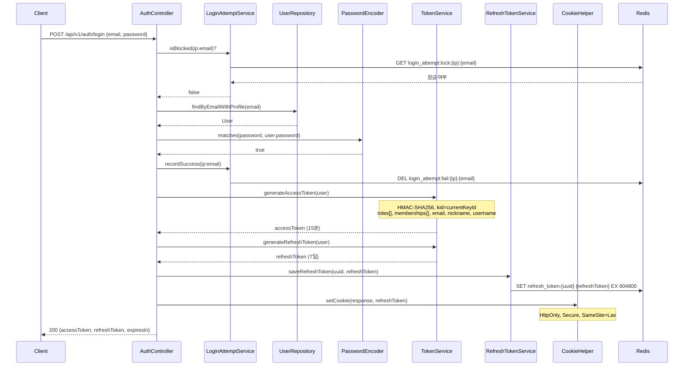
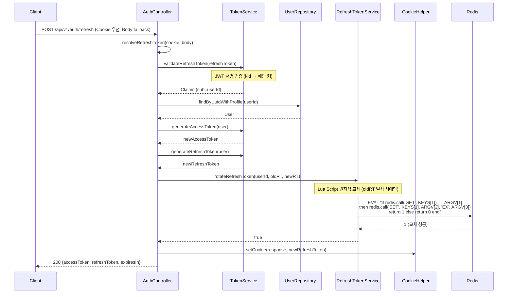
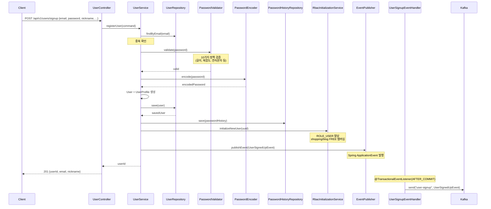
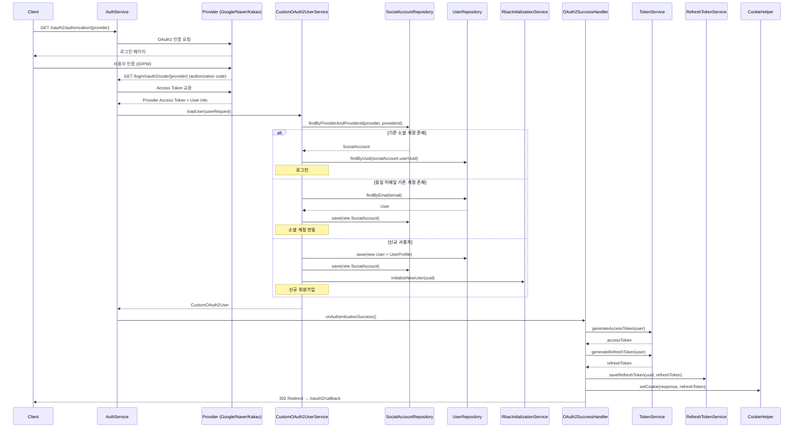
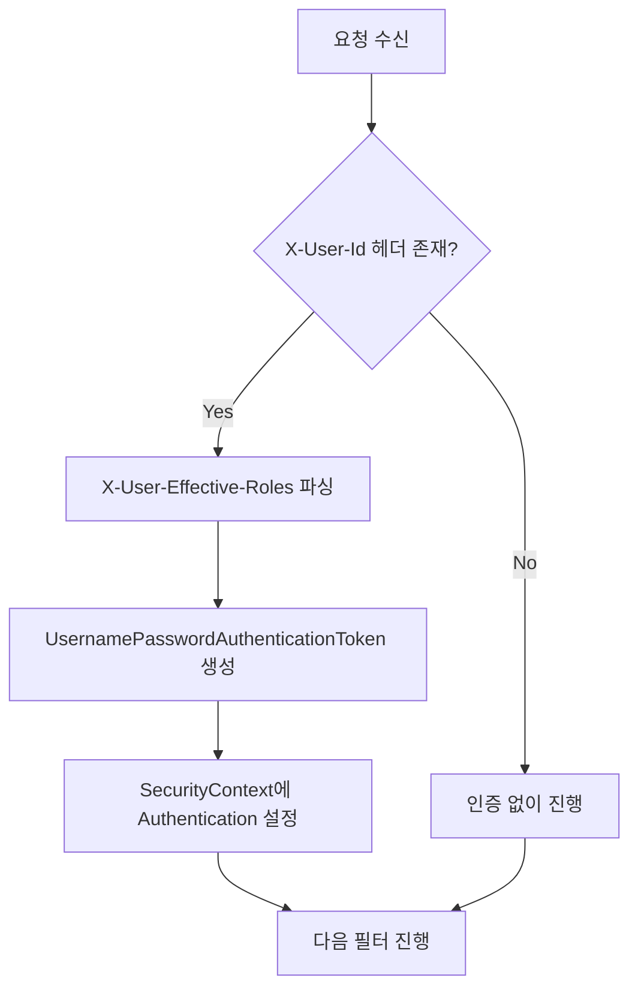
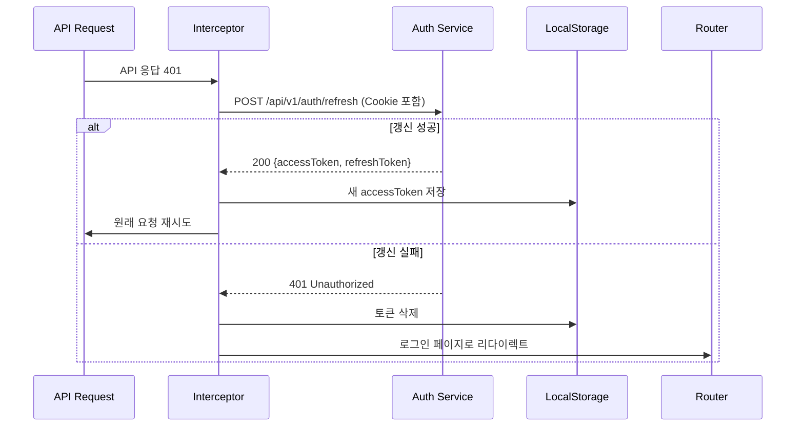

# Auth Service Data Flow

## 1. 개요

Auth Service의 JWT 기반 인증 플로우를 설명합니다. 모든 인증은 Stateless JWT + Redis 조합으로 동작하며, Access Token은 stateless하게 검증되고, Refresh Token과 블랙리스트는 Redis에서 관리됩니다.

### 핵심 컴포넌트

| 컴포넌트 | 역할 | 저장소 |
|----------|------|--------|
| `TokenService` | AT/RT 생성/검증 | - |
| `RefreshTokenService` | RT Redis 관리, Rotation | Redis |
| `TokenBlacklistService` | AT 블랙리스트 | Redis |
| `LoginAttemptServiceImpl` | 로그인 시도 추적/잠금 | Redis |
| `GatewayAuthenticationFilter` (common-library) | Gateway 헤더 기반 인증 | - |

### 주요 특징

- **Stateless JWT**: Access Token은 서명 검증만으로 인증 가능
- **Redis 기반 관리**: Refresh Token 저장, 블랙리스트, 로그인 시도 추적
- **Token Rotation**: 매 갱신 시 새로운 Refresh Token 발급
- **이벤트 기반 통신**: Kafka를 통한 비동기 이벤트 발행

## 2. 로그인 (POST /api/v1/auth/login)

사용자가 이메일과 비밀번호로 로그인하는 플로우입니다.



### 로그인 실패 처리

로그인 실패 시 `LoginAttemptService.recordFailure(ip:email)`가 호출됩니다:

1. Redis에 `login_attempt:fail:{ip}:{email}` 키로 실패 횟수 증가 (INCR)
2. 3회 실패: 5분 잠금
3. 5회 실패: 15분 잠금
4. 10회 이상 실패: 계정 잠금 (User.status = LOCKED)

잠금 상태에서는 `AuthErrorCode.ACCOUNT_LOCKED` 예외가 발생합니다.

## 3. 토큰 갱신 (POST /api/v1/auth/refresh)

Access Token이 만료되었을 때 Refresh Token으로 새로운 토큰 쌍을 발급받는 플로우입니다.



### Refresh Token Rotation

매 갱신 시 새로운 Refresh Token을 발급하고 이전 Refresh Token을 무효화합니다. 이는 토큰 탈취 시 피해를 최소화하기 위한 보안 메커니즘입니다.

**Lua Script를 사용하는 이유**:
- Redis 단일 명령으로 원자성 보장
- 동시에 여러 갱신 요청이 들어와도 하나만 성공
- Race condition 방지

### Refresh Token 검증 실패

다음 경우 `AuthErrorCode.INVALID_REFRESH_TOKEN` 예외가 발생합니다:
- 서명이 유효하지 않음
- 만료됨
- Redis에 저장된 값과 불일치 (이미 교체됨)

## 4. 로그아웃 (POST /api/v1/auth/logout)

사용자가 명시적으로 로그아웃하는 플로우입니다.

```mermaid
sequenceDiagram
    participant C as Client
    participant AC as AuthController
    participant TU as TokenUtils
    participant TS as TokenService
    participant TBS as TokenBlacklistService
    participant RTS as RefreshTokenService
    participant CH as CookieHelper
    participant R as Redis

    C->>AC: POST /api/v1/auth/logout (Authorization: Bearer {AT})
    AC->>TU: extractBearerToken(authorization)
    TU-->>AC: accessToken
    AC->>TS: parseClaimsAllowExpired(accessToken)
    Note over TS: 만료된 토큰도 서명 검증 후 Claims 반환
    TS-->>AC: Claims (sub=userId)
    AC->>TS: getRemainingExpiration(accessToken)
    TS-->>AC: remainingMs
    AC->>TBS: addToBlacklist(AT, remainingMs)
    Note over TBS: Redis SET blacklist:{SHA256(AT)} "1" PX {remainingMs}
    TBS->>R: SET blacklist:{SHA256(AT)} "1" PX {remainingMs}
    AC->>RTS: deleteRefreshToken(userId)
    RTS->>R: DEL refresh_token:{userId}
    AC->>CH: clearCookie(response)
    Note over CH: Set-Cookie: refreshToken=; Max-Age=0
    AC-->>C: 200 {message: "로그아웃 성공"}
```

### Access Token 블랙리스트

로그아웃 시 Access Token을 블랙리스트에 추가하여 해당 토큰으로는 더 이상 API 호출을 할 수 없도록 합니다.

- Redis 키: `blacklist:{SHA256(accessToken)}`
- TTL: Access Token의 남은 유효 시간 (만료되면 자동 삭제)
- 값: "1" (존재 여부만 확인하므로 간단한 값 사용)

### 만료된 토큰 처리

`parseClaimsAllowExpired()`는 만료된 토큰도 서명이 유효하면 Claims를 반환합니다. 이를 통해 로그아웃 시 만료된 토큰도 블랙리스트에 추가할 수 있습니다.

## 5. 회원가입 (POST /api/v1/users/signup)

새로운 사용자가 회원가입하는 플로우입니다.



### 비밀번호 정책 검증

`PasswordValidator`는 다음 10가지 정책을 검증합니다:

1. 최소 길이 (8자)
2. 최대 길이 (100자)
3. 영문 대문자 포함
4. 영문 소문자 포함
5. 숫자 포함
6. 특수문자 포함
7. 공백 미포함
8. 연속된 문자 3개 이상 금지 (예: aaa, 111)
9. 연속된 숫자 3개 이상 금지 (예: 123, 321)
10. 이메일/닉네임과 유사도 체크

### RBAC 초기화

`RbacInitializationService.initializeNewUser()`는 다음 작업을 수행합니다:

1. `ROLE_USER` 역할 할당
2. Shopping Service FREE 멤버십 할당
3. Blog Service FREE 멤버십 할당

멤버십 정보는 UserMembership 엔티티로 저장되며, 이후 JWT Access Token의 `memberships` 클레임에 포함됩니다.

### 이벤트 발행 시점

`UserSignupEventHandler`는 `@TransactionalEventListener(phase = AFTER_COMMIT)`로 트랜잭션 커밋 후에만 Kafka 이벤트를 발행합니다. 이를 통해:

- DB 저장이 실패하면 이벤트가 발행되지 않음
- 이벤트 발행 실패가 회원가입 트랜잭션에 영향을 주지 않음
- At-Least-Once 방식으로 이벤트 전달 보장

## 6. 소셜 로그인 (OAuth2)

Google, Naver, Kakao 등 외부 인증 제공자를 통한 로그인 플로우입니다.



### OAuth2 제공자별 사용자 정보 추출

`CustomOAuth2UserService`는 제공자별 UserInfo 객체를 생성합니다:

- **Google**: `GoogleOAuth2UserInfo` (email, name, picture)
- **Naver**: `NaverOAuth2UserInfo` (email, name, profile_image)
- **Kakao**: `KakaoOAuth2UserInfo` (email, nickname, profile_image)

### 소셜 계정 연동

동일한 이메일로 일반 회원가입과 소셜 로그인을 모두 사용할 수 있습니다. 이 경우 User 엔티티는 하나이며, 여러 SocialAccount 레코드가 연결됩니다.

### OAuth2 조건부 활성화

OAuth2는 `ClientRegistrationRepository` 빈이 존재할 때만 활성화됩니다. 이는 다음 설정으로 제어됩니다:

```yaml
spring.security.oauth2.client.registration:
  google:
    client-id: ${GOOGLE_CLIENT_ID}
    client-secret: ${GOOGLE_CLIENT_SECRET}
  naver:
    client-id: ${NAVER_CLIENT_ID}
    client-secret: ${NAVER_CLIENT_SECRET}
  kakao:
    client-id: ${KAKAO_CLIENT_ID}
    client-secret: ${KAKAO_CLIENT_SECRET}
```

환경 변수가 설정되지 않으면 OAuth2 기능이 비활성화됩니다.

## 7. Gateway 인증 필터 (GatewayAuthenticationFilter)

API Gateway가 JWT를 검증하고 설정한 `X-User-*` 헤더를 읽어 SecurityContext를 설정하는 필터입니다. `common-library`에서 제공하며, blog-service, shopping-service, drive-service와 동일한 공통 필터입니다.



### 처리하는 헤더

| 헤더 | 용도 |
|------|------|
| `X-User-Id` | 사용자 UUID → principal |
| `X-User-Effective-Roles` | Role Hierarchy 포함 유효 역할 → authorities |
| `X-User-Roles` | 원본 역할 (effective 없을 때 fallback) |
| `X-User-Nickname` | URL 인코딩된 닉네임 |
| `X-User-Memberships` | 멤버십 JSON |

### SecurityContext 설정

유효한 `X-User-Id`가 있으면 `UsernamePasswordAuthenticationToken`을 생성하여 `SecurityContextHolder`에 설정합니다:

```java
List<SimpleGrantedAuthority> authorities = parseAuthorities(effectiveRoles);
Authentication authentication = new UsernamePasswordAuthenticationToken(
    userId, null, authorities
);
SecurityContextHolder.getContext().setAuthentication(authentication);
```

이후 컨트롤러에서 `@AuthenticationPrincipal String userUuid`나 `@PreAuthorize("hasRole('ROLE_USER')")` 등의 권한 검증이 가능합니다.

> **참고**: JWT 검증과 블랙리스트 조회는 API Gateway에서 수행됩니다. auth-service는 Gateway가 설정한 헤더를 신뢰합니다 (ADR-039).

## 8. JWT 토큰 구조

### Access Token (15분)

```json
{
  "header": {
    "alg": "HS256",
    "kid": "key-2026-01"
  },
  "payload": {
    "sub": "user-uuid-1234",
    "roles": ["ROLE_USER", "ROLE_SELLER"],
    "memberships": {
      "shopping": "PREMIUM",
      "blog": "FREE"
    },
    "email": "user@example.com",
    "nickname": "닉네임",
    "username": "myusername",
    "iat": 1706000000,
    "exp": 1706000900
  }
}
```

**주요 클레임**:
- `sub`: User UUID (Primary Key)
- `roles`: 사용자 역할 배열
- `memberships`: 서비스별 멤버십 레벨 (Map)
- `email`, `nickname`, `username`: 사용자 기본 정보
- `iat`: 발급 시간 (Issued At)
- `exp`: 만료 시간 (Expiration Time, iat + 15분)

### Refresh Token (7일)

```json
{
  "header": {
    "alg": "HS256",
    "kid": "key-2026-01"
  },
  "payload": {
    "sub": "user-uuid-1234",
    "iat": 1706000000,
    "exp": 1706604800
  }
}
```

**주요 클레임**:
- `sub`: User UUID
- `iat`: 발급 시간
- `exp`: 만료 시간 (iat + 7일)

Refresh Token은 최소한의 정보만 포함하여 크기를 줄입니다. 역할이나 멤버십 정보는 갱신 시점에 DB에서 다시 조회하여 새로운 Access Token에 반영합니다.

### Key ID (kid)

JWT 헤더의 `kid` 필드는 어떤 서명 키를 사용했는지 나타냅니다. 이를 통해 Key Rotation을 지원합니다.

**Key Rotation 절차**:
1. 새 키 생성 (예: `key-2026-02`)
2. `JwtKeyEntity` 테이블에 새 키 추가
3. `currentKeyId` 변경
4. 이전 키의 `expiresAt` 설정 (새 키 발급 시작 시점 + 최대 토큰 수명)
5. 모든 이전 토큰이 만료되면 이전 키 제거

현재 시점에서 유효한 모든 키를 검증에 사용하므로, 키 교체 중에도 기존 토큰이 정상 작동합니다.

## 9. Kafka 이벤트

Auth Service에서 발행하는 Kafka 이벤트 목록입니다.

| 토픽 | 이벤트 | 발행 시점 | 소비자 |
|------|--------|----------|--------|
| `auth.user.signed-up` | `UserSignedUpEvent` | 회원가입 트랜잭션 커밋 후 | notification-service |

### UserSignedUpEvent

```json
{
  "userId": "user-uuid-1234",
  "email": "user@example.com",
  "name": "실명"
}
```

### 이벤트 발행 보장

`UserSignupEventHandler`는 `@TransactionalEventListener(phase = TransactionPhase.AFTER_COMMIT)`로 트랜잭션 커밋 후에만 이벤트를 발행합니다.

**장점**:
- DB 저장 실패 시 이벤트가 발행되지 않음 (일관성 보장)
- 이벤트 발행 실패가 회원가입 트랜잭션에 영향을 주지 않음 (격리)

**트레이드오프**:
- 이벤트 발행 실패 시 재시도 메커니즘이 필요
- 현재는 로그만 기록하며, 향후 Outbox Pattern 도입 검토

### 이벤트 소비자

**notification-service**:
- 환영 이메일 발송
- 환영 푸시 알림 발송

## 10. 프론트엔드 연동

### apiClient 인터셉터 (portal-shell)

`apiClient`는 모든 API 요청에 대해 다음 작업을 수행합니다:

**요청 인터셉터**:
```javascript
// 모든 요청에 Authorization 헤더 추가
config.headers.Authorization = `Bearer ${accessToken}`;
```

**응답 인터셉터**:
```javascript
// 401 응답 시 자동 토큰 갱신
if (error.response.status === 401) {
  const newAccessToken = await refreshAccessToken();
  // 원래 요청 재시도
  originalRequest.headers.Authorization = `Bearer ${newAccessToken}`;
  return axios(originalRequest);
}
```

### refreshAccessToken() 플로우



### HttpOnly Cookie

Refresh Token은 HttpOnly Cookie로 저장되어 JavaScript에서 접근할 수 없습니다.

**설정**:
- `HttpOnly`: true (XSS 방지)
- `Secure`: true (HTTPS only, local 개발 환경에서는 false)
- `SameSite`: Lax (OAuth2 redirect 지원)
- `Path`: /api/v1/auth
- `Max-Age`: 604800 (7일)

**장점**:
- XSS 공격으로 토큰을 탈취할 수 없음
- 브라우저가 자동으로 쿠키를 전송 (프론트엔드 코드 불필요)

**트레이드오프**:
- CSRF 공격에 취약할 수 있으나, SameSite=Lax로 일부 방어
- 쿠키를 사용할 수 없는 환경 (모바일 앱)에서는 Body 방식 사용

### 토큰 저장

- **Access Token**: LocalStorage (또는 Memory)
- **Refresh Token**: HttpOnly Cookie

LocalStorage는 XSS에 취약하지만, Access Token의 짧은 수명(15분)으로 위험을 완화합니다. 더 높은 보안이 필요한 경우 Memory 저장을 고려할 수 있습니다.

## 11. 관련 문서

- [System Overview](./system-overview.md) - Auth Service 전체 아키텍처
- [Security Mechanisms](./security-mechanisms.md) - 보안 메커니즘 상세
- [Auth API](../../api/auth-service/auth-api.md) - REST API 명세
- [ADR-008: JWT Stateless + Redis](../../adr/ADR-008-jwt-stateless-redis.md) - 아키텍처 결정 배경

## 변경 이력

| 날짜 | 변경 내용 | 작성자 |
|------|----------|--------|
| 2026-01-18 | 최초 작성 | Laze |
| 2026-02-06 | 데이터 플로우 상세화 | Laze |
| 2026-02-12 | ADR-039 구현: JwtAuthenticationFilter → GatewayAuthenticationFilter 전환 | Laze |
