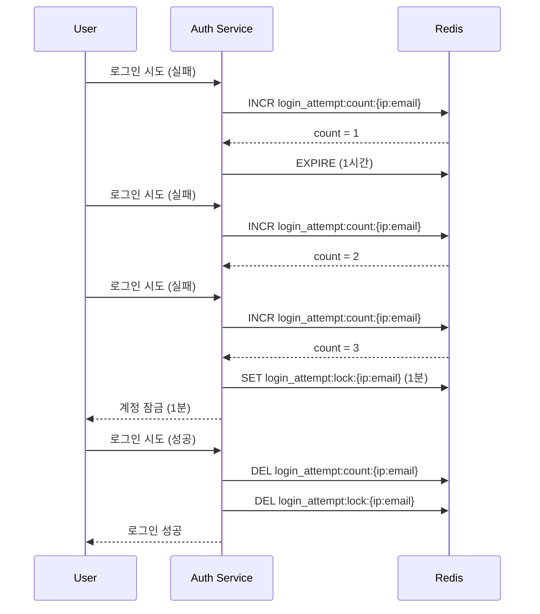
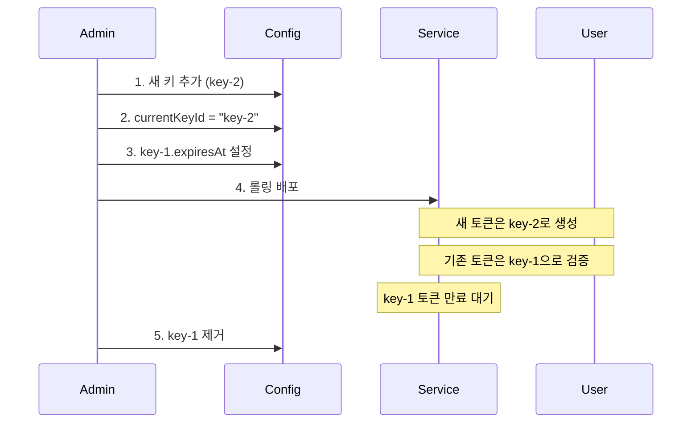
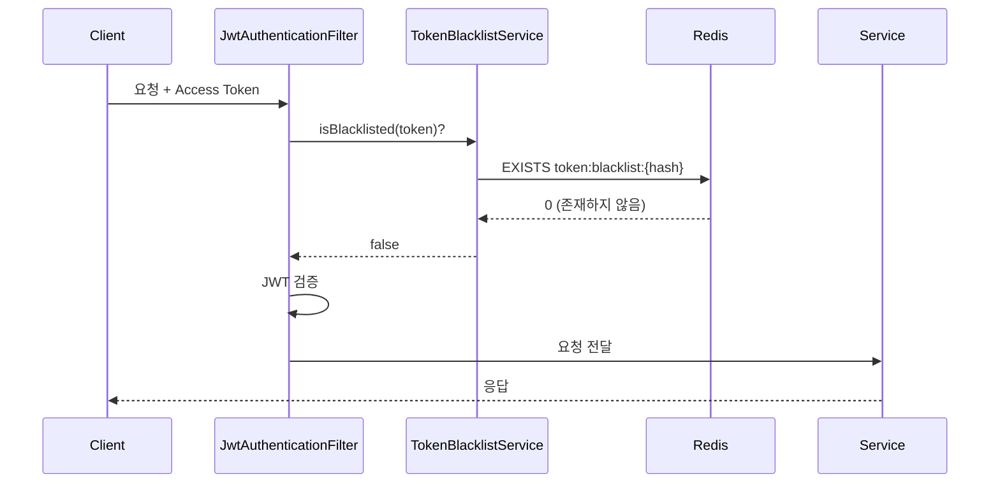
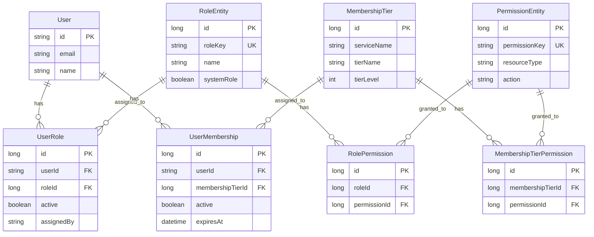
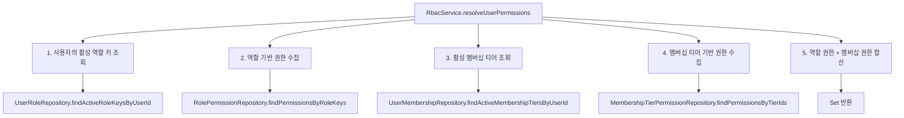
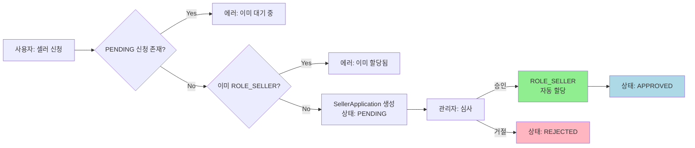
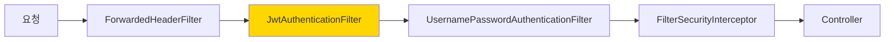
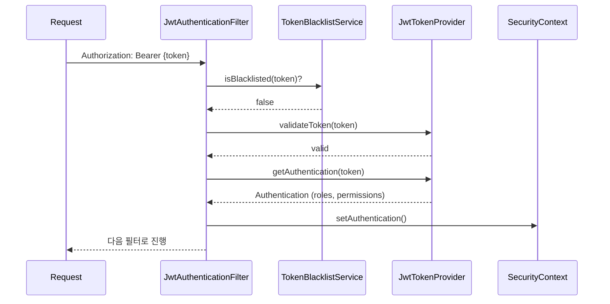

# Auth Service Security Mechanisms

## 1. 개요

Auth Service의 보안 메커니즘을 상세히 설명합니다. 이 문서는 계정 잠금, 비밀번호 정책, 토큰 보안, RBAC (Role-Based Access Control), 셀러 승인 워크플로우, 감사 로그, Spring Security 설정 등 인증/인가 서비스의 핵심 보안 기능을 다룹니다.

## 2. 계정 잠금

### 2.1 개요

로그인 실패 시 계정을 일시적으로 잠금 처리하여 무차별 대입 공격(Brute Force Attack)을 방지합니다.

### 2.2 구현: LoginAttemptServiceImpl

Redis 기반으로 IP 주소와 이메일의 복합 키를 사용하여 로그인 시도를 추적합니다. 이를 통해 특정 IP에서의 특정 계정에 대한 공격을 탐지할 수 있습니다.

### 2.3 Redis 키 구조

| 키 | 값 | TTL | 용도 |
|----|-----|-----|------|
| `login_attempt:count:{ip:email}` | Integer (실패 횟수) | 1시간 | 실패 카운트 |
| `login_attempt:lock:{ip:email}` | Unix Timestamp (ms) | 잠금 시간 | 잠금 상태 |

### 2.4 잠금 정책

| 실패 횟수 | 잠금 시간 |
|-----------|----------|
| 3회 | 1분 |
| 5회 | 5분 |
| 10회 | 30분 |

### 2.5 Lua Script를 통한 원자적 연산

실패 횟수 증가(INCR)와 첫 실패 시 만료 시간 설정(EXPIRE)을 원자적으로 실행합니다:

```lua
local count = redis.call('INCR', KEYS[1])
if count == 1 then
  redis.call('EXPIRE', KEYS[1], ARGV[1])
end
return count
```

이를 통해 동시성 문제 없이 실패 횟수를 정확하게 추적할 수 있습니다.

### 2.6 잠금 해제

로그인 성공 시 실패 카운트와 잠금 키가 모두 삭제되어 즉시 정상 상태로 복원됩니다.



## 3. 비밀번호 정책

### 3.1 개요

강력한 비밀번호 정책을 통해 계정 보안을 강화합니다.

### 3.2 구현: PasswordValidatorImpl + PasswordPolicyProperties

`PasswordValidatorImpl`은 `PasswordPolicyProperties`에서 로드한 설정을 기반으로 비밀번호를 검증합니다. 모든 정책은 `application.yml`에서 설정 가능합니다.

### 3.3 비밀번호 정책 목록

| # | 정책 | 기본값 | 설정 키 |
|---|------|--------|---------|
| 1 | 최소 길이 | 8자 | `security.password.min-length` |
| 2 | 최대 길이 | 128자 | `security.password.max-length` |
| 3 | 대문자 필수 | true | `security.password.require-uppercase` |
| 4 | 소문자 필수 | true | `security.password.require-lowercase` |
| 5 | 숫자 필수 | true | `security.password.require-digit` |
| 6 | 특수문자 필수 | true | `security.password.require-special-char` |
| 7 | 허용 특수문자 | `!@#$%^&*()_+-=[]{}|;:,.<>?` | `security.password.special-chars` |
| 8 | 이전 비밀번호 재사용 금지 | 최근 5개 | `security.password.history-count` |
| 9 | 비밀번호 만료 | 90일 | `security.password.max-age` |
| 10 | 연속 문자 금지 | true | `security.password.prevent-sequential` |
| 11 | 사용자 정보 포함 금지 | true | `security.password.prevent-user-info` |

### 3.4 검증 흐름

비밀번호 검증은 단계적으로 이루어집니다:

#### 3.4.1 기본 검증 (`validate(password)`)

- 길이 검증 (최소/최대)
- 복잡도 검증 (대문자, 소문자, 숫자, 특수문자)
- 연속 문자 검증 (abc, 123 등 금지)

#### 3.4.2 사용자 컨텍스트 검증 (`validate(password, user)`)

- 기본 검증 실행
- 사용자 정보 포함 여부 확인 (이메일, 이름 등)
- 이전 비밀번호 재사용 여부 확인 (`PasswordHistory` 조회)

#### 3.4.3 만료 검증 (`isExpired(user)`)

- `passwordChangedAt` 기준 `maxAge` 초과 여부 확인
- 소셜 로그인 사용자는 제외 (비밀번호 없음)

### 3.5 PasswordHistory 엔티티

비밀번호 변경 이력을 저장하여 재사용을 방지합니다:

- `PasswordHistory` 엔티티로 변경 이력 저장
- BCrypt 해시로 저장하여 보안 유지
- 비밀번호 검증 시 BCrypt 해시 비교로 재사용 여부 확인
- 회원가입 시, 비밀번호 변경 시 자동 저장
- 설정된 `history-count`(기본 5개)만큼 유지

### 3.6 공개 API

프론트엔드에서 비밀번호 입력 시 실시간 검증을 위해 정책 정보를 제공합니다:

**GET** `/api/v1/auth/password-policy`

- 인증 불필요 (public endpoint)
- 응답: `PasswordPolicyResponse` (모든 정책 정보 포함)

```json
{
  "minLength": 8,
  "maxLength": 128,
  "requireUppercase": true,
  "requireLowercase": true,
  "requireDigit": true,
  "requireSpecialChar": true,
  "specialChars": "!@#$%^&*()_+-=[]{}|;:,.<>?",
  "historyCount": 5,
  "maxAge": 90,
  "preventSequential": true,
  "preventUserInfo": true
}
```

## 4. 토큰 보안

### 4.1 Key Rotation (키 교체)

JWT 서명 키를 주기적으로 교체하여 보안을 강화합니다.

#### 4.1.1 구현: JwtProperties

`JwtProperties`에서 다중 키를 관리합니다:

```java
Map<String, KeyConfig> keys;
String currentKeyId;

class KeyConfig {
    String secretKey;
    LocalDateTime activatedAt;
    LocalDateTime expiresAt;
}
```

#### 4.1.2 키 사용 방식

- **토큰 생성**: `currentKeyId`로 지정된 키 사용, JWT 헤더에 `kid` (Key ID) 포함
- **토큰 검증**: JWT 헤더의 `kid`를 읽어 해당 키로 검증

#### 4.1.3 키 교체 절차



1. 새 키를 `keys` 맵에 추가
2. `currentKeyId`를 새 키로 변경
3. 이전 키의 `expiresAt` 설정 (Access Token 만료 기간 고려)
4. 롤링 배포
5. 이전 키로 발급된 토큰이 모두 만료된 후 키 제거

### 4.2 Refresh Token Rotation

Refresh Token 탈취 시 피해를 최소화하기 위해 매 갱신 시 새 Refresh Token을 발급합니다.

#### 4.2.1 구현: TokenService + Lua Script

매 토큰 갱신 시:
1. 새 Refresh Token 생성
2. Redis에서 이전 Refresh Token과 새 Refresh Token을 원자적으로 교체
3. 교체 성공 시에만 새 Access Token 발급

#### 4.2.2 Lua Script를 통한 원자적 교체

```lua
local stored = redis.call('GET', KEYS[1])
if stored == ARGV[1] then
  redis.call('SET', KEYS[1], ARGV[2], 'PX', ARGV[3])
  return 1
end
return 0
```

- `KEYS[1]`: Redis 키 (userId 기반)
- `ARGV[1]`: 이전 Refresh Token
- `ARGV[2]`: 새 Refresh Token
- `ARGV[3]`: TTL (milliseconds)

#### 4.2.3 동시 요청 방어

여러 클라이언트에서 동일한 Refresh Token으로 동시에 갱신 요청 시:
- 첫 번째 요청만 성공
- 나머지 요청은 실패 (이전 Refresh Token이 이미 교체됨)
- 실패 시 재로그인 필요 → 보안 강화

### 4.3 Token Blacklist (토큰 블랙리스트)

로그아웃한 Access Token을 무효화하여 재사용을 방지합니다.

#### 4.3.1 구현: TokenBlacklistService

- 로그아웃 시 Access Token을 블랙리스트에 추가
- SHA-256 해시로 Redis 키 크기 고정 (64 chars)
- TTL = Access Token의 남은 만료 시간 (자동 정리)

#### 4.3.2 Redis 키 구조

| 키 | 값 | TTL |
|----|-----|-----|
| `token:blacklist:{sha256(accessToken)}` | "revoked" | Access Token 남은 만료 시간 |

#### 4.3.3 검증 흐름



### 4.4 HttpOnly Cookie

Refresh Token을 HttpOnly Cookie로 전달하여 XSS 공격으로부터 보호합니다.

#### 4.4.1 Cookie 설정

| 속성 | 값 | 설명 |
|------|-----|------|
| `HttpOnly` | true | JavaScript 접근 불가 |
| `Secure` | true (프로덕션), false (local) | HTTPS 전용 |
| `SameSite` | Lax | OAuth2 redirect 호환 |
| `Path` | `/` | 전체 경로에서 사용 가능 |
| `MaxAge` | Refresh Token TTL | 만료 시간 |

#### 4.4.2 Fallback 지원

- **우선순위**: HttpOnly Cookie
- **Fallback**: Request Body의 `refreshToken` 필드
- 모바일 앱 등 Cookie를 사용하기 어려운 환경에서 Request Body 사용 가능

## 5. RBAC (Role-Based Access Control)

### 5.1 개요

역할(Role)과 권한(Permission) 기반의 접근 제어를 통해 세밀한 권한 관리를 제공합니다.

### 5.2 데이터 모델 (6개 핵심 엔티티)



#### 5.2.1 엔티티 설명

| 엔티티 | 역할 |
|--------|------|
| `RoleEntity` | 역할 정의 (ROLE_USER, ROLE_SELLER 등) |
| `UserRole` | 사용자-역할 매핑 (다대다 관계) |
| `PermissionEntity` | 권한 정의 (product:create, order:read 등) |
| `RolePermission` | 역할-권한 매핑 |
| `MembershipTier` | 멤버십 티어 정의 (FREE, PREMIUM, VIP) |
| `UserMembership` | 사용자-멤버십 매핑 |
| `MembershipTierPermission` | 멤버십 티어-권한 매핑 |

### 5.3 기본 역할

| Role Key | 설명 | System Role |
|----------|------|-------------|
| `ROLE_USER` | 일반 사용자 (기본 할당) | Yes |
| `ROLE_SELLER` | 판매자 (셀러 승인 시 할당) | No |
| `ROLE_SHOPPING_ADMIN` | 쇼핑 관리자 | No |
| `ROLE_SUPER_ADMIN` | 최고 관리자 | Yes |

- **System Role**: 시스템 필수 역할, 삭제 불가
- **일반 Role**: 관리자가 추가/삭제 가능

### 5.4 Permission Resolution 흐름

사용자의 권한을 해결하는 과정:



#### 5.4.1 구현: RbacService

```java
public Set<String> resolveUserPermissions(String userId) {
    Set<String> permissions = new HashSet<>();

    // 1. 역할 기반 권한
    List<String> roleKeys = userRoleRepository.findActiveRoleKeysByUserId(userId);
    if (!roleKeys.isEmpty()) {
        permissions.addAll(
            rolePermissionRepository.findPermissionsByRoleKeys(roleKeys)
        );
    }

    // 2. 멤버십 티어 기반 권한
    List<Long> tierIds = userMembershipRepository.findActiveMembershipTiersByUserId(userId);
    if (!tierIds.isEmpty()) {
        permissions.addAll(
            membershipTierPermissionRepository.findPermissionsByTierIds(tierIds)
        );
    }

    return permissions;
}
```

### 5.5 JWT Claims 활용

Access Token에 역할과 멤버십 정보를 포함하여 각 서비스에서 DB 조회 없이 권한 확인이 가능합니다.

#### 5.5.1 JWT Claims 구조

```json
{
  "sub": "user-uuid-1234",
  "email": "user@example.com",
  "roles": ["ROLE_USER", "ROLE_SELLER"],
  "memberships": {
    "shopping": "PREMIUM",
    "blog": "FREE"
  },
  "iat": 1707206400,
  "exp": 1707210000
}
```

#### 5.5.2 권한 확인 예시

Gateway나 각 서비스에서:

```java
// JWT Claims에서 직접 확인
if (claims.getRoles().contains("ROLE_SELLER")) {
    // 판매자 기능 실행
}

if ("PREMIUM".equals(claims.getMemberships().get("shopping"))) {
    // 프리미엄 기능 실행
}
```

### 5.6 SecurityConfig 경로 제어

Spring Security를 통해 경로별 접근 권한을 제어합니다.

| 경로 패턴 | 접근 권한 | 설명 |
|-----------|----------|------|
| `/api/v1/auth/**` | 모두 허용 | 로그인, 회원가입 등 |
| `POST /api/v1/users/signup` | 모두 허용 | 회원가입 |
| `/api/v1/admin/rbac/**` | `ROLE_SUPER_ADMIN` | RBAC 관리 |
| `/api/v1/admin/memberships/**` | `ROLE_SUPER_ADMIN` | 멤버십 관리 |
| `/api/v1/admin/seller/**` | `ROLE_SHOPPING_ADMIN` 또는 `ROLE_SUPER_ADMIN` | 셀러 승인 관리 |
| `/api/v1/profile/**` | 인증된 사용자 | 프로필 조회/수정 |
| `/api/v1/seller/**` | 인증된 사용자 | 셀러 신청 |
| `/api/v1/memberships/**` | 인증된 사용자 | 멤버십 조회 |
| `/api/v1/permissions/**` | 인증된 사용자 | 권한 조회 |
| 그 외 | 인증된 사용자 | 기본 인증 필요 |

### 5.7 신규 사용자 초기화

회원가입 시 자동으로 기본 역할과 멤버십을 할당합니다.

#### 5.7.1 구현: RbacInitializationService

```java
public void initializeNewUser(String userId) {
    // 1. ROLE_USER 자동 할당
    if (!userRoleRepository.existsByUserIdAndRoleKey(userId, "ROLE_USER")) {
        assignRole(userId, "ROLE_USER", "SYSTEM_REGISTRATION");
    }

    // 2. shopping, blog 서비스에 FREE 멤버십 자동 생성
    List<String> defaultServices = List.of("shopping", "blog");
    for (String service : defaultServices) {
        if (!userMembershipRepository.existsByUserIdAndService(userId, service)) {
            assignFreeMembership(userId, service);
        }
    }
}
```

#### 5.7.2 멱등성 보장

- 이미 초기화된 사용자는 스킵
- 중복 호출에 안전

## 6. 셀러 승인 워크플로우

### 6.1 개요

일반 사용자가 판매자로 전환하기 위한 승인 프로세스를 제공합니다.

### 6.2 구현: SellerApplicationService



### 6.3 SellerApplication 상태

| 상태 | 설명 |
|------|------|
| `PENDING` | 심사 대기 중 |
| `APPROVED` | 승인됨 (ROLE_SELLER 할당) |
| `REJECTED` | 거절됨 |

### 6.4 API 엔드포인트

#### 6.4.1 사용자 API

| Method | Path | 설명 |
|--------|------|------|
| POST | `/api/v1/seller/apply` | 셀러 신청 |
| GET | `/api/v1/seller/my-application` | 내 신청 상태 조회 |

#### 6.4.2 관리자 API

| Method | Path | 설명 | 권한 |
|--------|------|------|------|
| GET | `/api/v1/admin/seller/applications` | 신청 목록 조회 | `ROLE_SHOPPING_ADMIN` 또는 `ROLE_SUPER_ADMIN` |
| POST | `/api/v1/admin/seller/applications/{id}/review` | 승인/거절 | `ROLE_SHOPPING_ADMIN` 또는 `ROLE_SUPER_ADMIN` |

### 6.5 승인 처리

관리자가 승인 시:

1. `SellerApplication` 상태를 `APPROVED`로 변경
2. `ROLE_SELLER` 자동 할당 (RbacService 호출)
3. 감사 로그 기록 (`SELLER_APPLICATION_APPROVED`)
4. (향후) 알림 발송

### 6.6 거절 처리

관리자가 거절 시:

1. `SellerApplication` 상태를 `REJECTED`로 변경
2. `rejectionReason` 저장
3. 감사 로그 기록 (`SELLER_APPLICATION_REJECTED`)
4. (향후) 알림 발송

### 6.7 재신청

- `REJECTED` 상태인 경우 재신청 가능
- 이전 신청의 `rejectionReason` 확인하여 개선 후 신청

## 7. 감사 로그

### 7.1 개요

보안 관련 주요 이벤트를 기록하여 추적성과 책임성을 보장합니다.

### 7.2 구현: AuthAuditLog 엔티티

| 필드 | 타입 | 설명 |
|------|------|------|
| `id` | Long | PK (자동 증가) |
| `eventType` | AuditEventType (enum) | 이벤트 유형 |
| `targetUserId` | String | 대상 사용자 UUID |
| `actorUserId` | String | 행위자 UUID (null 가능) |
| `details` | String (TEXT) | 상세 내용 (JSON 등) |
| `ipAddress` | String | 요청 IP 주소 |
| `createdAt` | LocalDateTime | 생성 시간 (자동 설정) |

### 7.3 AuditEventType (17개)

| 이벤트 | 설명 | 예시 상황 |
|--------|------|----------|
| `ROLE_ASSIGNED` | 역할 할당 | 관리자가 사용자에게 ROLE_SELLER 할당 |
| `ROLE_REVOKED` | 역할 해제 | 관리자가 사용자의 ROLE_SELLER 해제 |
| `PERMISSION_ADDED` | 권한 추가 | 역할에 새 권한 추가 |
| `PERMISSION_REMOVED` | 권한 제거 | 역할에서 권한 제거 |
| `MEMBERSHIP_CREATED` | 멤버십 생성 | 회원가입 시 FREE 멤버십 자동 생성 |
| `MEMBERSHIP_UPGRADED` | 멤버십 업그레이드 | FREE → PREMIUM 전환 |
| `MEMBERSHIP_DOWNGRADED` | 멤버십 다운그레이드 | PREMIUM → FREE 전환 |
| `MEMBERSHIP_EXPIRED` | 멤버십 만료 | PREMIUM 만료로 FREE로 전환 |
| `MEMBERSHIP_CANCELLED` | 멤버십 취소 | 사용자가 PREMIUM 취소 |
| `MEMBERSHIP_RENEWED` | 멤버십 갱신 | PREMIUM 갱신 |
| `SELLER_APPLICATION_SUBMITTED` | 셀러 신청 | 사용자가 셀러 신청 |
| `SELLER_APPLICATION_APPROVED` | 셀러 승인 | 관리자가 셀러 승인 |
| `SELLER_APPLICATION_REJECTED` | 셀러 거절 | 관리자가 셀러 거절 |
| `TOKEN_REVOKED` | 토큰 무효화 | 로그아웃 시 토큰 블랙리스트 추가 |
| `PASSWORD_CHANGED` | 비밀번호 변경 | 사용자가 비밀번호 변경 |
| `ACCOUNT_LOCKED` | 계정 잠금 | 로그인 실패 누적으로 계정 잠금 |
| `ACCOUNT_UNLOCKED` | 계정 잠금 해제 | 잠금 시간 만료 또는 관리자가 해제 |

### 7.4 DB 인덱스

성능 최적화를 위한 인덱스:

| 인덱스명 | 컬럼 | 용도 |
|----------|------|------|
| `idx_audit_target_user` | `targetUserId` | 특정 사용자의 이력 조회 |
| `idx_audit_event_type` | `eventType` | 특정 이벤트 유형 조회 |
| `idx_audit_created_at` | `createdAt` | 시간 범위 조회 |

### 7.5 감사 로그 기록 시점

각 이벤트마다 적절한 시점에 자동 기록됩니다:

| 서비스/컨트롤러 | 기록 시점 |
|----------------|----------|
| `RbacService` | 역할/권한 할당/해제 시 |
| `MembershipService` | 멤버십 생성/변경/만료 시 |
| `SellerApplicationService` | 셀러 신청/승인/거절 시 |
| `AuthService` | 로그아웃(토큰 무효화) 시 |
| `UserService` | 비밀번호 변경 시 |
| `LoginAttemptService` | 계정 잠금/해제 시 |

### 7.6 조회 API

관리자가 감사 로그를 조회할 수 있습니다:

**GET** `/api/v1/admin/audit-logs`

Query Parameters:
- `targetUserId`: 대상 사용자 UUID
- `eventType`: 이벤트 유형
- `startDate`: 시작 일시
- `endDate`: 종료 일시
- `page`: 페이지 번호
- `size`: 페이지 크기

## 8. Spring Security 설정

### 8.1 개요

Spring Security를 통해 인증/인가를 처리하고 보안 정책을 적용합니다.

### 8.2 구현: SecurityConfig

핵심 설정:

| 설정 | 값 | 설명 |
|------|-----|------|
| `SessionCreationPolicy` | `STATELESS` | 세션 미사용 (JWT 기반) |
| `CSRF` | 비활성화 | Stateless 환경에서 불필요 |
| `FormLogin` | 비활성화 | JWT 기반 로그인 사용 |
| `HttpBasic` | 비활성화 | Bearer Token 사용 |
| `Logout` | 비활성화 | JWT 기반 로그아웃 직접 구현 |
| `CORS` | 비활성화 | API Gateway에서 처리 |
| `PasswordEncoder` | `BCryptPasswordEncoder` | 비밀번호 해싱 |

### 8.3 필터 체인



#### 8.3.1 ForwardedHeaderFilter

API Gateway를 통해 들어온 요청의 원본 정보를 보존합니다:

- `X-Forwarded-Host`: 원본 호스트
- `X-Forwarded-Proto`: 원본 프로토콜 (http/https)
- `X-Forwarded-Port`: 원본 포트
- `X-Forwarded-For`: 클라이언트 IP 주소

#### 8.3.2 JwtAuthenticationFilter

JWT 토큰을 검증하고 인증 컨텍스트를 설정합니다:



위치: `UsernamePasswordAuthenticationFilter` 앞에 위치

### 8.4 OAuth2 통합

조건부로 OAuth2를 활성화합니다:

```java
@Bean
public SecurityFilterChain filterChain(HttpSecurity http) throws Exception {
    // ... 기본 설정

    // ClientRegistrationRepository가 존재할 때만 OAuth2 활성화
    if (clientRegistrationRepository != null) {
        http.oauth2Login(oauth2 -> oauth2
            .authorizationEndpoint(auth -> auth
                .baseUri("/api/v1/auth/oauth2/authorize"))
            .redirectionEndpoint(redirect -> redirect
                .baseUri("/api/v1/auth/oauth2/callback/*"))
            .userInfoEndpoint(userInfo -> userInfo
                .userService(customOAuth2UserService))
            .successHandler(oauth2SuccessHandler)
        );
    }

    return http.build();
}
```

지원 Provider: Google, Kakao, Naver

### 8.5 메서드 레벨 보안

`@EnableMethodSecurity`를 통해 메서드 레벨 권한 검증을 활성화합니다:

```java
@Configuration
@EnableMethodSecurity(prePostEnabled = true)
public class SecurityConfig {
    // ...
}
```

사용 예시:

```java
@PreAuthorize("hasRole('ROLE_SUPER_ADMIN')")
public void deleteUser(String userId) {
    // ROLE_SUPER_ADMIN만 실행 가능
}

@PreAuthorize("hasAuthority('product:create')")
public void createProduct(ProductRequest request) {
    // product:create 권한이 있는 사용자만 실행 가능
}

@PreAuthorize("#userId == authentication.principal.userId or hasRole('ROLE_ADMIN')")
public UserProfile getProfile(String userId) {
    // 본인 또는 관리자만 조회 가능
}
```

### 8.6 보안 헤더

기본적으로 Spring Security가 적용하는 보안 헤더:

| 헤더 | 값 | 설명 |
|------|-----|------|
| `X-Content-Type-Options` | `nosniff` | MIME 타입 스니핑 방지 |
| `X-Frame-Options` | `DENY` | 클릭재킹 방지 |
| `X-XSS-Protection` | `1; mode=block` | XSS 공격 방지 |
| `Strict-Transport-Security` | `max-age=31536000` | HTTPS 강제 (프로덕션) |

### 8.7 CORS 정책

Auth Service 자체는 CORS를 비활성화하고, API Gateway에서 통합 관리합니다:

- Gateway의 `CorsGlobalConfiguration`에서 전역 CORS 설정
- 허용 Origin: 프론트엔드 도메인
- 허용 Method: GET, POST, PUT, DELETE, PATCH
- 허용 Header: Authorization, Content-Type 등
- Credentials: true (쿠키 전송 허용)

## 9. 관련 문서

### 9.1 Architecture Documents

- [System Overview](./system-overview.md) - 시스템 전체 아키텍처
- [Data Flow](./data-flow.md) - 인증 플로우 상세 설명
- [Database Schema](../database/auth-service-erd.md) - Auth Service ERD

### 9.2 API Documentation

- [Auth API](../../api/auth-service/README.md) - REST API 명세

### 9.3 Architecture Decision Records

- [ADR-008: JWT Stateless + Redis](../../adr/ADR-008-jwt-stateless-redis.md) - JWT와 Redis 통합 결정
- [ADR-003: Admin 권한 검증 전략](../../adr/ADR-003-authorization-strategy.md) - 권한 검증 전략

### 9.4 Troubleshooting

- [TS-20260118-001: Redis Connection Timeout](../../troubleshooting/2026/01/TS-20260118-001-redis-connection-timeout.md)

### 9.5 Guides

- [개발 가이드](../../guides/development-guide.md) - 로컬 개발 환경 설정
- [배포 가이드](../../guides/deployment-guide.md) - 배포 절차

## 10. 요약

Auth Service의 보안 메커니즘은 다층 방어(Defense in Depth) 전략을 통해 구현되었습니다:

1. **계정 보호**: 계정 잠금, 강력한 비밀번호 정책
2. **토큰 보안**: Key Rotation, Refresh Token Rotation, Blacklist, HttpOnly Cookie
3. **접근 제어**: RBAC, 경로별 권한 제어, 메서드 레벨 보안
4. **워크플로우**: 셀러 승인 프로세스
5. **추적성**: 포괄적인 감사 로그
6. **인프라**: Spring Security, Redis, JWT

모든 보안 메커니즘은 성능과 사용성을 고려하여 설계되었으며, 필요에 따라 설정을 통해 조정할 수 있습니다.
