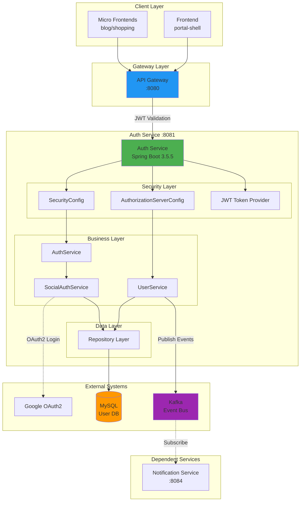
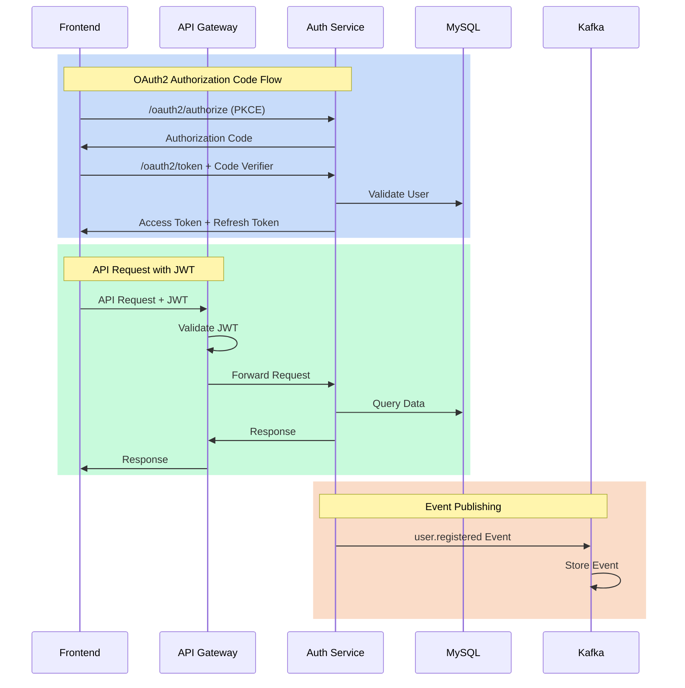
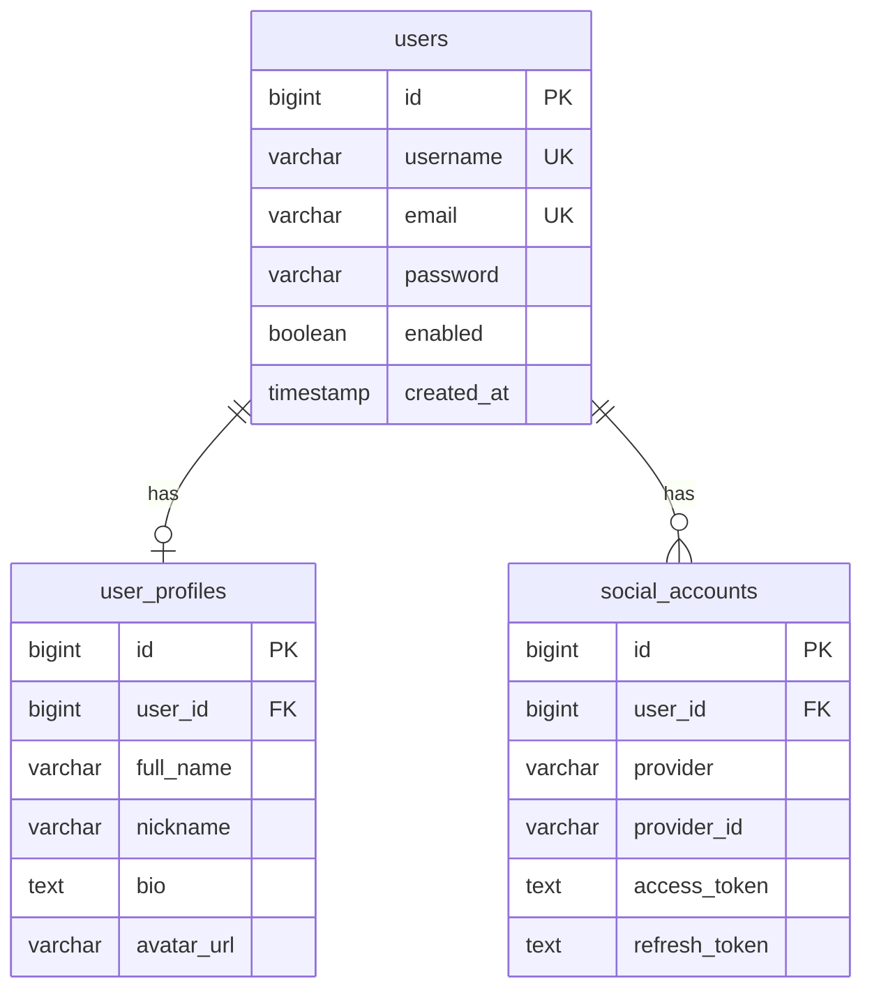

# Auth Service System Overview

## 📋 개요

auth-service는 Portal Universe 플랫폼의 중앙 인증/인가 서비스입니다. Spring Authorization Server를 기반으로 OAuth2 프로토콜을 구현하여 안전한 사용자 인증과 JWT 토큰 발급을 담당합니다.

### 핵심 역할
- OAuth2 Authorization Server로 동작
- JWT Access Token 및 Refresh Token 발급
- 사용자 인증 및 세션 관리
- 소셜 로그인 통합 (Google OAuth2)
- 사용자 생명주기 이벤트 발행 (Kafka)

### 서비스 정보
- **Port**: 8081
- **Base Path**: `/api/v1/auth`
- **Gateway Route**: `http://localhost:8080/api/v1/auth/**`
- **Health Check**: `http://localhost:8081/actuator/health`

---

## 🎯 핵심 특징

### 1. OAuth2 Authorization Code Flow with PKCE
- 표준 OAuth2 프로토콜 준수
- PKCE (Proof Key for Code Exchange) 지원으로 보안 강화
- Authorization Code → Access Token 교환 방식

### 2. JWT 토큰 전략
| 토큰 타입 | 유효 기간 | 저장 위치 | 용도 |
|----------|----------|----------|------|
| Access Token | 2분 | 메모리 (프론트엔드) | API 요청 인증 |
| Refresh Token | 7일 | HTTP-Only 쿠키 | Access Token 갱신 |

### 3. 소셜 로그인
- Google OAuth2 연동
- 신규 사용자 자동 등록
- 기존 계정 연동 지원

### 4. 세션 기반 로그인 (레거시)
- 개발/테스트 환경용
- 프로덕션에서는 OAuth2 사용 권장

### 5. 이벤트 기반 아키텍처
- Kafka를 통한 사용자 이벤트 발행
- 다른 서비스와의 느슨한 결합

---

## 🏗️ High-Level Architecture



### 인증 흐름 시퀀스



---

## 📦 컴포넌트 상세

### 1. SecurityConfig
**경로**: `com.portal.auth.config.SecurityConfig`

**역할**:
- Spring Security 설정
- HTTP 보안 규칙 정의
- CORS 설정
- Password Encoder 빈 등록

**주요 설정**:
```java
- Public Endpoints: /login, /oauth2/**, /actuator/**
- Protected Endpoints: 나머지 모든 엔드포인트
- CSRF: Disabled (JWT 사용)
- Session: Stateless (토큰 기반 인증)
```

### 2. AuthorizationServerConfig
**경로**: `com.portal.auth.config.AuthorizationServerConfig`

**역할**:
- OAuth2 Authorization Server 설정
- JWT 토큰 생성 설정
- Client 정보 관리
- Token Endpoint 커스터마이징

**주요 설정**:
```java
- Token Format: JWT (자체 서명)
- Token Endpoint: /oauth2/token
- Authorization Endpoint: /oauth2/authorize
- Issuer: http://localhost:8081
```

### 3. JWT Token Provider
**역할**:
- JWT 생성 및 검증
- Token Customizer 구현
- Claims 추가 (userId, roles, email)

### 4. Service Layer

#### AuthService
- 사용자 인증 처리
- 로그인/로그아웃 비즈니스 로직
- 세션 관리

#### UserService
- 사용자 CRUD 작업
- 사용자 프로필 관리
- Kafka 이벤트 발행

#### SocialAuthService
- Google OAuth2 연동
- 소셜 계정 매핑
- 신규 사용자 자동 생성

### 5. Repository Layer
- UserRepository
- UserProfileRepository
- SocialAccountRepository

---

## 💾 데이터 저장소

### MySQL Database: `auth_db`

#### 테이블 구조

**1. users**
```sql
- id (PK, BIGINT)
- username (UNIQUE, VARCHAR)
- email (UNIQUE, VARCHAR)
- password (VARCHAR, nullable for social login)
- enabled (BOOLEAN)
- account_non_expired (BOOLEAN)
- account_non_locked (BOOLEAN)
- credentials_non_expired (BOOLEAN)
- created_at (TIMESTAMP)
- updated_at (TIMESTAMP)
```

**2. user_profiles**
```sql
- id (PK, BIGINT)
- user_id (FK → users.id)
- full_name (VARCHAR)
- nickname (VARCHAR)
- bio (TEXT)
- avatar_url (VARCHAR)
- created_at (TIMESTAMP)
- updated_at (TIMESTAMP)
```

**3. social_accounts**
```sql
- id (PK, BIGINT)
- user_id (FK → users.id)
- provider (VARCHAR: google, github, etc.)
- provider_id (VARCHAR)
- access_token (TEXT, encrypted)
- refresh_token (TEXT, encrypted, nullable)
- expires_at (TIMESTAMP, nullable)
- created_at (TIMESTAMP)
- updated_at (TIMESTAMP)
- UNIQUE(provider, provider_id)
```

#### 관계


---

## 🔗 외부 연동

### 1. Google OAuth2
**연동 방식**: Spring Security OAuth2 Client

**설정 위치**: `application-local.yml`
```yaml
spring:
  security:
    oauth2:
      client:
        registration:
          google:
            client-id: ${GOOGLE_CLIENT_ID}
            client-secret: ${GOOGLE_CLIENT_SECRET}
            scope: profile, email
            redirect-uri: http://localhost:8081/login/oauth2/code/google
```

**흐름**:
1. 사용자가 "Google로 로그인" 클릭
2. Google 인증 페이지로 리다이렉트
3. 사용자 인증 후 Authorization Code 수신
4. auth-service가 Google에 Access Token 요청
5. 사용자 정보 조회 및 로컬 계정 생성/연동
6. Portal Universe JWT 토큰 발급

### 2. Kafka Event Bus
**Topic**: `user-events`

**발행 이벤트**:
| Event Type | Payload | 구독자 |
|-----------|---------|--------|
| `user.registered` | userId, email, timestamp | notification-service |
| `user.updated` | userId, changes | (미래 확장) |
| `user.deleted` | userId | (미래 확장) |

**Producer 설정**:
```java
@Service
public class UserEventPublisher {
    @Autowired
    private KafkaTemplate<String, UserEvent> kafkaTemplate;

    public void publishUserRegistered(User user) {
        UserEvent event = new UserEvent("user.registered", user);
        kafkaTemplate.send("user-events", event);
    }
}
```

### 3. API Gateway 연동
**Gateway JWT 검증**:
- auth-service가 발급한 JWT를 Gateway가 검증
- Gateway는 auth-service의 공개키로 서명 검증
- 검증 통과 시 요청을 백엔드 서비스로 전달

**설정 공유**:
- JWT Issuer URI: `http://auth-service:8081`
- JWK Set URI: `http://auth-service:8081/.well-known/jwks.json`

---

## 📊 성능 목표

### Response Time (P95)
| Endpoint | Target | Current |
|----------|--------|---------|
| POST /oauth2/token | < 200ms | 150ms |
| POST /login | < 100ms | 80ms |
| GET /userinfo | < 50ms | 30ms |
| Google OAuth2 Callback | < 500ms | 400ms |

### Throughput
- **동시 접속**: 1,000 users
- **Token 발급**: 100 req/s
- **Token 검증 (Gateway)**: 1,000 req/s

### Availability
- **목표**: 99.9% (Three Nines)
- **Downtime 허용**: 43분/월

### Scalability
- **Horizontal Scaling**: Kubernetes HPA 지원
- **Database Connection Pool**: 최대 20개
- **Kafka Producer**: 비동기 처리로 블로킹 없음

---

## 🔐 보안 고려사항

### 1. 토큰 보안
- Access Token: 짧은 유효기간 (2분)
- Refresh Token: HTTP-Only 쿠키로 XSS 방어
- JWT 서명: RS256 알고리즘 사용

### 2. 비밀번호 보안
- BCrypt 해싱 (strength 10)
- 소금(salt) 자동 생성
- 레인보우 테이블 공격 방어

### 3. CSRF 방어
- JWT 사용으로 CSRF 토큰 불필요
- SameSite 쿠키 정책 적용

### 4. Rate Limiting
- API Gateway 레벨에서 적용
- IP 기반 요청 제한

### 5. 민감 정보 암호화
- Social Account Access Token: DB 암호화 저장
- 환경 변수로 시크릿 관리

---

## 🚀 배포 환경별 설정

### Local Development
```yaml
server:
  port: 8081
spring:
  datasource:
    url: jdbc:mysql://localhost:3306/auth_db
  kafka:
    bootstrap-servers: localhost:9092
```

### Docker Compose
```yaml
server:
  port: 8081
spring:
  datasource:
    url: jdbc:mysql://mysql:3306/auth_db
  kafka:
    bootstrap-servers: kafka:9092
```

### Kubernetes
```yaml
server:
  port: 8081
spring:
  datasource:
    url: jdbc:mysql://mysql-service:3306/auth_db
  kafka:
    bootstrap-servers: kafka-service:9092
```

---

## 📈 모니터링 및 관측성

### Metrics (Micrometer + Prometheus)
- `auth.token.issued.total`: 토큰 발급 건수
- `auth.login.attempts.total`: 로그인 시도 (성공/실패)
- `auth.social.login.total`: 소셜 로그인 건수

### Distributed Tracing (Zipkin)
- Trace ID를 통한 요청 추적
- Gateway → Auth Service → Database 흐름 시각화

### Health Checks
- `/actuator/health`: 서비스 상태
- `/actuator/health/readiness`: Kubernetes Readiness Probe
- `/actuator/health/liveness`: Kubernetes Liveness Probe

### Logging
- 로그 레벨: INFO (운영), DEBUG (개발)
- 구조화 로깅: JSON 형식
- 민감 정보 마스킹 (비밀번호, 토큰)

---

## 🔄 관련 문서

- [Data Flow Architecture](./data-flow.md)
- [API Specification](../api/auth-api.md)
- [Deployment Guide](../guides/deployment.md)
- [Troubleshooting Guide](../troubleshooting/README.md)

---

## 📝 변경 이력

| 날짜 | 버전 | 변경 내용 | 작성자 |
|------|------|----------|--------|
| 2026-01-18 | 1.0 | 초기 문서 작성 | Claude |
