# Blog Frontend Data Flow

## 개요

Blog Frontend는 Vue 3 기반의 마이크로 프론트엔드로, API Gateway를 통해 **blog-service**와 **auth-service** 두 개의 백엔드 서비스와 통신합니다. Pinia를 사용하여 상태를 관리하며 `searchStore`(검색)와 `followStore`(팔로우)를 운영합니다.

**핵심 특징**:
- Portal Shell에서 주입된 `apiClient` (axios 인스턴스) 사용
- **Cross-service 통신**: blog-service (`/api/v1/blog/**`) + auth-service (`/api/v1/users/**`)
- Pinia를 활용한 반응형 상태 관리 (searchStore, followStore)
- followStore의 캐시 전략으로 불필요한 API 호출 최소화

---

## 전체 데이터 흐름 아키텍처

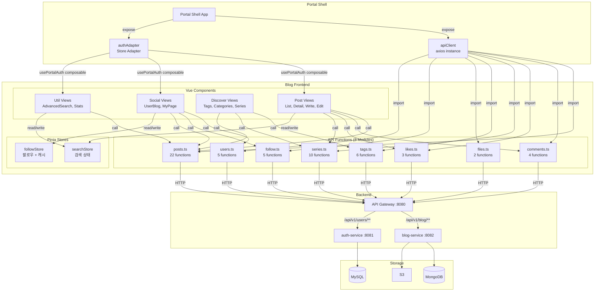

---

## 주요 데이터 흐름

### 1. 게시물 목록 조회 (Pagination)

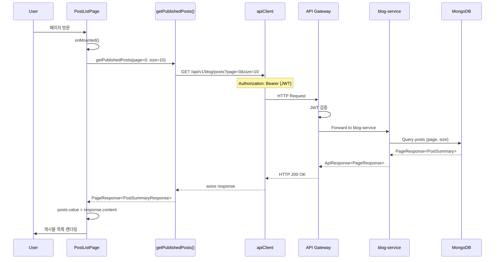

### 2. 게시물 상세 조회 (병렬 로딩)

PostDetailPage는 게시물 본문과 함께 여러 관련 데이터를 **병렬로** 로드합니다.

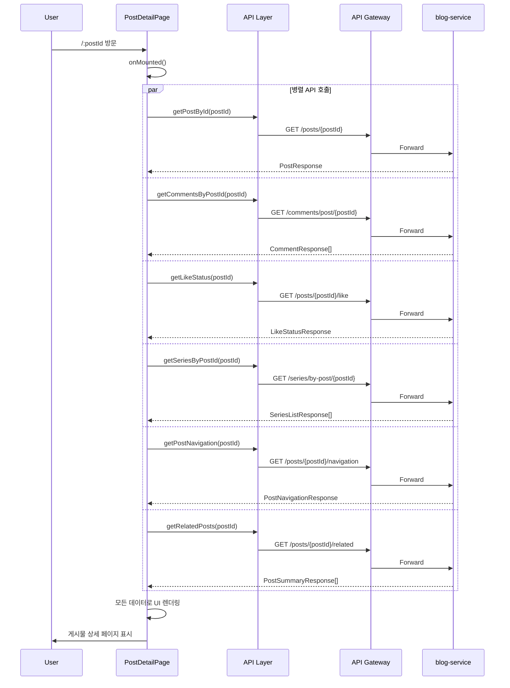

### 3. 좋아요 토글 (낙관적 업데이트)

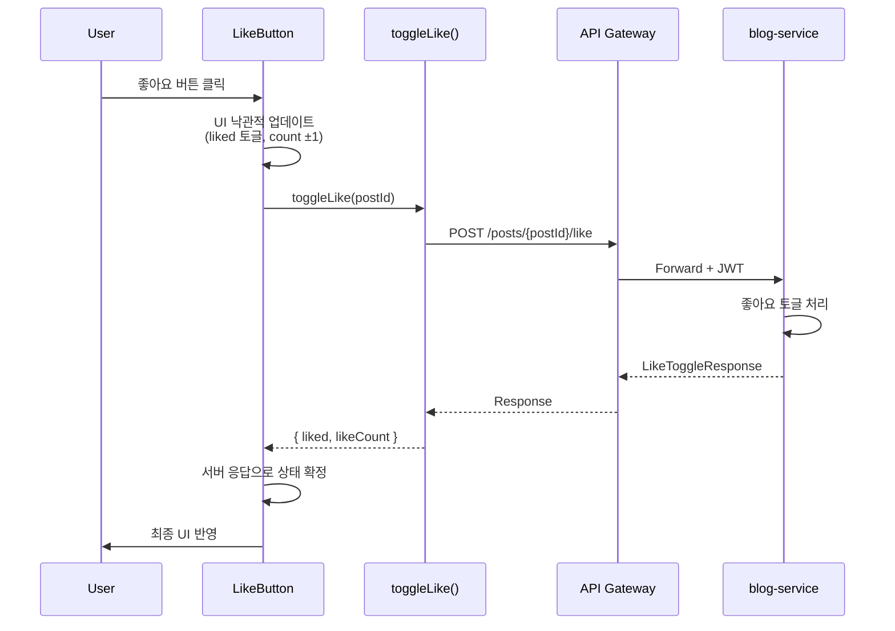

### 4. 팔로우 흐름 (followStore + auth-service)

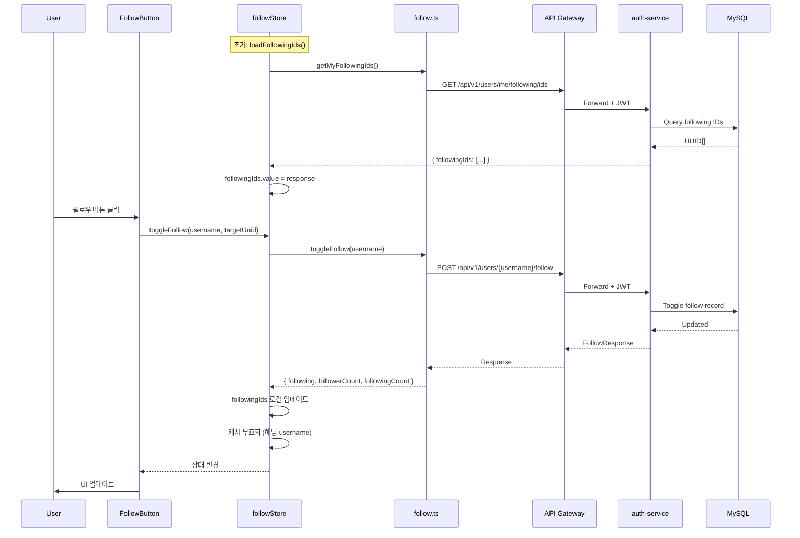

### 5. 사용자 블로그 (Cross-Service 패턴)

UserBlogPage는 **auth-service**(프로필)와 **blog-service**(게시물)를 동시에 호출합니다.

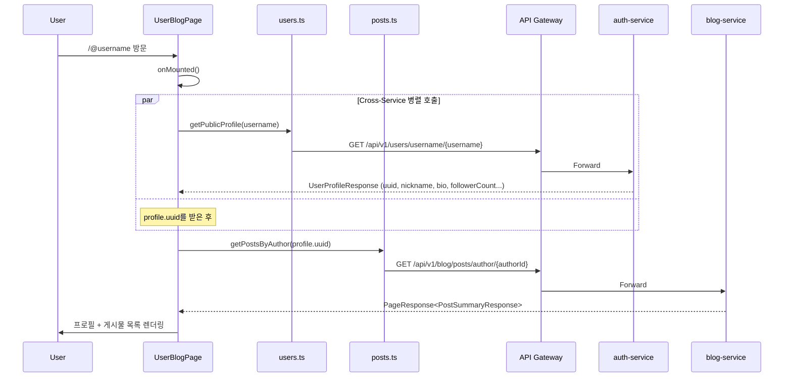

### 6. 피드 흐름 (followingIds + blog-service)

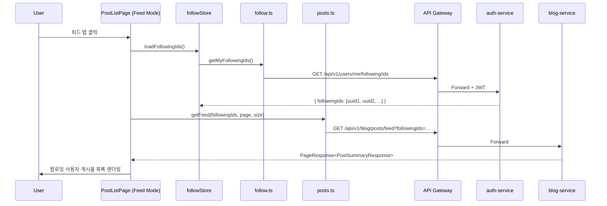

### 7. 시리즈 관리 흐름

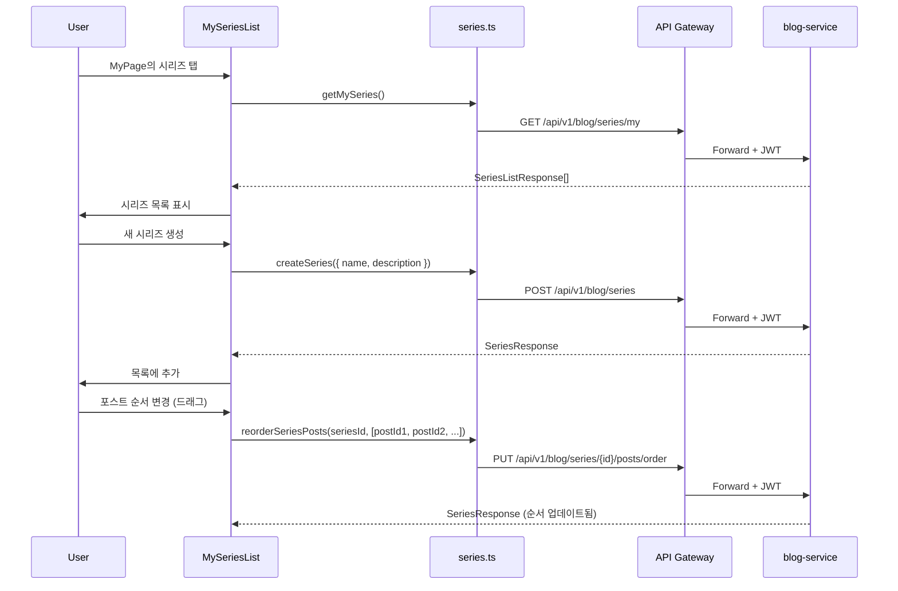

### 8. 고급 검색 흐름

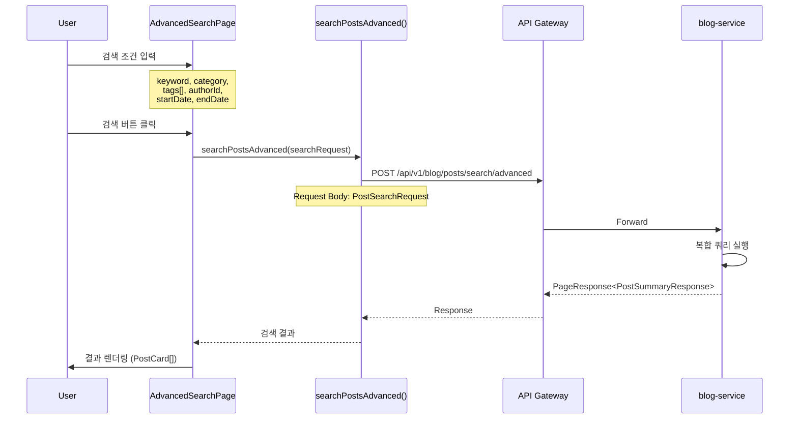

### 9. 게시물 작성/수정

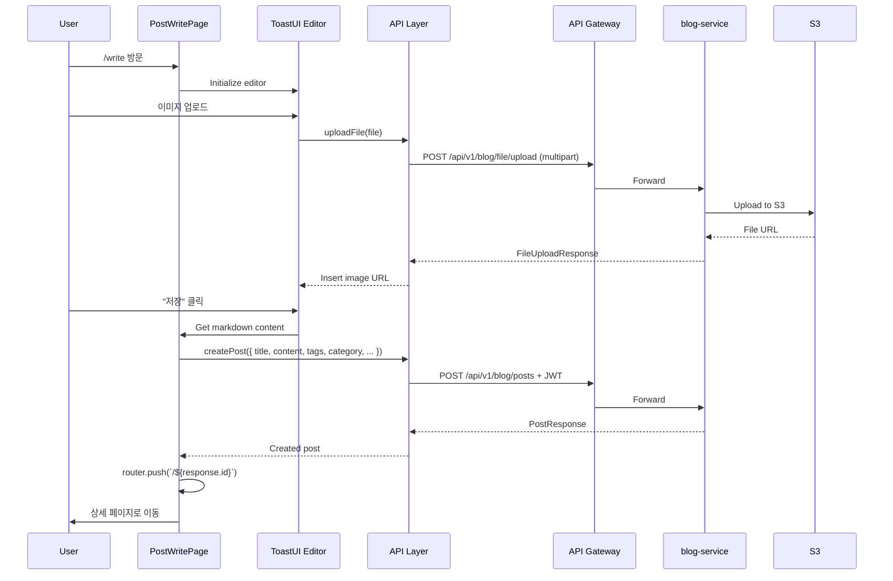

---

## 인증 토큰 흐름

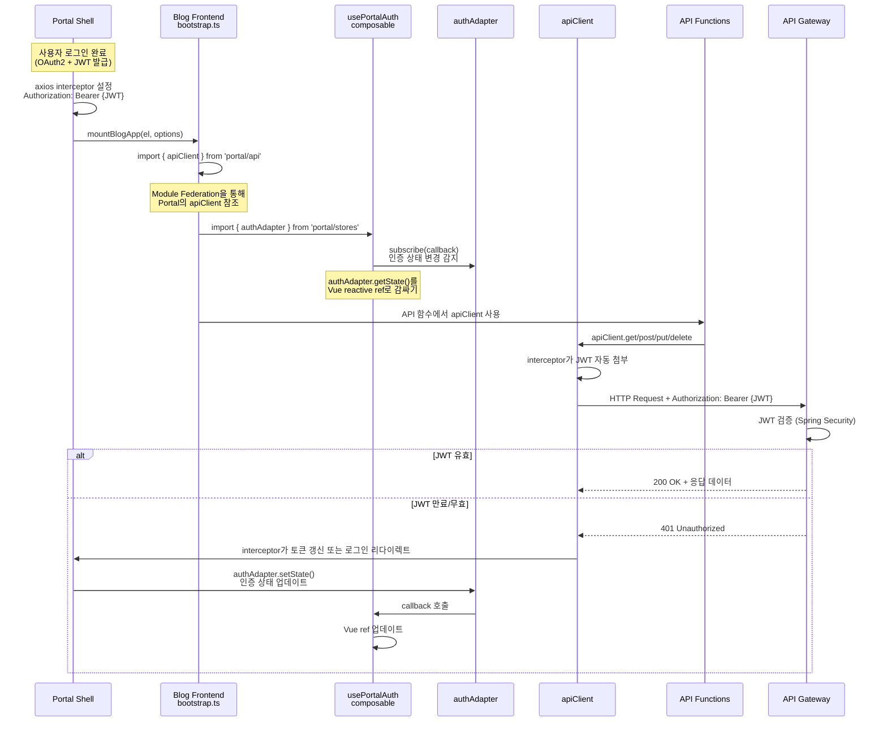

---

## Pinia 상태 관리 흐름

### searchStore

```mermaid
graph TB
    subgraph "searchStore State"
        KW[keyword: string]
        RES[results: PostSummaryResponse[]]
        IS[isSearching: boolean]
        ERR[error: string | null]
        CP[currentPage: number]
        TP[totalPages: number]
        HM[hasMore: boolean]
    end

    subgraph "searchStore Actions"
        SEARCH[search<br/>keyword]
        LOAD[loadMore]
        CLEAR[clear]
    end

    subgraph "Components"
        PL[PostListPage]
        SB[SearchBar]
    end

    PL -->|watch| RES
    PL -->|watch| IS
    SB -->|@search| SEARCH
    SB -->|@clear| CLEAR
    PL -->|scroll to bottom| LOAD
```

**동작 흐름**:

1. **새 검색**: `search(keyword)` → `results = []`, `currentPage = 0` → API 호출 → `results = response.content`
2. **추가 로드**: `loadMore()` → API 호출 (currentPage + 1) → `results = [...results, ...new]`
3. **초기화**: `clear()` → 모든 상태 리셋

### followStore

```mermaid
graph TB
    subgraph "followStore State"
        FI[followingIds: string[]]
        FIL[followingIdsLoaded: boolean]
        LD[loading: boolean]
        ER[error: Error | null]
        FC[followersCache: Map]
        FGC[followingsCache: Map]
    end

    subgraph "followStore Getters"
        IF[isFollowing(uuid)]
        FCT[followingCount]
    end

    subgraph "followStore Actions"
        LFI[loadFollowingIds]
        TF[toggleFollow]
        GF[getFollowers]
        GFG[getFollowings]
        CFS[checkFollowStatus]
        CC[clearCache]
        RST[reset]
    end

    subgraph "Components"
        FB[FollowButton]
        FM[FollowerModal]
        UB[UserBlogPage]
    end

    FB -->|call| TF
    FB -->|read| IF
    FM -->|call| GF & GFG
    UB -->|call| LFI

    TF -->|update| FI
    TF -->|invalidate| FC & FGC
    GF -->|cache hit| FC
    GFG -->|cache hit| FGC
```

**캐시 전략**:
- `followersCache` / `followingsCache`: `Map<string, FollowListResponse>` (key: `{username}-{page}-{size}`)
- 캐시 히트 시 API 호출 없이 즉시 반환
- `toggleFollow()` 호출 시 해당 사용자의 캐시 무효화
- `reset()`: 로그아웃 시 전체 상태 + 캐시 초기화

---

## 에러 처리 흐름

### 컴포넌트 레벨 에러 처리

```typescript
const isLoading = ref(false);
const error = ref<string | null>(null);

async function loadPosts() {
  try {
    isLoading.value = true;
    error.value = null;
    const response = await getPublishedPosts(page, size);
    posts.value = response.content;
  } catch (err) {
    console.error('Failed to fetch posts:', err);
    error.value = '게시글 목록을 불러올 수 없습니다.';
  } finally {
    isLoading.value = false;
  }
}
```

### API Gateway 에러 응답

| HTTP Status | 설명 | 처리 |
|-------------|------|------|
| `401 Unauthorized` | JWT 만료 또는 무효 | Portal Shell interceptor가 토큰 갱신 또는 로그인 리다이렉트 |
| `403 Forbidden` | 권한 없음 | 에러 메시지 표시 |
| `404 Not Found` | 리소스 없음 | 에러 메시지 표시 |
| `500 Internal Server Error` | 서버 에러 | 에러 메시지 표시 |

---

## API 엔드포인트 맵핑

### blog-service 엔드포인트 (`/api/v1/blog/**`)

#### Posts API (posts.ts)

| Frontend 함수 | HTTP Method | 경로 | 설명 |
|---------------|-------------|------|------|
| `createPost()` | POST | `/api/v1/blog/posts` | 게시물 생성 |
| `updatePost()` | PUT | `/api/v1/blog/posts/{postId}` | 게시물 수정 |
| `deletePost()` | DELETE | `/api/v1/blog/posts/{postId}` | 게시물 삭제 |
| `getPostById()` | GET | `/api/v1/blog/posts/{postId}` | 게시물 상세 조회 |
| `getAllPosts()` | GET | `/api/v1/blog/posts/all` | 전체 게시물 (관리자용) |
| `getPublishedPosts()` | GET | `/api/v1/blog/posts?page&size` | 발행된 게시물 목록 |
| `getMyPosts()` | GET | `/api/v1/blog/posts/my?status&page&size` | 내 게시물 |
| `getPostsByAuthor()` | GET | `/api/v1/blog/posts/author/{authorId}?page&size` | 작성자별 게시물 |
| `getPostsByCategory()` | GET | `/api/v1/blog/posts/category/{category}?page&size` | 카테고리별 게시물 |
| `getPostsByTags()` | GET | `/api/v1/blog/posts/tags?tags&page&size` | 태그별 게시물 |
| `getPopularPosts()` | GET | `/api/v1/blog/posts/popular?page&size` | 인기 게시물 |
| `getTrendingPosts()` | GET | `/api/v1/blog/posts/trending?period&page&size` | 트렌딩 게시물 |
| `getRecentPosts()` | GET | `/api/v1/blog/posts/recent?limit` | 최근 게시물 |
| `getRelatedPosts()` | GET | `/api/v1/blog/posts/{postId}/related?limit` | 관련 게시물 |
| `getPostWithViewIncrement()` | GET | `/api/v1/blog/posts/{postId}/view` | 조회수 증가 + 조회 |
| `searchPosts()` | GET | `/api/v1/blog/posts/search?keyword&page&size` | 간단 검색 |
| `searchPostsAdvanced()` | POST | `/api/v1/blog/posts/search/advanced` | 고급 검색 |
| `changePostStatus()` | PATCH | `/api/v1/blog/posts/{postId}/status` | 상태 변경 |
| `getCategoryStats()` | GET | `/api/v1/blog/posts/stats/categories` | 카테고리 통계 |
| `getPopularTags()` | GET | `/api/v1/blog/posts/stats/tags?limit` | 인기 태그 통계 |
| `getAuthorStats()` | GET | `/api/v1/blog/posts/stats/author/{authorId}` | 작성자 통계 |
| `getBlogStats()` | GET | `/api/v1/blog/posts/stats/blog` | 블로그 전체 통계 |
| `getPostsByProductId()` | GET | `/api/v1/blog/posts/product/{productId}` | 상품별 게시물 |
| `getPostNavigation()` | GET | `/api/v1/blog/posts/{postId}/navigation?scope` | 이전/다음 포스트 |
| `getFeed()` | GET | `/api/v1/blog/posts/feed?followingIds&page&size` | 팔로잉 피드 |

#### Comments API (comments.ts)

| Frontend 함수 | HTTP Method | 경로 | 설명 |
|---------------|-------------|------|------|
| `getCommentsByPostId()` | GET | `/api/v1/blog/comments/post/{postId}` | 게시글별 댓글 조회 |
| `createComment()` | POST | `/api/v1/blog/comments` | 댓글 작성 |
| `updateComment()` | PUT | `/api/v1/blog/comments/{commentId}` | 댓글 수정 |
| `deleteComment()` | DELETE | `/api/v1/blog/comments/{commentId}` | 댓글 삭제 |

#### Likes API (likes.ts)

| Frontend 함수 | HTTP Method | 경로 | 설명 |
|---------------|-------------|------|------|
| `toggleLike()` | POST | `/api/v1/blog/posts/{postId}/like` | 좋아요 토글 |
| `getLikeStatus()` | GET | `/api/v1/blog/posts/{postId}/like` | 좋아요 상태 확인 |
| `getLikers()` | GET | `/api/v1/blog/posts/{postId}/likes?page&size` | 좋아요 사용자 목록 |

#### Series API (series.ts)

| Frontend 함수 | HTTP Method | 경로 | 설명 |
|---------------|-------------|------|------|
| `getSeriesList()` | GET | `/api/v1/blog/series` 또는 `/author/{authorId}` | 시리즈 목록 |
| `getSeriesById()` | GET | `/api/v1/blog/series/{seriesId}` | 시리즈 상세 |
| `getSeriesPosts()` | GET | `/api/v1/blog/series/{seriesId}/posts` | 시리즈 포스트 목록 |
| `getMySeries()` | GET | `/api/v1/blog/series/my` | 내 시리즈 목록 |
| `createSeries()` | POST | `/api/v1/blog/series` | 시리즈 생성 |
| `updateSeries()` | PUT | `/api/v1/blog/series/{seriesId}` | 시리즈 수정 |
| `deleteSeries()` | DELETE | `/api/v1/blog/series/{seriesId}` | 시리즈 삭제 |
| `reorderSeriesPosts()` | PUT | `/api/v1/blog/series/{seriesId}/posts/order` | 포스트 순서 변경 |
| `addPostToSeries()` | POST | `/api/v1/blog/series/{seriesId}/posts/{postId}` | 포스트 추가 |
| `removePostFromSeries()` | DELETE | `/api/v1/blog/series/{seriesId}/posts/{postId}` | 포스트 제거 |
| `getSeriesByPostId()` | GET | `/api/v1/blog/series/by-post/{postId}` | 포스트별 시리즈 |

#### Tags API (tags.ts)

| Frontend 함수 | HTTP Method | 경로 | 설명 |
|---------------|-------------|------|------|
| `getAllTags()` | GET | `/api/v1/blog/tags` | 전체 태그 목록 |
| `getTagById()` | GET | `/api/v1/blog/tags/{tagId}` | 태그 상세 |
| `getTagByName()` | GET | `/api/v1/blog/tags/{tagName}` | 태그명 조회 |
| `getPostsByTag()` | GET | `/api/v1/blog/posts/tags?tags&page&size` | 태그별 포스트 |
| `getPopularTags()` | GET | `/api/v1/blog/tags/popular?limit` | 인기 태그 |
| `searchTags()` | GET | `/api/v1/blog/tags/search?q&limit` | 태그 검색 |

#### Files API (files.ts)

| Frontend 함수 | HTTP Method | 경로 | 설명 |
|---------------|-------------|------|------|
| `uploadFile()` | POST | `/api/v1/blog/file/upload` | S3 파일 업로드 (multipart) |
| `deleteFile()` | DELETE | `/api/v1/blog/file/delete` | S3 파일 삭제 |

### auth-service 엔드포인트 (`/api/v1/users/**`) - Cross-Service

#### Follow API (follow.ts)

| Frontend 함수 | HTTP Method | 경로 | 설명 |
|---------------|-------------|------|------|
| `toggleFollow()` | POST | `/api/v1/users/{username}/follow` | 팔로우 토글 |
| `getFollowers()` | GET | `/api/v1/users/{username}/followers?page&size` | 팔로워 목록 |
| `getFollowings()` | GET | `/api/v1/users/{username}/following?page&size` | 팔로잉 목록 |
| `getFollowStatus()` | GET | `/api/v1/users/{username}/follow/status` | 팔로우 상태 확인 |
| `getMyFollowingIds()` | GET | `/api/v1/users/me/following/ids` | 내 팔로잉 UUID 목록 |

#### Users API (users.ts)

| Frontend 함수 | HTTP Method | 경로 | 대상 서비스 | 설명 |
|---------------|-------------|------|-------------|------|
| `getPublicProfile()` | GET | `/api/v1/users/username/{username}` | auth-service | 공개 프로필 조회 |
| `getMyProfile()` | GET | `/api/v1/users/me` | auth-service | 내 프로필 조회 |
| `updateProfile()` | PATCH | `/api/v1/users/me` | auth-service | 프로필 수정 |
| `setUsername()` | POST | `/api/v1/users/me/username` | auth-service | Username 설정 |
| `checkUsername()` | GET | `/api/v1/users/username/{username}/check` | auth-service | Username 중복 확인 |
| `getUserPosts()` | GET | `/api/v1/blog/posts/author/{authorId}` | **blog-service** | 사용자 게시물 |

> `users.ts`는 auth-service와 blog-service를 **모두** 호출하는 cross-service 모듈입니다.

---

## 최적화 및 모범 사례

### 1. 무한 스크롤 (Intersection Observer)

```typescript
const observer = new IntersectionObserver(
  (entries) => {
    if (entries[0].isIntersecting && canLoadMore.value) {
      loadMore();
    }
  },
  { rootMargin: '100px', threshold: 0.1 }
);
```

### 2. 낙관적 업데이트 (좋아요, 팔로우)

UI를 먼저 업데이트하고 API 응답으로 확정합니다. 실패 시 롤백합니다.

### 3. followStore 캐시

팔로워/팔로잉 목록을 Map으로 캐시하여 동일 요청 시 API 호출을 생략합니다.

### 4. 병렬 API 호출

PostDetailPage에서 관련 데이터(댓글, 좋아요, 시리즈, 네비게이션, 관련글)를 `Promise.all` 또는 개별 `await` 없이 병렬로 호출합니다.

---

## 관련 문서

- [System Overview](./system-overview.md)
- [Module Federation](./module-federation.md)
- [Blog Service Architecture](../blog-service/)
- [Auth Service Architecture](../auth-service/)

---

**최종 업데이트**: 2026-02-15
