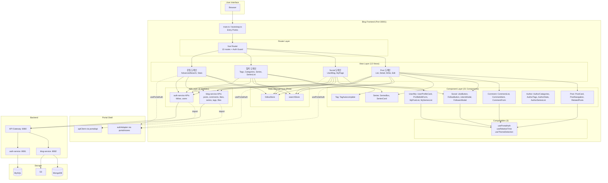

# Blog Frontend System Overview

## 개요

Blog Frontend는 Vue 3 기반의 마이크로 프론트엔드 애플리케이션으로, Module Federation을 통해 Portal Shell에 통합되거나 독립 실행(Standalone) 가능한 **Dual Mode** 아키텍처를 제공합니다.

블로그 게시물의 CRUD(생성, 조회, 수정, 삭제) 기능 외에도 **좋아요**, **팔로우**, **시리즈 관리**, **태그 탐색**, **사용자 블로그 프로필**, **통계 대시보드**, **고급 검색** 기능을 포함하는 종합 블로그 플랫폼입니다.

**Cross-service 통신**: blog-service(게시물, 댓글, 시리즈, 태그, 좋아요)와 auth-service(팔로우, 사용자 프로필)를 동시에 호출하는 멀티 서비스 아키텍처입니다.

---

## 핵심 특징

### 1. Dual Mode Architecture
- **Standalone Mode**: 독립 실행 가능한 SPA (Web History)
- **Embedded Mode**: Portal Shell에 통합되는 Remote 모듈 (Memory History)
- 런타임에 자동 감지 (`window.__POWERED_BY_PORTAL_SHELL__`)

### 2. Module Federation Integration
- Vite + @originjs/vite-plugin-federation
- `./bootstrap` 모듈을 Portal Shell에 노출
- Portal Shell의 `apiClient` 재사용 (MF `portal/api`)

### 3. Cross-Service API
- **blog-service**: 게시물, 댓글, 시리즈, 태그, 좋아요, 통계, 파일 업로드
- **auth-service**: 팔로우, 사용자 프로필, username 관리

### 4. Rich Editor
- ToastUI Editor 기반 마크다운 편집
- 코드 신택스 하이라이팅 (Prism.js)
- 이미지 업로드 (S3)

---

## High-Level Architecture



---

## Entry Points

### main.ts (Standalone Mode)

| 항목 | 내용 |
|------|------|
| **역할** | 독립 실행 시 진입점 |
| **History** | Web History (`createWebHistory('/')`) |
| **Router** | `createStandaloneBlogRouter()` |
| **감지 방법** | `window.__POWERED_BY_PORTAL_SHELL__ !== true` |
| **인증** | `window.__PORTAL_ACCESS_TOKEN__` 존재 여부로 판단 |

### bootstrap.ts (Embedded Mode)

| 항목 | 내용 |
|------|------|
| **역할** | Portal Shell 통합 시 진입점 |
| **Export** | `mountBlogApp(el, options)` 함수 |
| **History** | Memory History (`createMemoryHistory('/')`) |
| **Router** | `createBlogRouter('/')` |
| **Lifecycle** | `router`, `onParentNavigate`, `unmount`, `onActivated`, `onDeactivated` 반환 |
| **CSS 관리** | CSS lifecycle은 Portal Shell(RemoteWrapper)에서 중앙 관리. Remote app은 Vue app unmount와 DOM 정리만 담당 |

---

## Router Configuration

### Route 테이블 (13개)

| Route | Name | Component | Auth | Props | 설명 |
|-------|------|-----------|------|-------|------|
| `/` | PostList | PostListPage | - | - | 게시물 목록 (검색, 필터링) |
| `/tags` | TagList | TagListPage | - | - | 전체 태그 목록 |
| `/tags/:tagName` | TagDetail | TagDetailPage | - | `true` | 태그별 게시물 목록 |
| `/categories` | CategoryList | CategoryListPage | - | - | 카테고리 목록 및 통계 |
| `/search/advanced` | AdvancedSearch | AdvancedSearchPage | - | - | 고급 검색 (다중 조건) |
| `/stats` | Stats | StatsPage | - | - | 블로그 통계 대시보드 |
| `/write` | PostWrite | PostWritePage | - | - | 새 게시물 작성 |
| `/edit/:postId` | PostEdit | PostEditPage | - | `true` | 게시물 수정 |
| `/series` | SeriesList | SeriesListPage | - | - | 전체 시리즈 목록 (최신순/인기순) |
| `/series/:seriesId` | SeriesDetail | SeriesDetailPage | - | `true` | 시리즈 상세 및 포스트 목록 |
| `/my` | MyPage | MyPage | ✅ | - | 내 블로그 대시보드 (7탭: 글/시리즈/카테고리/태그/통계/소개/글쓰기) |
| `/@:username` | UserBlog | UserBlogPage | - | `true` | 사용자 블로그 프로필 (6탭: 글/시리즈/카테고리/태그/통계/소개) |
| `/:postId` | PostDetail | PostDetailPage | - | `true` | 게시물 상세 (댓글, 좋아요) |

### Auth Guard (`addAuthGuard`)

`meta.requiresAuth: true`인 라우트에 대해 인증을 검사합니다.

- **Embedded 모드**: `getPortalAuthState()` (usePortalAuth composable)로 authAdapter 기반 인증 상태 확인
- **Standalone 모드**: `window.__PORTAL_ACCESS_TOKEN__` 존재 여부 확인
- **미인증 시**: `window.__PORTAL_SHOW_LOGIN__()` 호출하여 Portal Shell에 로그인 모달 요청

### Router 모드

- **Standalone**: Web History (`createWebHistory('/')`) - 브라우저 URL 직접 관리
- **Embedded**: Memory History (`createMemoryHistory('/')`) - Portal Shell이 URL 관리

---

## View Layer (13 Views)

### Post 도메인

| View | 역할 | 주요 API | 사용 컴포넌트 |
|------|------|----------|--------------|
| **PostListPage** | 게시물 목록, 검색, 페이징, 무한 스크롤 | `getPublishedPosts`, `searchPosts`, `getTrendingPosts` | PostCard |
| **PostDetailPage** | 게시물 상세, 댓글, 좋아요, 시리즈, 네비게이션, 관련글 | `getPostById`, `getCommentsByPostId`, `getLikeStatus`, `getSeriesByPostId`, `getPostNavigation`, `getRelatedPosts` | CommentList, CommentForm, LikeButton, SeriesBox, PostNavigation, RelatedPosts, LikersModal |
| **PostWritePage** | 새 게시물 작성 (ToastUI Editor) | `createPost`, `uploadFile`, `getMySeries` | TagAutocomplete |
| **PostEditPage** | 기존 게시물 수정 | `getPostById`, `updatePost`, `uploadFile` | TagAutocomplete |

### Social 도메인

| View | 역할 | 주요 API | 사용 컴포넌트 |
|------|------|----------|--------------|
| **UserBlogPage** | 사용자 공개 블로그 (6탭: 글/시리즈/카테고리/태그/통계/소개) | `getPublicProfile` (auth-service), `getPostsByAuthor` (blog-service), `getAuthorCategoryStats`, `getAuthorTagStats`, `getAuthorStats` | UserProfileCard, FollowButton, PostCard, FollowerModal, AuthorCategories, AuthorTags, AuthorStats, AuthorSeriesList |
| **MyPage** | 내 블로그 대시보드 (7탭: 글/시리즈/카테고리/태그/통계/소개/글쓰기) | `getMyProfile`, `getMyPosts`, `getMySeries`, `updateProfile`, `getAuthorCategoryStats`, `getAuthorTagStats`, `getAuthorStats` | MyPostList, MySeriesList, ProfileEditForm, AuthorCategories, AuthorTags, AuthorStats |

### 탐색 도메인

| View | 역할 | 주요 API | 사용 컴포넌트 |
|------|------|----------|--------------|
| **TagListPage** | 전체 태그 목록 (인기 태그 포함) | `getAllTags`, `getPopularTags` | - |
| **TagDetailPage** | 특정 태그의 게시물 목록 | `getTagByName`, `getPostsByTag` | PostCard |
| **CategoryListPage** | 카테고리 목록 및 통계 | `getCategoryStats` | - |
| **SeriesListPage** | 전체 시리즈 목록 (최신순/인기순 정렬) | `getAllSeries` | SeriesCard |
| **SeriesDetailPage** | 시리즈 상세 + 포함 포스트 목록 | `getSeriesById`, `getSeriesPosts` | SeriesCard, PostCard |

### 유틸 도메인

| View | 역할 | 주요 API | 사용 컴포넌트 |
|------|------|----------|--------------|
| **AdvancedSearchPage** | 다중 조건 검색 (키워드, 카테고리, 태그, 작성자, 기간) | `searchPostsAdvanced` | PostCard, TagAutocomplete |
| **StatsPage** | 블로그 통계 대시보드 | `getBlogStats`, `getCategoryStats`, `getPopularTags` | - |

---

## Component Layer (21 Components)

### Post (3)

| Component | 역할 | Props |
|-----------|------|-------|
| **PostCard** | 게시물 카드 UI (목록용) | `post: PostSummaryResponse` |
| **PostNavigation** | 이전/다음 게시물 네비게이션 | `postId: string`, `scope: string` |
| **RelatedPosts** | 관련 게시물 목록 | `postId: string` |

### Comment (3)

| Component | 역할 | Props |
|-----------|------|-------|
| **CommentList** | 댓글 목록 표시 (트리 구조) | `postId: string` |
| **CommentItem** | 개별 댓글 렌더링 (수정/삭제) | `comment: CommentResponse` |
| **CommentForm** | 댓글 작성 폼 | `postId: string`, `parentCommentId?: string` |

### Social (4)

| Component | 역할 | Props |
|-----------|------|-------|
| **LikeButton** | 좋아요 토글 버튼 (낙관적 업데이트) | `postId: string` |
| **FollowButton** | 팔로우/언팔로우 버튼 (followStore 연동) | `username: string`, `targetUuid: string` |
| **LikersModal** | 좋아요한 사용자 목록 모달 | `postId: string` |
| **FollowerModal** | 팔로워/팔로잉 목록 모달 | `username: string`, `type: 'followers' | 'following'` |

### Series (2)

| Component | 역할 | Props |
|-----------|------|-------|
| **SeriesBox** | 게시물 상세에서 시리즈 정보 표시 | `seriesId: string` |
| **SeriesCard** | 시리즈 카드 UI (목록용) | `series: SeriesListResponse` |

### User / My (4)

| Component | 역할 | Props |
|-----------|------|-------|
| **UserProfileCard** | 사용자 프로필 카드 (프로필 이미지, bio, 팔로워 수) | `profile: UserProfileResponse` |
| **ProfileEditForm** | 프로필 편집 폼 (닉네임, bio, 이미지, 웹사이트) | `profile: UserProfileResponse` |
| **MyPostList** | 내 게시물 목록 (상태별 필터) | - |
| **MySeriesList** | 내 시리즈 목록 (CRUD) | - |

### Author (4)

| Component | 역할 | Props |
|-----------|------|-------|
| **AuthorCategories** | 작성자별 카테고리 통계 (게시글 수, 최근 게시일) | `authorId: string` |
| **AuthorTags** | 작성자별 태그 통계 (게시글 수 리스트) | `authorId: string` |
| **AuthorStats** | 작성자별 통계 카드 (총 게시글, 발행, 조회수, 좋아요) | `authorId: string` |
| **AuthorSeriesList** | 작성자별 시리즈 목록 (읽기 전용) | `authorId: string` |

### Tag (1)

| Component | 역할 | Props |
|-----------|------|-------|
| **TagAutocomplete** | 태그 자동완성 입력 | `modelValue: string[]` |

---

## Composables (3)

| Composable | 역할 | 사용처 |
|------------|------|--------|
| **usePortalAuth** | Portal Shell authAdapter를 Vue reactive ref로 감싸는 composable. `isAuthenticated`, `userUuid`, `displayName`, `roles`, `hasRole()`, `logout()`, `requestLogin()` 제공 | PostDetailPage, PostListPage, StatsPage |
| **getPortalAuthState()** | 컴포넌트 밖(router guard)에서 동기적으로 auth 상태 조회 | router/index.ts (Auth Guard) |
| **disposePortalAuth()** | MF app unmount 시 authAdapter 구독 해제 | bootstrap.ts |
| **useRelativeTime** | 상대 시간 계산 (`방금 전`, `N분 전`, `N일 전`) | PostCard, CommentItem |
| **useThemeDetection** | `data-theme` 속성 변경 감지하여 다크모드 상태 관리 (MutationObserver) | App.vue, PostDetailPage |

---

## State Management (Pinia)

### searchStore

| 항목 | 내용 |
|------|------|
| **역할** | 검색 상태 관리 |
| **State** | `keyword`, `results`, `isSearching`, `error`, `currentPage`, `totalPages`, `hasMore` |
| **Actions** | `search(keyword)`, `loadMore()`, `clear()` |
| **API 연동** | `searchPosts(keyword, page, size)` → blog-service |

### followStore

| 항목 | 내용 |
|------|------|
| **역할** | 팔로우 상태 관리 + 캐시 |
| **State** | `followingIds`, `followingIdsLoaded`, `loading`, `error`, `followersCache`, `followingsCache` |
| **Getters** | `isFollowing(uuid)`, `followingCount` |
| **Actions** | `loadFollowingIds()`, `toggleFollow(username, targetUuid)`, `getFollowers()`, `getFollowings()`, `checkFollowStatus()`, `clearCache()`, `reset()` |
| **API 연동** | `follow.ts` → auth-service (`/api/v1/users`) |
| **캐시 전략** | `followersCache` / `followingsCache`를 Map으로 관리. 팔로우 토글 시 해당 사용자 캐시 무효화 |

---

## API Layer (8 Modules)

### blog-service 호출 (6 모듈)

| 모듈 | Base Path | 함수 수 | 주요 기능 |
|------|-----------|---------|-----------|
| **posts.ts** | `/api/v1/blog/posts` | 24 | CRUD, 목록(전체/내글/작성자별/카테고리별/태그별/인기/트렌딩/최근/관련), 검색(간단/고급), 상태변경, 통계(카테고리/태그/작성자/블로그/작성자별카테고리/작성자별태그), 네비게이션, 피드 |
| **comments.ts** | `/api/v1/blog/comments` | 4 | 댓글 CRUD (게시글별 조회, 작성, 수정, 삭제) |
| **likes.ts** | `/api/v1/blog/posts/{postId}` | 3 | 좋아요 토글, 상태 확인, 좋아요 사용자 목록 |
| **series.ts** | `/api/v1/blog/series` | 11 | 시리즈 CRUD, 전체 목록, 포스트 추가/제거/순서변경, 내 시리즈, 포스트별 시리즈 |
| **tags.ts** | `/api/v1/blog/tags` | 6 | 태그 목록, 상세, 인기 태그, 태그 검색, 태그별 포스트 |
| **files.ts** | `/api/v1/blog/file` | 2 | 파일 업로드(S3), 파일 삭제 |

### auth-service 호출 (2 모듈) - Cross-Service

| 모듈 | Base Path | 함수 수 | 주요 기능 |
|------|-----------|---------|-----------|
| **follow.ts** | `/api/v1/users` | 5 | 팔로우 토글, 팔로워/팔로잉 목록, 팔로우 상태, 내 팔로잉 ID 목록 |
| **users.ts** | `/api/v1/users` + `/api/v1/blog/posts` | 5 | 프로필 조회(공개/내), 프로필 수정, username 설정/중복확인 |

### API Client

```typescript
// src/api/index.ts
import { apiClient } from 'portal/api';
export default apiClient;
```

Portal Shell의 인증된 axios 인스턴스를 Module Federation을 통해 재사용합니다.

---

## DTO Layer (9 Files)

| 파일 | 주요 타입 |
|------|-----------|
| **post.ts** | `PostResponse`, `PostSummaryResponse`, `PostCreateRequest`, `PostUpdateRequest`, `PostStatusChangeRequest`, `PostSearchRequest`, `AuthorStats`, `BlogStats`, `CategoryStats` |
| **comment.ts** | `CommentResponse`, `CommentCreateRequest`, `CommentUpdateRequest` |
| **like.ts** | `LikeToggleResponse`, `LikeStatusResponse`, `LikerResponse` |
| **follow.ts** | `FollowResponse`, `FollowUserResponse`, `FollowListResponse`, `FollowStatusResponse`, `FollowingIdsResponse` |
| **user.ts** | `UserProfileResponse`, `UserProfileUpdateRequest`, `UsernameSetRequest`, `UsernameCheckResponse` |
| **series.ts** | `SeriesResponse`, `SeriesCreateRequest`, `SeriesUpdateRequest`, `SeriesListResponse`, `SeriesPostOrderRequest` |
| **tag.ts** | `TagResponse`, `TagCreateRequest`, `TagStatsResponse` |
| **navigation.ts** | `PostNavigationResponse`, `PostNavigationItem` |
| **file.ts** | `FileUploadResponse`, `FileDeleteRequest` |

---

## 디렉토리 구조

```
blog-frontend/
├── src/
│   ├── main.ts                    # Standalone 모드 진입점
│   ├── bootstrap.ts               # Embedded 모드 진입점 (mountBlogApp)
│   ├── App.vue                    # Root 컴포넌트
│   ├── style.css                  # Global styles
│   │
│   ├── router/
│   │   └── index.ts               # Router 설정 (13 routes, Auth Guard)
│   │
│   ├── views/                     # 페이지 컴포넌트 (13)
│   │   ├── PostListPage.vue       # 게시물 목록 (검색, 무한 스크롤)
│   │   ├── PostDetailPage.vue     # 게시물 상세 (댓글, 좋아요, 시리즈)
│   │   ├── PostWritePage.vue      # 게시물 작성 (ToastUI Editor)
│   │   ├── PostEditPage.vue       # 게시물 수정
│   │   ├── TagListPage.vue        # 태그 목록
│   │   ├── TagDetailPage.vue      # 태그별 게시물
│   │   ├── CategoryListPage.vue   # 카테고리 목록
│   │   ├── SeriesListPage.vue     # 전체 시리즈 목록
│   │   ├── SeriesDetailPage.vue   # 시리즈 상세
│   │   ├── AdvancedSearchPage.vue # 고급 검색
│   │   ├── StatsPage.vue          # 통계 대시보드
│   │   ├── UserBlogPage.vue       # 사용자 블로그 (@username, 6탭)
│   │   └── MyPage.vue             # 내 블로그 대시보드 (requiresAuth, 7탭)
│   │
│   ├── components/                # 재사용 컴포넌트 (21)
│   │   ├── PostCard.vue           # 게시물 카드
│   │   ├── PostNavigation.vue     # 이전/다음 네비게이션
│   │   ├── RelatedPosts.vue       # 관련 게시물
│   │   ├── CommentList.vue        # 댓글 목록
│   │   ├── CommentItem.vue        # 개별 댓글
│   │   ├── CommentForm.vue        # 댓글 작성 폼
│   │   ├── LikeButton.vue         # 좋아요 버튼
│   │   ├── FollowButton.vue       # 팔로우 버튼
│   │   ├── LikersModal.vue        # 좋아요 사용자 모달
│   │   ├── FollowerModal.vue      # 팔로워/팔로잉 모달
│   │   ├── SeriesBox.vue          # 시리즈 정보 박스
│   │   ├── SeriesCard.vue         # 시리즈 카드
│   │   ├── UserProfileCard.vue    # 프로필 카드
│   │   ├── ProfileEditForm.vue    # 프로필 편집 폼
│   │   ├── MyPostList.vue         # 내 게시물 목록
│   │   ├── MySeriesList.vue       # 내 시리즈 목록
│   │   ├── AuthorCategories.vue   # 작성자별 카테고리 통계
│   │   ├── AuthorTags.vue         # 작성자별 태그 통계
│   │   ├── AuthorStats.vue        # 작성자별 통계 카드
│   │   ├── AuthorSeriesList.vue   # 작성자별 시리즈 목록 (읽기 전용)
│   │   └── TagAutocomplete.vue    # 태그 자동완성
│   │
│   ├── api/                       # API 클라이언트 (8 + index)
│   │   ├── index.ts               # apiClient import (from portal/api)
│   │   ├── posts.ts               # 게시물 API (22 함수)
│   │   ├── comments.ts            # 댓글 API (4 함수)
│   │   ├── likes.ts               # 좋아요 API (3 함수)
│   │   ├── series.ts              # 시리즈 API (10 함수)
│   │   ├── tags.ts                # 태그 API (6 함수)
│   │   ├── files.ts               # 파일 API (2 함수)
│   │   ├── follow.ts              # 팔로우 API (5 함수) → auth-service
│   │   └── users.ts               # 사용자 API (5 함수) → auth-service
│   │
│   ├── stores/                    # Pinia Stores (2)
│   │   ├── searchStore.ts         # 검색 상태 관리
│   │   └── followStore.ts         # 팔로우 상태 + 캐시
│   │
│   ├── composables/               # Vue Composables (3)
│   │   ├── usePortalAuth.ts       # Portal Shell 인증 상태 (authAdapter wrapper)
│   │   ├── useRelativeTime.ts     # 상대 시간 계산
│   │   └── useThemeDetection.ts   # 다크모드 감지
│   │
│   ├── dto/                       # Data Transfer Objects (9)
│   │   ├── post.ts                # 게시물 관련 DTO
│   │   ├── comment.ts             # 댓글 DTO
│   │   ├── like.ts                # 좋아요 DTO
│   │   ├── follow.ts              # 팔로우 DTO
│   │   ├── user.ts                # 사용자 프로필 DTO
│   │   ├── series.ts              # 시리즈 DTO
│   │   ├── tag.ts                 # 태그 DTO
│   │   ├── navigation.ts          # 포스트 네비게이션 DTO
│   │   └── file.ts                # 파일 업로드 DTO
│   │
│   ├── types/                     # TypeScript 타입 정의
│   │   ├── index.ts               # 통합 re-export
│   │   ├── common.ts              # ApiResponse, PageResponse 등
│   │   └── federation.d.ts        # Module Federation 타입
│   │
│   ├── config/
│   │   └── assets.ts              # Asset 경로 설정
│   │
│   └── assets/                    # 정적 파일 (이미지, 아이콘)
│
├── vite.config.ts                 # Vite 설정 (Module Federation)
├── tsconfig.json                  # TypeScript 설정
├── tailwind.config.js             # TailwindCSS 설정
├── package.json
└── README.md
```

---

## 기술 스택

### Core

| 기술 | 버전 | 용도 |
|------|------|------|
| Vue | 3.5.21 | UI 프레임워크 |
| Vite | 7.1.7 | 빌드 도구 |
| TypeScript | ~5.9.3 | 타입 안전성 |
| Pinia | 3.0.3 | 상태 관리 |
| Vue Router | 4.5.1 | 라우팅 |

### Module Federation

| 기술 | 버전 | 용도 |
|------|------|------|
| @originjs/vite-plugin-federation | 1.4.1 | Vite Module Federation 지원 |

### Editor

| 기술 | 버전 | 용도 |
|------|------|------|
| @toast-ui/editor | 3.2.2 | 마크다운 편집기 |
| @toast-ui/editor-plugin-code-syntax-highlight | 3.1.0 | 코드 하이라이팅 |
| Prism.js | 1.30.0 | 신택스 하이라이팅 |

### HTTP & Auth

| 기술 | 버전 | 용도 |
|------|------|------|
| axios | 1.12.2 | HTTP 클라이언트 (Portal Shell에서 제공) |
| oidc-client-ts | 3.3.0 | OAuth2/OIDC 인증 |

### Design System

| 기술 | 버전 | 용도 |
|------|------|------|
| @portal/design-system-vue | * | 공유 Vue 컴포넌트 |
| @portal/design-tokens | * | 디자인 토큰 |
| TailwindCSS | 3.4.15 | 유틸리티 CSS |

---

## 인증 & 인가

### Embedded 모드 인증 흐름
1. Portal Shell에서 OAuth2/OIDC 인증 완료
2. Portal Shell의 `apiClient`에 JWT 토큰 자동 첨부
3. Blog Frontend는 Portal Shell의 `apiClient` 재사용 (MF `portal/api`)
4. API Gateway에서 JWT 검증 후 blog-service/auth-service로 라우팅

### Standalone 모드 인증
- `window.__PORTAL_ACCESS_TOKEN__` 존재 여부로 인증 상태 판단
- Auth Guard가 `requiresAuth` 라우트 접근 시 토큰 확인

### Auth Guard 동작

```typescript
// Embedded: authAdapter 기반 composable 사용
import { getPortalAuthState } from '@/composables/usePortalAuth';
const authState = getPortalAuthState();
if (authState.isAuthenticated) return true;

// Standalone: 글로벌 토큰 확인
if (window.__PORTAL_ACCESS_TOKEN__) return true;

// 미인증: 로그인 모달 요청
window.__PORTAL_SHOW_LOGIN__();
return false;
```

### 권한

| 기능 | 인증 요구 |
|------|-----------|
| 게시물/태그/시리즈 조회 | 불필요 |
| 게시물 작성/수정/삭제 | 필요 |
| 댓글 작성/수정/삭제 | 필요 |
| 좋아요 토글 | 필요 |
| 팔로우 토글 | 필요 |
| MyPage 접근 | 필요 (`requiresAuth`) |
| 프로필 수정 | 필요 |

---

## Theme & Styling

### Design Token Integration
```css
/* Base Layer */
--color-green-600: #10b981;
/* Semantic Layer */
--color-brand-primary: var(--color-green-600);
/* Component Layer */
.bg-brand-primary { background-color: var(--color-brand-primary); }
```

### Service-Specific Theme
```vue
<!-- App.vue -->
<script setup>
onMounted(() => {
  document.documentElement.setAttribute('data-service', 'blog');
});
</script>
```

### Dark Mode (useThemeDetection)

`useThemeDetection` composable이 `data-theme` 속성을 MutationObserver로 감지하여 다크모드 상태를 관리합니다.

```typescript
const { isDarkMode } = useThemeDetection();
// isDarkMode는 data-theme="dark" 일 때 true
```

---

## 외부 연동

| 시스템 | 용도 | 프로토콜 | URL |
|--------|------|----------|-----|
| API Gateway | 백엔드 API 호출 | REST | http://localhost:8080 |
| blog-service | 게시물, 댓글, 시리즈, 태그, 좋아요, 통계, 파일 | REST | Gateway 경유 (:8082) |
| auth-service | 팔로우, 사용자 프로필, username 관리 | REST | Gateway 경유 (:8081) |
| S3 | 이미지 업로드 | HTTP | blog-service가 처리 |
| Portal Shell | apiClient, authStore 제공 | Module Federation | http://localhost:30000 |

---

## 빌드 & 실행

### 개발 모드
```bash
npm run dev
# build --watch + preview 동시 실행: http://localhost:30001
```

### 빌드
```bash
npm run build:dev      # 개발 환경
npm run build:docker   # Docker 환경
npm run build:k8s      # Kubernetes 환경
```

---

## 관련 문서

- [Data Flow Architecture](./data-flow.md)
- [Module Federation](./module-federation.md)
- [Blog Service Architecture](../blog-service/)
- [Auth Service Architecture](../auth-service/)

---

**최종 업데이트**: 2026-02-17
