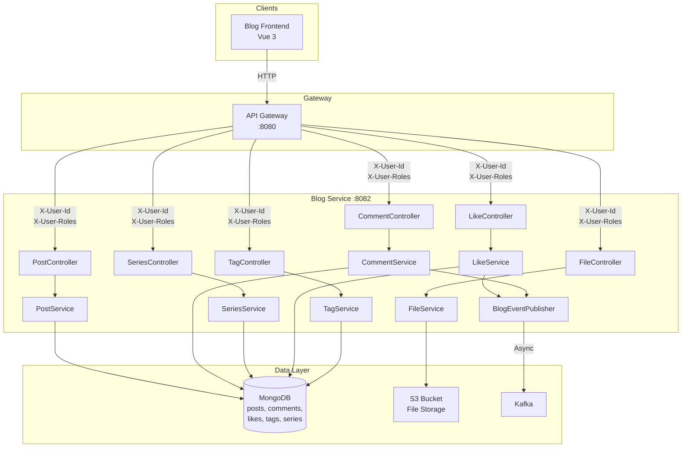
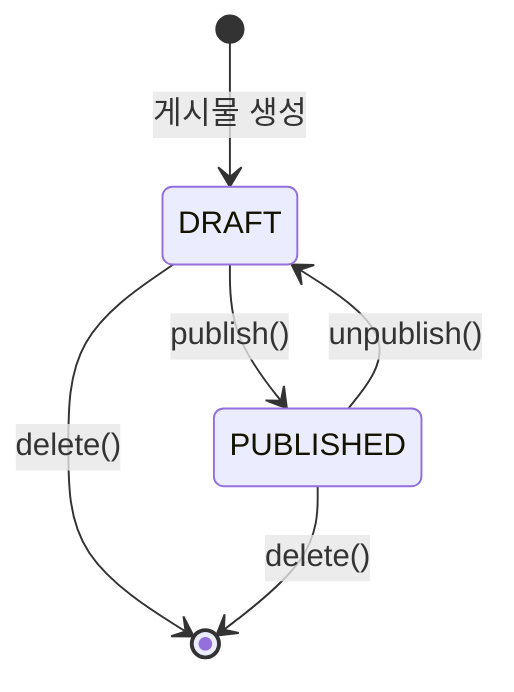
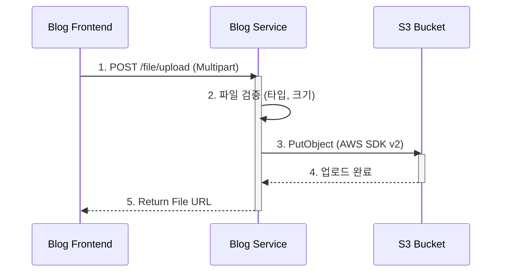

# Blog Service System Overview

## 개요

Blog Service는 Portal Universe의 블로그 기능을 담당하는 마이크로서비스입니다. MongoDB를 사용한 유연한 문서 구조, S3를 통한 파일 관리, Kafka를 통한 이벤트 기반 알림 연동을 제공합니다.

| 항목 | 내용 |
|------|------|
| **범위** | Service |
| **주요 기술** | Java 17, Spring Boot 3.5.5, MongoDB, AWS S3 (SDK v2), Kafka |
| **배포 환경** | Docker Compose, Kubernetes |
| **관련 서비스** | API Gateway (인증 헤더 전달), Kafka → notification-service (이벤트 소비) |

**핵심 기능**:
- 블로그 게시물 CRUD (생성, 조회, 수정, 삭제)
- 댓글 시스템 (대댓글 지원, soft delete)
- 좋아요 (postId+userId 복합 유니크)
- 시리즈 관리 (순서 유지)
- 태그 기반 분류 (역정규화 postCount)
- 전문 검색 (Full-text Search, 가중치 인덱스)
- 파일 업로드 (S3 연동, 이미지 전용)
- Kafka 이벤트 발행 (좋아요, 댓글, 팔로우)

---

## 아키텍처 다이어그램



---

## 도메인 구조

```
services/blog-service/src/main/java/com/portal/universe/blogservice/
├── BlogServiceApplication.java
├── post/                           # 게시물 도메인
│   ├── domain/
│   │   ├── Post.java               # 게시물 엔티티
│   │   ├── PostStatus.java         # DRAFT, PUBLISHED, ARCHIVED
│   │   └── PostSortType.java       # LATEST, POPULAR, OLDEST
│   ├── dto/
│   │   ├── PostCreateRequest.java
│   │   ├── PostUpdateRequest.java
│   │   ├── PostResponse.java
│   │   ├── PostSummaryResponse.java
│   │   ├── PostNavigationResponse.java
│   │   ├── PostSearchRequest.java
│   │   ├── PostStatusChangeRequest.java
│   │   ├── PostMapper.java
│   │   └── stats/                  # 통계 DTO
│   │       ├── BlogStats.java
│   │       ├── CategoryStats.java
│   │       └── AuthorStats.java
│   ├── repository/
│   │   ├── PostRepository.java
│   │   ├── PostRepositoryCustom.java
│   │   └── PostRepositoryCustomImpl.java
│   ├── service/
│   │   ├── PostService.java        # 인터페이스
│   │   └── PostServiceImpl.java    # 구현체
│   └── controller/
│       └── PostController.java
├── comment/                        # 댓글 도메인
│   ├── domain/
│   │   └── Comment.java            # 댓글 엔티티 (대댓글, soft delete)
│   ├── dto/
│   │   ├── CommentCreateRequest.java
│   │   ├── CommentUpdateRequest.java
│   │   └── CommentResponse.java
│   ├── repository/
│   │   └── CommentRepository.java
│   ├── service/
│   │   └── CommentService.java
│   └── controller/
│       └── CommentController.java
├── like/                           # 좋아요 도메인
│   ├── domain/
│   │   └── Like.java               # 좋아요 엔티티 (postId+userId 복합 유니크)
│   ├── dto/
│   │   ├── LikeToggleResponse.java
│   │   ├── LikeStatusResponse.java
│   │   └── LikerResponse.java
│   ├── repository/
│   │   └── LikeRepository.java
│   ├── service/
│   │   └── LikeService.java
│   └── controller/
│       └── LikeController.java
├── series/                         # 시리즈 도메인
│   ├── domain/
│   │   └── Series.java             # 시리즈 엔티티 (순서 관리)
│   ├── dto/
│   │   ├── SeriesCreateRequest.java
│   │   ├── SeriesUpdateRequest.java
│   │   ├── SeriesResponse.java
│   │   ├── SeriesListResponse.java
│   │   ├── SeriesNavigationResponse.java
│   │   └── SeriesPostOrderRequest.java
│   ├── repository/
│   │   └── SeriesRepository.java
│   ├── service/
│   │   └── SeriesService.java
│   └── controller/
│       └── SeriesController.java
├── tag/                            # 태그 도메인
│   ├── domain/
│   │   └── Tag.java                # 태그 엔티티 (역정규화 postCount)
│   ├── dto/
│   │   ├── TagCreateRequest.java
│   │   ├── TagResponse.java
│   │   └── TagStatsResponse.java
│   ├── repository/
│   │   └── TagRepository.java
│   ├── service/
│   │   └── TagService.java
│   └── controller/
│       └── TagController.java
├── file/                           # 파일 업로드 도메인
│   ├── config/
│   │   └── S3Config.java           # AWS SDK v2 S3 클라이언트
│   ├── dto/
│   │   ├── FileUploadResponse.java
│   │   └── FileDeleteRequest.java
│   ├── service/
│   │   └── FileService.java
│   └── controller/
│       └── FileController.java
├── event/                          # Kafka 이벤트
│   └── BlogEventPublisher.java     # 4개 토픽 이벤트 발행
├── common/                         # 공통
│   ├── config/
│   │   ├── SecurityConfig.java     # Gateway 헤더 기반 보안
│   │   ├── KafkaConfig.java        # Kafka Producer + 토픽
│   │   ├── MongoConfig.java        # MongoDB 인덱스 설정
│   │   ├── MongoAuditingConfig.java
│   │   └── OpenApiConfig.java      # Swagger 설정
│   ├── domain/
│   │   └── SortDirection.java
│   └── exception/
│       └── BlogErrorCode.java      # B001-B065
```

---

## 데이터 모델

### Post (게시물)

```java
@Document(collection = "posts")
public class Post {
    @Id
    private String id;                       // MongoDB ObjectId
    @TextIndexed(weight = 2.0f)
    private String title;                    // 제목 (max 200자)
    @TextIndexed
    private String content;                  // 본문
    private String summary;                  // 요약 (max 500자, 자동 생성)
    private String authorId;                 // 작성자 ID
    private String authorUsername;           // 작성자 Username
    private String authorNickname;           // 작성자 닉네임
    private PostStatus status;               // DRAFT | PUBLISHED | ARCHIVED
    private Set<String> tags;                // 태그 목록
    private String category;                 // 카테고리
    private Long viewCount;                  // 조회수
    private Long likeCount;                  // 좋아요 수
    private Long commentCount;               // 댓글 수
    private LocalDateTime publishedAt;       // 발행일
    private String metaDescription;          // SEO 메타 (max 160자, 자동 생성)
    private String thumbnailUrl;             // 썸네일 이미지 URL
    private List<String> images;             // 첨부 이미지 URL 목록
    private String productId;                // 연관 상품 ID (선택적)
    @CreatedDate
    private LocalDateTime createdAt;         // 생성일
    @LastModifiedDate
    private LocalDateTime updatedAt;         // 수정일
}
```

**인덱스** (MongoConfig에서 프로그래밍 방식 생성, 총 7개):
```javascript
db.posts.createIndex({ title: "text", content: "text" },
    { weights: { title: 2, content: 1 } })                      // 전문 검색 (가중치)
db.posts.createIndex({ status: 1, publishedAt: -1 })            // 발행된 게시물 조회
db.posts.createIndex({ authorId: 1, createdAt: -1 })            // 작성자별 게시물
db.posts.createIndex({ category: 1, status: 1, publishedAt: -1 }) // 카테고리별 게시물
db.posts.createIndex({ tags: 1 })                                // 태그별 게시물
db.posts.createIndex({ status: 1, viewCount: -1, publishedAt: -1 }) // 인기 게시물
db.posts.createIndex({ productId: 1 })                           // 상품별 게시물
```

### Comment (댓글)

```java
@Document(collection = "comments")
public class Comment {
    @Id
    private String id;
    private String postId;                   // 게시물 ID
    private String authorId;                 // 작성자 ID
    private String authorUsername;           // 작성자 Username
    private String authorNickname;           // 작성자 닉네임
    private String content;                  // 댓글 내용
    private String parentCommentId;          // 대댓글인 경우 부모 댓글 ID (null이면 루트)
    private Long likeCount;                  // 좋아요 수 (기본 0)
    private Boolean isDeleted;               // soft delete 플래그 (기본 false)
    private LocalDateTime createdAt;         // 생성일
    private LocalDateTime updatedAt;         // 수정일
}
```

### Like (좋아요)

```java
@Document(collection = "likes")
@CompoundIndex(name = "postId_userId_unique", def = "{'postId': 1, 'userId': 1}", unique = true)
public class Like {
    @Id
    private String id;
    private String postId;                   // 게시물 ID
    private String userId;                   // 사용자 ID
    private String userName;                 // 사용자 이름 (표시용)
    @CreatedDate
    private LocalDateTime createdAt;         // 생성일
}
```

### Tag (태그)

```java
@Document(collection = "tags")
public class Tag {
    @Id
    private String id;
    @TextIndexed
    @Indexed(unique = true)
    private String name;                     // 태그 이름 (고유, max 50자)
    private Long postCount;                  // 사용된 포스트 수 (역정규화, 기본 0)
    private String description;              // 태그 설명 (선택, max 200자)
    private LocalDateTime createdAt;         // 생성일
    private LocalDateTime lastUsedAt;        // 최종 사용일
}
```

#### Tag postCount 동기화 전략

Tag.postCount는 Post lifecycle에서 PostServiceImpl이 TagService를 호출하여 동기화합니다:

- **Post 생성**: 태그 자동 생성(`getOrCreateTag`) + bulk `$inc` postCount 증가
- **Post 수정**: 태그 diff 계산 (added → increment, removed → decrement)
- **Post 삭제**: 기존 태그 bulk `$inc` postCount 감소

### Series (시리즈)

```java
@Document(collection = "series")
public class Series {
    @Id
    private String id;
    private String name;                     // 시리즈 제목 (max 100자)
    private String description;              // 설명 (max 500자)
    private String authorId;                 // 작성자 ID
    private String authorUsername;           // 작성자 Username
    private String authorNickname;           // 작성자 닉네임
    private String thumbnailUrl;             // 썸네일 이미지 URL
    private List<String> postIds;            // 게시물 ID 목록 (인덱스 = 순서)
    private LocalDateTime createdAt;         // 생성일
    private LocalDateTime updatedAt;         // 수정일
    @Version
    private Long version;                    // 낙관적 잠금 버전
}
```

#### Series 낙관적 잠금 전략

Series는 MongoDB `@Version` 어노테이션으로 낙관적 잠금을 적용합니다. 동시 수정이 감지되면 `OptimisticLockingFailureException`이 발생하고, SeriesService에서 `SERIES_CONCURRENT_MODIFICATION` (B046, 409 Conflict) 에러로 변환합니다. 클라이언트는 재시도로 처리합니다.

---

## 게시물 상태 흐름



| 상태 | 설명 | 구현된 전이 |
|------|------|------------|
| `DRAFT` | 작성 중 (비공개) | → PUBLISHED (publish), 삭제 |
| `PUBLISHED` | 발행됨 (공개) | → DRAFT (unpublish), 삭제 |
| `ARCHIVED` | enum에 정의됨 | PRD Phase 2에서 archive()/restore() 구현 예정 |

---

## Kafka 이벤트

### 토픽 정의

| 토픽 | 이벤트 DTO | 파티션 | 복제본 | 설명 |
|------|-----------|--------|--------|------|
| `blog.post.liked` | `PostLikedEvent` | 3 | 1 | 게시물 좋아요 발생 |
| `blog.post.commented` | `CommentCreatedEvent` | 3 | 1 | 댓글 작성 |
| `blog.comment.replied` | `CommentRepliedEvent` | - | - | 대댓글 작성 |
| `blog.user.followed` | `UserFollowedEvent` | - | - | 사용자 팔로우 |

> `blog.comment.replied`, `blog.user.followed`는 BlogEventPublisher에서 발행하지만, KafkaConfig에 토픽 자동 생성은 미정의 (Kafka auto.create.topics 또는 수동 생성 필요)

### Producer 설정

```java
// KafkaConfig.java
configProps.put(ProducerConfig.ACKS_CONFIG, "all");            // 모든 복제본 확인
configProps.put(ProducerConfig.RETRIES_CONFIG, 3);             // 3회 재시도
configProps.put(ProducerConfig.ENABLE_IDEMPOTENCE_CONFIG, true); // 멱등성 보장
// Value Serializer: JsonSerializer (이벤트 객체 → JSON)
```

### 이벤트 발행 흐름

```
LikeService.toggleLike()
  → BlogEventPublisher.publishPostLiked(PostLikedEvent)
    → KafkaTemplate.send("blog.post.liked", postId, event)
      → notification-service (Consumer)
```

---

## 보안 설정

### 인증 방식

API Gateway에서 JWT를 검증하고 다음 헤더를 전달합니다:
- `X-User-Id`: 사용자 UUID
- `X-User-Roles`: 쉼표 구분 권한 (예: `ROLE_USER,ROLE_SELLER`)
- `X-User-Nickname`, `X-User-Name`: 사용자 정보

`GatewayAuthenticationFilter`가 이 헤더를 읽어 `SecurityContext`를 설정합니다.

### SecurityFilterChain (3개)

```java
// @Order(0) - Actuator
"/actuator/health", "/actuator/info"          → permitAll
"/actuator/prometheus", "/actuator/metrics/**" → permitAll (Gateway에서 외부 차단)
나머지                                          → denyAll

// @Order(1) - Swagger
"/swagger-ui/**", "/api-docs/**", "/v3/api-docs/**" → permitAll

// @Order(2) - API (Gateway StripPrefix=2 적용 후 경로)
GET  /posts/**, /tags/**, /categories/**     → permitAll (공개 조회)
POST /posts, /file/upload, /posts/*/like     → authenticated (인증 필요)
PUT  /posts/**                                → authenticated
DELETE /posts/**                              → authenticated
DELETE /file/delete                           → ROLE_BLOG_ADMIN 또는 ROLE_SUPER_ADMIN
/admin/**                                     → ROLE_BLOG_ADMIN 또는 ROLE_SUPER_ADMIN
나머지                                         → authenticated
```

> **참고**: API Gateway에서 `StripPrefix=2`가 적용되어 `/api/blog/posts/**` → `/posts/**`로 매핑됩니다.

---

## 파일 업로드

### S3 연동 흐름



### 지원 파일 형식

| 타입 | 확장자 | 최대 크기 |
|------|--------|-----------|
| 이미지 | `.jpg`, `.jpeg`, `.png`, `.gif`, `.webp`, `.svg` | 100MB |

### S3 설정 (AWS SDK v2)

```java
@Configuration
public class S3Config {
    @Bean
    public S3Client s3Client() {
        return S3Client.builder()
                .region(Region.of(region))
                .credentialsProvider(StaticCredentialsProvider.create(
                        AwsBasicCredentials.create(accessKey, secretKey)))
                .endpointOverride(URI.create(endpoint))
                .serviceConfiguration(S3Configuration.builder()
                        .pathStyleAccessEnabled(true)  // LocalStack 필수
                        .build())
                .build();
    }
}
```

---

## 검색 기능

### 전문 검색

- 제목(`title`, 가중치 2.0)과 본문(`content`, 가중치 1.0)에서 키워드 검색
- MongoDB Text Index 활용

### 고급 검색 (PostSearchRequest)

| 조건 | 설명 |
|------|------|
| keyword | 제목/본문 전문 검색 |
| category | 정확히 일치 |
| tags | 배열 요소 포함 여부 |
| authorId | 정확히 일치 |
| status | 정확히 일치 |
| 기간 | publishedAt 범위 검색 |
| 정렬 | LATEST (최신순), POPULAR (인기순), OLDEST (오래된순) |

---

## 에러 코드

| 코드 | HTTP 상태 | 메시지 | 설명 |
|------|-----------|--------|------|
| B001 | 404 | Post not found | 게시물을 찾을 수 없음 |
| B002 | 403 | Post update forbidden | 게시물 수정 권한 없음 |
| B003 | 403 | Post delete forbidden | 게시물 삭제 권한 없음 |
| B004 | 400 | Post not published | 게시물 미발행 상태 |
| B020 | 404 | Like not found | 좋아요를 찾을 수 없음 |
| B021 | 409 | Like already exists | 좋아요 중복 |
| B022 | 500 | Like operation failed | 좋아요 처리 실패 |
| B030 | 404 | Comment not found | 댓글을 찾을 수 없음 |
| B031 | 403 | Comment update forbidden | 댓글 수정 권한 없음 |
| B032 | 403 | Comment delete forbidden | 댓글 삭제 권한 없음 |
| B040 | 404 | Series not found | 시리즈를 찾을 수 없음 |
| B041 | 403 | Series update forbidden | 시리즈 수정 권한 없음 |
| B042 | 403 | Series delete forbidden | 시리즈 삭제 권한 없음 |
| B043 | 403 | Series add post forbidden | 시리즈 포스트 추가 권한 없음 |
| B044 | 403 | Series remove post forbidden | 시리즈 포스트 제거 권한 없음 |
| B045 | 403 | Series reorder forbidden | 시리즈 순서 변경 권한 없음 |
| B046 | 409 | Series concurrent modification | 시리즈 동시 수정 충돌 (재시도 필요) |
| B050 | 404 | Tag not found | 태그를 찾을 수 없음 |
| B051 | 409 | Tag already exists | 태그 중복 |
| B060 | 500 | File upload failed | 파일 업로드 실패 |
| B061 | 400 | File is empty | 빈 파일 |
| B062 | 400 | File size exceeded | 파일 크기 초과 (100MB) |
| B063 | 400 | File type not allowed | 허용되지 않는 파일 유형 |
| B064 | 500 | File delete failed | 파일 삭제 실패 |
| B065 | 400 | Invalid file URL | 잘못된 파일 URL |

---

## 기술적 결정

### 선택한 패턴
- **문서 기반 데이터 모델**: 블로그 포스트의 유연한 구조에 MongoDB 적합
- **역정규화**: Tag.postCount, Post.likeCount/commentCount 직접 저장 (조회 성능 우선)
- **이벤트 기반 알림**: Kafka를 통해 notification-service와 비동기 연동
- **Gateway 헤더 인증**: JWT 검증은 API Gateway에 위임, 서비스는 헤더만 읽음
- **Soft Delete**: Comment의 isDeleted 플래그로 대댓글 트리 구조 유지

### 제약사항
- ARCHIVED 상태 전이는 PRD Phase 2에서 구현 예정
- `blog.comment.replied`, `blog.user.followed` 토픽은 KafkaConfig에 자동 생성 미정의

---

## 배포 및 확장

### Spring Profiles

| Profile | 용도 | 특징 |
|---------|------|------|
| `local` | 로컬 개발 (기본) | LocalStack S3, 로컬 MongoDB/Kafka |
| `docker` | Docker Compose | 컨테이너 내부 호스트명 사용 |
| `kubernetes` | Kubernetes | ConfigMap/Secret 기반 설정 |

### Dockerfile (멀티 스테이지)

```
Stage 1 (Builder): gradle:8.9-jdk17
  - Layer 캐싱 (의존성 → 소스 → 빌드)
  - common-library, blog-events 포함 빌드

Stage 2 (Runtime): eclipse-temurin:17-jre-jammy
  - 비root 사용자 (appuser) 실행
  - Health check: /actuator/health (30초 간격)
```

### 의존성

| 라이브러리 | 용도 |
|-----------|------|
| common-library | 공통 보안 필터, 예외 처리, ApiResponse |
| blog-events | Kafka 이벤트 DTO (PostLikedEvent 등) |
| Spring Data MongoDB | 데이터 접근 |
| Spring Kafka | 이벤트 발행 |
| Spring Security | 인증/인가 |
| AWS S3 SDK v2 (2.29.50) | 파일 저장 |
| SpringDoc OpenAPI (2.8.14) | API 문서화 |
| Micrometer + Prometheus | 메트릭 수집 |
| Zipkin | 분산 추적 |
| Testcontainers (MongoDB) | 통합 테스트 |

---

## 외부 연동

| 시스템 | 용도 | 프로토콜 | 인증 |
|--------|------|----------|------|
| **API Gateway** | 인증 헤더 전달, 라우팅 | HTTP | X-User-Id/Roles 헤더 |
| **Kafka** | 이벤트 발행 (notification-service 소비) | Kafka Protocol | N/A |
| **AWS S3** | 파일 저장소 | AWS SDK v2 | Access Key/Secret |
| **MongoDB** | 데이터 저장소 | MongoDB Wire Protocol | Username/Password |

---

## 성능 목표

| 지표 | 목표 | 비고 |
|------|------|------|
| **응답 시간 (p95)** | < 200ms | 단일 게시물 조회 |
| **처리량** | 500 TPS | 읽기 작업 기준 |
| **가용성** | 99.5% | 월간 기준 |
| **검색 응답 시간** | < 500ms | 전문 검색 |

---

## 관련 문서

- [Blog API 명세서](../../api/blog-service/README.md)
- [Architecture Template](../../templates/architecture-template.md)

---

**최종 업데이트**: 2026-02-06
