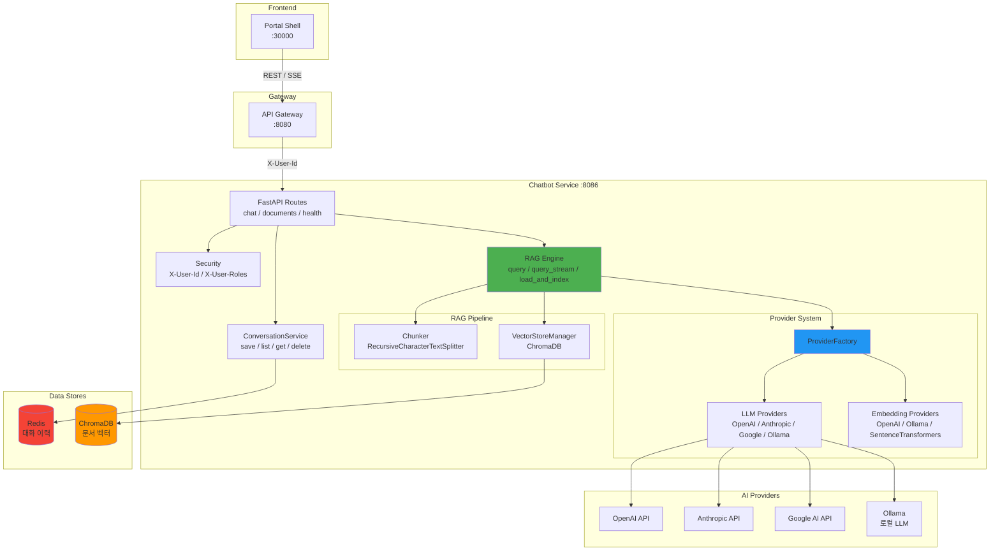

# Chatbot Service 시스템 아키텍처

## 개요

Chatbot Service는 Portal Universe 플랫폼의 RAG(Retrieval-Augmented Generation) 기반 AI 채팅 서비스입니다. 관리자가 업로드한 문서를 벡터 DB에 인덱싱하고, 사용자 질문에 대해 관련 문서를 검색한 뒤 LLM을 통해 답변을 생성합니다.

| 항목 | 내용 |
|------|------|
| **범위** | Service |
| **주요 기술** | FastAPI, LangChain, ChromaDB, Redis, Pydantic |
| **배포 환경** | Local, Docker Compose, Kubernetes |
| **관련 서비스** | api-gateway (인증 위임) |

### 핵심 역할

- **RAG 질의**: 문서 기반 검색 + LLM 답변 생성 (동기/스트리밍)
- **문서 관리**: 업로드, 청킹, 임베딩, 인덱싱, 삭제
- **대화 관리**: Redis 기반 대화 이력 저장/조회 (TTL 7일)
- **다중 Provider**: OpenAI, Anthropic, Google, Ollama 4개 LLM + 3개 Embedding Provider

### 서비스 정보

- **Port**: 8086
- **Base Path**: `/api/v1/chat`
- **Health Check**: `http://localhost:8086/api/v1/chat/health`

---

## 아키텍처 다이어그램



### 내부 모듈 구조

```
app/
├── main.py                 # FastAPI 앱 진입점, 라우터 등록, Lifespan Hook, AuditMiddleware
├── api/routes/
│   ├── chat.py             # Chat + Conversation 엔드포인트 (5개)
│   ├── documents.py        # Document 엔드포인트 (4개, Path Traversal 방어)
│   └── health.py           # Health Check (1개)
├── core/
│   ├── config.py           # Pydantic Settings (환경변수 바인딩)
│   ├── security.py         # Gateway 위임 인증 (X-User-Id, X-User-Roles)
│   ├── validators.py       # XSS 검증 (check_no_xss)
│   ├── audit.py            # Audit Middleware (POST/PUT/PATCH/DELETE 로깅)
│   └── logging_config.py   # 구조화 로깅
├── rag/
│   ├── engine.py           # RAG 파이프라인 오케스트레이션
│   ├── chunker.py          # 텍스트 분할기
│   └── vectorstore.py      # ChromaDB 관리
├── providers/
│   ├── base.py             # LLMProvider / EmbeddingProvider 추상 인터페이스
│   ├── factory.py          # Provider 팩토리 (환경변수 기반 생성)
│   ├── openai_provider.py  # OpenAI GPT
│   ├── anthropic_provider.py # Anthropic Claude
│   ├── google_provider.py  # Google Gemini
│   ├── ollama_provider.py  # Ollama (로컬)
│   └── local_provider.py   # SentenceTransformers (로컬 임베딩)
├── schemas/
│   ├── chat.py             # ChatRequest (XSS validation), ChatResponse, SourceInfo
│   ├── common.py           # ApiResponse (Java 서비스 호환)
│   └── document.py         # DocumentInfo, DocumentList
└── services/
    └── conversation_service.py  # Redis 대화 이력 관리
```

---

## 핵심 컴포넌트

### 1. FastAPI App

**경로**: `app/main.py`

**역할**: HTTP 서버 진입점. 라우터 등록, CORS 미들웨어, Lifespan Hook을 관리합니다.

**주요 책임**:
- Lifespan Hook으로 RAG Engine 초기화 (`rag_engine.initialize()`)
- 3개 라우터 등록: chat (`/api/v1/chat`), documents (`/api/v1/chat/documents`), health
- CORS 설정 (환경변수로 제어, Gateway 경유 시 비활성화 가능)

### 2. RAG Engine

**경로**: `app/rag/engine.py`

**역할**: RAG 파이프라인의 핵심 오케스트레이터. 싱글톤 인스턴스(`rag_engine`)로 운영됩니다.

**주요 기능**:
- `initialize()`: LLM/Embedding Provider 생성 + VectorStore 연결
- `query()`: 동기 RAG 질의 (검색 → 컨텍스트 조합 → LLM 생성)
- `query_stream()`: SSE 스트리밍 RAG 질의 (토큰 단위 AsyncIterator)
- `load_and_index_file()`: 문서 로드 → 청킹 → 벡터 인덱싱

**지원 문서 형식**:

| 확장자 | Loader |
|--------|--------|
| `.md` | `UnstructuredMarkdownLoader` |
| `.txt` | `TextLoader` |
| `.pdf` | `PyPDFLoader` |

### 3. Provider System

**경로**: `app/providers/`

**역할**: AI 모델 접근을 추상화. `ProviderFactory`가 환경변수 기반으로 적절한 Provider를 생성합니다.

**LLM Providers** (4개):

| Provider | 클래스 | 설정 키 |
|----------|--------|---------|
| OpenAI | `OpenAILLMProvider` | `AI_PROVIDER=openai` |
| Anthropic | `AnthropicLLMProvider` | `AI_PROVIDER=anthropic` |
| Google | `GoogleLLMProvider` | `AI_PROVIDER=google` |
| Ollama | `OllamaLLMProvider` | `AI_PROVIDER=ollama` (기본값) |

**Embedding Providers** (3개):

| Provider | 클래스 | 설정 키 |
|----------|--------|---------|
| OpenAI | `OpenAIEmbeddingProvider` | `EMBEDDING_PROVIDER=openai` |
| Ollama | `OllamaEmbeddingProvider` | `EMBEDDING_PROVIDER=ollama` (기본값) |
| SentenceTransformers | `LocalEmbeddingProvider` | `EMBEDDING_PROVIDER=sentence-transformers` |

**인터페이스**:
- `LLMProvider`: `generate(prompt, context)` / `stream(prompt, context)` / `get_chat_model()`
- `EmbeddingProvider`: `get_embeddings()` / `embed_text(text)` / `embed_batch(texts)`

### 4. VectorStoreManager

**경로**: `app/rag/vectorstore.py`

**역할**: ChromaDB 벡터 스토어를 관리합니다.

**주요 기능**:
- `add_documents()`: 문서 청크를 벡터 스토어에 추가
- `search()`: 유사 문서 검색 (top_k + score threshold 필터링)
- `delete_by_source()`: 특정 소스 문서의 모든 청크 삭제
- `get_document_count()`: 저장된 총 청크 수 반환

**설정**:
- Collection: `chatbot_documents`
- Persist Directory: `./data/chroma` (디스크 영속화)
- 유사도 검색: `similarity_search_with_relevance_scores`

### 5. ConversationService

**경로**: `app/services/conversation_service.py`

**역할**: Redis 기반 대화 이력을 관리합니다. 싱글톤 인스턴스(`conversation_service`)로 운영됩니다.

**Redis Key Pattern**:
- `chatbot:conversations:{user_id}` (Hash) - 대화 목록 메타데이터
- `chatbot:messages:{user_id}:{conversation_id}` (List) - 메시지 이력

**주요 기능**:
- `save_message()`: 메시지 저장 + 대화 메타데이터 업데이트
- `list_conversations()`: 사용자의 대화 목록 (최신순)
- `get_messages()`: 특정 대화의 전체 메시지 이력
- `delete_conversation()`: 대화 + 메시지 삭제

**운영 특성**:
- TTL 7일: 대화/메시지 모두 7일 후 자동 삭제
- Lazy Connection: 첫 요청 시 Redis 연결 생성
- 사용자 격리: Key에 `user_id` 포함

### 6. Security

**경로**: `app/core/security.py`

**역할**: API Gateway 위임 인증을 처리합니다.

**인증 함수**:
- `get_current_user_id()`: `X-User-Id` 헤더에서 사용자 ID 추출 (없으면 401)
- `require_admin()`: `X-User-Id` + `X-User-Roles` 헤더로 관리자 권한 확인 (403)

**특이사항**:
- JWT 직접 검증 없음 (Gateway가 대행)
- `X-User-Roles`가 없으면 일반 인증만 확인 (하위 호환)
- `admin` 또는 `role_admin` 역할 허용

### 7. Input Validation (XSS 방어)

**경로**: `app/core/validators.py`

**역할**: 사용자 입력에서 XSS(Cross-Site Scripting) 공격 패턴을 감지합니다.

**주요 함수**:
- `check_no_xss(value: str) -> str`: XSS 패턴 검증 + 길이 제한 (1-10000)

**검증 패턴**:

| 패턴 | 설명 |
|------|------|
| `<script[^>]*>.*?</script>` | Script 태그 |
| `on\w+\s*=` | Event 핸들러 (`onclick`, `onerror` 등) |
| `javascript:` | JavaScript 프로토콜 |
| `<iframe[^>]*>` | Iframe 태그 |

**적용 위치**:
- `ChatRequest.message`: Pydantic `field_validator`로 자동 검증
- 검증 실패 시 422 Unprocessable Entity 반환

**사용 예시**:
```python
from app.core.validators import check_no_xss
from pydantic import BaseModel, field_validator

class ChatRequest(BaseModel):
    message: str

    @field_validator("message")
    @classmethod
    def validate_message(cls, v: str) -> str:
        return check_no_xss(v)
```

### 8. Path Traversal 방어

**경로**: `app/api/routes/documents.py`

**역할**: 문서 삭제 시 디렉토리 탈출 공격을 방지합니다.

**검증 로직**:
```python
file_path = Path(config.documents_dir) / document_id
resolved_path = file_path.resolve()

if not resolved_path.is_relative_to(Path(config.documents_dir).resolve()):
    raise HTTPException(status_code=400, detail="Invalid document path")
```

**방어 원리**:
- `Path.resolve()`: 심볼릭 링크, `..` 경로 해석
- `is_relative_to()`: 허용된 디렉토리 내부인지 확인
- `../../etc/passwd` 같은 공격 차단

### 9. Audit Middleware

**경로**: `app/core/audit.py`

**역할**: 데이터 변경 요청(POST/PUT/PATCH/DELETE)을 로깅합니다.

**주요 기능**:
- 요청 정보 로깅: HTTP Method, URL Path, User ID (X-User-Id 헤더)
- 응답 정보 로깅: Status Code, Duration (ms)
- 성공/실패 모두 기록

**로그 형식**:
```python
{
    "timestamp": "2026-02-13T10:00:00.000Z",
    "user_id": "user-123",
    "method": "POST",
    "path": "/api/v1/chat/message",
    "status_code": 200,
    "duration_ms": 1234
}
```

**등록 위치**: `main.py`
```python
from app.core.audit import AuditMiddleware

app.add_middleware(AuditMiddleware)
```

**대상 메서드**:
- POST: 생성
- PUT/PATCH: 수정
- DELETE: 삭제
- GET은 제외 (조회는 로깅하지 않음)

---

## 데이터 플로우

### 1. RAG 질의 플로우

```
1. Client → API Gateway (JWT 검증, X-User-Id 추출)
2. Gateway → FastAPI (X-User-Id 헤더 전달)
3. FastAPI → Security (사용자 인증 확인)
4. FastAPI → RAG Engine
   4a. 질문 전처리 (공백/물음표 정규화)
   4b. VectorStore 검색 (ChromaDB, top_k=5, threshold=0.7)
   4c. Context 조합 (검색 결과 + 질문)
   4d. LLM Provider에 생성 요청
5. RAG Engine → ConversationService (메시지 저장, Redis)
6. FastAPI → Client (ApiResponse 반환)
```

### 2. SSE 스트리밍 플로우

```
1. Client → POST /stream (ChatRequest)
2. 사용자 메시지 Redis 저장
3. VectorStore 유사 문서 검색
4. LLM Provider 스트리밍 시작
5. 토큰 단위 SSE 전송:
   → {"type": "token", "content": "..."}  (반복)
   → {"type": "sources", "sources": [...]}  (1회)
   → {"type": "done", "message_id": "...", "conversation_id": "..."}  (1회)
6. 어시스턴트 메시지 Redis 저장
```

### 3. 문서 인덱싱 플로우

```
1. Admin → POST /documents/upload (multipart/form-data)
2. 파일 검증 (확장자, 크기)
3. 파일 시스템에 저장 (./documents/)
4. Document Loader로 로드 (MD/TXT/PDF)
5. RecursiveCharacterTextSplitter로 청킹 (1000자, 200자 겹침)
6. 청크별 메타데이터 추가 (source, document_id)
7. Embedding Provider로 벡터화
8. ChromaDB에 저장
9. 결과 반환 (document_id, chunk_count)
```

---

## 기술적 결정

### RDBMS 미사용

전통적인 관계형 데이터베이스를 사용하지 않습니다. 대화 이력은 Redis(임시 데이터, TTL 7일), 문서 임베딩은 ChromaDB(벡터 검색 특화)에 저장합니다. 영구 보존이 필요한 데이터가 없으므로 RDBMS 오버헤드를 제거했습니다.

### Kafka 미연동

다른 서비스(Shopping, Blog 등)와 달리 Kafka 이벤트를 발행하거나 소비하지 않습니다. 채팅은 순수 요청-응답(REST + SSE) 패턴이며, 다른 서비스에 사이드이펙트를 일으키지 않습니다.

### 다중 AI Provider

환경변수 하나(`AI_PROVIDER`)로 LLM Provider를 전환할 수 있습니다. 개발 환경에서는 Ollama(로컬 LLM)를, 프로덕션에서는 OpenAI/Anthropic을 사용하는 것이 의도된 패턴입니다.

### 로컬 LLM 지원 (Ollama)

기본 설정이 Ollama(`llama3`)이므로 외부 API 키 없이 로컬에서 동작합니다. 개발/테스트 환경에서 비용 없이 RAG 파이프라인을 검증할 수 있습니다.

### Gateway 위임 인증

JWT 검증은 API Gateway가 담당하고, chatbot-service는 Gateway가 전달하는 `X-User-Id`, `X-User-Roles` 헤더만 신뢰합니다. 서비스 자체에 JWT 라이브러리 의존성이 없어 경량화됩니다.

---

## 설정

### 환경변수 (Pydantic Settings)

| 설정 | 환경변수 | 기본값 | 설명 |
|------|---------|--------|------|
| `service_port` | `SERVICE_PORT` | 8086 | 서비스 포트 |
| `ai_provider` | `AI_PROVIDER` | `ollama` | LLM Provider (openai/anthropic/google/ollama) |
| `ai_model` | `AI_MODEL` | `llama3` | LLM 모델명 |
| `ai_api_key` | `AI_API_KEY` | - | AI API 키 |
| `embedding_provider` | `EMBEDDING_PROVIDER` | `ollama` | Embedding Provider |
| `embedding_model` | `EMBEDDING_MODEL` | `nomic-embed-text` | Embedding 모델명 |
| `ollama_base_url` | `OLLAMA_BASE_URL` | `http://localhost:11434` | Ollama 서버 URL |
| `redis_url` | `REDIS_URL` | `redis://localhost:6379/1` | Redis 접속 URL |
| `chroma_persist_dir` | `CHROMA_PERSIST_DIR` | `./data/chroma` | ChromaDB 저장 경로 |
| `documents_dir` | `DOCUMENTS_DIR` | `./documents` | 업로드 문서 저장 경로 |
| `rag_chunk_size` | `RAG_CHUNK_SIZE` | 1000 | 청크 크기 (문자) |
| `rag_chunk_overlap` | `RAG_CHUNK_OVERLAP` | 200 | 청크 겹침 (문자) |
| `rag_top_k` | `RAG_TOP_K` | 5 | 검색 상위 K개 |
| `rag_score_threshold` | `RAG_SCORE_THRESHOLD` | 0.7 | 최소 유사도 점수 |
| `cors_enabled` | `CORS_ENABLED` | `true` | CORS 활성화 여부 |
| `cors_origins` | `CORS_ORIGINS` | `["http://localhost:30000"]` | 허용 Origin |

---

## 기술 스택

| 카테고리 | 의존성 | 용도 |
|----------|--------|------|
| **Framework** | FastAPI | 비동기 HTTP 서버, SSE |
| **Validation** | Pydantic, pydantic-settings | 요청/응답 모델, 환경변수 관리 |
| **AI Pipeline** | LangChain | 문서 로딩, 청킹, RAG 파이프라인 |
| **Vector DB** | ChromaDB (langchain-chroma) | 문서 임베딩 저장, 유사 검색 |
| **Cache/Session** | redis.asyncio | 대화 이력 저장 (비동기) |
| **SSE** | sse-starlette | Server-Sent Events 스트리밍 |
| **LLM** | langchain-openai, langchain-anthropic, langchain-google-genai | 클라우드 LLM |
| **LLM (Local)** | langchain-ollama | 로컬 LLM (Ollama) |
| **Embedding (Local)** | langchain-huggingface | SentenceTransformers |
| **Document Loading** | langchain-community, pypdf | MD/TXT/PDF 문서 로더 |

---

## 배포 및 확장

### 배포 구성

- **Local**: `uvicorn app.main:app --reload --port 8086`
- **Docker**: Dockerfile로 이미지 빌드
- **Kubernetes**: Deployment + Service manifest

### Stateful 고려사항

- **ChromaDB**: 디스크 영속화(`./data/chroma`)로 Pod 재시작 시 데이터 유지 필요 (PersistentVolume)
- **업로드 문서**: `./documents/` 디렉토리도 PersistentVolume 필요
- **Redis**: 외부 Redis 사용 (Stateless 구조)

### 확장 전략

- **수평 확장**: Redis와 ChromaDB를 외부화하면 여러 인스턴스 배포 가능
- **병목 지점**: LLM API 호출 latency가 주요 병목. 스트리밍으로 체감 지연 완화

---

## 관련 문서

- [Chatbot API 명세](../../api/chatbot-service/chatbot-api.md)
- [Chatbot Data Store Schema](../../architecture/database/chatbot-service-schema.md)
- [API Gateway Architecture](../api-gateway/system-overview.md)

---

## 변경 이력

| 날짜 | 버전 | 변경 내용 | 작성자 |
|------|------|----------|--------|
| 2026-02-06 | 1.0 | 코드베이스 기반 초기 문서 작성 | Laze |
| 2026-02-13 | 1.1 | XSS 검증, Path Traversal 방어, Audit Middleware 추가 | Laze |
