# Auth Service Database Schema

**Database**: MySQL
**Last Updated**: 2026-02-06

## ERD

```mermaid
erDiagram
    User {
        Long id PK
        String uuid UK
        String email UK
        String password
        UserStatus status
        LocalDateTime lastLoginAt
        LocalDateTime passwordChangedAt
        LocalDateTime createdAt
        LocalDateTime updatedAt
    }

    UserProfile {
        Long userId PK,FK
        String nickname
        String realName
        String username UK
        String bio
        String phoneNumber
        String profileImageUrl
        String website
        Boolean marketingAgree
    }

    SocialAccount {
        Long id PK
        Long userId FK
        SocialProvider provider
        String providerId
        String accessToken
        LocalDateTime connectedAt
    }

    Follow {
        Long id PK
        Long followerId FK
        Long followingId FK
        LocalDateTime createdAt
    }

    PasswordHistory {
        Long id PK
        Long userId FK
        String passwordHash
        LocalDateTime createdAt
    }

    RoleEntity {
        Long id PK
        String roleKey UK
        String displayName
        String description
        String serviceScope
        Long parentRoleId FK
        Boolean system
        Boolean active
        LocalDateTime createdAt
        LocalDateTime updatedAt
    }

    PermissionEntity {
        Long id PK
        String permissionKey UK
        String displayName
        String description
        String resource
        String action
        Boolean system
        LocalDateTime createdAt
        LocalDateTime updatedAt
    }

    UserRole {
        Long id PK
        String userId
        Long roleId FK
        String assignedBy
        LocalDateTime assignedAt
        LocalDateTime expiresAt
    }

    RolePermission {
        Long id PK
        Long roleId FK
        Long permissionId FK
        LocalDateTime assignedAt
    }

    MembershipTier {
        Long id PK
        String serviceName "UK(service_name, tier_key)"
        String tierKey "UK(service_name, tier_key)"
        String displayName
        BigDecimal priceMonthly
        BigDecimal priceYearly
        int sortOrder
        Boolean active
        LocalDateTime createdAt
    }

    UserMembership {
        Long id PK
        String userId "UK(user_id, service_name)"
        String serviceName "UK(user_id, service_name)"
        Long tierId FK
        MembershipStatus status
        LocalDateTime startedAt
        LocalDateTime expiresAt
        Boolean autoRenew
        LocalDateTime createdAt
        LocalDateTime updatedAt
    }

    MembershipTierPermission {
        Long id PK
        Long tierId FK "UK(tier_id, permission_id)"
        Long permissionId FK "UK(tier_id, permission_id)"
    }

    AuthAuditLog {
        Long id PK
        String userId
        AuditEventType eventType
        String ipAddress
        String userAgent
        String details
        Boolean success
        String failureReason
        LocalDateTime createdAt
    }

    SellerApplication {
        Long id PK
        String userId
        String businessName
        String businessNumber
        String contactPhone
        String contactEmail
        String description
        SellerApplicationStatus status
        String reviewedBy
        String reviewComment
        LocalDateTime reviewedAt
        LocalDateTime createdAt
        LocalDateTime updatedAt
    }

    User ||--|| UserProfile : has
    User ||--o{ SocialAccount : has
    User ||--o{ PasswordHistory : has
    User ||--o{ Follow : "follows (follower)"
    User ||--o{ Follow : "followed by (following)"
    User ||--o{ UserRole : assigned
    User ||--o{ UserMembership : has
    User ||--o{ AuthAuditLog : generates
    User ||--o{ SellerApplication : submits

    RoleEntity ||--o{ UserRole : assigned-to
    RoleEntity ||--o{ RolePermission : has
    RoleEntity ||--o{ RoleEntity : "parent (hierarchy)"

    PermissionEntity ||--o{ RolePermission : granted-to
    PermissionEntity ||--o{ MembershipTierPermission : granted-to

    MembershipTier ||--o{ UserMembership : subscribed-by
    MembershipTier ||--o{ MembershipTierPermission : has
```

## Entities

| Entity | 설명 | 주요 필드 |
|--------|------|----------|
| User | 사용자 핵심 정보 | id, uuid, email, password, status |
| UserProfile | 사용자 프로필 | userId, nickname, username, bio, phoneNumber |
| SocialAccount | 소셜 로그인 연동 | id, userId, provider, providerId |
| Follow | 팔로우 관계 | id, followerId, followingId |
| PasswordHistory | 비밀번호 변경 이력 | id, userId, passwordHash |
| RoleEntity | 역할 정의 | id, roleKey, displayName, serviceScope |
| PermissionEntity | 권한 정의 | id, permissionKey, resource, action |
| UserRole | 사용자-역할 매핑 | id, userId, roleId, expiresAt |
| RolePermission | 역할-권한 매핑 | id, roleId, permissionId |
| MembershipTier | 멤버십 등급 | id, serviceName, tierKey, displayName, priceMonthly, priceYearly, sortOrder |
| UserMembership | 사용자 멤버십 | id, userId, serviceName, tierId, status, startedAt, expiresAt, autoRenew |
| MembershipTierPermission | 멤버십-권한 매핑 | id, tierId, permissionId |
| AuthAuditLog | 인증 감사 로그 | id, userId, eventType, ipAddress, success |
| SellerApplication | 판매자 신청 | id, userId, businessName, status |

## Relationships

### 사용자 및 프로필
- User 1:1 UserProfile: 사용자당 하나의 프로필 (PK 공유)
- User 1:N SocialAccount: 사용자는 여러 소셜 계정 연동 가능
- User 1:N PasswordHistory: 비밀번호 변경 이력 추적

### 팔로우
- Follow: User(follower) M:N User(following)
- Self-referencing many-to-many 관계

### RBAC (Role-Based Access Control)
- User M:N RoleEntity (via UserRole): 사용자는 여러 역할 보유 가능
- RoleEntity M:N PermissionEntity (via RolePermission): 역할은 여러 권한 보유
- RoleEntity: 계층 구조 지원 (parentRoleId)

### 멤버십
- User 1:N UserMembership: 사용자는 서비스별 멤버십 보유
- MembershipTier 1:N UserMembership: 멤버십 등급별 구독자
- MembershipTier M:N PermissionEntity (via MembershipTierPermission): 멤버십 등급별 권한
- MembershipTier: `(service_name, tier_key)` 복합 Unique로 서비스별 등급 관리
- UserMembership: `(user_id, service_name)` 복합 Unique로 서비스당 하나의 멤버십

### 감사 및 판매자
- User 1:N AuthAuditLog: 사용자 인증 이벤트 추적
- User 1:N SellerApplication: 사용자는 판매자 신청 가능

## 주요 특징

### 1. 인증 및 권한 관리
- **JWT + OAuth2**: 토큰 기반 인증
- **RBAC**: 역할 기반 접근 제어
- **멤버십 시스템**: 등급별 권한 부여

### 2. 소셜 로그인
- **Multi-Provider**: Google, Kakao, Naver 지원
- **계정 연동**: 하나의 User에 여러 소셜 계정 연동 가능
- **providerId**: 소셜 플랫폼의 고유 식별자 저장

### 3. 비밀번호 정책
- **PasswordHistory**: 최근 N개 비밀번호 재사용 방지
- **passwordChangedAt**: 비밀번호 변경 주기 강제

### 4. 팔로우 시스템
- **Self-referencing**: User 간 팔로우 관계
- **Unique Constraint**: (followerId, followingId) 중복 방지

### 5. 역할 계층
- **parentRoleId**: 역할 상속 구조
- **serviceScope**: 서비스별 역할 범위 (global, shopping, blog 등)

### 6. 감사 추적
- **AuthAuditLog**: 모든 인증 이벤트 기록
- IP 주소, User-Agent, 성공/실패 여부 추적

## Indexes

### 성능 최적화
- `users.uuid`: 외부 노출 식별자로 빠른 조회
- `users.email`: 이메일 로그인 검색
- `user_profiles.username`: 사용자명 검색 (UK)
- `social_accounts(provider, providerId)`: 소셜 로그인 검증 (UK)
- `follows(follower_id)`: 팔로잉 목록 조회
- `follows(following_id)`: 팔로워 목록 조회
- `user_roles(user_id)`: 사용자별 역할 조회
- `roles.role_key`: 역할 키로 검색 (UK)
- `permissions.permission_key`: 권한 키로 검색 (UK)

## Business Rules

### 사용자 가입
1. 이메일 인증 후 User 생성 (ACTIVE)
2. UserProfile 자동 생성 (nickname 필수)
3. 기본 역할 할당 (ROLE_USER)

### 소셜 로그인
- 소셜 계정으로 첫 로그인 시 User + UserProfile 생성
- 이미 존재하는 이메일이면 SocialAccount만 추가

### 역할 및 권한
- **시스템 역할**: system=true는 수정/삭제 불가
- **역할 만료**: UserRole.expiresAt으로 임시 권한 부여 가능
- **권한 상속**: 부모 역할의 권한 자동 상속

### 멤버십
- **서비스별 등급**: `serviceName`으로 서비스별 독립적 멤버십 등급 체계
- **월간/연간 가격**: `priceMonthly`, `priceYearly`로 결제 주기별 가격 관리
- **자동 갱신**: autoRenew=true 시 만료일에 자동 연장
- **멤버십 권한**: 등급별 추가 권한 부여

### 판매자 신청
- **승인 프로세스**: PENDING → APPROVED/REJECTED
- 승인 시 ROLE_SELLER 역할 자동 부여
