# Auth Service Database Schema

**Database**: MySQL
**Last Updated**: 2026-02-18

## ERD

```mermaid
erDiagram
    User {
        Long id PK
        String uuid UK
        String email UK
        String password
        UserStatus status
        LocalDateTime lastLoginAt
        LocalDateTime passwordChangedAt
        LocalDateTime createdAt
        LocalDateTime updatedAt
    }

    UserProfile {
        Long userId PK,FK
        String nickname
        String realName
        String username UK
        String bio
        String phoneNumber
        String profileImageUrl
        String website
        Boolean marketingAgree
    }

    SocialAccount {
        Long id PK
        Long userId FK
        SocialProvider provider
        String providerId
        String accessToken
        LocalDateTime connectedAt
    }

    Follow {
        Long id PK
        Long followerId FK
        Long followingId FK
        LocalDateTime createdAt
    }

    PasswordHistory {
        Long id PK
        Long userId FK
        String passwordHash
        LocalDateTime createdAt
    }

    RoleEntity {
        Long id PK
        String roleKey UK
        String displayName
        String description
        String serviceScope
        String membershipGroup
        Boolean system
        Boolean active
        LocalDateTime createdAt
        LocalDateTime updatedAt
    }

    RoleInclude {
        Long id PK
        Long roleId FK
        Long includedRoleId FK
        LocalDateTime createdAt
    }

    PermissionEntity {
        Long id PK
        String permissionKey UK
        String displayName
        String description
        String resource
        String action
        Boolean system
        LocalDateTime createdAt
        LocalDateTime updatedAt
    }

    UserRole {
        Long id PK
        String userId
        Long roleId FK
        String assignedBy
        LocalDateTime assignedAt
        LocalDateTime expiresAt
    }

    RolePermission {
        Long id PK
        Long roleId FK
        Long permissionId FK
        LocalDateTime assignedAt
    }

    MembershipTier {
        Long id PK
        String membershipGroup "UK(membership_group, tier_key)"
        String tierKey "UK(membership_group, tier_key)"
        String displayName
        BigDecimal priceMonthly
        BigDecimal priceYearly
        int sortOrder
        Boolean active
        LocalDateTime createdAt
    }

    UserMembership {
        Long id PK
        String userId "UK(user_id, membership_group)"
        String membershipGroup "UK(user_id, membership_group)"
        Long tierId FK
        MembershipStatus status
        LocalDateTime startedAt
        LocalDateTime expiresAt
        Boolean autoRenew
        LocalDateTime createdAt
        LocalDateTime updatedAt
    }

    MembershipTierPermission {
        Long id PK
        Long tierId FK "UK(tier_id, permission_id)"
        Long permissionId FK "UK(tier_id, permission_id)"
    }

    AuthAuditLog {
        Long id PK
        String userId
        AuditEventType eventType
        String ipAddress
        String userAgent
        String details
        Boolean success
        String failureReason
        LocalDateTime createdAt
    }

    SellerApplication {
        Long id PK
        String userId
        String businessName
        String businessNumber
        String contactPhone
        String contactEmail
        String description
        SellerApplicationStatus status
        String reviewedBy
        String reviewComment
        LocalDateTime reviewedAt
        LocalDateTime createdAt
        LocalDateTime updatedAt
    }

    User ||--|| UserProfile : has
    User ||--o{ SocialAccount : has
    User ||--o{ PasswordHistory : has
    User ||--o{ Follow : "follows (follower)"
    User ||--o{ Follow : "followed by (following)"
    User ||--o{ UserRole : assigned
    User ||--o{ UserMembership : has
    User ||--o{ AuthAuditLog : generates
    User ||--o{ SellerApplication : submits

    RoleEntity ||--o{ UserRole : assigned-to
    RoleEntity ||--o{ RolePermission : has
    RoleEntity ||--o{ RoleInclude : "includes (DAG)"
    RoleInclude }o--|| RoleEntity : "included role"

    PermissionEntity ||--o{ RolePermission : granted-to
    PermissionEntity ||--o{ MembershipTierPermission : granted-to

    MembershipTier ||--o{ UserMembership : subscribed-by
    MembershipTier ||--o{ MembershipTierPermission : has
```

## Entities

| Entity | 설명 | 주요 필드 |
|--------|------|----------|
| User | 사용자 핵심 정보 | id, uuid, email, password, status |
| UserProfile | 사용자 프로필 | userId, nickname, username, bio, phoneNumber |
| SocialAccount | 소셜 로그인 연동 | id, userId, provider, providerId |
| Follow | 팔로우 관계 | id, followerId, followingId |
| PasswordHistory | 비밀번호 변경 이력 | id, userId, passwordHash |
| RoleEntity | 역할 정의 | id, roleKey, displayName, serviceScope, membershipGroup |
| RoleInclude | 역할 포함 관계 (DAG) | id, roleId, includedRoleId |
| PermissionEntity | 권한 정의 | id, permissionKey, resource, action |
| UserRole | 사용자-역할 매핑 | id, userId, roleId, expiresAt |
| RolePermission | 역할-권한 매핑 | id, roleId, permissionId |
| MembershipTier | 멤버십 등급 | id, membershipGroup, tierKey, displayName, priceMonthly, priceYearly, sortOrder |
| UserMembership | 사용자 멤버십 | id, userId, membershipGroup, tierId, status, startedAt, expiresAt, autoRenew |
| MembershipTierPermission | 멤버십-권한 매핑 | id, tierId, permissionId |
| AuthAuditLog | 인증 감사 로그 | id, userId, eventType, ipAddress, success |
| SellerApplication | 판매자 신청 | id, userId, businessName, status |

## Relationships

### 사용자 및 프로필
- User 1:1 UserProfile: 사용자당 하나의 프로필 (PK 공유)
- User 1:N SocialAccount: 사용자는 여러 소셜 계정 연동 가능
- User 1:N PasswordHistory: 비밀번호 변경 이력 추적

### 팔로우
- Follow: User(follower) M:N User(following)
- Self-referencing many-to-many 관계

### RBAC (Role-Based Access Control)
- User M:N RoleEntity (via UserRole): 사용자는 여러 역할 보유 가능
- RoleEntity M:N PermissionEntity (via RolePermission): 역할은 여러 권한 보유
- RoleEntity M:N RoleEntity (via RoleInclude): DAG 기반 역할 포함 관계 (다중 상속 지원)

### 멤버십
- User 1:N UserMembership: 사용자는 서비스별 멤버십 보유
- MembershipTier 1:N UserMembership: 멤버십 등급별 구독자
- MembershipTier M:N PermissionEntity (via MembershipTierPermission): 멤버십 등급별 권한
- MembershipTier: `(membership_group, tier_key)` 복합 Unique로 그룹별 등급 관리
- UserMembership: `(user_id, membership_group)` 복합 Unique로 그룹당 하나의 멤버십

### 감사 및 판매자
- User 1:N AuthAuditLog: 사용자 인증 이벤트 추적
- User 1:N SellerApplication: 사용자는 판매자 신청 가능

## 주요 특징

### 1. 인증 및 권한 관리
- **JWT + OAuth2**: 토큰 기반 인증
- **RBAC**: 역할 기반 접근 제어
- **멤버십 시스템**: 등급별 권한 부여

### 2. 소셜 로그인
- **Multi-Provider**: Google, Kakao, Naver 지원
- **계정 연동**: 하나의 User에 여러 소셜 계정 연동 가능
- **providerId**: 소셜 플랫폼의 고유 식별자 저장

### 3. 비밀번호 정책
- **PasswordHistory**: 최근 N개 비밀번호 재사용 방지
- **passwordChangedAt**: 비밀번호 변경 주기 강제

### 4. 팔로우 시스템
- **Self-referencing**: User 간 팔로우 관계
- **Unique Constraint**: (followerId, followingId) 중복 방지

### 5. 역할 계층 (DAG)
- **role_includes**: 다대다 테이블로 DAG(Directed Acyclic Graph) 구조 지원 (V4 마이그레이션)
- 하나의 역할이 여러 역할을 포함 가능 (예: SUPER_ADMIN → [SHOPPING_ADMIN, BLOG_ADMIN])
- cycle detection으로 순환 참조 방지
- **serviceScope**: 서비스별 역할 범위 (global, shopping, blog 등)

### 6. 감사 추적
- **AuthAuditLog**: 모든 인증 이벤트 기록
- IP 주소, User-Agent, 성공/실패 여부 추적

## Indexes

### 성능 최적화
- `users.uuid`: 외부 노출 식별자로 빠른 조회
- `users.email`: 이메일 로그인 검색
- `user_profiles.username`: 사용자명 검색 (UK)
- `social_accounts(provider, providerId)`: 소셜 로그인 검증 (UK)
- `follows(follower_id)`: 팔로잉 목록 조회
- `follows(following_id)`: 팔로워 목록 조회
- `user_roles(user_id)`: 사용자별 역할 조회
- `roles.role_key`: 역할 키로 검색 (UK)
- `permissions.permission_key`: 권한 키로 검색 (UK)

## Business Rules

### 사용자 가입
1. 이메일 인증 후 User 생성 (ACTIVE)
2. UserProfile 자동 생성 (nickname 필수)
3. 기본 역할 할당 (ROLE_USER)

### 소셜 로그인
- 소셜 계정으로 첫 로그인 시 User + UserProfile 생성
- 이미 존재하는 이메일이면 SocialAccount만 추가

### 역할 및 권한
- **시스템 역할**: system=true는 수정/삭제 불가
- **역할 만료**: UserRole.expiresAt으로 임시 권한 부여 가능
- **권한 상속**: role_includes DAG를 BFS 탐색하여 포함된 역할의 권한 자동 상속

### 멤버십
- **역할+서비스 복합 그룹**: `membershipGroup = {role_scope}:{service}` 형태로 역할과 서비스 조합별 독립 티어 체계 (예: `user:blog`, `seller:shopping`)
- **월간/연간 가격**: `priceMonthly`, `priceYearly`로 결제 주기별 가격 관리
- **자동 갱신**: autoRenew=true 시 만료일에 자동 연장
- **멤버십 권한**: 등급별 추가 권한 부여

### 판매자 신청
- **승인 프로세스**: PENDING → APPROVED/REJECTED
- 승인 시 ROLE_SHOPPING_SELLER 역할 자동 부여

## Migrations

### V2: 역할+서비스 복합 멤버십 재구조화 (ADR-021)

| 변경 | 내용 |
|------|------|
| `membership_tiers` | `service_name` → `membership_group` 컬럼 변환, UK `uk_group_tier(membership_group, tier_key)` |
| `user_memberships` | `service_name` → `membership_group` 컬럼 변환, UK `uk_user_group(user_id, membership_group)` |
| `roles` | `membership_group` 컬럼 추가 (nullable), `ROLE_SELLER` → `ROLE_SHOPPING_SELLER` |
| `users` | `role` enum 컬럼 삭제 |
| 새 티어 | `seller:shopping` 그룹: BRONZE, SILVER, GOLD, PLATINUM |
| 티어 변경 | `user:blog` 그룹: BASIC→PRO, PREMIUM→MAX, VIP 삭제 |
| 역할 계층 | SHOPPING_ADMIN → SHOPPING_SELLER → USER, BLOG_ADMIN → USER |
| 인덱스 | `idx_mt_membership_group`, `idx_um_membership_group` 추가 |

### V4: Role Multi-Include DAG (ADR-044)

| 변경 | 내용 |
|------|------|
| `role_includes` 테이블 | 신규 생성 — `role_id`, `included_role_id` (MtM), UK `uk_role_include` |
| `roles.parent_role_id` | FK 제거 후 컬럼 DROP |
| 기존 데이터 마이그레이션 | `parent_role_id` → `role_includes` 레코드로 자동 전환 |
| `ROLE_GUEST` | 신규 역할 추가 (최소 접근 권한) |
| `ROLE_USER → ROLE_GUEST` | include 관계 추가 |
| `ROLE_SUPER_ADMIN → ROLE_SHOPPING_ADMIN` | include 관계 추가 (다중 포함) |
| `ROLE_SUPER_ADMIN → ROLE_BLOG_ADMIN` | include 관계 추가 (다중 포함) |
