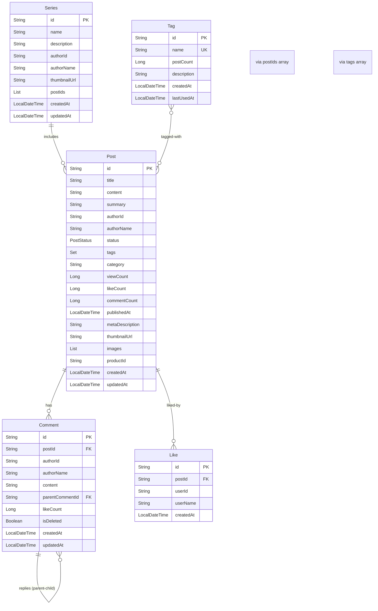

# Blog Service Database Schema

**Database**: MongoDB
**Last Updated**: 2026-02-06

> MongoDB Document 모델이지만 관계를 나타내기 위해 ERD 형식으로 표현합니다.

## ERD



## Collections

| Collection | 설명 | 주요 필드 |
|--------|------|----------|
| posts | 블로그 게시물 | id, title, content, authorId, status, tags, category |
| comments | 댓글 및 대댓글 | id, postId, authorId, content, parentCommentId |
| series | 시리즈 (연재물) | id, name, authorId, postIds (배열) |
| tags | 태그 | id, name, postCount |
| likes | 좋아요 | id, postId, userId |

## Relationships

### 게시물과 댓글
- Post 1:N Comment: 게시물당 여러 댓글
- Comment 1:N Comment: 대댓글 구조 (parentCommentId)

### 게시물과 좋아요
- Post 1:N Like: 게시물당 여러 좋아요
- (postId, userId) 복합 인덱스로 중복 방지

### 시리즈
- Series → Post: postIds 배열로 관계 표현
- 배열 인덱스가 시리즈 내 순서

### 태그
- Post → Tag: tags 배열 (비정규화)
- Tag.postCount: 역정규화로 인기 태그 빠른 조회

## 주요 특징

### 1. Document 기반 설계
- **Embedded vs Reference**:
  - Comment는 별도 컬렉션 (대댓글 구조)
  - tags는 Post 내부에 배열로 저장
  - postIds는 Series 내부에 배열로 저장

### 2. 역정규화 전략
- **Post.likeCount**: Like 컬렉션 집계 대신 캐시
- **Post.commentCount**: Comment 컬렉션 집계 대신 캐시
- **Tag.postCount**: 인기 태그 정렬용

### 3. 전문 검색
- **Text Index**: title, content 필드
- 한글 검색 최적화

### 4. 상태 관리
- **PostStatus**: DRAFT, PUBLISHED
- publishedAt: 발행 시점 기록

### 5. 대댓글 구조
- **parentCommentId**: null이면 루트 댓글
- 무제한 depth 가능

### 6. Soft Delete
- **Comment.isDeleted**: 물리적 삭제 대신 플래그

## Indexes

### 성능 최적화
```javascript
// posts 컬렉션
db.posts.createIndex({ title: "text", content: "text" })  // 전문 검색
db.posts.createIndex({ authorId: 1 })                      // 작성자별 조회
db.posts.createIndex({ status: 1, publishedAt: -1 })      // 발행 글 목록
db.posts.createIndex({ tags: 1 })                          // 태그별 조회
db.posts.createIndex({ category: 1 })                      // 카테고리별 조회

// comments 컬렉션
db.comments.createIndex({ postId: 1, createdAt: 1 })      // 게시물별 댓글 조회
db.comments.createIndex({ authorId: 1 })                   // 작성자별 댓글
db.comments.createIndex({ parentCommentId: 1 })            // 대댓글 조회

// likes 컬렉션
db.likes.createIndex({ postId: 1, userId: 1 }, { unique: true })  // 중복 좋아요 방지
db.likes.createIndex({ postId: 1 })                        // 게시물별 좋아요 목록
db.likes.createIndex({ userId: 1 })                        // 사용자별 좋아요 목록

// tags 컬렉션
db.tags.createIndex({ name: 1 }, { unique: true })        // 태그명 고유
db.tags.createIndex({ postCount: -1 })                     // 인기 태그 정렬

// series 컬렉션
db.series.createIndex({ authorId: 1 })                     // 작성자별 시리즈
```

## Document 예시

### Post 문서
```json
{
  "_id": "65a1b2c3d4e5f6789abcdef0",
  "title": "Vue 3 완벽 가이드",
  "content": "Vue 3의 Composition API를...",
  "summary": "Vue 3의 주요 기능을 다룹니다",
  "authorId": "user-uuid-123",
  "authorName": "홍길동",
  "status": "PUBLISHED",
  "tags": ["Vue.js", "Frontend", "JavaScript"],
  "category": "프론트엔드",
  "viewCount": 1234,
  "likeCount": 56,
  "commentCount": 12,
  "publishedAt": ISODate("2026-02-01T10:00:00Z"),
  "metaDescription": "Vue 3의 주요 기능과 Composition API...",
  "thumbnailUrl": "https://s3.../thumbnail.jpg",
  "images": ["https://s3.../image1.jpg", "https://s3.../image2.jpg"],
  "createdAt": ISODate("2026-02-01T09:00:00Z"),
  "updatedAt": ISODate("2026-02-01T10:00:00Z")
}
```

### Comment 문서
```json
{
  "_id": "65a1b2c3d4e5f6789abcdef1",
  "postId": "65a1b2c3d4e5f6789abcdef0",
  "authorId": "user-uuid-456",
  "authorName": "김철수",
  "content": "유용한 정보 감사합니다!",
  "parentCommentId": null,  // 루트 댓글
  "likeCount": 3,
  "isDeleted": false,
  "createdAt": ISODate("2026-02-01T11:00:00Z"),
  "updatedAt": ISODate("2026-02-01T11:00:00Z")
}
```

### Series 문서
```json
{
  "_id": "65a1b2c3d4e5f6789abcdef2",
  "name": "Vue 3 완벽 마스터",
  "description": "Vue 3를 처음부터 끝까지 다루는 시리즈",
  "authorId": "user-uuid-123",
  "authorName": "홍길동",
  "thumbnailUrl": "https://s3.../series-thumbnail.jpg",
  "postIds": [
    "65a1b2c3d4e5f6789abcdef0",  // 1편
    "65a1b2c3d4e5f6789abcdef3",  // 2편
    "65a1b2c3d4e5f6789abcdef4"   // 3편
  ],
  "createdAt": ISODate("2026-02-01T09:00:00Z"),
  "updatedAt": ISODate("2026-02-05T10:00:00Z")
}
```

### Tag 문서
```json
{
  "_id": "65a1b2c3d4e5f6789abcdef5",
  "name": "vue.js",  // 정규화된 소문자
  "postCount": 42,
  "description": "Vue.js 프레임워크 관련 글",
  "createdAt": ISODate("2026-01-01T00:00:00Z"),
  "lastUsedAt": ISODate("2026-02-01T10:00:00Z")
}
```

## Business Rules

### 게시물 발행
1. DRAFT 상태로 작성
2. publish() 호출 시 PUBLISHED 상태로 전환
3. publishedAt 자동 설정

### 댓글 작성
- 대댓글은 parentCommentId 설정
- 삭제 시 isDeleted=true (Soft Delete)
- 댓글 작성 시 Post.commentCount 증가

### 좋아요
- (postId, userId) 중복 방지
- 좋아요 추가 시 Post.likeCount 증가
- 좋아요 취소 시 Post.likeCount 감소

### 태그 관리
- 태그명은 소문자로 정규화
- Post에 태그 추가 시 Tag.postCount 증가
- 사용되지 않는 태그 (postCount=0) 자동 정리 가능

### 시리즈
- postIds 배열로 순서 관리
- 시리즈에서 Post 제거 시 배열에서 삭제
- 순서 변경은 배열 재정렬

## MongoDB 최적화

### Aggregation Pipeline 활용
```javascript
// 인기 게시물 (조회수 + 좋아요 기반)
db.posts.aggregate([
  { $match: { status: "PUBLISHED" } },
  { $addFields: {
      score: { $add: ["$viewCount", { $multiply: ["$likeCount", 2] }] }
  }},
  { $sort: { score: -1 } },
  { $limit: 10 }
])

// 카테고리별 통계
db.posts.aggregate([
  { $match: { status: "PUBLISHED" } },
  { $group: {
      _id: "$category",
      count: { $sum: 1 },
      totalViews: { $sum: "$viewCount" }
  }}
])
```

### Change Streams (실시간 동기화)
```javascript
// 게시물 변경 감지
const changeStream = db.posts.watch([
  { $match: { "operationType": "update" } }
])
```
