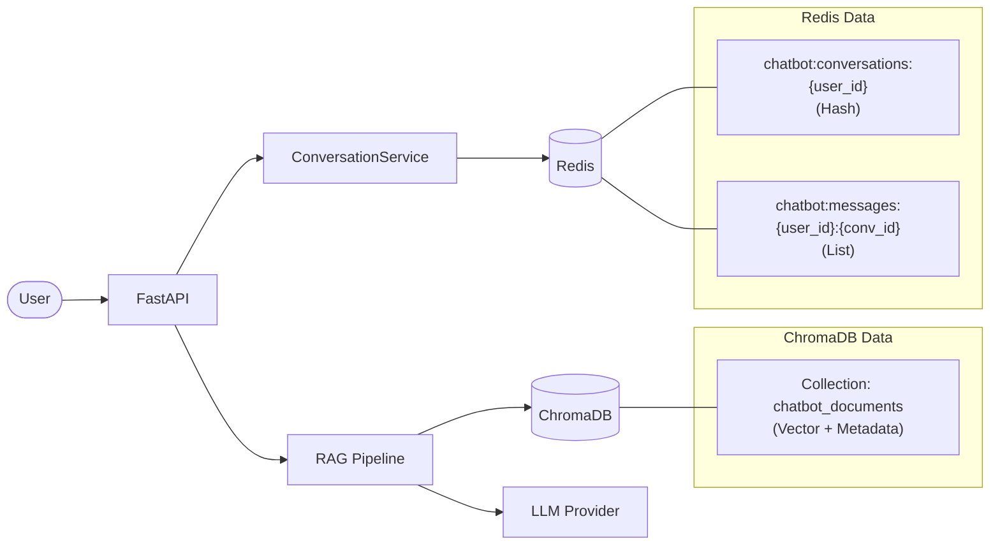

# Chatbot Service Data Store Schema

**Data Stores**: Redis + ChromaDB (Vector DB)
**Framework**: FastAPI + LangChain
**Last Updated**: 2026-02-06

> Chatbot Service는 전통적인 RDBMS를 사용하지 않습니다.
> 대화 이력은 Redis, 문서 임베딩은 ChromaDB에 저장합니다.

## Data Store Overview

| Store | 용도 | 데이터 유형 |
|-------|------|-----------|
| Redis | 대화 이력, 세션 관리 | Hash, List |
| ChromaDB | 문서 임베딩, 유사 검색 (RAG) | Vector + Metadata |

## Data Flow



## Redis Data Model

### Conversation 목록
- **Key Pattern**: `chatbot:conversations:{user_id}`
- **Type**: Hash
- **TTL**: 7일 (604800초)

| Hash Field | Value (JSON) | 설명 |
|------------|-------------|------|
| `{conversation_id}` | `{"conversation_id", "title", "message_count", "created_at", "updated_at"}` | 대화 세션 메타데이터 |

```json
{
  "conversation_id": "uuid-string",
  "title": "첫 번째 사용자 메시지 50자",
  "message_count": 5,
  "created_at": "2026-02-06T12:00:00+00:00",
  "updated_at": "2026-02-06T12:05:00+00:00"
}
```

### Message 목록
- **Key Pattern**: `chatbot:messages:{user_id}:{conversation_id}`
- **Type**: List (RPUSH로 시간순 추가)
- **TTL**: 7일 (604800초)

| List Element | Value (JSON) | 설명 |
|-------------|-------------|------|
| 각 원소 | `{"message_id", "role", "content", "sources", "created_at"}` | 개별 메시지 |

```json
{
  "message_id": "uuid-string",
  "role": "user",
  "content": "메시지 내용",
  "sources": [
    {"document": "file.md", "chunk": "관련 텍스트", "relevance_score": 0.85}
  ],
  "created_at": "2026-02-06T12:00:00+00:00"
}
```

### Redis 운영 특성
- **TTL 자동 만료**: 대화/메시지 모두 7일 후 자동 삭제
- **사용자 격리**: Key에 `user_id` 포함하여 사용자별 데이터 분리
- **역직렬화**: `decode_responses=True`로 문자열 자동 디코딩
- **Lazy Connection**: 첫 요청 시 Redis 연결 생성

## ChromaDB Data Model

### Collection: `chatbot_documents`
- **Persist Directory**: `./data/chroma`
- **Embedding**: 설정 가능 (기본: Ollama `nomic-embed-text`)

| Field | Type | 설명 |
|-------|------|------|
| id | string | 청크별 고유 ID (자동 생성) |
| embedding | vector | 텍스트 임베딩 벡터 |
| document | string | 원본 텍스트 청크 |
| metadata | object | `source`, 기타 메타데이터 |

### RAG 검색 파라미터

| 파라미터 | 기본값 | 설명 |
|---------|--------|------|
| `rag_top_k` | 5 | 검색할 최대 문서 수 |
| `rag_score_threshold` | 0.7 | 최소 유사도 점수 |
| `rag_chunk_size` | 1000 | 문서 청크 크기 (문자) |
| `rag_chunk_overlap` | 200 | 청크 간 겹침 (문자) |

### ChromaDB 운영 특성
- **Persist Mode**: 디스크 영속화 (`./data/chroma`)
- **유사도 검색**: `similarity_search_with_relevance_scores`
- **Score Filtering**: threshold 미만 결과 자동 제외
- **소스별 삭제**: `where={"source": source}` 필터로 특정 문서의 모든 청크 삭제 가능

## Pydantic Models (Runtime)

### Domain Models (`app/models/conversation.py`)

| Model | 필드 | 설명 |
|-------|------|------|
| Message | message_id, role, content, sources, created_at | 단일 메시지 |
| Conversation | conversation_id, user_id, title, messages, message_count, created_at, updated_at | 대화 세션 |

### API Schemas (`app/schemas/`)

| Schema | 용도 |
|--------|------|
| ChatRequest | 채팅 요청 (message, conversation_id) |
| ChatResponse | 채팅 응답 (answer, sources, conversation_id, message_id) |
| SourceInfo | RAG 소스 정보 (document, chunk, relevance_score) |
| ConversationSummary | 대화 목록 조회 응답 |
| ConversationMessage | 대화 내 메시지 조회 응답 |
| DocumentInfo | 업로드 문서 메타데이터 (document_id, filename, chunks, status) |
| ApiResponse[T] | 통일 응답 형식 (Java 서비스 호환) |

## 설정 (`app/core/config.py`)

| 설정 | 환경변수 | 기본값 | 설명 |
|------|---------|--------|------|
| `service_port` | SERVICE_PORT | 8086 | 서비스 포트 |
| `ai_provider` | AI_PROVIDER | ollama | AI 제공자 |
| `ai_model` | AI_MODEL | llama3 | LLM 모델 |
| `embedding_provider` | EMBEDDING_PROVIDER | ollama | 임베딩 제공자 |
| `embedding_model` | EMBEDDING_MODEL | nomic-embed-text | 임베딩 모델 |
| `vector_db_type` | VECTOR_DB_TYPE | chroma | 벡터 DB 종류 |
| `chroma_persist_dir` | CHROMA_PERSIST_DIR | ./data/chroma | ChromaDB 저장 경로 |
| `redis_url` | REDIS_URL | redis://localhost:6379/1 | Redis 접속 URL |
| `rag_chunk_size` | RAG_CHUNK_SIZE | 1000 | 청크 크기 |
| `rag_chunk_overlap` | RAG_CHUNK_OVERLAP | 200 | 청크 겹침 |
| `rag_top_k` | RAG_TOP_K | 5 | 검색 상위 K개 |
| `rag_score_threshold` | RAG_SCORE_THRESHOLD | 0.7 | 최소 유사도 |

## Business Rules

### 대화 관리
1. 새 대화 시작: `conversation_id` 없이 요청 → 서버에서 UUID 생성
2. 기존 대화 계속: `conversation_id` 포함 요청
3. 대화 제목: 첫 번째 사용자 메시지의 앞 50자로 자동 설정
4. 대화 만료: 7일간 활동 없으면 자동 삭제 (Redis TTL)

### RAG Pipeline
1. 문서 업로드 → 청크 분할 (1000자, 200자 겹침)
2. 청크별 임베딩 생성 → ChromaDB 저장
3. 사용자 질문 → 유사 문서 검색 (top_k=5, threshold=0.7)
4. 검색 결과 + 질문 → LLM에 컨텍스트 전달 → 응답 생성

### 응답 형식
- Java 서비스와 호환되는 `ApiResponse` wrapper 사용
- `success: true/false`, `data`, `error` 구조

## 관련 문서

- [ERD Overview](./erd-overview.md)
- [Chatbot Service Architecture](../chatbot-service/)
