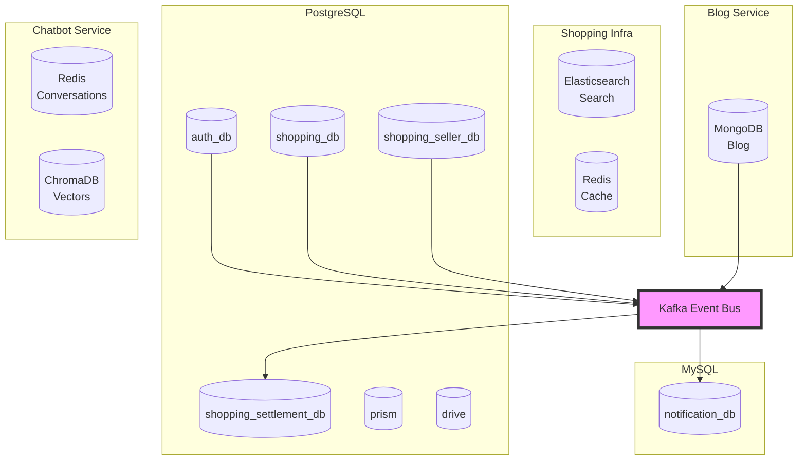

# Database ERD Overview

**Last Updated**: 2026-02-18

Portal Universe는 마이크로서비스 아키텍처로 각 서비스가 독립적인 데이터베이스를 운영합니다.

## Service Database Summary

| Service | Database | Entity 수 | Purpose | ERD 링크 |
|---------|----------|----------|---------|----------|
| **Auth Service** | PostgreSQL (auth_db) | 16 | 인증/인가 (사용자, 역할, 권한, 멤버십) | [auth-service-schema.md](./auth-service-schema.md) |
| **Shopping Service** | PostgreSQL (shopping_db) + Elasticsearch + Redis | 11 (10 JPA + 1 ES) | 쇼핑몰 Buyer (장바구니, 주문, 결제, 배송) | [shopping-service-schema.md](./shopping-service-schema.md) |
| **Shopping Seller Service** | PostgreSQL (shopping_seller_db) + Redis | 11 | 쇼핑몰 Seller (판매자, 상품, 재고, 쿠폰, 타임딜) | [shopping-seller-service-schema.md](./shopping-seller-service-schema.md) |
| **Shopping Settlement Service** | PostgreSQL (shopping_settlement_db) | 4 | 정산 (정산 주기, 판매자별 정산, 원장) | [shopping-settlement-service-schema.md](./shopping-settlement-service-schema.md) |
| **Blog Service** | MongoDB 7.0 | 5 컬렉션 | 블로그 (게시물, 댓글, 시리즈, 태그) | [blog-service-schema.md](./blog-service-schema.md) |
| **Notification Service** | MySQL 8.0 (notification_db) | 1 | 알림 (실시간 푸시, WebSocket) | [notification-service-schema.md](./notification-service-schema.md) |
| **Prism Service** | PostgreSQL (prism) | 5 | AI 에이전트 (Provider, Agent, Board, Task, Execution) | [prism-service-schema.md](./prism-service-schema.md) |
| **Drive Service** | PostgreSQL (drive) | - | 파일 관리 (S3 + 메타데이터) | - |
| **Chatbot Service** | Redis + ChromaDB | - | 대화 이력 (Redis) + RAG 벡터 검색 (ChromaDB) | [chatbot-service-schema.md](./chatbot-service-schema.md) |
| **API Gateway** | - | - | 라우팅 전용 (DB 없음) | - |

## Architecture Overview



## Database 선택 근거

### PostgreSQL (Auth, Shopping, Seller, Settlement, Prism, Drive)
- **ACID 보장**: 주문/결제/인증/정산 트랜잭션 중요
- **관계형 모델**: 복잡한 조인 쿼리 필요
- **JSONB 지원**: AI Provider 모델 목록 등 비정규 데이터
- **Trigger 지원**: `updated_at` 자동 갱신 (MySQL ON UPDATE CURRENT_TIMESTAMP 대체)
- **표준 SQL**: Spring Data JPA 완벽 지원
- **마이그레이션 (ADR-046)**: MySQL 랜섬웨어 공격 후 보안 강화를 위해 PostgreSQL로 전환

### MySQL (Notification)
- **기존 유지**: notification-service만 MySQL 유지 (ADR-046)
- **단순 스키마**: 1개 테이블, 마이그레이션 비용 대비 이점 없음

### MongoDB (Blog)
- **유연한 스키마**: 게시물 구조 변경 용이
- **Document 모델**: 게시물 + 태그 + 이미지 등 계층 구조
- **전문 검색**: Text Index로 한글 검색 최적화
- **빠른 읽기**: 조회 중심 워크로드

### Redis (Shopping Cache, Chatbot Conversations)
- **Shopping**: 대기열 관리, 세션 캐시
- **Chatbot**: 대화 이력 저장 (Hash + List), 7일 TTL 자동 만료
- **고성능**: 인메모리 읽기/쓰기로 실시간 처리

### Elasticsearch (Shopping Search)
- **상품 검색**: ProductDocument 인덱싱
- **전문 검색**: 상품명, 설명 기반 검색
- **실시간 동기화**: Product 변경 시 ES 문서 업데이트

### ChromaDB (Chatbot RAG)
- **벡터 저장**: 문서 임베딩 영속화
- **유사 검색**: RAG 파이프라인용 similarity search
- **Persist Mode**: 디스크 영속화 (`./data/chroma`)

## 서비스 간 데이터 참조

### 원칙
- **No Direct DB Access**: 서비스 간 직접 DB 접근 금지
- **API/Event 통신**: REST API 또는 Kafka 이벤트로 통신
- **ID 참조만 저장**: 타 서비스 엔티티의 ID만 저장 (Foreign Key 없음)

### 예시

#### Shopping Service → Auth Service
```java
// Shopping Service: Order 엔티티
@Column(name = "user_id")
private String userId;  // Auth Service의 User UUID 참조

// 사용자 정보 조회: Feign Client 사용
@FeignClient(name = "auth-service")
public interface AuthClient {
    @GetMapping("/api/v1/users/{userId}")
    UserResponse getUser(@PathVariable String userId);
}
```

#### Shopping Service → Shopping Seller Service
```java
// Saga에서 Feign Client로 재고 관리
@FeignClient(name = "shopping-seller-service")
public interface SellerInventoryClient {
    @PostMapping("/internal/inventory/reserve")
    void reserve(@RequestBody ReserveRequest request);
}
```

#### Settlement Service ← Kafka Events
```yaml
# Order 완료/환불 → Settlement 원장 수집
Shopping Service:
  - Order 완료 이벤트 발행
  - Kafka "order-events" 토픽

Settlement Service:
  - Kafka "order-events" 구독
  - settlement_ledger에 원장 기록
  - Spring Batch로 주기적 정산 실행
```

## 주요 Entity 개수

### Auth Service (PostgreSQL)
- **16개 테이블**:
  - 사용자: `users`, `user_profiles`, `social_accounts`, `follows`, `password_histories`
  - RBAC: `roles`, `permissions`, `user_roles`, `role_permissions`, `role_includes`, `role_default_memberships`
  - 멤버십: `membership_tiers`, `user_memberships`, `membership_tier_permissions`
  - 감사: `auth_audit_logs`
  - 판매자: `seller_applications`

### Shopping Service (PostgreSQL + Elasticsearch + Redis)
- **11개 (10 JPA + 1 ES)**:
  - 주문: `orders`, `order_items`, `saga_states`
  - 결제: `payments`
  - 배송: `deliveries`, `delivery_histories`
  - 장바구니: `carts`, `cart_items`
  - 쿠폰/딜: `user_coupons`, `time_deal_purchases`, `queue_entries`
  - 검색: `ProductDocument` (Elasticsearch)

### Shopping Seller Service (PostgreSQL + Redis)
- **11개 테이블**:
  - 판매자: `sellers`
  - 상품: `products`, `product_images`
  - 재고: `inventory`, `stock_movements`
  - 쿠폰: `coupons`
  - 타임딜: `time_deals`, `time_deal_products`
  - 대기열: `waiting_queues`, `queue_entries`

### Shopping Settlement Service (PostgreSQL)
- **4개 테이블**:
  - 정산: `settlement_periods`, `settlements`, `settlement_details`
  - 원장: `settlement_ledger`

### Blog Service (MongoDB)
- **5개 컬렉션**:
  - `posts`, `comments`, `series`, `tags`, `likes`

### Notification Service (MySQL)
- **1개 테이블**:
  - `notifications`

### Prism Service (PostgreSQL)
- **5개 테이블**:
  - AI: `ai_providers`, `agents`
  - 보드: `boards`, `tasks`
  - 실행: `executions`

### Chatbot Service (Redis + ChromaDB)
- **Redis**: 대화 이력 (Hash + List)
  - `chatbot:conversations:{user_id}` (대화 목록)
  - `chatbot:messages:{user_id}:{conversation_id}` (메시지)
- **ChromaDB**: 문서 임베딩
  - Collection: `chatbot_documents`

## 데이터 일관성 전략

### 1. 이벤트 기반 비동기 동기화
```
Shopping: Order 생성
  → Kafka: "order-events"
    → Notification: 알림 생성
    → Settlement: 원장 기록
```

### 2. Saga Pattern (분산 트랜잭션)
```
Order 생성 Saga:
1. 재고 예약 (Feign → Seller Service: Inventory.reserve)
2. 결제 처리 (Payment.process)
3. 재고 차감 (Feign → Seller Service: Inventory.deduct)
4. 배송 생성 (Delivery.create)

실패 시 보상 트랜잭션:
- 재고 해제 (Feign → Seller Service: Inventory.release)
- 결제 취소 (Payment.cancel)
```

### 3. 비정규화 (캐싱)
```javascript
// Post에 authorUsername, authorNickname 캐싱
{
  authorId: "user-uuid-123",
  authorUsername: "gildong",
  authorNickname: "홍길동"  // Auth Service에서 가져와 저장
}

// 장점: 매번 Auth Service 호출 불필요
// 단점: User 이름 변경 시 수동 동기화 필요
```

## 인덱싱 전략

### 복합 인덱스
```sql
-- Shopping Service
CREATE INDEX idx_order_user_status ON orders(user_id, status);
CREATE INDEX idx_cart_user_status ON carts(user_id, status);

-- Auth Service
CREATE INDEX idx_follow_follower_id ON follows(follower_id);
CREATE INDEX idx_follow_following_id ON follows(following_id);

-- Notification Service
CREATE INDEX idx_notification_user_status ON notifications(user_id, status);
```

### Unique 제약
```sql
-- 중복 방지
CREATE UNIQUE INDEX uk_coupon_code ON coupons(code);
CREATE UNIQUE INDEX uk_inventory_product ON inventory(product_id);
CREATE UNIQUE INDEX uk_follow_relationship ON follows(follower_id, following_id);
```

## 백업 및 복구

### RDB (PostgreSQL/MySQL)
- **일일 풀 백업**: 매일 02:00 AM
- **증분 백업**: 4시간마다
- **WAL/Binary Log**: 7일 보관
- **Point-in-Time Recovery**: 가능

### MongoDB
- **Replica Set**: 3노드 구성
- **Oplog**: 24시간 보관
- **mongodump**: 매일 백업
- **Atlas Backup**: 프로덕션 환경

## 모니터링

### Metrics
- **Connection Pool**: HikariCP 메트릭
- **Query Performance**: Slow Query Log
- **Replication Lag**: MongoDB Replica Set 지연
- **Disk Usage**: 임계값 알림

### Tools
- **Prometheus + Grafana**: 메트릭 시각화
- **Spring Actuator**: JPA 통계
- **MongoDB Compass**: 쿼리 분석

## 마이그레이션 전략

### Flyway (RDB)
```
services/{service}/src/main/resources/db/migration/
  V1__init.sql    # 통합 초기 스키마 (PostgreSQL)
```

> **ADR-046 (2026-02-18)**: MySQL → PostgreSQL 전환 시 각 서비스의 V1~Vn 마이그레이션을 최종 상태의 `V1__init.sql` 하나로 통합.
> `updated_at` 자동 갱신은 PostgreSQL Trigger 함수 `update_updated_at_column()`로 처리.

### Mongock (MongoDB)
```java
@ChangeSet(order = "001", id = "init-collections", author = "admin")
public void initCollections(MongoDatabase db) {
    db.createCollection("posts");
    db.createCollection("comments");
}
```

## 참고 자료

- [ADR-046: MySQL to PostgreSQL Migration](../../adr/ADR-046-mysql-to-postgresql-migration.md)
- [Spring Data JPA Best Practices](https://spring.io/guides/gs/accessing-data-jpa/)
- [MongoDB Schema Design](https://www.mongodb.com/docs/manual/core/data-model-design/)
- [Microservices Data Patterns](https://microservices.io/patterns/data/)
- [Saga Pattern](https://microservices.io/patterns/data/saga.html)

## 다음 단계

- [x] Prism Service ERD 작성 (PostgreSQL)
- [x] Chatbot Service Data Store 작성 (Redis + ChromaDB)
- [x] Shopping Seller Service ERD 작성 (PostgreSQL)
- [x] Shopping Settlement Service ERD 작성 (PostgreSQL)
- [ ] 서비스별 샘플 데이터 생성 스크립트
- [ ] 데이터베이스 성능 테스트
- [ ] 백업 자동화 스크립트
