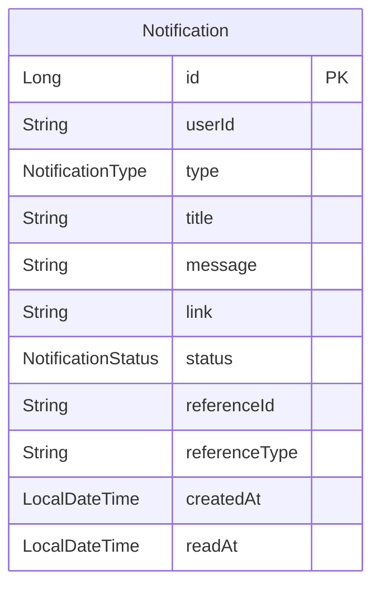

# Notification Service Database Schema

**Database**: MySQL
**Last Updated**: 2026-02-06

## ERD



## Entities

| Entity | 설명 | 주요 필드 |
|--------|------|----------|
| Notification | 사용자 알림 | id, userId, type, title, message, status, referenceId |

## 주요 필드 설명

### userId
- 알림을 받을 사용자 ID (auth-service의 User UUID)

### type (NotificationType)
- 알림 유형:
  - `ORDER_PLACED`: 주문 완료
  - `ORDER_SHIPPED`: 배송 시작
  - `ORDER_DELIVERED`: 배송 완료
  - `PAYMENT_COMPLETED`: 결제 완료
  - `COMMENT_ADDED`: 댓글 작성
  - `POST_LIKED`: 게시물 좋아요
  - `FOLLOW_NEW`: 새 팔로워
  - `COUPON_ISSUED`: 쿠폰 발급
  - `SYSTEM_NOTICE`: 시스템 공지

### status (NotificationStatus)
- `UNREAD`: 읽지 않음 (기본값)
- `READ`: 읽음

### referenceId, referenceType
- 알림 관련 엔티티 참조
- 예:
  - referenceType="ORDER", referenceId="ORD-20260206-XXXXX"
  - referenceType="POST", referenceId="65a1b2c3d4e5f6789abcdef0"
  - referenceType="COMMENT", referenceId="65a1b2c3d4e5f6789abcdef1"

### link
- 알림 클릭 시 이동할 URL
- 예: `/orders/ORD-20260206-XXXXX`, `/blog/posts/65a1b2c3d4e5f6789abcdef0`

## Indexes

### 성능 최적화
- `idx_notification_user_status`: 사용자별 읽지 않은 알림 조회
  ```sql
  (user_id, status)
  ```
- `idx_notification_user_created`: 사용자별 최근 알림 목록
  ```sql
  (user_id, created_at DESC)
  ```
- `idx_notification_ref`: 참조 엔티티별 알림 조회
  ```sql
  (reference_id, reference_type, user_id)
  ```

## 주요 특징

### 1. Kafka 이벤트 기반
- 다른 서비스에서 Kafka로 이벤트 발행
- Notification Service가 이벤트 구독하여 알림 생성

### 2. 실시간 푸시
- **WebSocket**: 실시간 알림 전송
- **Redis Pub/Sub**: 다중 인스턴스 간 메시지 전달

### 3. 알림 타입별 템플릿
```java
// 주문 완료 알림
{
  "type": "ORDER_PLACED",
  "title": "주문이 완료되었습니다",
  "message": "주문번호 ORD-20260206-XXXXX의 결제가 완료되었습니다.",
  "link": "/orders/ORD-20260206-XXXXX"
}

// 댓글 알림
{
  "type": "COMMENT_ADDED",
  "title": "새 댓글이 작성되었습니다",
  "message": "김철수님이 'Vue 3 완벽 가이드'에 댓글을 작성했습니다.",
  "link": "/blog/posts/65a1b2c3d4e5f6789abcdef0#comment-123"
}
```

### 4. 읽음 처리
- 알림 클릭 시 `markAsRead()` 호출
- status: UNREAD → READ
- readAt 타임스탬프 기록

## Business Rules

### 알림 생성
1. 이벤트 수신 (Kafka)
2. 알림 타입별 메시지 생성
3. Notification 엔티티 저장
4. WebSocket/Redis로 실시간 푸시

### 알림 조회
- 사용자별 최근 알림 목록 (페이징)
- 읽지 않은 알림 개수 조회

### 알림 삭제
- Soft Delete 대신 물리적 삭제
- 오래된 알림 자동 삭제 (배치)

## Kafka Topics 연동

### Consumers
```yaml
# application.yml
spring:
  kafka:
    consumer:
      group-id: notification-service
      topics:
        - order-events          # 주문 이벤트
        - payment-events        # 결제 이벤트
        - blog-events           # 블로그 이벤트
        - auth-events           # 인증 이벤트 (팔로우 등)
```

### 이벤트 예시
```json
// order-events 토픽
{
  "eventType": "ORDER_PLACED",
  "userId": "user-uuid-123",
  "orderId": "ORD-20260206-XXXXX",
  "orderNumber": "ORD-20260206-XXXXX",
  "totalAmount": 50000,
  "timestamp": "2026-02-06T10:00:00Z"
}

// blog-events 토픽
{
  "eventType": "COMMENT_ADDED",
  "postId": "65a1b2c3d4e5f6789abcdef0",
  "postTitle": "Vue 3 완벽 가이드",
  "postAuthorId": "user-uuid-123",  // 알림 받을 사용자
  "commentAuthorId": "user-uuid-456",
  "commentAuthorName": "김철수",
  "commentId": "65a1b2c3d4e5f6789abcdef1",
  "timestamp": "2026-02-06T11:00:00Z"
}
```

## WebSocket 실시간 알림

### Endpoint
```
ws://localhost:8084/notifications
```

### 메시지 형식
```json
{
  "type": "NEW_NOTIFICATION",
  "notification": {
    "id": 123,
    "type": "ORDER_PLACED",
    "title": "주문이 완료되었습니다",
    "message": "주문번호 ORD-20260206-XXXXX의 결제가 완료되었습니다.",
    "link": "/orders/ORD-20260206-XXXXX",
    "createdAt": "2026-02-06T10:00:00Z"
  }
}
```

### Redis Pub/Sub (Multi-Instance)
```
CHANNEL: notification:user:{userId}
MESSAGE: {notification JSON}
```

## API 엔드포인트

### 알림 조회
```
GET /api/v1/notifications
  ?page=0&size=20
  ?status=UNREAD
```

### 읽지 않은 알림 개수
```
GET /api/v1/notifications/unread-count
```

### 알림 읽음 처리
```
PATCH /api/v1/notifications/{id}/read
```

### 모든 알림 읽음 처리
```
PATCH /api/v1/notifications/read-all
```

### 알림 삭제
```
DELETE /api/v1/notifications/{id}
```

## 최적화 전략

### 1. 알림 배치 처리
- 동일 사용자에게 짧은 시간 내 여러 알림 발생 시 집계

### 2. 알림 우선순위
- CRITICAL: 결제 실패, 계정 보안
- HIGH: 주문 완료, 배송 시작
- NORMAL: 댓글, 좋아요
- LOW: 시스템 공지

### 3. 오래된 알림 삭제
```sql
-- 90일 이상 된 읽은 알림 삭제
DELETE FROM notifications
WHERE status = 'READ'
  AND read_at < DATE_SUB(NOW(), INTERVAL 90 DAY);
```

### 4. 캐싱
- Redis: 사용자별 읽지 않은 알림 개수 캐싱
```
KEY: notification:unread:{userId}
TTL: 60 seconds
```

## 향후 확장

### 푸시 알림 (FCM, APNS)
- 모바일 앱 지원 시 추가
- 디바이스 토큰 관리

### 이메일 알림
- 중요 알림은 이메일로도 전송
- 사용자 설정으로 On/Off

### 알림 설정
- 사용자별 알림 타입 On/Off
- 알림 수신 시간대 설정 (방해 금지)
