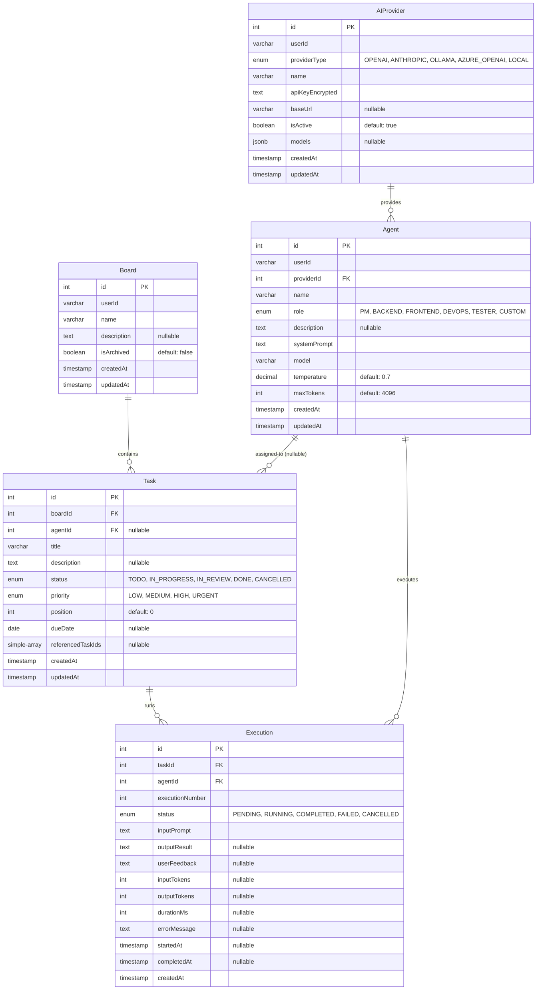

# Prism Service Database Schema

**Database**: PostgreSQL
**DB Name**: `prism`
**ORM**: TypeORM (`synchronize: true`, migration 미사용)
**Entity Count**: 5
**Last Updated**: 2026-02-06

## ERD

## Entities

| Entity | Table | 설명 | 주요 필드 |
|--------|-------|------|----------|
| AIProvider | ai_providers | AI 제공자 설정 | id, userId, providerType, name, apiKeyEncrypted, models(jsonb) |
| Agent | agents | AI 에이전트 정의 | id, userId, providerId, name, role, systemPrompt, model, temperature |
| Board | boards | 작업 보드 | id, userId, name, description, isArchived |
| Task | tasks | 작업 항목 | id, boardId, agentId, title, status, priority, position, dueDate |
| Execution | executions | 작업 실행 기록 | id, taskId, agentId, executionNumber, status, inputPrompt, outputResult |

## Relationships

### AI Provider - Agent
- AIProvider 1:N Agent: 하나의 AI 제공자에 여러 에이전트 설정 가능
- Agent는 반드시 하나의 AIProvider에 속함 (required)

### Board - Task
- Board 1:N Task: 보드는 여러 작업 항목을 포함
- Task는 반드시 하나의 Board에 속함 (required)

### Agent - Task
- Agent 1:N Task: 에이전트는 여러 작업에 할당 가능
- Task의 Agent 할당은 선택적 (nullable)

### Task/Agent - Execution
- Task 1:N Execution: 하나의 작업에 여러 실행 기록
- Agent 1:N Execution: 하나의 에이전트가 여러 실행 수행

## 주요 특징

### 1. 멀티유저 격리
- 모든 주요 엔티티(AIProvider, Agent, Board)에 `userId` 필드
- `@Index(['userId', 'id'])` 복합 인덱스로 사용자별 조회 최적화
- Task/Execution은 Board/Agent를 통해 간접적으로 userId 격리

### 2. JSONB 활용
- AIProvider의 `models` 필드: 지원 모델 목록을 JSONB로 저장
- 유연한 스키마로 제공자별 다양한 모델 구조 대응

### 3. Enum Types
- `ProviderType`: OPENAI, ANTHROPIC, OLLAMA, AZURE_OPENAI, LOCAL
- `AgentRole`: PM, BACKEND, FRONTEND, DEVOPS, TESTER, CUSTOM
- `TaskStatus`: TODO, IN_PROGRESS, IN_REVIEW, DONE, CANCELLED
- `TaskPriority`: LOW, MEDIUM, HIGH, URGENT
- `ExecutionStatus`: PENDING, RUNNING, COMPLETED, FAILED, CANCELLED

### 4. 토큰 사용량 추적
- Execution: `inputTokens`, `outputTokens`, `durationMs`로 비용/성능 모니터링
- `userFeedback`으로 실행 결과에 대한 피드백 수집

### 5. Auto-synchronize
- TypeORM `synchronize: true` 설정으로 엔티티 변경 시 스키마 자동 반영
- Migration 파일 미사용 (개발 단계)

## Indexes

| Index | Table | Columns | Type |
|-------|-------|---------|------|
| (userId, id) | ai_providers | user_id, id | Composite |
| (userId, id) | agents | user_id, id | Composite |
| (userId, id) | boards | user_id, id | Composite |
| (boardId, status) | tasks | board_id, status | Composite |

## Business Rules

### AI Provider 관리
- API Key는 암호화되어 `apiKeyEncrypted`에 저장
- `isActive=false` 시 해당 Provider의 Agent 실행 차단
- JSONB `models` 필드로 Provider별 사용 가능 모델 관리

### Agent 설정
- `systemPrompt`: 에이전트의 행동 지침 정의
- `temperature` (0.00~1.00): 응답의 창의성 수준
- `maxTokens`: 최대 응답 토큰 수 제한

### Task 관리
- `position` 필드로 보드 내 작업 순서 관리
- `referencedTaskIds`: 다른 Task 참조 (의존성 표현)
- Status flow: TODO → IN_PROGRESS → IN_REVIEW → DONE (또는 CANCELLED)

### Execution 추적
- `executionNumber`: 동일 Task 내 실행 순서
- Status flow: PENDING → RUNNING → COMPLETED/FAILED/CANCELLED
- 실패 시 `errorMessage`에 상세 오류 기록

## 관련 문서

- [ERD Overview](./erd-overview.md)
- [Prism Service Architecture](../prism-service/)
