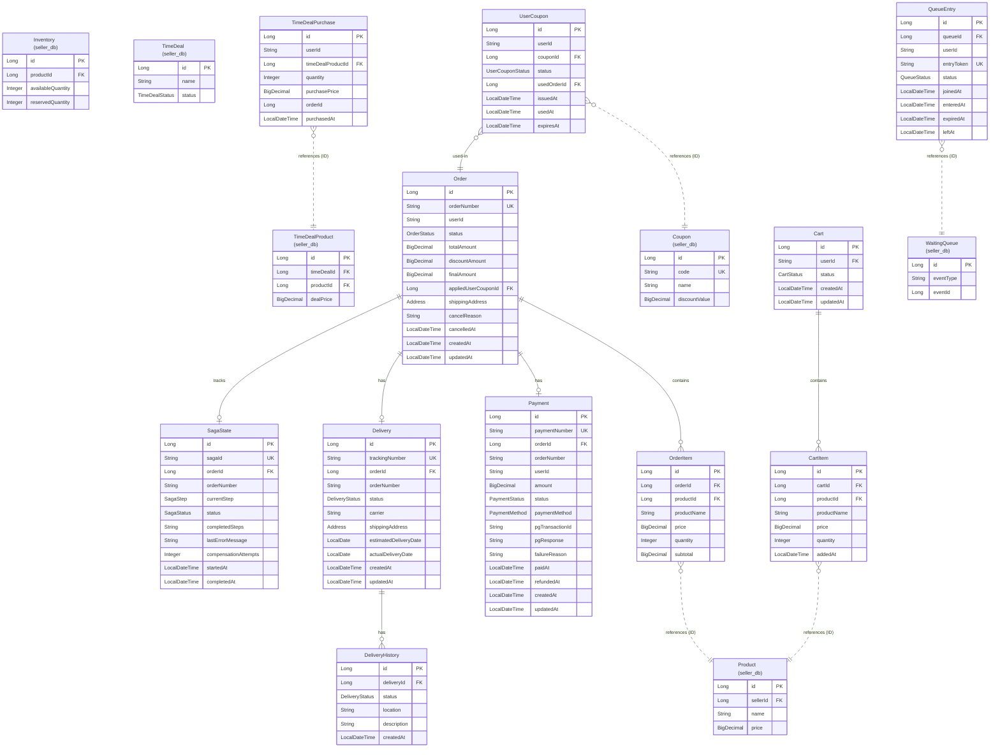

# Shopping Service Database Schema

**Database**: MySQL 8.0 (shopping_db) + Elasticsearch + Redis
**Entity Count**: 11 (10 JPA + 1 Elasticsearch Document)
**Last Updated**: 2026-02-14

> **서비스 분해 (2026-02-14)**: Product, Inventory, StockMovement, Seller는 `shopping_seller_db`로 이전되었습니다.
> Coupon, TimeDeal, WaitingQueue도 `shopping_seller_db`로 이전되었으며, 이 서비스에는 UserCoupon, TimeDealPurchase, QueueEntry만 유지됩니다.

## ERD

> **Note**: Product, Inventory, Coupon, TimeDeal, WaitingQueue는 `shopping_seller_db`에 있습니다. (점선으로 표시)

### Elasticsearch Document

| Document | Index | 설명 | 주요 필드 |
|----------|-------|------|----------|
| ProductDocument | (동적) | 상품 검색 인덱스 | id, name, description, price, stock |

> ProductDocument는 JPA 엔티티가 아닌 Elasticsearch 문서입니다. Product 엔티티에서 변환하여 색인합니다.

## Entities (shopping_db)

| Entity | 설명 | 주요 필드 | 위치 |
|--------|------|----------|------|
| Cart | 장바구니 | id, userId, status | shopping_db |
| CartItem | 장바구니 항목 | id, cartId, productId (참조만), quantity, price | shopping_db |
| Order | 주문 | id, orderNumber, userId, status, totalAmount, finalAmount | shopping_db |
| OrderItem | 주문 항목 | id, orderId, productId (참조만), quantity, subtotal | shopping_db |
| Payment | 결제 | id, paymentNumber, orderId, amount, status, paymentMethod | shopping_db |
| Delivery | 배송 | id, trackingNumber, orderId, status, carrier | shopping_db |
| DeliveryHistory | 배송 이력 | id, deliveryId, status, location | shopping_db |
| UserCoupon | 사용자 발급 쿠폰 | id, userId, couponId (참조만), status, usedOrderId | shopping_db |
| TimeDealPurchase | 타임딜 구매 기록 | id, userId, timeDealProductId (참조만), quantity, purchasePrice | shopping_db |
| QueueEntry | 대기열 엔트리 | id, queueId (참조만), userId, entryToken, status | shopping_db |
| SagaState | Saga 오케스트레이션 상태 | id, sagaId, orderId, currentStep, status | shopping_db |

## Entities (shopping_seller_db, 참조만)

| Entity | 설명 | 이전일 | 위치 |
|--------|------|--------|------|
| Product | 상품 정보 | 2026-02-14 | shopping_seller_db |
| Inventory | 재고 | 2026-02-14 | shopping_seller_db |
| StockMovement | 재고 이동 이력 | 2026-02-14 | shopping_seller_db |
| Coupon | 쿠폰 | 2026-02-14 | shopping_seller_db |
| TimeDeal | 타임딜 이벤트 | 2026-02-14 | shopping_seller_db |
| TimeDealProduct | 타임딜 상품 | 2026-02-14 | shopping_seller_db |
| WaitingQueue | 대기열 설정 | 2026-02-14 | shopping_seller_db |
| Seller | 판매자 | 2026-02-14 (신규) | shopping_seller_db |

## Relationships

### shopping_db 내부 관계

#### 주문 및 결제 플로우
- Cart 1:N CartItem: 장바구니는 여러 항목을 포함
- Order 1:N OrderItem: 주문은 여러 상품 항목을 포함
- Order 1:1 Payment: 주문당 하나의 결제
- Order 1:1 Delivery: 주문당 하나의 배송
- Order 1:1 SagaState: 주문당 하나의 Saga 실행 상태 추적

#### 쿠폰
- UserCoupon N:1 Order: 사용자 쿠폰은 주문에서 사용 (선택적)

#### 배송
- Delivery 1:N DeliveryHistory: 배송 상태 변경 이력 추적

### shopping_db -> shopping_seller_db 참조 (ID만)

- **CartItem.productId** → Product.id (seller_db): 상품 참조 (스냅샷 포함)
- **OrderItem.productId** → Product.id (seller_db): 주문 항목 상품 참조
- **UserCoupon.couponId** → Coupon.id (seller_db): 쿠폰 정의 참조
- **TimeDealPurchase.timeDealProductId** → TimeDealProduct.id (seller_db): 타임딜 상품 참조
- **QueueEntry.queueId** → WaitingQueue.id (seller_db): 대기열 설정 참조

> **FK 제거**: 서비스 분해 후 DB 간 FK는 제거되었으며, ID 참조만 유지합니다. 데이터 조회는 Feign Client 또는 Kafka 이벤트를 통해 수행합니다.

## 주요 특징

### 1. 재고 관리 (Feign Client)
- **shopping-seller-service 위임**: Inventory는 seller-service에서 관리
- **Saga에서 Feign 호출**: reserve/deduct/release API 호출
- **Circuit Breaker**: Resilience4j 적용, fallback: 에러 응답

### 2. Saga Pattern (Feign 기반)
- **SagaState**: 분산 트랜잭션 오케스트레이션
- 재고 예약 → 결제 → 재고 차감 → 배송 생성 단계별 추적
- 보상 트랜잭션 지원 (롤백)

### 3. 스냅샷 패턴
- **CartItem, OrderItem**: 상품 정보를 스냅샷으로 저장
- 상품 가격 변경 시에도 기존 주문/장바구니에 영향 없음

### 4. 이벤트 소싱
- **DeliveryHistory**: 배송 상태 변경 이력
- **StockMovement**: 재고 변경 이력
- 모든 변경 사항 추적 가능

## Indexes

### 성능 최적화
- `idx_cart_user_status`: 사용자별 활성 장바구니 조회
- `idx_order_number`: 주문 번호로 빠른 검색
- `idx_order_user_id`: 사용자별 주문 목록
- `idx_payment_order_id`: 주문별 결제 조회
- `idx_delivery_tracking_number`: 운송장 번호로 배송 조회
- `idx_inventory_product_id`: 상품별 재고 조회 (UK)
- `idx_stock_movement_reference`: 참조 타입/ID로 재고 이력 조회
- `idx_tdp_user_product`: 사용자-타임딜상품별 구매 조회
- `idx_queue_entry_queue_user`: 대기열-사용자별 조회
- `idx_queue_entry_token`: 엔트리 토큰으로 조회

## Business Rules

### 주문 프로세스
1. 장바구니에서 주문 생성 (PENDING)
2. 재고 예약 (Inventory.reserve)
3. 결제 처리 (Payment.COMPLETED)
4. 주문 확정 (Order.CONFIRMED → PAID)
5. 재고 차감 (Inventory.deduct)
6. 배송 생성 (Delivery.PREPARING)

### 주문 취소
- **취소 가능 상태**: PENDING, CONFIRMED
- 재고 예약 해제 (Feign: SellerInventoryClient.release)
- 결제 취소 처리

### 쿠폰 사용
- 최소 주문 금액 검증
- 할인 금액 계산 (고정/퍼센트)
- 최대 할인 금액 제한

## 변경 이력

| Date | Change | Author |
|------|--------|--------|
| 2026-02-14 | 서비스 분해: Product, Inventory, Coupon, TimeDeal, WaitingQueue를 shopping_seller_db로 이전 | Laze |
| 2026-02-06 | 초기 문서 작성 | Laze |
