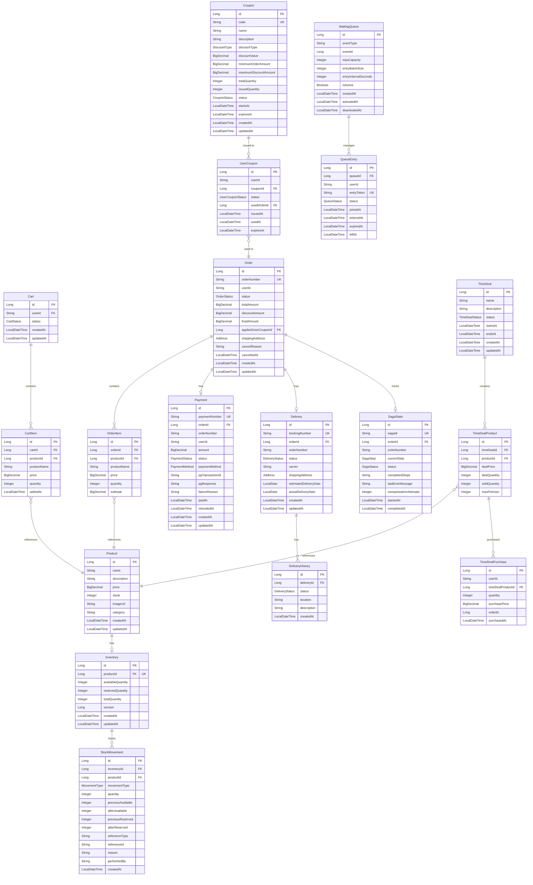

# Shopping Service Database Schema

**Database**: MySQL 8.0 + Elasticsearch + Redis
**Entity Count**: 19 (18 JPA + 1 Elasticsearch Document)
**Last Updated**: 2026-02-06

## ERD

### Elasticsearch Document

| Document | Index | 설명 | 주요 필드 |
|----------|-------|------|----------|
| ProductDocument | (동적) | 상품 검색 인덱스 | id, name, description, price, stock |

> ProductDocument는 JPA 엔티티가 아닌 Elasticsearch 문서입니다. Product 엔티티에서 변환하여 색인합니다.

## Entities

| Entity | 설명 | 주요 필드 |
|--------|------|----------|
| Product | 상품 정보 | id, name, price, stock, category |
| Cart | 장바구니 | id, userId, status |
| CartItem | 장바구니 항목 | id, cartId, productId, quantity, price |
| Order | 주문 | id, orderNumber, userId, status, totalAmount, finalAmount |
| OrderItem | 주문 항목 | id, orderId, productId, quantity, subtotal |
| Payment | 결제 | id, paymentNumber, orderId, amount, status, paymentMethod |
| Delivery | 배송 | id, trackingNumber, orderId, status, carrier |
| DeliveryHistory | 배송 이력 | id, deliveryId, status, location |
| Inventory | 재고 | id, productId, availableQuantity, reservedQuantity |
| StockMovement | 재고 이동 이력 | id, inventoryId, movementType, quantity |
| Coupon | 쿠폰 | id, code, discountType, discountValue, totalQuantity |
| UserCoupon | 사용자 발급 쿠폰 | id, userId, couponId, status, usedOrderId |
| TimeDeal | 타임딜 이벤트 | id, name, status, startsAt, endsAt |
| TimeDealProduct | 타임딜 상품 | id, timeDealId, productId, dealPrice, dealQuantity, soldQuantity, maxPerUser |
| TimeDealPurchase | 타임딜 구매 기록 | id, userId, timeDealProductId, quantity, purchasePrice |
| WaitingQueue | 대기열 설정 | id, eventType, eventId, maxCapacity, entryBatchSize, isActive |
| QueueEntry | 대기열 엔트리 | id, queueId, userId, entryToken, status |
| SagaState | Saga 오케스트레이션 상태 | id, sagaId, orderId, currentStep, status |

## Relationships

### 주문 및 결제 플로우
- Cart 1:N CartItem: 장바구니는 여러 항목을 포함
- Order 1:N OrderItem: 주문은 여러 상품 항목을 포함
- Order 1:1 Payment: 주문당 하나의 결제
- Order 1:1 Delivery: 주문당 하나의 배송
- Order 1:1 SagaState: 주문당 하나의 Saga 실행 상태 추적

### 상품 및 재고
- Product 1:1 Inventory: 상품당 하나의 재고 관리
- Inventory 1:N StockMovement: 재고 변경 이력 추적 (Audit Trail)
- CartItem N:1 Product: 장바구니 항목은 상품 참조 (스냅샷 포함)
- OrderItem N:1 Product: 주문 항목은 상품 참조 (스냅샷)

### 쿠폰
- Coupon 1:N UserCoupon: 쿠폰은 여러 사용자에게 발급
- UserCoupon N:1 Order: 사용자 쿠폰은 주문에서 사용 (선택적)

### 배송
- Delivery 1:N DeliveryHistory: 배송 상태 변경 이력 추적

### 타임딜
- TimeDeal 1:N TimeDealProduct: 타임딜 이벤트는 여러 상품을 포함
- TimeDealProduct N:1 Product: 타임딜 상품은 실제 상품 참조
- TimeDealProduct 1:N TimeDealPurchase: 타임딜 상품별 구매 기록

### 대기열
- WaitingQueue 1:N QueueEntry: 대기열 설정별 사용자 엔트리 관리
- WaitingQueue: eventType/eventId로 타임딜 등 이벤트와 논리적 연결

## 주요 특징

### 1. 재고 관리
- **Optimistic Lock** (`@Version`): 동시성 제어 (Inventory 엔티티의 `version` 필드)
- **Available/Reserved/Total**: 3단계 재고 상태 관리
- **StockMovement**: 모든 재고 변경 감사 추적

### 2. Saga Pattern
- **SagaState**: 분산 트랜잭션 오케스트레이션
- 재고 예약 → 결제 → 재고 차감 → 배송 생성 단계별 추적
- 보상 트랜잭션 지원 (롤백)

### 3. 스냅샷 패턴
- **CartItem, OrderItem**: 상품 정보를 스냅샷으로 저장
- 상품 가격 변경 시에도 기존 주문/장바구니에 영향 없음

### 4. 이벤트 소싱
- **DeliveryHistory**: 배송 상태 변경 이력
- **StockMovement**: 재고 변경 이력
- 모든 변경 사항 추적 가능

## Indexes

### 성능 최적화
- `idx_cart_user_status`: 사용자별 활성 장바구니 조회
- `idx_order_number`: 주문 번호로 빠른 검색
- `idx_order_user_id`: 사용자별 주문 목록
- `idx_payment_order_id`: 주문별 결제 조회
- `idx_delivery_tracking_number`: 운송장 번호로 배송 조회
- `idx_inventory_product_id`: 상품별 재고 조회 (UK)
- `idx_stock_movement_reference`: 참조 타입/ID로 재고 이력 조회
- `idx_tdp_user_product`: 사용자-타임딜상품별 구매 조회
- `idx_queue_entry_queue_user`: 대기열-사용자별 조회
- `idx_queue_entry_token`: 엔트리 토큰으로 조회

## Business Rules

### 주문 프로세스
1. 장바구니에서 주문 생성 (PENDING)
2. 재고 예약 (Inventory.reserve)
3. 결제 처리 (Payment.COMPLETED)
4. 주문 확정 (Order.CONFIRMED → PAID)
5. 재고 차감 (Inventory.deduct)
6. 배송 생성 (Delivery.PREPARING)

### 주문 취소
- **취소 가능 상태**: PENDING, CONFIRMED
- 재고 예약 해제 (Inventory.release)
- 결제 취소 처리

### 쿠폰 사용
- 최소 주문 금액 검증
- 할인 금액 계산 (고정/퍼센트)
- 최대 할인 금액 제한
