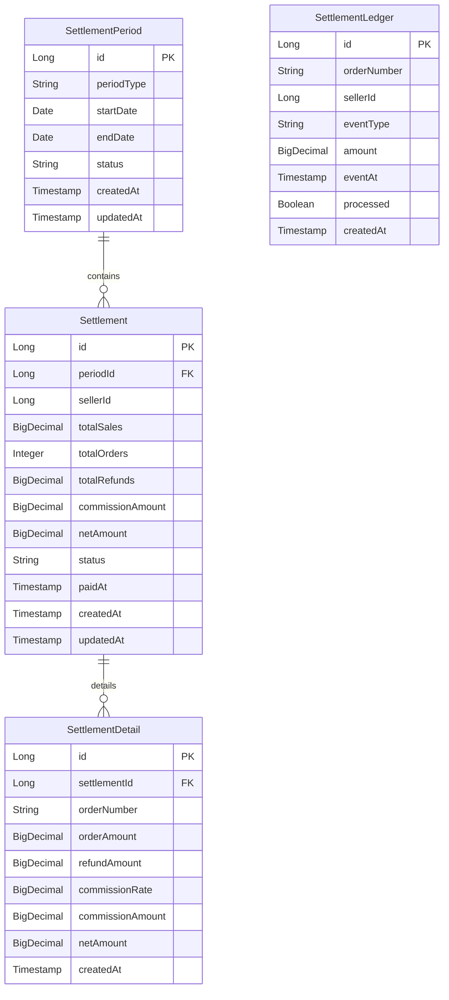

# Shopping Settlement Service Database Schema

**Database**: PostgreSQL (shopping_settlement_db)
**Entity Count**: 4
**Last Updated**: 2026-02-18

> Shopping 서비스 분해 (2026-02-14, ADR-041)로 Settlement 도메인이 독립 서비스로 분리되었습니다.
> Spring Batch 기반 주기적 정산 처리.

## ERD



## Entities

| Entity | 설명 | 주요 필드 |
|--------|------|----------|
| SettlementPeriod | 정산 주기 | id, periodType, startDate, endDate, status |
| Settlement | 판매자별 정산 요약 | id, periodId, sellerId, totalSales, commissionAmount, netAmount |
| SettlementDetail | 정산 상세 (주문 단위) | id, settlementId, orderNumber, orderAmount, commissionRate |
| SettlementLedger | 정산 원장 (Kafka 이벤트 수집) | id, orderNumber, sellerId, eventType, amount, processed |

## Relationships

### 정산 구조
- SettlementPeriod 1:N Settlement: 정산 주기당 판매자별 정산 레코드
- Settlement 1:N SettlementDetail: 판매자 정산당 주문 단위 상세
- **UK**: `(period_id, seller_id)` — 동일 주기에 판매자 중복 정산 방지

### 원장 (Ledger)
- SettlementLedger: Kafka 이벤트에서 수집한 주문 완료/환불 기록
- `processed` 플래그로 배치 처리 여부 추적
- Settlement과 직접 FK 관계 없음 (배치 처리 시 매칭)

## Cross-Service References (ID Only)

| 이 서비스 필드 | 참조 서비스 | 설명 |
|---------------|-----------|------|
| settlements.seller_id | Shopping Seller Service | 판매자 ID |
| settlement_ledger.order_number | Shopping Service | 주문 번호 |
| settlement_ledger.seller_id | Shopping Seller Service | 판매자 ID |

## Data Flow

```
Shopping Service (Order 완료/환불)
  → Kafka: "order-events"
    → Settlement Service: SettlementLedger 기록

Spring Batch Job (주기적 실행):
  1. SettlementPeriod 생성 (DAILY/WEEKLY/MONTHLY)
  2. SettlementLedger에서 미처리 건 조회
  3. 판매자별 집계 → Settlement 생성
  4. 주문별 상세 → SettlementDetail 생성
  5. SettlementLedger.processed = true 갱신
```

## Indexes

### 성능 최적화
- `idx_settlement_periods_type`: 정산 주기 타입별 조회
- `idx_settlement_periods_status`: 정산 상태별 조회
- `idx_settlement_periods_dates`: 날짜 범위 조회
- `idx_settlements_seller_id`: 판매자별 정산 조회
- `idx_settlements_status`: 정산 상태별 조회
- `idx_settlement_details_order`: 주문번호별 상세 조회
- `idx_ledger_processed`: 미처리 원장 조회 (배치)
- `idx_ledger_seller`: 판매자별 원장 조회
- `idx_ledger_event_at`: 이벤트 시간순 조회

## 변경 이력

| Date | Change | Author |
|------|--------|--------|
| 2026-02-18 | MySQL → PostgreSQL 전환 (ADR-046) | Laze |
| 2026-02-14 | Settlement 서비스 독립 분리 (ADR-041) | Laze |
