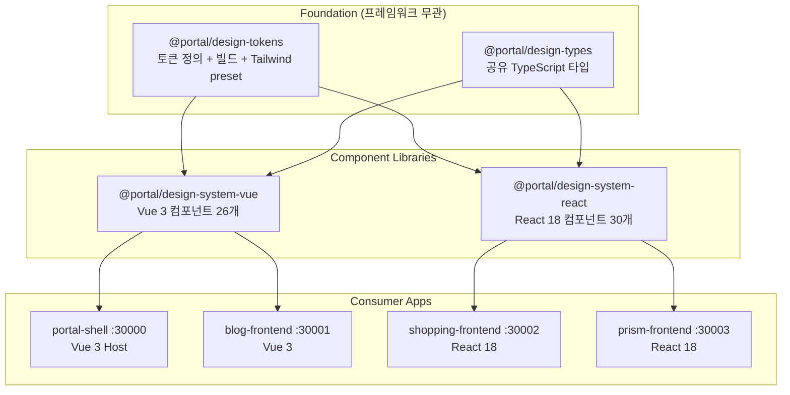

# Design System Architecture

Portal Universe Design System의 아키텍처 문서 인덱스. 3계층 토큰 시스템 기반으로 Vue 3와 React 18 듀얼 프레임워크를 지원하는 컴포넌트 라이브러리이다.

## 문서 목록

| 문서 | 설명 | 범위 |
|------|------|------|
| [System Overview](./system-overview.md) | 멀티 패키지 아키텍처 전체 개요 | 전체 |
| [Token System](./token-system.md) | 3계층 토큰 시스템, 빌드 파이프라인 | `@portal/design-tokens` |
| [Theming](./theming.md) | 테마 시스템 (서비스별, Light/Dark) | Vue + React |
| [Vue Components](./vue-components.md) | Vue 3 컴포넌트 라이브러리 | `@portal/design-system-vue` |
| [React Components](./react-components.md) | React 18 컴포넌트 라이브러리 | `@portal/design-system-react` |
| [Component Matrix](./component-matrix.md) | 크로스 프레임워크 비교표 | Vue + React |

## 핵심 개념

### 3계층 토큰 시스템

```
Base Layer (Primitive)     7개 JSON: colors, typography, spacing, border, effects, gradients, interactive
     |
Semantic Layer (Role-based)  CSS 변수: brand, text, bg, border, status, accent
     |
Component Layer (Application)  Tailwind preset 클래스: bg-brand-primary, text-text-heading
```

### 서비스별 테마

| 서비스 | 브랜드 색상 | 기본 모드 |
|--------|-----------|----------|
| Portal | Indigo (`#5e6ad2`) | Dark-first |
| Blog | Green (`#12B886`) | Light-first |
| Shopping | Orange (`#FD7E14`) | Light-first |
| Prism | Purple (별도 정의) | Light-first |

### 듀얼 프레임워크

- **Vue 3**: 26개 컴포넌트 + 4개 composable + 에러 핸들러
- **React 18**: 30개 컴포넌트 + ErrorBoundary + 4개 hook
- **공유 타입**: `@portal/design-types`에서 단일 소스
- **공유 로거**: Framework-agnostic `createLogger` (design-types)

## 패키지 관계



## 기술 스택

| 카테고리 | 기술 | 버전 |
|---------|------|------|
| Vue | Vue 3 (Composition API, `<script setup>`) | ^3.5.21 |
| React | React 18 (Hooks, forwardRef) | ^18.0.0 |
| 빌드 도구 | Vite | ^7.1.7 |
| 스타일 | Tailwind CSS | ^3.4.15 |
| 타입 시스템 | TypeScript | ~5.9.3 |
| 테스팅 | Vitest | ^4.0.17 |
| 문서화 | Storybook | ^9.1.13 |
| 유틸리티 | clsx + tailwind-merge (React) | ^2.1.1 / ^2.5.5 |

## 디렉토리 구조

```
frontend/
├── design-tokens/               # @portal/design-tokens
│   ├── src/tokens/
│   │   ├── base/                # 7개 원시 토큰 JSON
│   │   ├── semantic/            # 의미 기반 토큰
│   │   └── themes/              # 서비스별 테마 (4개)
│   ├── scripts/build-tokens.js  # 토큰 빌드 스크립트
│   └── tailwind.preset.js       # Tailwind 프리셋
│
├── design-types/                # @portal/design-types
│   └── src/
│       ├── index.ts             # ServiceType, ThemeMode 등
│       ├── common.ts            # 공통 variant/size 타입
│       ├── components.ts        # 컴포넌트 Props 인터페이스
│       ├── api.ts               # API 타입
│       └── logger.ts            # 구조화된 로거 (createLogger)
│
├── design-system-vue/           # @portal/design-system-vue
│   └── src/
│       ├── components/          # 26개 Vue 컴포넌트
│       ├── composables/         # useTheme, useToast, useApiError, useLogger, setupErrorHandler
│       └── styles/themes/       # blog.css, shopping.css, prism.css
│
└── design-system-react/         # @portal/design-system-react
    └── src/
        ├── components/          # 30개 React 컴포넌트 + ErrorBoundary
        ├── hooks/               # useTheme, useToast, useApiError, useLogger
        └── utils/cn.ts          # clsx + tailwind-merge
```

## 관련 문서

- [Architecture Template](../../templates/architecture-template.md) - 아키텍처 문서 작성 템플릿

---

## 변경 이력

| 날짜 | 변경 내용 | 작성자 |
|------|----------|--------|
| 2026-01-18 | 초안 작성 | Laze |
| 2026-02-06 | 업데이트 | Laze |
| 2026-02-14 | 에러 핸들링/로깅 유틸리티 추가 (ADR-040) | Laze |
