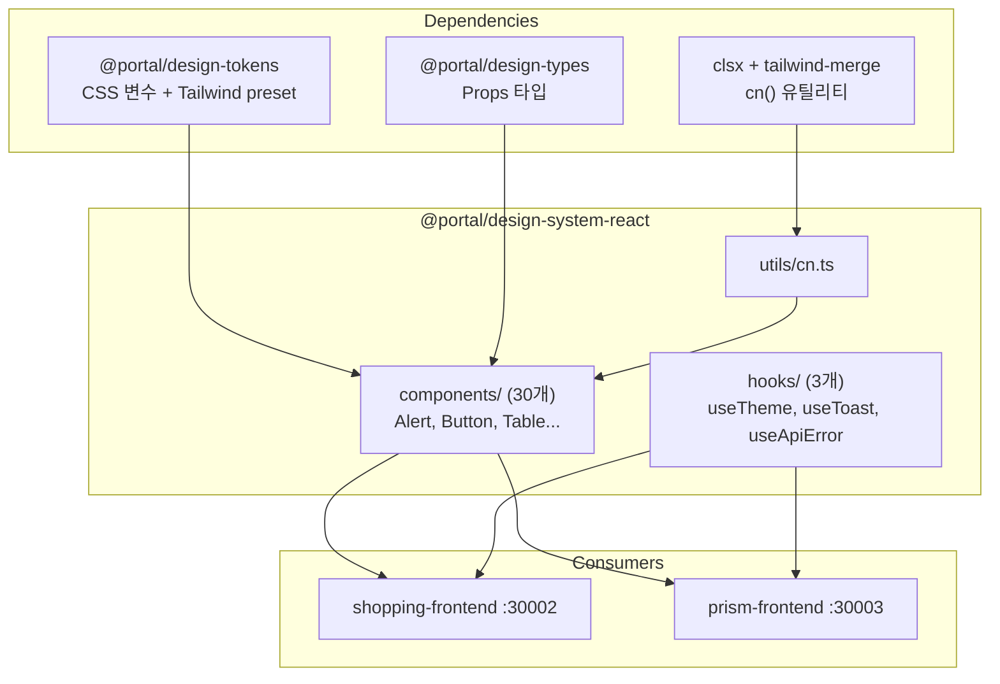

# React 컴포넌트 라이브러리

## 개요

`@portal/design-system-react`는 React 18 Hooks + forwardRef 기반 컴포넌트 라이브러리이다. 30개 컴포넌트와 3개 hook을 제공하며, Vue 라이브러리와 25개 공유 컴포넌트 + 5개 React-only 컴포넌트로 구성된다.

| 항목 | 내용 |
|------|------|
| 패키지 | `@portal/design-system-react` |
| 컴포넌트 | 30개 (공유 25 + React-only 5) + ErrorBoundary |
| Hook | 4개 (useTheme, useToast, useApiError, useLogger) |
| 소비자 앱 | shopping-frontend (:30002), prism-frontend (:30003) |
| 빌드 | Vite library mode |
| 테스팅 | Vitest + @testing-library/react |
| Storybook | port 6007 |

## 아키텍처 다이어그램



## 핵심 컴포넌트

### 컴포넌트 목록 (30개)

#### Vue와 공유 (25개)

| 컴포넌트 | 설명 | Controlled |
|---------|------|-----------|
| Alert | 알림 박스 | - |
| Avatar | 사용자 아바타 | - |
| Badge | 뱃지 레이블 | - |
| Breadcrumb | 브레드크럼 | - |
| Button | 버튼 | - |
| Card | 카드 컨테이너 | - |
| Checkbox | 체크박스 | `checked` + `onChange` |
| Container | 페이지 래퍼 | - |
| Divider | 구분선 | - |
| Dropdown | 드롭다운 메뉴 | - |
| FormField | 폼 필드 래퍼 | - |
| Input | 텍스트 입력 | `value` + `onChange` |
| Link | 링크 | - |
| Modal | 모달 다이얼로그 | `isOpen` + `onClose` |
| Radio | 라디오 버튼 | `value` + `onChange` |
| SearchBar | 검색창 | `value` + `onChange` |
| Select | 드롭다운 선택 | `value` + `onChange` |
| Skeleton | 스켈레톤 로더 | - |
| Spinner | 로딩 스피너 | - |
| Stack | Flexbox 레이아웃 | - |
| Switch | 토글 스위치 | `checked` + `onChange` |
| Tabs | 탭 네비게이션 | `activeTab` + `onChange` |
| Tag | 태그 | - |
| Textarea | 여러 줄 입력 | `value` + `onChange` |
| Toast | 토스트 알림 | - |

#### React-only (5개)

| 컴포넌트 | 설명 | 비고 |
|---------|------|------|
| Pagination | 페이지네이션 | 상품 목록 등 페이지 분할 UI |
| Popover | 팝오버 | 추가 정보 표시 |
| Progress | 진행률 표시 | 업로드/로딩 진행률 |
| Table | 데이터 테이블 | 정렬/필터 지원 |
| Tooltip | 툴팁 | 호버 시 설명 표시 |

React-only 컴포넌트는 Shopping/Prism 서비스에서 필요하지만 Blog/Portal(Vue)에서는 아직 필요하지 않아 Vue 라이브러리에 미구현.

### Hook (4개)

| Hook | 설명 |
|------|------|
| `useTheme` | 서비스 테마 + Dark/Light 모드 관리 ([상세](./theming.md)) |
| `useToast` | ToastContext 기반 알림 표시/제거 |
| `useApiError` | API 에러 응답을 사용자 친화적 메시지로 변환 |
| `useLogger` | 구조화된 Logger 인스턴스 제공 (framework-agnostic createLogger 래핑) |

### ErrorBoundary 컴포넌트

위치: `src/components/ErrorBoundary/ErrorBoundary.tsx`

React Error Boundary로 컴포넌트 트리의 에러를 캐치하고 fallback UI를 표시한다.

**Props**:
- `fallback?: ReactNode` - 에러 발생 시 표시할 대체 UI
- `onError?: (error: Error, errorInfo: ErrorInfo) => void` - 에러 발생 시 콜백

**사용 예시**:
```tsx
// main.tsx
import { ErrorBoundary } from '@portal/design-system-react'

<ErrorBoundary fallback={<div>Something went wrong</div>}>
  <App />
</ErrorBoundary>
```

내부적으로 `useLogger()`를 사용하여 캐치된 에러를 로깅한다.

### cn() 유틸리티

위치: `src/utils/cn.ts`

`clsx`와 `tailwind-merge`를 결합하여 Tailwind 클래스 충돌을 자동 해결한다.

```typescript
import { clsx, type ClassValue } from 'clsx'
import { twMerge } from 'tailwind-merge'

export function cn(...inputs: ClassValue[]) {
  return twMerge(clsx(inputs))
}
```

**사용 예시**:
```tsx
<button className={cn(
  'bg-brand-primary text-text-inverse',
  size === 'lg' && 'h-11 px-6',
  disabled && 'opacity-50 cursor-not-allowed',
  className  // 외부에서 오버라이드 가능
)}>
```

## 데이터 플로우

### 컴포넌트 패턴

모든 인터랙티브 컴포넌트는 `forwardRef` + `@portal/design-types` Props 패턴을 따른다.

```tsx
import { forwardRef, type ButtonHTMLAttributes, type ReactNode } from 'react'
import type { ButtonProps } from '@portal/design-types'
import { cn } from '../../utils/cn'

export interface ButtonComponentProps
  extends ButtonProps,
    Omit<ButtonHTMLAttributes<HTMLButtonElement>, 'type'> {
  children?: ReactNode
}

export const Button = forwardRef<HTMLButtonElement, ButtonComponentProps>(
  ({ variant = 'primary', size = 'md', disabled, loading, className, children, ...props }, ref) => {
    return (
      <button
        ref={ref}
        disabled={disabled || loading}
        className={cn(
          'inline-flex items-center justify-center rounded-md font-medium',
          variantClasses[variant],
          sizeClasses[size],
          className
        )}
        {...props}
      >
        {loading && <Spinner size="sm" color="current" />}
        {children}
      </button>
    )
  }
)

Button.displayName = 'Button'
```

**핵심 패턴**:
- `forwardRef`: 모든 인터랙티브 컴포넌트에서 ref 전달 지원
- `displayName`: DevTools에서 컴포넌트 이름 표시
- `cn()`: Tailwind 클래스 병합 + 외부 className 오버라이드
- `@portal/design-types` + HTML 속성 합성: 공유 Props 확장

### Controlled Component 패턴

React는 v-model 대신 controlled component 패턴을 사용한다.

```tsx
// 소비자 앱에서 사용
const [query, setQuery] = useState('')
const [selected, setSelected] = useState<string>()

<Input value={query} onChange={(e) => setQuery(e.target.value)} />
<Select value={selected} onChange={setSelected} options={options} />
<Switch checked={isDark} onChange={setIsDark} label="다크 모드" />
```

### 테스팅

Vitest + @testing-library/react로 컴포넌트 테스트를 작성한다.

```tsx
// Button.test.tsx
import { describe, it, expect, vi } from 'vitest'
import { render, screen, fireEvent } from '@testing-library/react'
import { Button } from './Button'

describe('Button', () => {
  it('renders with children', () => {
    render(<Button>Click me</Button>)
    expect(screen.getByRole('button')).toHaveTextContent('Click me')
  })

  it('calls onClick when clicked', () => {
    const handleClick = vi.fn()
    render(<Button onClick={handleClick}>Click</Button>)
    fireEvent.click(screen.getByRole('button'))
    expect(handleClick).toHaveBeenCalled()
  })

  it('does not call onClick when disabled', () => {
    const handleClick = vi.fn()
    render(<Button disabled onClick={handleClick}>Click</Button>)
    fireEvent.click(screen.getByRole('button'))
    expect(handleClick).not.toHaveBeenCalled()
  })
})
```

### Storybook

```tsx
// Button.stories.tsx
import type { Meta, StoryObj } from '@storybook/react'
import { Button } from './Button'

const meta: Meta<typeof Button> = {
  title: 'Components/Button',
  component: Button,
  tags: ['autodocs'],
}

export default meta
type Story = StoryObj<typeof Button>

export const Primary: Story = {
  args: { variant: 'primary', children: 'Primary Button' },
}
```

## 기술적 결정

### 선택한 패턴

- **forwardRef 필수**: 모든 인터랙티브 컴포넌트에 ref 전달 지원. 폼 라이브러리(react-hook-form 등)와의 호환성 보장.
- **cn() 유틸리티**: `clsx` + `tailwind-merge` 조합으로 className 충돌 자동 해결. 소비자가 스타일 오버라이드 가능.
- **Controlled only**: Uncontrolled 패턴 없이 모든 폼 컴포넌트를 controlled로 제공. 상태 예측 가능성 보장.
- **displayName 설정**: forwardRef 컴포넌트에 displayName 필수 설정. React DevTools 디버깅 편의성.

### 외부 의존성

| 패키지 | 버전 | 용도 |
|--------|------|------|
| `react` | ^18.0.0 | 컴포넌트 프레임워크 |
| `react-dom` | ^18.0.0 | DOM 렌더링 |
| `@portal/design-tokens` | workspace | 토큰 + Tailwind preset |
| `@portal/design-types` | workspace | Props 타입 |
| `clsx` | ^2.1.1 | 조건부 className |
| `tailwind-merge` | ^2.5.5 | Tailwind 클래스 병합 |
| `@fontsource-variable/inter` | ^5.0.0 | Inter 폰트 |

### 빌드 설정

```typescript
// vite.config.ts
export default defineConfig({
  plugins: [react()],
  build: {
    lib: {
      entry: resolve(__dirname, 'src/index.ts'),
      name: 'DesignSystemReact',
      formats: ['es', 'cjs'],
    },
    rollupOptions: {
      external: ['react', 'react-dom', '@portal/design-tokens', '@portal/design-types'],
    },
  },
})
```

**출력 파일**:
```
dist/
├── design-system-react.es.js    # ESM
├── design-system-react.cjs.js   # CommonJS
├── style.css                    # 스타일
└── types/                       # TypeScript 타입
```

## 관련 문서

- [System Overview](./system-overview.md) - 전체 아키텍처 개요
- [Vue Components](./vue-components.md) - Vue 컴포넌트 라이브러리
- [Component Matrix](./component-matrix.md) - Vue/React 비교
- [Theming](./theming.md) - 테마 시스템

---

## 변경 이력

| 날짜 | 변경 내용 | 작성자 |
|------|----------|--------|
| 2026-01-19 | 초안 작성 | Laze |
| 2026-02-06 | 업데이트 | Laze |
| 2026-02-14 | ErrorBoundary 컴포넌트, useLogger hook 추가 (ADR-040) | Laze |
