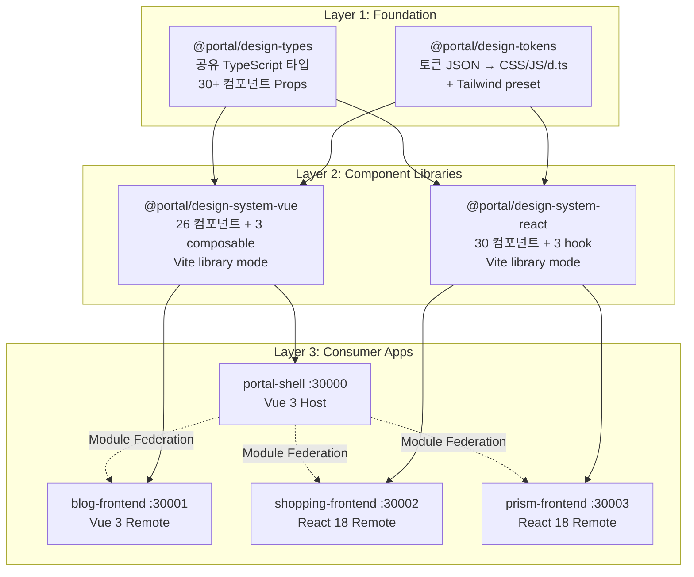
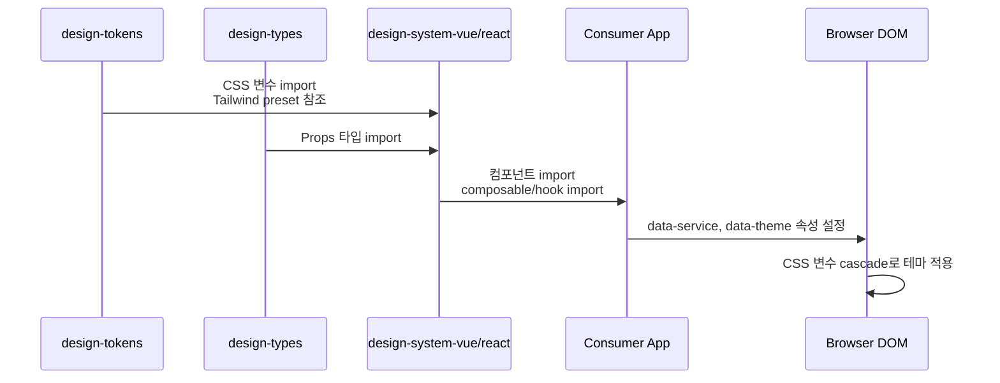

# Design System 아키텍처 개요

## 개요

Portal Universe Design System은 4개 패키지로 구성된 멀티 프레임워크 디자인 시스템이다. 프레임워크 무관한 토큰/타입 계층 위에 Vue 3과 React 18 컴포넌트 라이브러리를 제공하여, Module Federation 기반의 마이크로 프론트엔드 환경에서 일관된 UI를 보장한다.

| 항목 | 내용 |
|------|------|
| 패키지 수 | 4 (`design-tokens`, `design-types`, `design-system-vue`, `design-system-react`) |
| 컴포넌트 수 | Vue 26 + React 30 (공유 25, Vue-only 1, React-only 5) |
| 테마 | 4개 서비스 (Portal, Blog, Shopping, Prism) + Dark/Light 모드 |
| 소비자 앱 | 4개 (portal-shell, blog-frontend, shopping-frontend, prism-frontend) |

## 아키텍처 다이어그램



## 핵심 컴포넌트

### 1. @portal/design-tokens

프레임워크 무관한 디자인 토큰 패키지. JSON 정의에서 여러 포맷으로 빌드한다.

**역할**:
- 3계층 토큰 정의 (Base → Semantic → Component)
- 빌드 스크립트로 5개 출력 생성 (CSS, JSON, ESM, CJS, d.ts)
- Tailwind preset 제공 (semantic 토큰을 Tailwind 클래스로 매핑)
- 4개 서비스 테마 + Dark/Light 모드 CSS 변수 생성

**Exports**:
```
@portal/design-tokens       → dist/tokens.js (ESM) / dist/tokens.cjs (CJS)
@portal/design-tokens/css   → dist/tokens.css
@portal/design-tokens/json  → dist/tokens.json
@portal/design-tokens/tailwind → tailwind.preset.js
```

### 2. @portal/design-types

프레임워크 무관한 TypeScript 타입 패키지. 컴포넌트 Props의 단일 소스(Single Source of Truth)를 제공한다.

**역할**:
- `ServiceType`, `ThemeMode`, `ThemeConfig` 정의
- 공통 variant/size 타입 (ButtonVariant, BadgeVariant, Size 등)
- 30+ 컴포넌트 Props 인터페이스 (ButtonProps, InputProps 등)

**구성 파일**:
- `index.ts` - 재수출 + 테마 타입
- `common.ts` - 공통 variant/size 열거형
- `components.ts` - 컴포넌트별 Props 인터페이스
- `api.ts` - API 응답/요청 타입

### 3. @portal/design-system-vue

Vue 3 전용 컴포넌트 라이브러리. `<script setup>` + Composition API 패턴을 사용한다.

**역할**:
- 26개 Vue 컴포넌트 (Form 8, Feedback 7, Layout 5, Navigation 3, Display 2, Utility 1)
- 3개 composable (useTheme, useToast, useApiError)
- 서비스별 테마 CSS (blog.css, shopping.css, prism.css)

**소비자**: portal-shell (:30000), blog-frontend (:30001)

### 4. @portal/design-system-react

React 18 전용 컴포넌트 라이브러리. Hooks + forwardRef 패턴을 사용한다.

**역할**:
- 30개 React 컴포넌트 (Vue 25개 공유 + React-only 5개)
- 3개 hook (useTheme, useToast, useApiError)
- `cn()` 유틸리티 (clsx + tailwind-merge)

**소비자**: shopping-frontend (:30002), prism-frontend (:30003)

## 데이터 플로우

### 토큰 빌드 파이프라인

```
┌───────────────────────┐     ┌──────────────────┐     ┌──────────────────────┐
│  Input (12 JSON)      │     │  Build Script    │     │  Output (5 files)    │
│                       │ --> │  build-tokens.js │ --> │                      │
│  base/ (7 files)      │     │  462 lines       │     │  tokens.css          │
│  semantic/ (1 file)   │     │                  │     │  tokens.json         │
│  themes/ (4 files)    │     │  5-step process  │     │  tokens.js (ESM)     │
└───────────────────────┘     └──────────────────┘     │  tokens.cjs (CJS)    │
                                                       │  tokens.d.ts         │
                                                       └──────────────────────┘
```

**빌드 단계**:
1. `base/colors.json`에서 color reference map 구성
2. Base 토큰 읽기 (colors, typography, spacing, border, effects, gradients, interactive)
3. Semantic 토큰 읽기 (Base 참조 해석)
4. Theme 토큰 읽기 (서비스별 dark/light 모드 포함)
5. 출력 파일 생성 (CSS 변수, JSON, JS, CJS, d.ts)

### 소비자 앱에서의 사용 흐름



### Module Federation에서의 디자인 시스템 공유

portal-shell(Host)이 Vue 디자인 시스템을 사용하고, React Remote(shopping, prism)는 각자 `@portal/design-system-react`를 번들한다. 테마는 Host가 `<html>` 요소에 설정한 `data-service`, `data-theme` 속성을 통해 전체 앱에 일관되게 적용된다.

```
portal-shell (Host)
├── @portal/design-system-vue 사용
├── data-service="shopping" 설정 (라우트 기반)
└── Remote iframe/component 내부에서도 CSS 변수 상속
```

## 기술적 결정

### 선택한 패턴

- **Dark-first (Portal)**: Portal 서비스는 dark 모드가 기본. Linear 스타일의 개발자 친화적 UI 지향. Blog/Shopping/Prism은 light-first.
- **CSS Variables 런타임 테마**: 빌드 타임이 아닌 런타임에 `data-service` + `data-theme` 속성으로 테마를 전환. 컴포넌트 코드 변경 없이 스타일 적용 가능.
- **data-attribute 기반 전환**: `class` 기반 대신 `data-service`, `data-theme` HTML 속성을 사용. Tailwind `darkMode: ['class', '[data-theme="dark"]']`와 호환.
- **단일 타입 소스**: `@portal/design-types`에서 컴포넌트 Props를 한 번 정의하고, Vue/React 양쪽에서 참조. 타입 일관성 보장.
- **Vite Library Mode**: 두 컴포넌트 라이브러리 모두 Vite library mode로 빌드. `react`, `react-dom`, `@portal/design-tokens`, `@portal/design-types`는 external로 처리.

### 제약사항

- Vue ServiceType에 `'prism'`이 포함되지 않음 (Vue 앱에서 Prism 테마를 직접 사용하지 않으므로)
- React `ThemeMode`에 `'system'` 옵션이 있으나, Vue에는 없음 (API 비대칭)
- Module Federation 환경에서 React Context 기반 라이브러리 사용 시 Provider 공유 주의 필요

## 배포 및 확장

### 빌드 순서

의존성 그래프에 따른 필수 빌드 순서:

```
1. @portal/design-tokens   (npm run build:tokens → npm run build)
2. @portal/design-types    (npm run build)
3. @portal/design-system-vue  +  @portal/design-system-react  (병렬 가능)
4. Consumer Apps (portal-shell → blog/shopping/prism)
```

모노레포 루트에서 `npm run build:design` → `npm run build:libs` → `npm run build:apps` 순서로 실행.

### Storybook

| 패키지 | Storybook 포트 |
|--------|---------------|
| design-system-vue | 6006 |
| design-system-react | 6007 |

### 확장 전략

- 새 서비스 테마 추가: `design-tokens/src/tokens/themes/` 에 JSON 추가 후 빌드
- 새 컴포넌트 추가: `design-types`에 Props 정의 → Vue/React 양쪽 구현 (자세한 절차는 [Component Matrix](./component-matrix.md) 참조)

## 관련 문서

- [Token System](./token-system.md) - 토큰 시스템 상세
- [Theming](./theming.md) - 테마 시스템 가이드
- [Vue Components](./vue-components.md) - Vue 컴포넌트 상세
- [React Components](./react-components.md) - React 컴포넌트 상세
- [Component Matrix](./component-matrix.md) - 크로스 프레임워크 비교

**최종 업데이트**: 2026-02-06
