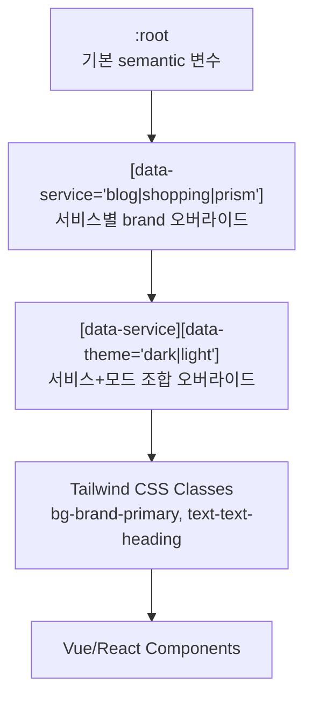
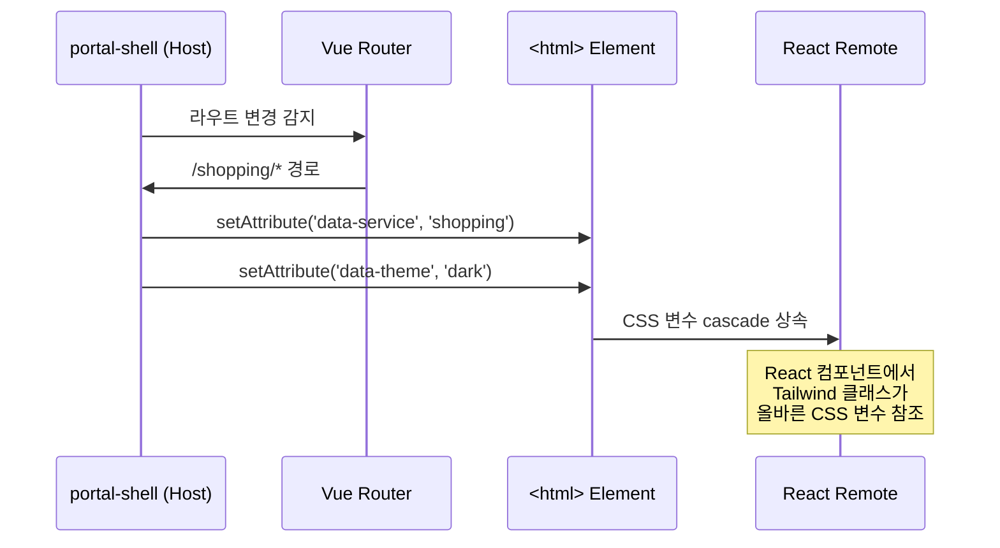

# 테마 시스템 아키텍처

## 개요

테마 시스템은 CSS 변수 캐스케이드를 기반으로 4개 서비스 테마와 Dark/Light 모드를 제공한다. Vue composable과 React hook을 통해 프레임워크별 API를 제공하며, `data-service`와 `data-theme` HTML 속성으로 런타임 전환한다.

| 항목 | 내용 |
|------|------|
| 서비스 테마 | Portal (dark-first), Blog (light-first), Shopping (light-first), Prism (light-first) |
| 명암 모드 | Dark / Light |
| Vue API | `useTheme()` composable |
| React API | `useTheme()` hook |
| 전환 메커니즘 | `data-service` + `data-theme` HTML 속성 |

## 아키텍처 다이어그램

### CSS 변수 캐스케이드



**Specificity 순서** (낮음 → 높음):

```
:root { --semantic-brand-primary: ... }
  ↓ 오버라이드
[data-theme="dark"] { --semantic-bg-page: ... }
  ↓ 오버라이드
[data-service="blog"] { --semantic-brand-primary: ... }
  ↓ 오버라이드
[data-service="blog"][data-theme="dark"] { --semantic-bg-page: ... }
```

## 핵심 컴포넌트

### 1. 서비스 테마

4개 서비스는 각각 고유한 브랜드 색상과 기본 모드를 가진다.

#### Portal (Dark-first)

기본 테마. Linear 스타일의 개발자 친화적 다크 UI.

```css
/* Portal: dark가 기본 */
[data-service="portal"] {
  --semantic-brand-primary: #5e6ad2;
  --semantic-bg-page: #08090a;
}

/* Portal light 모드 오버라이드 */
[data-service="portal"][data-theme="light"] {
  --semantic-bg-page: #f7f8f8;
  --semantic-text-body: #3e3e44;
}
```

#### Blog (Light-first)

그린 계열 브랜드. 긴 글 읽기에 최적화된 typography 설정.

```css
[data-service="blog"] {
  --semantic-brand-primary: #12B886;
  --semantic-brand-primaryHover: #0CA678;
  --semantic-bg-page: #F8F9FA;
}

[data-service="blog"][data-theme="dark"] {
  --semantic-bg-page: #1a1a2e;
}
```

테마 CSS 위치: `design-core/src/styles/themes/blog.css`

#### Shopping (Light-first)

오렌지 계열 브랜드. 상품 카드에 역동적인 그림자 효과.

```css
[data-service="shopping"] {
  --semantic-brand-primary: #FD7E14;
  --semantic-brand-primaryHover: #F76707;
  --semantic-bg-page: #ffffff;
}

[data-service="shopping"][data-theme="dark"] {
  --semantic-bg-page: #1a1a2e;
}
```

테마 CSS 위치: `design-core/src/styles/themes/shopping.css`

#### Prism (Light-first)

별도 브랜드 색상. `design-core/src/tokens/themes/prism.json`에 정의됨.

```css
[data-service="prism"] {
  --semantic-brand-primary: /* prism.json에서 정의 */;
}
```

테마 CSS 위치: `design-core/src/styles/themes/prism.css`

### 2. Dark/Light 모드 전환

#### HTML 속성 설정

```html
<!-- Light 모드 -->
<html data-theme="light" data-service="blog">

<!-- Dark 모드 -->
<html data-theme="dark" data-service="blog" class="dark">
```

`class="dark"`는 Tailwind CSS `darkMode: ['class', '[data-theme="dark"]']` 호환을 위해 함께 설정.

#### 글로벌 Dark 모드 CSS

```css
[data-theme="dark"],
.dark {
  --semantic-text-heading: var(--base-color-gray-100);
  --semantic-text-body: var(--base-color-gray-200);
  --semantic-bg-page: var(--base-color-gray-900);
  --semantic-bg-card: var(--base-color-gray-800);
  --semantic-border-default: var(--base-color-gray-700);
}
```

### 3. Vue useTheme Composable

위치: `design-vue/src/composables/useTheme.ts`

```typescript
export type ServiceType = 'portal' | 'blog' | 'shopping'
export type ThemeMode = 'light' | 'dark'

export function useTheme() {
  const currentService: Ref<ServiceType>
  const currentTheme: Ref<ThemeMode>

  const setService: (service: ServiceType) => void
  const setTheme: (mode: ThemeMode) => void
  const toggleTheme: () => void
  const initTheme: () => void

  return { currentService, currentTheme, setService, setTheme, toggleTheme, initTheme }
}
```

**기능**:
- `setService(service)` - `data-service` 속성 설정, localStorage `portal-service` 저장
- `setTheme(mode)` - `data-theme` 속성 설정, `dark` class 토글, localStorage `portal-theme` 저장
- `toggleTheme()` - light ↔ dark 전환
- `initTheme()` - localStorage 복원 또는 시스템 설정(`prefers-color-scheme`) 반영
- `onMounted` - 시스템 테마 변경 감지 리스너 등록

### 4. React useTheme Hook

위치: `design-react/src/hooks/useTheme.ts`

```typescript
export type ServiceType = /* @portal/design-core에서 정의 */
export type ThemeMode = 'light' | 'dark' | 'system'

interface UseThemeOptions {
  defaultService?: ServiceType  // default: 'portal'
  defaultMode?: ThemeMode       // default: 'system'
}

interface UseThemeReturn {
  service: ServiceType
  mode: ThemeMode
  resolvedMode: 'light' | 'dark'
  setService: (service: ServiceType) => void
  setMode: (mode: ThemeMode) => void
  toggleMode: () => void
}

export function useTheme(options?: UseThemeOptions): UseThemeReturn
```

**기능**:
- `service` / `setService` - `data-service` 속성 관리
- `mode` / `setMode` - 사용자 선택 모드 (`'light' | 'dark' | 'system'`)
- `resolvedMode` - 실제 적용 모드 (system → 시스템 설정 해석)
- `toggleMode()` - light → dark → light (system인 경우 반전 후 고정)
- `useEffect` - 시스템 `prefers-color-scheme` 변경 감지

### 5. Vue vs React API 비교

| 기능 | Vue (useTheme) | React (useTheme) |
|------|---------------|-----------------|
| 서비스 상태 | `currentService` (Ref) | `service` (useState) |
| 테마 상태 | `currentTheme` (Ref) | `mode` (useState) |
| System 모드 | 지원 안 함 | `'system'` 옵션 + `resolvedMode` |
| 서비스 설정 | `setService(service)` | `setService(service)` |
| 테마 설정 | `setTheme(mode)` | `setMode(mode)` |
| 테마 토글 | `toggleTheme()` | `toggleMode()` |
| 초기화 | `initTheme()` (수동 호출) | 자동 (useEffect) |
| 저장소 | localStorage | DOM 속성만 (localStorage 없음) |
| ServiceType | `'portal' \| 'blog' \| 'shopping'` | `@portal/design-types` 참조 |

### 6. 알려진 타입 불일치

| 항목 | Vue | React | 비고 |
|------|-----|-------|------|
| ServiceType 'prism' | 포함 안 됨 | design-core에서 참조 | Vue 앱에서 Prism 미사용 |
| ThemeMode 'system' | 없음 (`'light' \| 'dark'`) | 있음 (`'light' \| 'dark' \| 'system'`) | React만 시스템 모드 지원 |

## 데이터 플로우

### Module Federation 환경에서의 테마 적용



**portal-shell에서의 라우트 기반 테마 전환**:
```vue
<script setup lang="ts">
import { watch } from 'vue'
import { useRoute } from 'vue-router'
import { useTheme } from '@portal/design-vue'

const route = useRoute()
const { setService } = useTheme()

watch(
  () => route.path,
  (path) => {
    if (path.includes('blog')) setService('blog')
    else if (path.includes('shopping')) setService('shopping')
    else setService('portal')
  },
  { immediate: true }
)
</script>
```

**React Remote Standalone 모드**:
```tsx
import { useTheme } from '@portal/design-react'

function App() {
  const { setService } = useTheme({ defaultService: 'shopping', defaultMode: 'system' })
  // Standalone에서는 자체적으로 서비스/테마 관리
  return <RouterProvider router={router} />
}
```

## 기술적 결정

### 선택한 패턴

- **CSS Variables 런타임 전환**: JavaScript로 `data-*` 속성만 변경하면 전체 UI 테마가 바뀜. 컴포넌트 리렌더링 불필요.
- **data-attribute 기반**: `class` 기반보다 서비스+모드 조합이 명확. `[data-service="blog"][data-theme="dark"]` 형태로 fine-grained 제어.
- **Dark-first vs Light-first 분리**: Portal은 개발자 도구 특성상 dark-first, 콘텐츠 서비스(Blog/Shopping/Prism)는 light-first. 빌드 스크립트에서 전략 분기.

### Tailwind 통합

```javascript
// tailwind.config.js (소비자 앱)
export default {
  presets: [require('@portal/design-core/tailwind')],
  // darkMode 설정이 preset에 포함됨:
  // darkMode: ['class', '[data-theme="dark"]']
}
```

**light: variant 커스텀 플러그인**:

Tailwind preset에 `light:` variant가 정의되어 있어 `[data-theme="light"]` 또는 `.light` 클래스에서만 적용되는 스타일 작성 가능.

```html
<div class="bg-bg-page light:shadow-md dark:shadow-lg">
  <!-- light 모드에서 shadow-md, dark 모드에서 shadow-lg -->
</div>
```

## 관련 문서

- [System Overview](./system-overview.md) - 전체 아키텍처 개요
- [Token System](./token-system.md) - 토큰 시스템 상세
- [Vue Components](./vue-components.md) - Vue 컴포넌트에서의 테마 사용
- [React Components](./react-components.md) - React 컴포넌트에서의 테마 사용

---

## 변경 이력

| 날짜 | 변경 내용 | 작성자 |
|------|----------|--------|
| 2026-01-18 | 초안 작성 | Laze |
| 2026-02-06 | 업데이트 | Laze |
| 2026-02-17 | 4→3 패키지 통합 반영: 패키지명/경로 업데이트 (ADR-043) | Laze |
