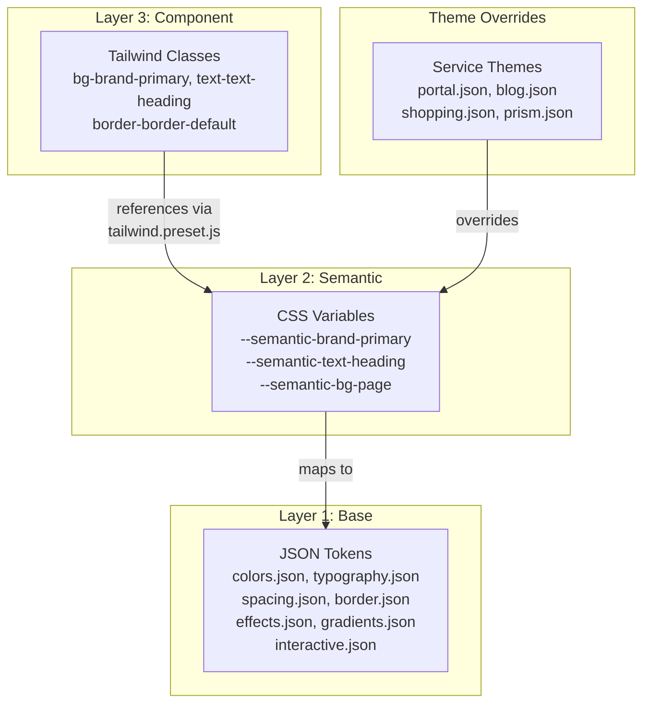

# 3계층 토큰 시스템

## 개요

Design Tokens는 디자인 결정을 플랫폼에 구애받지 않는 방식으로 변수화한 값이다. `@portal/design-core` 패키지의 `src/tokens/`에서 JSON으로 정의하고, 빌드 스크립트로 CSS 변수, JS 모듈, TypeScript 타입을 생성한다. 3계층 구조(Base → Semantic → Component)로 확장 가능하고 유지보수하기 쉬운 토큰 시스템을 제공한다.

| 항목 | 내용 |
|------|------|
| 패키지 | `@portal/design-core` (토큰 + 타입 + variant 통합, [ADR-043](../../adr/ADR-043-design-system-package-consolidation.md)) |
| 입력 | 11개 JSON 파일 (5 base + 1 semantic + 3 theme + 2 추가) |
| 출력 | 5개 파일 (CSS, JSON, ESM, CJS, d.ts) |
| Tailwind | `tailwind.preset.js`로 Semantic 토큰 → 유틸리티 클래스 매핑 |

## 아키텍처 다이어그램



## 핵심 컴포넌트

### 1. Base Layer (원시 토큰)

위치: `src/tokens/base/`

기본 디자인 값을 정의하는 가장 낮은 레벨의 토큰. 직접 사용하지 않고 Semantic 레이어에서 참조한다.

| 파일 | 내용 |
|------|------|
| `colors.json` | 컬러 팔레트 (brand, neutral, green, orange, red, blue, yellow, indigo 등) |
| `typography.json` | font-family, font-size, font-weight, line-height, letter-spacing |
| `spacing.json` | 간격 스케일 (xs ~ 2xl) |
| `border.json` | 반경, 너비, 그림자 |
| `effects.json` | shadow, glass, animation, opacity |
| `gradients.json` | page, card, glow, brand gradient |
| `interactive.json` | focus ring, hover/active state, transition, disabled |

**colors.json 예시**:
```json
{
  "color": {
    "brand": {
      "primary": "#20C997",
      "primaryHover": "#12B886",
      "secondary": "#38D9A9"
    },
    "neutral": {
      "white": "#ffffff",
      "50": "#f9fafb",
      "900": "#111827",
      "black": "#000000"
    },
    "indigo": {
      "400": "#5e6ad2",
      "500": "#4754c9"
    }
  }
}
```

**gradients.json 예시**:
```json
{
  "gradient": {
    "page": "linear-gradient(180deg, var(--semantic-bg-page) 0%, ...)",
    "card": "linear-gradient(135deg, ...)",
    "glow": "radial-gradient(circle, ...)",
    "brand": "linear-gradient(135deg, var(--semantic-brand-primary) ...)"
  }
}
```

**interactive.json 예시**:
```json
{
  "interactive": {
    "focusRing": {
      "width": "2px",
      "offset": "2px",
      "color": "{color.brand.primary}"
    },
    "hover": { "opacity": "0.8" },
    "active": { "scale": "0.98" },
    "transition": {
      "fast": "150ms",
      "normal": "200ms",
      "slow": "300ms"
    },
    "disabled": { "opacity": "0.5" }
  }
}
```

### 2. Semantic Layer (의미 기반 토큰)

위치: `src/tokens/semantic/colors.json`

Base 토큰을 참조하여 UI 역할 기반의 색상을 정의한다. `{color.green.600}` 형식으로 Base를 참조.

| 카테고리 | 설명 | 예시 변수 |
|---------|------|----------|
| `brand` | 브랜드 색상 | `--semantic-brand-primary`, `--semantic-brand-primaryHover` |
| `text` | 텍스트 색상 | `--semantic-text-heading`, `--semantic-text-body`, `--semantic-text-muted` |
| `bg` | 배경 색상 | `--semantic-bg-page`, `--semantic-bg-card`, `--semantic-bg-elevated` |
| `border` | 테두리 색상 | `--semantic-border-default`, `--semantic-border-hover`, `--semantic-border-focus` |
| `status` | 상태 색상 | `--semantic-status-success`, `--semantic-status-error`, `--semantic-status-warning` |
| `accent` | 강조 색상 | `--semantic-accent-indigo` 등 |

```json
{
  "brand": {
    "primary": "{color.brand.primary}",
    "primaryHover": "{color.brand.primaryHover}"
  },
  "text": {
    "heading": "{color.gray.900}",
    "body": "{color.gray.900}",
    "meta": "{color.gray.600}",
    "muted": "{color.gray.500}",
    "inverse": "{color.neutral.white}",
    "link": "{color.blue.600}"
  },
  "bg": {
    "page": "{color.gray.50}",
    "card": "{color.neutral.white}",
    "elevated": "{color.neutral.white}",
    "muted": "{color.gray.100}",
    "hover": "{color.gray.50}"
  },
  "status": {
    "success": "{color.green.600}",
    "successBg": "{color.green.50}",
    "error": "{color.red.600}",
    "errorBg": "{color.red.50}"
  }
}
```

### 3. Component Layer (Tailwind 프리셋)

위치: `design-core/tailwind.preset.js`

Semantic CSS 변수를 Tailwind 유틸리티 클래스로 매핑한다. 소비자 앱의 `tailwind.config.js`에서 이 preset을 확장하여 사용.

```javascript
// tailwind.preset.js (핵심 발췌)
export default {
  darkMode: ['class', '[data-theme="dark"]'],
  theme: {
    extend: {
      colors: {
        brand: {
          primary: 'var(--semantic-brand-primary)',
          primaryHover: 'var(--semantic-brand-primaryHover)',
          secondary: 'var(--semantic-brand-secondary)',
        },
        text: {
          heading: 'var(--semantic-text-heading)',
          body: 'var(--semantic-text-body)',
          meta: 'var(--semantic-text-meta)',
          muted: 'var(--semantic-text-muted)',
          inverse: 'var(--semantic-text-inverse)',
        },
        bg: {
          page: 'var(--semantic-bg-page)',
          card: 'var(--semantic-bg-card)',
          elevated: 'var(--semantic-bg-elevated)',
          muted: 'var(--semantic-bg-muted)',
        },
        border: {
          default: 'var(--semantic-border-default)',
          hover: 'var(--semantic-border-hover)',
          focus: 'var(--semantic-border-focus)',
        },
        status: {
          success: 'var(--semantic-status-success)',
          error: 'var(--semantic-status-error)',
          warning: 'var(--semantic-status-warning)',
          info: 'var(--semantic-status-info)',
        },
      },
      fontFamily: {
        sans: ['Inter Variable', ...fallbacks],
        mono: ['JetBrains Mono', ...fallbacks],
      },
      fontSize: { /* micro ~ 9xl, 13단계 */ },
      spacing: { xs: '...', sm: '...', md: '...', lg: '...', xl: '...', '2xl': '...' },
      borderRadius: { none: '0', sm: '...', DEFAULT: '...', md: '...', lg: '...', xl: '...', '2xl': '...', full: '9999px' },
      boxShadow: { sm: '...', md: '...', lg: '...', xl: '...', glow: '...', 'glow-lg': '...' },
      animation: { 'fade-in': '...', 'fade-out': '...', 'slide-up': '...', 'slide-down': '...', 'scale-in': '...' },
    },
  },
  plugins: [
    require('@tailwindcss/typography'),
    // Custom light: variant for [data-theme="light"] & .light
  ],
}
```

**컴포넌트에서의 사용**:
```html
<!-- Tailwind 클래스로 semantic 토큰 접근 -->
<button class="bg-brand-primary text-text-inverse hover:bg-brand-primaryHover">
  Click me
</button>

<div class="bg-bg-card border border-border-default rounded-lg p-4">
  <h1 class="text-text-heading">제목</h1>
  <p class="text-text-body">본문</p>
</div>
```

## 데이터 플로우

### 빌드 파이프라인

```
┌─────────────────────────────────────┐
│  Input: 12 JSON files               │
│                                     │
│  base/colors.json          (Step 1) │
│  base/typography.json      (Step 2) │
│  base/spacing.json                  │
│  base/border.json                   │
│  base/effects.json                  │
│  base/gradients.json                │
│  base/interactive.json              │
│  semantic/colors.json      (Step 3) │
│  themes/portal.json        (Step 4) │
│  themes/blog.json                   │
│  themes/shopping.json               │
│  themes/prism.json                  │
└──────────────┬──────────────────────┘
               │
               ▼
┌─────────────────────────────────────┐
│  scripts/build-tokens.js (462줄)    │
│                                     │
│  Step 1: Color reference map 구성   │
│  Step 2: Base 토큰 읽기             │
│  Step 3: Semantic 토큰 해석         │
│  Step 4: Theme 토큰 (dark/light)    │
│  Step 5: 출력 파일 생성             │
└──────────────┬──────────────────────┘
               │
               ▼
┌─────────────────────────────────────┐
│  Output: dist/ (5 files)            │
│                                     │
│  tokens.css   → CSS 변수            │
│  tokens.json  → Raw JSON 데이터     │
│  tokens.js    → ESM export          │
│  tokens.cjs   → CommonJS export     │
│  tokens.d.ts  → TypeScript 타입     │
└─────────────────────────────────────┘
```

**빌드 명령**:
```bash
npm run build:tokens  # scripts/build-tokens.js 실행
```

### CSS 변수 생성 구조

```css
/* 1. Base 토큰 */
:root {
  --base-color-brand-primary: #20C997;
  --base-color-gray-900: #111827;
  --base-font-family-sans: 'Inter Variable', ...;
  --base-spacing-md: 1rem;
}

/* 2. Semantic 토큰 (Base 참조) */
:root {
  --semantic-brand-primary: var(--base-color-brand-primary);
  --semantic-text-heading: var(--base-color-gray-900);
  --semantic-bg-page: var(--base-color-gray-50);
}

/* 3. Dark 모드 글로벌 오버라이드 */
[data-theme="dark"] {
  --semantic-text-heading: var(--base-color-gray-100);
  --semantic-bg-page: var(--base-color-gray-900);
  --semantic-bg-card: var(--base-color-gray-800);
}

/* 4. 서비스별 오버라이드 */
[data-service="blog"] {
  --semantic-brand-primary: #12B886;
}

/* 5. 서비스 + 다크 모드 조합 */
[data-service="blog"][data-theme="dark"] {
  --semantic-bg-page: ...;
}
```

## 기술적 결정

### 선택한 패턴

- **JSON 기반 Single Source of Truth**: 모든 디자인 값은 JSON 토큰 파일에서 시작. 어떤 플랫폼에서든 동일한 소스 참조.
- **커스텀 빌드 스크립트**: Style Dictionary 대신 자체 `build-tokens.js` 사용. Portal의 3계층 구조, 서비스 테마, dark-first/light-first 구분에 최적화.
- **CSS Variables 런타임 전환**: 빌드 타임이 아닌 런타임에 테마 전환 가능. `data-service` + `data-theme` HTML 속성으로 제어.
- **Tailwind Preset 분리**: 코어 패키지가 Tailwind preset을 제공. 소비자 앱은 `presets: [require('@portal/design-core/tailwind')]`로 간단히 적용.

### 테마 전략

| 서비스 | 전략 | 의미 |
|--------|------|------|
| Portal | Dark-first | dark 모드가 기본, `lightMode` 섹션에서 light 오버라이드 |
| Blog | Light-first | light 모드가 기본, `darkMode` 섹션에서 dark 오버라이드 |
| Shopping | Light-first | light 모드가 기본 |
| Prism | Light-first | light 모드가 기본 |

### 제약사항

- JSON 참조(`{color.green.600}`)는 빌드 타임에 해석됨. 런타임 동적 참조 불가.
- CSS 변수 cascade 순서에 따라 specificity가 결정됨: `:root` < `[data-service]` < `[data-service][data-theme]`

## 모범 사례

### 해야 할 것

- Semantic 토큰 사용: `bg-brand-primary`, `text-text-heading`, `border-border-default`
- 의미 기반 이름 사용: `text-text-muted`, `bg-bg-elevated`
- 서비스별 오버라이드는 `data-service` 속성으로 적용

### 하지 말아야 할 것

- Base 색상 직접 사용 금지: ~~`var(--base-color-gray-900)`~~ → `var(--semantic-text-heading)`
- 하드코딩 색상값 금지: ~~`#212529`~~ → Tailwind 클래스 또는 CSS 변수 사용
- 인라인 스타일로 색상 오버라이드 금지

## 관련 문서

- [System Overview](./system-overview.md) - 전체 아키텍처 개요
- [Theming](./theming.md) - 테마 시스템 상세
- [Vue Components](./vue-components.md) - Vue 컴포넌트에서의 토큰 사용
- [React Components](./react-components.md) - React 컴포넌트에서의 토큰 사용

---

## 변경 이력

| 날짜 | 변경 내용 | 작성자 |
|------|----------|--------|
| 2026-01-18 | 초안 작성 | Laze |
| 2026-02-06 | 업데이트 | Laze |
| 2026-02-17 | 4→3 패키지 통합 반영: design-tokens → design-core (ADR-043) | Laze |
