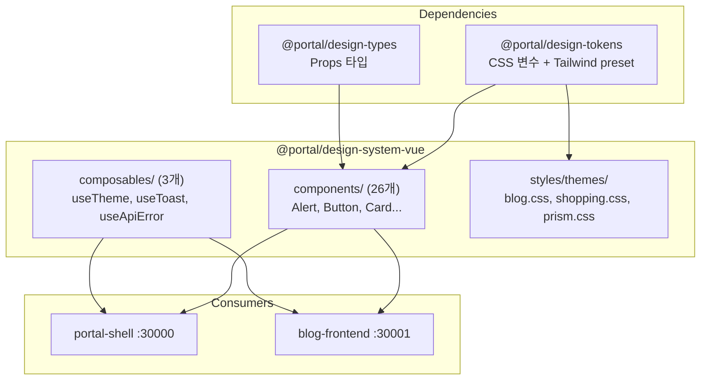

# Vue 컴포넌트 라이브러리

## 개요

`@portal/design-system-vue`는 Vue 3 Composition API 기반 컴포넌트 라이브러리이다. 26개 컴포넌트와 3개 composable을 제공하며, `@portal/design-tokens`의 CSS 변수와 `@portal/design-types`의 타입 시스템을 기반으로 한다.

| 항목 | 내용 |
|------|------|
| 패키지 | `@portal/design-system-vue` |
| 컴포넌트 | 26개 |
| Composable | 4개 (useTheme, useToast, useApiError, useLogger) |
| 유틸리티 | `setupErrorHandler` (전역 에러 핸들러) |
| 소비자 앱 | portal-shell (:30000), blog-frontend (:30001), drive-frontend (:30005), admin-frontend (:30004) |
| 빌드 | Vite library mode + vue-tsc |
| Storybook | port 6006 |

## 아키텍처 다이어그램



## 핵심 컴포넌트

### 컴포넌트 목록 (26개)

#### Form (8개)

| 컴포넌트 | 설명 | v-model |
|---------|------|---------|
| Button | 버튼 (5 variant, 4 size) | - |
| Input | 텍스트 입력 | `modelValue` |
| Textarea | 여러 줄 입력 | `modelValue` |
| Select | 드롭다운 선택 | `modelValue` |
| Checkbox | 체크박스 | `modelValue` |
| Radio | 라디오 버튼 | `modelValue` |
| Switch | 토글 스위치 | `modelValue` |
| SearchBar | 검색창 | `modelValue` |

#### Feedback (7개)

| 컴포넌트 | 설명 |
|---------|------|
| Alert | 알림 박스 (success, error, warning, info) |
| Badge | 뱃지 레이블 |
| Modal | 모달 다이얼로그 |
| Skeleton | 스켈레톤 로더 |
| Spinner | 로딩 스피너 |
| Tag | 태그 |
| Toast | 토스트 알림 |

#### Layout (5개)

| 컴포넌트 | 설명 |
|---------|------|
| Card | 카드 컨테이너 |
| Container | 페이지 래퍼 (max-width) |
| Divider | 구분선 |
| FormField | 폼 필드 래퍼 (label + error) |
| Stack | Flexbox 레이아웃 |

#### Navigation (3개)

| 컴포넌트 | 설명 |
|---------|------|
| Breadcrumb | 브레드크럼 네비게이션 |
| Dropdown | 드롭다운 메뉴 |
| Link | 링크 |
| Tabs | 탭 네비게이션 |

#### Display (2개)

| 컴포넌트 | 설명 |
|---------|------|
| Avatar | 사용자 아바타 |
| ToastContainer | 토스트 컨테이너 (위치 관리) |

### Composable (4개)

| Composable | 설명 |
|-----------|------|
| `useTheme` | 서비스 테마 + Dark/Light 모드 관리 ([상세](./theming.md)) |
| `useToast` | 토스트 알림 표시/제거 |
| `useApiError` | API 에러 응답을 사용자 친화적 메시지로 변환 |
| `useLogger` | 구조화된 Logger 인스턴스 제공 (framework-agnostic createLogger 래핑) |

### setupErrorHandler 유틸리티

위치: `src/composables/setupErrorHandler.ts`

Vue 3 앱의 전역 에러 핸들러를 설정한다. `app.config.errorHandler`에 등록되어 컴포넌트/라우터/Vuex 에러를 캐치한다.

**사용 예시**:
```typescript
// main.ts
import { setupErrorHandler } from '@portal/design-system-vue'

const app = createApp(App)
setupErrorHandler(app)
app.mount('#app')
```

내부적으로 `useLogger()`를 사용하여 캐치된 에러를 로깅한다.

### 서비스 테마 CSS

위치: `src/styles/themes/`

| 파일 | 서비스 | 내용 |
|------|--------|------|
| `blog.css` | Blog | 그린 브랜드, 긴 글 읽기 최적화 typography |
| `shopping.css` | Shopping | 오렌지 브랜드, 상품 카드 그림자 효과 |
| `prism.css` | Prism | Prism 서비스 테마 |

## 데이터 플로우

### 컴포넌트 패턴

모든 컴포넌트는 `<script setup lang="ts">` + `@portal/design-types` Props 패턴을 따른다.

```vue
<script setup lang="ts">
import type { ButtonProps } from '@portal/design-types'

interface Props extends ButtonProps {
  // Vue 전용 확장 props (필요 시)
}

const props = withDefaults(defineProps<Props>(), {
  variant: 'primary',
  size: 'md',
})

const emit = defineEmits<{
  (e: 'click', event: MouseEvent): void
}>()
</script>

<template>
  <button
    :class="[
      'bg-brand-primary text-text-inverse hover:bg-brand-primaryHover',
      'inline-flex items-center justify-center rounded-md',
    ]"
    :disabled="props.disabled || props.loading"
    @click="emit('click', $event)"
  >
    <Spinner v-if="props.loading" size="sm" />
    <slot />
  </button>
</template>
```

### v-model 바인딩

```vue
<!-- 소비자 앱에서 사용 -->
<Input v-model="searchQuery" placeholder="검색..." />
<Select v-model="selectedOption" :options="options" />
<Switch v-model="isDarkMode" label="다크 모드" />
```

## 기술적 결정

### 선택한 패턴

- **`<script setup>`**: 모든 컴포넌트에서 Composition API + `<script setup>` 사용. 보일러플레이트 최소화.
- **defineModel / v-model**: 폼 컴포넌트에서 `defineModel()` 또는 `modelValue` + `emit('update:modelValue')` 패턴 사용.
- **Scoped Styles 최소화**: Tailwind 유틸리티 클래스 우선 사용. 복잡한 커스텀 스타일만 `<style scoped>`로 처리.
- **@portal/design-types 의존**: 컴포넌트 Props를 직접 정의하지 않고, 공유 타입에서 import하여 React와 일관성 유지.

### 외부 의존성

| 패키지 | 버전 | 용도 |
|--------|------|------|
| `vue` | ^3.5.21 | 컴포넌트 프레임워크 |
| `@portal/design-tokens` | workspace | 토큰 + Tailwind preset |
| `@portal/design-types` | workspace | Props 타입 |
| `@fontsource-variable/inter` | ^5.1.1 | Inter 폰트 |

### 빌드 설정

```typescript
// vite.config.ts
export default defineConfig({
  plugins: [vue()],
  build: {
    lib: {
      entry: resolve(__dirname, 'src/index.ts'),
      formats: ['es', 'cjs'],
    },
    rollupOptions: {
      external: ['vue', '@portal/design-tokens', '@portal/design-types'],
    },
  },
})
```

## 관련 문서

- [System Overview](./system-overview.md) - 전체 아키텍처 개요
- [React Components](./react-components.md) - React 컴포넌트 라이브러리
- [Component Matrix](./component-matrix.md) - Vue/React 비교
- [Theming](./theming.md) - 테마 시스템

---

## 변경 이력

| 날짜 | 변경 내용 | 작성자 |
|------|----------|--------|
| 2026-01-18 | 초안 작성 | Laze |
| 2026-02-06 | 업데이트 | Laze |
| 2026-02-14 | setupErrorHandler 유틸리티, useLogger composable 추가 (ADR-040) | Laze |
