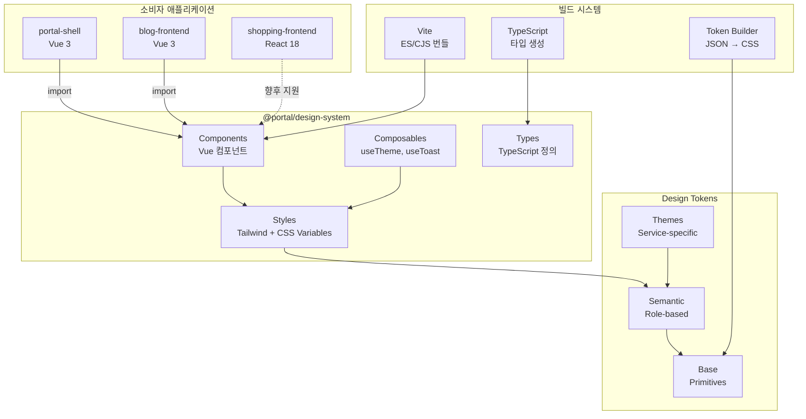
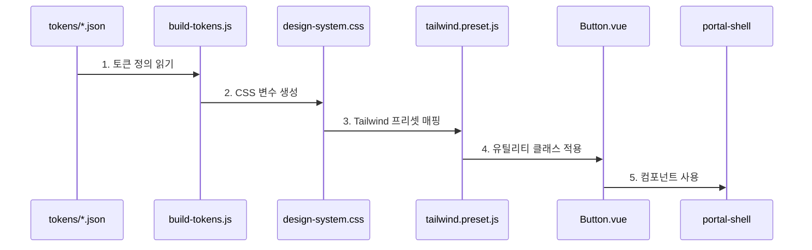

# Design System Overview

Portal Universe Design System의 전체 구조와 핵심 컨셉을 설명합니다.

---

## 📋 개요

Portal Universe Design System은 **3-계층 토큰 시스템**을 기반으로 하여 일관되고 확장 가능한 디자인을 제공하는 Vue 3 컴포넌트 라이브러리입니다.

**핵심 가치**:
- **일관성**: 모든 서비스에서 동일한 컴포넌트 사용
- **확장성**: 서비스별 테마 커스터마이징 지원
- **유지보수성**: 토큰 기반 디자인으로 일괄 변경 가능
- **타입 안전성**: TypeScript 완전 지원

---

## 🎯 핵심 특징

- ✅ **Vue 3 전용**: Composition API, `<script setup>` 패턴
- ✅ **21개 컴포넌트**: Button, Input, Modal, Card 등
- ✅ **3계층 토큰 시스템**: Base → Semantic → Component
- ✅ **서비스별 테마**: Blog (Green), Shopping (Orange)
- ✅ **명암 모드**: Light/Dark 지원
- ✅ **TailwindCSS 통합**: Preset 제공
- ✅ **TypeScript 지원**: 완전한 타입 정의
- ✅ **Storybook 문서화**: 인터랙티브 문서

---

## 🏗️ High-Level Architecture



---

## 📦 컴포넌트 분류

### 입력 컴포넌트 (8)

| 컴포넌트 | 설명 | v-model |
|---------|------|---------|
| Button | 버튼 | ❌ |
| Input | 텍스트 입력 | ✅ |
| Textarea | 여러 줄 입력 | ✅ |
| Select | 드롭다운 선택 | ✅ |
| Checkbox | 체크박스 | ✅ |
| Radio | 라디오 버튼 | ✅ |
| Switch | 토글 스위치 | ✅ |
| SearchBar | 검색창 | ✅ |

### 피드백 컴포넌트 (7)

| 컴포넌트 | 설명 |
|---------|------|
| Modal | 모달 다이얼로그 |
| Toast | 토스트 알림 |
| Badge | 뱃지 레이블 |
| Tag | 태그 |
| Alert | 알림 박스 |
| Spinner | 로딩 스피너 |
| Skeleton | 스켈레톤 로더 |

### 레이아웃 컴포넌트 (6)

| 컴포넌트 | 설명 |
|---------|------|
| Card | 카드 컨테이너 |
| Container | 페이지 래퍼 |
| Stack | Flexbox 레이아웃 |
| Divider | 구분선 |
| FormField | 폼 필드 래퍼 |
| Breadcrumb | 브레드크럼 |

---

## 💾 데이터 흐름

### 토큰 → CSS 변수 → 컴포넌트



**단계별 설명**:

1. **토큰 정의** (`src/tokens/base/colors.json`):
   ```json
   {
     "color": {
       "brand": {
         "primary": "#20C997"
       }
     }
   }
   ```

2. **CSS 변수 생성** (`dist/design-system.css`):
   ```css
   :root {
     --base-color-brand-primary: #20C997;
     --semantic-brand-primary: var(--base-color-brand-primary);
   }
   ```

3. **Tailwind 매핑** (`tailwind.preset.js`):
   ```javascript
   colors: {
     'brand-primary': 'var(--semantic-brand-primary)'
   }
   ```

4. **컴포넌트 사용** (`Button.vue`):
   ```vue
   <button class="bg-brand-primary text-white">
     Click me
   </button>
   ```

---

## 🔗 외부 의존성

| 패키지 | 버전 | 용도 |
|--------|------|------|
| `vue` | ^3.5.13 | 컴포넌트 프레임워크 |
| `tailwindcss` | ^3.4.1 | 유틸리티 CSS |
| `@headlessui/vue` | ^1.7.23 | 접근성 컴포넌트 |
| `@heroicons/vue` | ^2.2.0 | 아이콘 |
| `vite` | ^7.0.5 | 빌드 도구 |

---

## 📈 확장 계획

### Phase 1 (현재)
- ✅ Vue 3 컴포넌트
- ✅ 서비스별 테마 (Blog, Shopping)
- ✅ Light/Dark 모드

### Phase 2 (계획)
- 📋 React 래퍼 컴포넌트
- 📋 추가 컴포넌트 (DataTable, DatePicker 등)

---

## 🔗 관련 문서

- [Token System](./token-system.md) - 토큰 시스템 상세
- [Theming](./theming.md) - 테마 시스템 가이드
- [API Reference](../api/README.md) - API 문서

---

**최종 업데이트**: 2026-01-18
