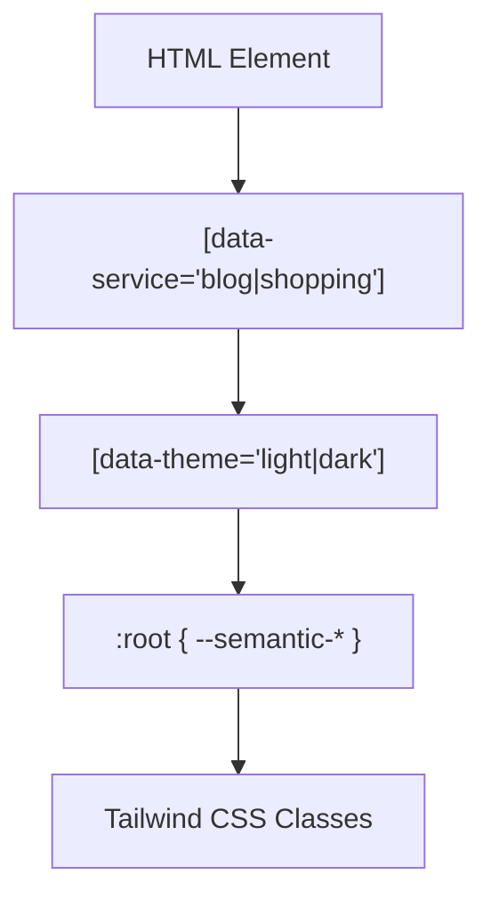

# 테마 시스템 아키텍처

테마 시스템은 다중 명암 모드와 서비스별 브랜드 디자인을 제공합니다.

---

## 📋 개요

- **명암 모드**: Light (밝음) / Dark (어두움)
- **서비스 스타일**: Blog (초록) / Shopping (주황) / Portal (기본)

---

## 🏗️ 아키텍처

### CSS Variables 계층



```
[data-service="blog|shopping"]     <!-- 서비스 컨텍스트 -->
    ↓
[data-theme="light|dark"]          <!-- Light/Dark 모드 -->
    ↓
:root { --semantic-brand-primary: ... }
    ↓
Tailwind CSS 클래스: bg-brand-primary, text-heading
```

---

## 🌗 명암 모드 (Light/Dark)

### HTML 속성

```html
<!-- Light 모드 (기본) -->
<html data-theme="light">
  <body>
    <!-- 밝은 테마 적용 -->
  </body>
</html>

<!-- Dark 모드 -->
<html data-theme="dark" class="dark">
  <body>
    <!-- 어두운 테마 적용 -->
  </body>
</html>
```

### CSS 변수 오버라이드

```css
/* Light 모드 (기본) */
:root {
  --semantic-text-heading: var(--base-color-gray-900);
  --semantic-text-body: var(--base-color-gray-700);
  --semantic-bg-page: var(--base-color-white);
  --semantic-bg-card: var(--base-color-gray-50);
  --semantic-border-default: var(--base-color-gray-200);
}

/* Dark 모드 */
[data-theme="dark"],
.dark {
  --semantic-text-heading: var(--base-color-gray-100);
  --semantic-text-body: var(--base-color-gray-200);
  --semantic-bg-page: var(--base-color-gray-900);
  --semantic-bg-card: var(--base-color-gray-800);
  --semantic-border-default: var(--base-color-gray-700);
}
```

### useTheme Composable

```typescript
// src/composables/useTheme.ts
import { ref } from 'vue'

export type ThemeMode = 'light' | 'dark'
export type ServiceType = 'blog' | 'shopping' | 'portal'

const currentTheme = ref<ThemeMode>('light')
const currentService = ref<ServiceType>('portal')

export function useTheme() {
  const setTheme = (mode: ThemeMode) => {
    currentTheme.value = mode
    document.documentElement.setAttribute('data-theme', mode)
    if (mode === 'dark') {
      document.documentElement.classList.add('dark')
    } else {
      document.documentElement.classList.remove('dark')
    }
    localStorage.setItem('theme', mode)
  }

  const toggleTheme = () => {
    setTheme(currentTheme.value === 'light' ? 'dark' : 'light')
  }

  const setService = (service: ServiceType) => {
    currentService.value = service
    document.documentElement.setAttribute('data-service', service)
    localStorage.setItem('service', service)
  }

  const initTheme = () => {
    // 1. localStorage에서 복원
    const savedTheme = localStorage.getItem('theme') as ThemeMode
    const savedService = localStorage.getItem('service') as ServiceType

    if (savedTheme) {
      setTheme(savedTheme)
    } else if (window.matchMedia('(prefers-color-scheme: dark)').matches) {
      // 2. 시스템 설정 반영
      setTheme('dark')
    }

    if (savedService) {
      setService(savedService)
    }

    // 3. 시스템 설정 변경 감지
    window.matchMedia('(prefers-color-scheme: dark)')
      .addEventListener('change', (e) => {
        if (!localStorage.getItem('theme')) {
          setTheme(e.matches ? 'dark' : 'light')
        }
      })
  }

  return {
    currentTheme,
    currentService,
    setTheme,
    toggleTheme,
    setService,
    initTheme
  }
}
```

---

## 🎨 서비스별 테마

### Blog 서비스 (초록 강조)

**브랜드 색**: `#20C997` (Mantine Green)

**위치**: `src/styles/themes/blog.css`

```css
[data-service="blog"] {
  /* 브랜드 색: 초록 */
  --semantic-brand-primary: #20C997;
  --semantic-brand-primaryHover: #12B886;

  /* Typography 최적화 - 긴 글 읽기를 위한 설정 */
  --font-size-body: 1.125rem;   /* 18px */
  --line-height-body: 1.75;     /* 넓은 줄 간격 */
}

/* Blog 본문 스타일 */
[data-service="blog"] .prose {
  font-size: var(--font-size-body);
  line-height: var(--line-height-body);
}

[data-service="blog"] .prose blockquote {
  border-left: 4px solid var(--semantic-brand-primary);
  padding-left: 1rem;
  font-style: italic;
}
```

### Shopping 서비스 (주황 강조)

**브랜드 색**: `#FF922B` (Mantine Orange)

**위치**: `src/styles/themes/shopping.css`

```css
[data-service="shopping"] {
  /* 브랜드 색: 주황 */
  --semantic-brand-primary: #FF922B;
  --semantic-brand-primaryHover: #FD7E14;

  /* 역동적인 그림자 */
  --shadow-card: 0 4px 12px rgba(255, 146, 43, 0.15);
}

/* Shopping 상품 카드 */
[data-service="shopping"] .product-card {
  box-shadow: var(--shadow-card);
  border-radius: 0.75rem;
}

[data-service="shopping"] .product-price {
  color: var(--semantic-brand-primary);
  font-weight: 700;
}
```

### Portal 서비스 (기본)

```css
:root {
  /* 기본 Mantine Green */
  --semantic-brand-primary: #20C997;
  --semantic-brand-primaryHover: #12B886;
}
```

---

## 🔄 Module Federation 환경

### Portal Shell에서 서비스 전환

```vue
<!-- portal-shell/src/App.vue -->
<script setup lang="ts">
import { watch } from 'vue'
import { useRoute } from 'vue-router'
import { useTheme } from '@portal/design-system'

const route = useRoute()
const { setService } = useTheme()

// 라우트 변경 시 서비스 설정
watch(
  () => route.path,
  (newPath) => {
    if (newPath.includes('blog')) {
      setService('blog')
    } else if (newPath.includes('shopping')) {
      setService('shopping')
    } else {
      setService('portal')
    }
  },
  { immediate: true }
)
</script>

<template>
  <router-view />
</template>
```

### Remote Module에서 Standalone 처리

```vue
<!-- blog-frontend/src/App.vue -->
<script setup lang="ts">
import { onMounted } from 'vue'
import { useTheme } from '@portal/design-system'

onMounted(() => {
  // Standalone 모드에서만 수동 설정
  if (import.meta.env.MODE === 'standalone') {
    const { setService, initTheme } = useTheme()
    initTheme()
    setService('blog')
  }
  // Portal Shell에서는 이미 설정됨
})
</script>
```

---

## 🛠️ Tailwind 통합

### tailwind.config.js

```javascript
export default {
  darkMode: ['class', '[data-theme="dark"]'],
  theme: {
    extend: {
      colors: {
        'brand-primary': 'var(--semantic-brand-primary)',
        'text-heading': 'var(--semantic-text-heading)',
        'bg-page': 'var(--semantic-bg-page)',
        'bg-card': 'var(--semantic-bg-card)',
      }
    }
  }
}
```

### 사용 예시

```vue
<template>
  <div class="bg-page text-body">
    <div class="bg-card border border-default p-4">
      <h1 class="text-heading">제목</h1>
      <p class="text-body">본문</p>
    </div>
  </div>
</template>
```

---

## 🔗 관련 문서

- [System Overview](./system-overview.md) - 전체 시스템 구조
- [Token System](./token-system.md) - 토큰 시스템 상세
- [Theming Guide](../guides/theming-guide.md) - 테마 사용 가이드

---

**최종 업데이트**: 2026-01-18
