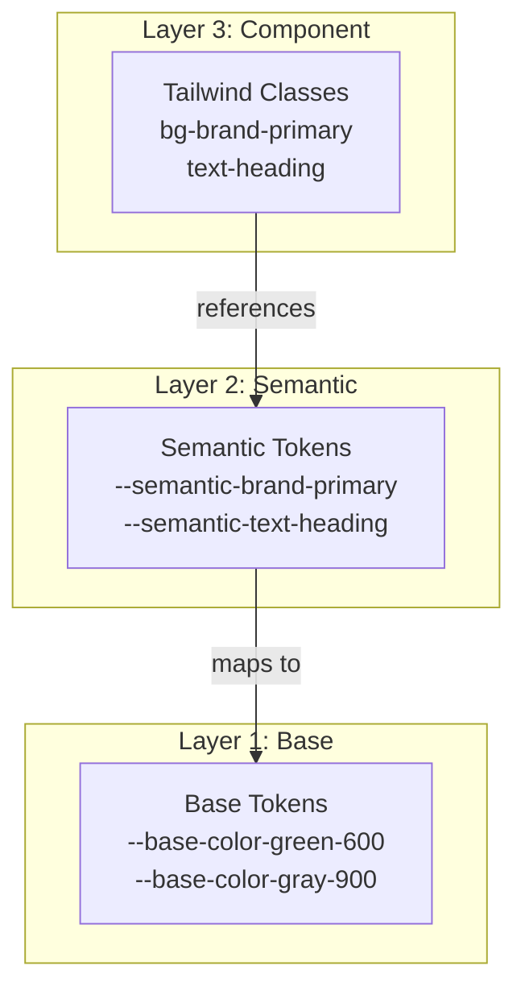

# 3계층 토큰 시스템

Design Tokens는 디자인 결정을 변수화한 값입니다. Portal Universe Design System은 **3-계층 토큰 구조**를 사용하여 확장 가능하고 유지보수하기 쉬운 디자인 시스템을 구축합니다.

---

## 📋 개요



| Layer | 명칭 | 위치 | 용도 |
|-------|------|------|------|
| 1 | Base | `src/tokens/base/` | 원시 값 정의 |
| 2 | Semantic | `src/tokens/semantic/` | 역할 기반 매핑 |
| 3 | Component | Vue 컴포넌트 | 실제 사용 |

---

## 1️⃣ Base Layer (원시 토큰)

### 위치

`src/tokens/base/`

### 파일 구조

| 파일 | 내용 |
|------|------|
| `colors.json` | 컬러 팔레트 |
| `typography.json` | 폰트, 크기, 두께 |
| `spacing.json` | 마진, 패딩 |
| `border.json` | 반경, 너비, 그림자 |

### 컬러 토큰

```json
{
  "color": {
    "brand": {
      "primary": "#20C997",
      "primaryHover": "#12B886",
      "secondary": "#38D9A9"
    },
    "neutral": {
      "white": "#ffffff",
      "50": "#f9fafb",
      "100": "#f3f4f6",
      "200": "#e5e7eb",
      "300": "#d1d5db",
      "400": "#9ca3af",
      "500": "#6b7280",
      "600": "#4b5563",
      "700": "#374151",
      "800": "#1f2937",
      "900": "#111827",
      "black": "#000000"
    },
    "green": {
      "50": "#E6FCF5",
      "500": "#20C997",
      "600": "#12B886"
    },
    "orange": {
      "50": "#FFF4E6",
      "500": "#FF922B",
      "600": "#FD7E14"
    },
    "red": {
      "50": "#FFE3E3",
      "500": "#FA5252",
      "600": "#F03E3E"
    },
    "blue": {
      "50": "#D0EBFF",
      "500": "#339AF0",
      "600": "#228BE6"
    },
    "yellow": {
      "50": "#FFF9DB",
      "500": "#FCC419",
      "600": "#FAB005"
    }
  }
}
```

### Typography 토큰

```json
{
  "font": {
    "family": {
      "sans": "-apple-system, BlinkMacSystemFont, 'Segoe UI', Roboto, sans-serif",
      "mono": "'Fira Code', 'Courier New', monospace"
    },
    "size": {
      "xs": "0.75rem",
      "sm": "0.875rem",
      "base": "1rem",
      "lg": "1.125rem",
      "xl": "1.25rem",
      "2xl": "1.5rem",
      "3xl": "1.875rem"
    },
    "weight": {
      "light": "300",
      "normal": "400",
      "medium": "500",
      "semibold": "600",
      "bold": "700"
    },
    "lineHeight": {
      "tight": "1.25",
      "normal": "1.5",
      "relaxed": "1.625"
    }
  }
}
```

### Spacing 토큰

```json
{
  "spacing": {
    "xs": "0.5rem",
    "sm": "1rem",
    "md": "1.5rem",
    "lg": "2rem",
    "xl": "3rem",
    "2xl": "4rem"
  }
}
```

### Border 토큰

```json
{
  "border": {
    "radius": {
      "none": "0",
      "sm": "0.25rem",
      "default": "0.375rem",
      "md": "0.5rem",
      "lg": "0.75rem",
      "xl": "1rem",
      "full": "9999px"
    },
    "width": {
      "hairline": "0.5px",
      "thin": "1px",
      "medium": "2px",
      "thick": "4px"
    },
    "shadow": {
      "sm": "0 1px 2px rgba(0, 0, 0, 0.05)",
      "md": "0 4px 6px rgba(0, 0, 0, 0.1)",
      "lg": "0 10px 15px rgba(0, 0, 0, 0.1)"
    }
  }
}
```

---

## 2️⃣ Semantic Layer (의미 기반 토큰)

### 위치

`src/tokens/semantic/colors.json`

### 역할

Base 토큰을 참조하여 UI 역할 기반 색상을 정의합니다.

### Brand

```json
{
  "brand": {
    "primary": "{color.brand.primary}",
    "primaryHover": "{color.brand.primaryHover}",
    "secondary": "{color.brand.secondary}"
  }
}
```

### Text Colors

```json
{
  "text": {
    "heading": "{color.gray.900}",
    "body": "{color.gray.900}",
    "meta": "{color.gray.600}",
    "muted": "{color.gray.500}",
    "inverse": "{color.neutral.white}",
    "link": "{color.blue.600}",
    "linkHover": "{color.blue.700}"
  }
}
```

### Background Colors

```json
{
  "bg": {
    "page": "{color.gray.50}",
    "card": "{color.neutral.white}",
    "elevated": "{color.neutral.white}",
    "muted": "{color.gray.100}",
    "hover": "{color.gray.50}"
  }
}
```

### Border Colors

```json
{
  "border": {
    "default": "{color.gray.200}",
    "hover": "{color.gray.300}",
    "focus": "{color.blue.600}",
    "muted": "{color.gray.100}"
  }
}
```

### Status Colors

```json
{
  "status": {
    "success": "{color.green.600}",
    "successBg": "{color.green.50}",
    "error": "{color.red.600}",
    "errorBg": "{color.red.50}",
    "warning": "{color.yellow.600}",
    "warningBg": "{color.yellow.50}",
    "info": "{color.blue.600}",
    "infoBg": "{color.blue.50}"
  }
}
```

---

## 3️⃣ Component Layer (컴포넌트 토큰)

### 위치

각 Vue 컴포넌트 파일 (`src/components/**/*.vue`)

### Tailwind Preset 매핑

`tailwind.preset.js`:

```javascript
colors: {
  'brand': {
    'primary': 'var(--semantic-brand-primary)',
    'primaryHover': 'var(--semantic-brand-primaryHover)'
  },
  'text': {
    'heading': 'var(--semantic-text-heading)',
    'body': 'var(--semantic-text-body)',
    'meta': 'var(--semantic-text-meta)'
  },
  'bg': {
    'page': 'var(--semantic-bg-page)',
    'card': 'var(--semantic-bg-card)'
  }
}
```

### 컴포넌트에서 사용

```vue
<!-- Button.vue -->
<template>
  <button class="bg-brand-primary text-white hover:bg-brand-primaryHover">
    <slot />
  </button>
</template>
```

---

## 🔄 CSS 변수 생성

### 빌드 프로세스

```bash
npm run build:tokens
# scripts/build-tokens.js 실행
```

### 생성된 CSS 변수

```css
/* dist/design-system.css */

/* Base 토큰 */
:root {
  --base-color-brand-primary: #20C997;
  --base-color-brand-primaryHover: #12B886;
  --base-color-gray-900: #212529;
  --base-font-family-sans: -apple-system, BlinkMacSystemFont...;
  --base-spacing-xs: 0.5rem;
  --base-spacing-sm: 1rem;
  --base-border-radius-md: 0.5rem;
}

/* Semantic 토큰 */
:root {
  --semantic-brand-primary: var(--base-color-brand-primary);
  --semantic-text-heading: var(--base-color-gray-900);
  --semantic-bg-page: var(--base-color-gray-50);
  --semantic-border-default: var(--base-color-gray-200);
  --semantic-status-success: var(--base-color-green-600);
}
```

---

## 🎨 테마 오버라이드

### Blog 테마

```css
/* src/styles/themes/blog.css */
[data-service="blog"] {
  --semantic-brand-primary: #20C997;
  --semantic-brand-primaryHover: #12B886;
}
```

### Shopping 테마

```css
/* src/styles/themes/shopping.css */
[data-service="shopping"] {
  --semantic-brand-primary: #FF922B;
  --semantic-brand-primaryHover: #FD7E14;
}
```

### Dark 모드

```css
[data-theme="dark"],
.dark {
  --semantic-text-heading: var(--base-color-gray-100);
  --semantic-bg-page: var(--base-color-gray-900);
  --semantic-bg-card: var(--base-color-gray-800);
}
```

---

## 💡 모범 사례

### ✓ 해야 할 것

- Semantic 토큰 사용: `bg-brand-primary`, `text-heading`
- 의미 기반 토큰 이름 사용: `text-muted`, `bg-elevated`
- 서비스별 오버라이드: `data-service` 속성

### ✗ 하지 말아야 할 것

- Base 색상 직접 사용 금지: `--base-color-gray-900`
- 하드코딩 색상값 금지: `#212529`
- 인라인 스타일로 색상 오버라이드 금지

---

## 🔗 관련 문서

- [System Overview](./system-overview.md) - 전체 시스템 구조
- [Theming](./theming.md) - 테마 시스템 가이드
- [API Reference](../api/README.md) - API 문서

---

**최종 업데이트**: 2026-01-18
