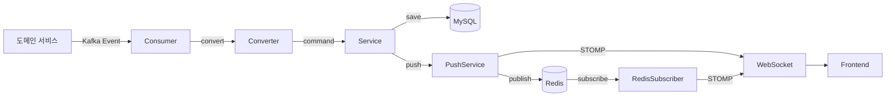
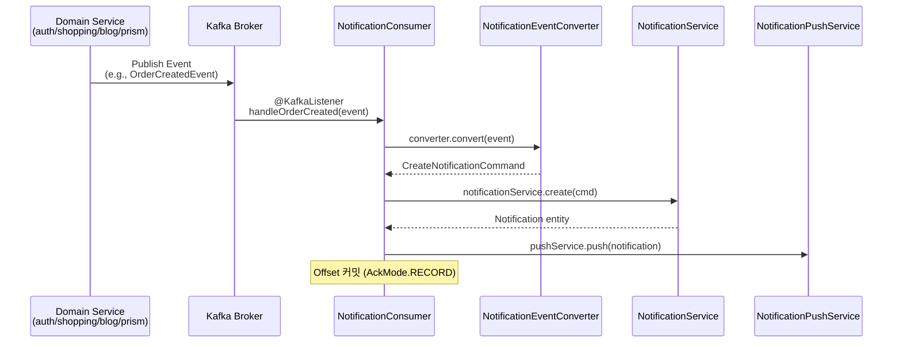
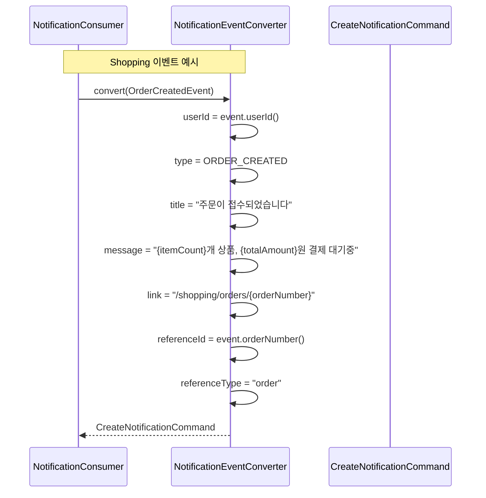
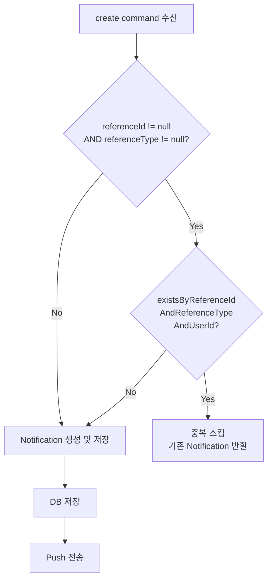
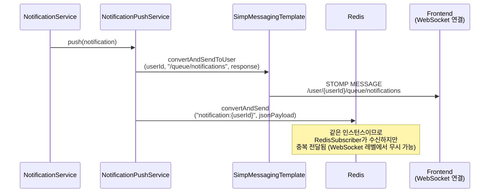
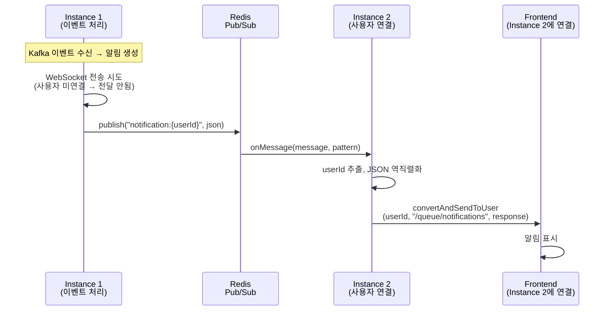
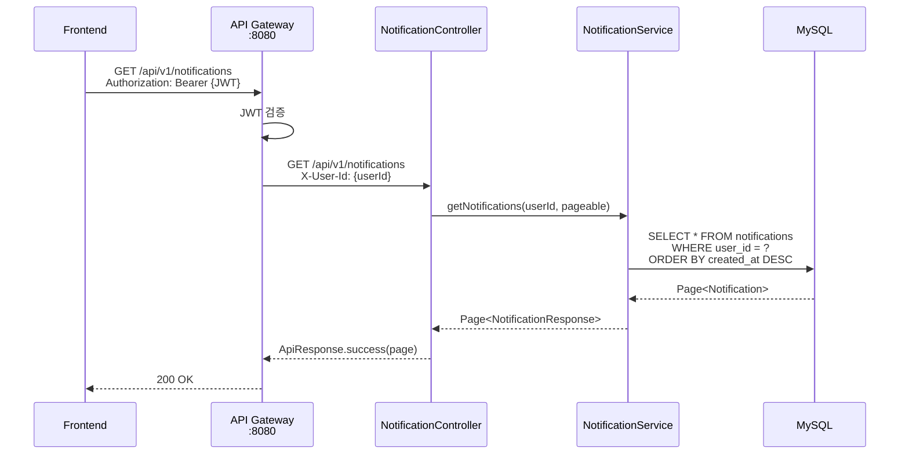
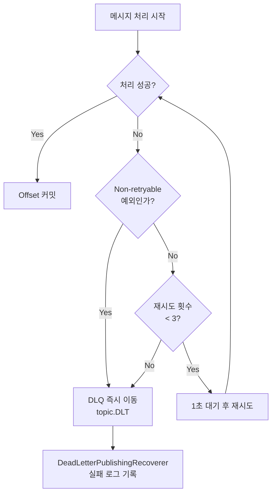
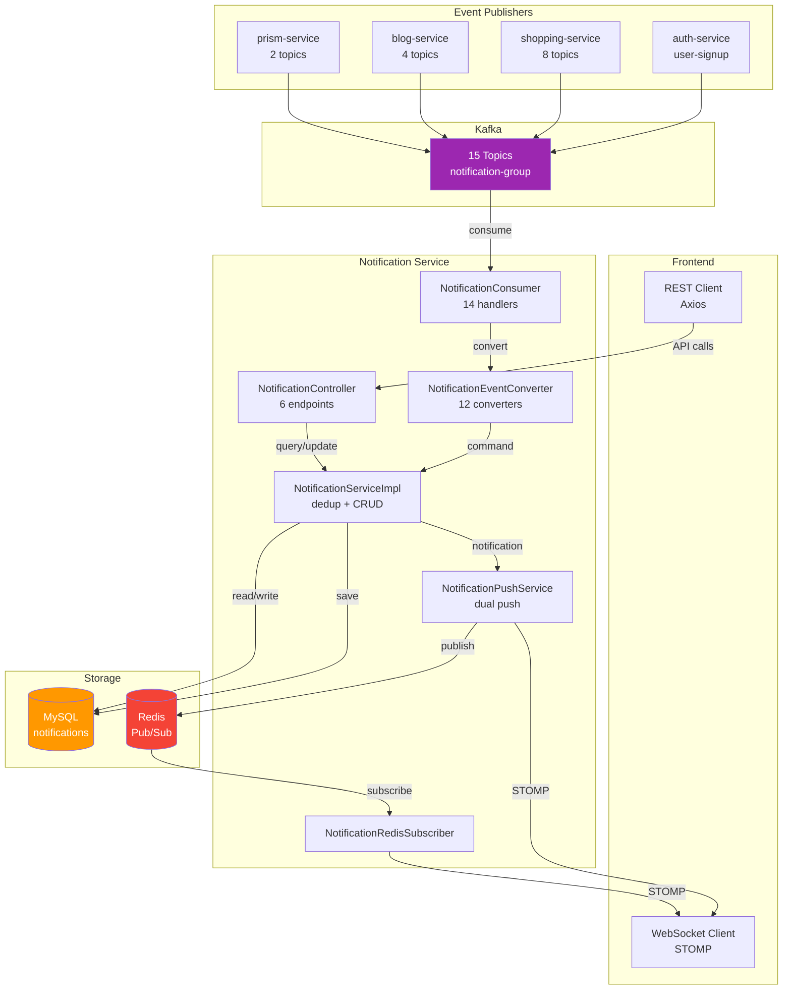

# Notification Service Data Flow

## 📋 개요

Notification Service는 Kafka 이벤트 소비부터 실시간 WebSocket 전달까지 여러 단계의 데이터 흐름을 관리합니다. 이 문서는 6개 주요 데이터 흐름을 시퀀스 다이어그램과 함께 설명합니다.

### 핵심 컴포넌트

- **NotificationConsumer**: 14개 Kafka 토픽 리스너
- **NotificationEventConverter**: 이벤트 → 커맨드 변환기
- **NotificationServiceImpl**: 알림 CRUD + 중복 방지
- **NotificationPushService**: WebSocket + Redis Pub/Sub 실시간 전달
- **NotificationRedisSubscriber**: Cross-instance 알림 수신

### 전체 흐름 개요



---

## 🔄 주요 데이터 흐름

### 1. Kafka 이벤트 소비 플로우

도메인 서비스에서 발행된 이벤트가 Kafka를 통해 Notification Service에 전달되는 흐름입니다.



#### 도메인별 토픽 상세 (15개)

| 도메인 | 토픽 | 이벤트 | Consumer 핸들러 |
|--------|------|--------|----------------|
| **Auth** | `user-signup` | `UserSignedUpEvent` | `handleUserSignup` |
| **Shopping** | `shopping.order.created` | `OrderCreatedEvent` | `handleOrderCreated` |
| | `shopping.order.confirmed` | `OrderConfirmedEvent` | (토픽 정의됨, 핸들러 미구현) |
| | `shopping.order.cancelled` | `OrderCancelledEvent` | `handleOrderCancelled` |
| | `shopping.delivery.shipped` | `DeliveryShippedEvent` | `handleDeliveryShipped` |
| | `shopping.payment.completed` | `PaymentCompletedEvent` | `handlePaymentCompleted` |
| | `shopping.payment.failed` | `PaymentFailedEvent` | `handlePaymentFailed` |
| | `shopping.coupon.issued` | `CouponIssuedEvent` | `handleCouponIssued` |
| | `shopping.timedeal.started` | `TimeDealStartedEvent` | `handleTimeDealStarted` (skip) |
| **Blog** | `blog.post.liked` | `PostLikedEvent` | `handlePostLiked` |
| | `blog.post.commented` | `CommentCreatedEvent` | `handleCommentCreated` |
| | `blog.comment.replied` | `CommentRepliedEvent` | `handleCommentReplied` |
| | `blog.user.followed` | `UserFollowedEvent` | `handleUserFollowed` |
| **Prism** | `prism.task.completed` | `PrismTaskCompletedEvent` | `handlePrismTaskCompleted` |
| | `prism.task.failed` | `PrismTaskFailedEvent` | `handlePrismTaskFailed` |

#### 핸들러 처리 패턴

대부분의 핸들러는 동일한 패턴을 따릅니다:

```java
@KafkaListener(topics = NotificationConstants.TOPIC_ORDER_CREATED,
               groupId = "${spring.kafka.consumer.group-id}")
public void handleOrderCreated(OrderCreatedEvent event) {
    log.info("Received order created event: orderNumber={}", event.orderNumber());
    try {
        CreateNotificationCommand cmd = converter.convert(event);
        createAndPushNotification(cmd);
    } catch (Exception e) {
        log.error("Failed to process order created event: {}", e.getMessage(), e);
        throw e; // DefaultErrorHandler가 재시도/DLQ 처리
    }
}
```

**예외 처리**: `handleUserSignup`은 인라인으로 `NotificationEvent`를 직접 생성하며, `handleTimeDealStarted`는 broadcast 대상(구독 모델 미구현)으로 현재 로그만 남기고 skip합니다.

---

### 2. Event → Notification 변환 플로우

`NotificationEventConverter`가 12개 도메인 이벤트를 `CreateNotificationCommand`로 변환합니다.



#### 변환 매핑 상세

| 이벤트 | type | title | message 템플릿 | referenceId | referenceType |
|--------|------|-------|---------------|-------------|---------------|
| `OrderCreatedEvent` | `ORDER_CREATED` | 주문이 접수되었습니다 | `{itemCount}개 상품, {totalAmount}원 결제 대기중` | `orderNumber` | `order` |
| `OrderCancelledEvent` | `ORDER_CANCELLED` | 주문이 취소되었습니다 | `주문번호: {orderNumber} - {cancelReason}` | `orderNumber` | `order` |
| `PaymentCompletedEvent` | `PAYMENT_COMPLETED` | 결제가 완료되었습니다 | `{amount}원 결제 완료` | `paymentNumber` | `payment` |
| `PaymentFailedEvent` | `PAYMENT_FAILED` | 결제가 실패했습니다 | `사유: {failureReason}` (50자 제한) | `paymentNumber` | `payment` |
| `DeliveryShippedEvent` | `DELIVERY_STARTED` | 배송이 시작되었습니다 | `운송장번호: {trackingNumber} ({carrier})` | `trackingNumber` | `delivery` |
| `CouponIssuedEvent` | `COUPON_ISSUED` | 쿠폰이 발급되었습니다 | `{couponName} - {discountValue}할인` | `couponCode` | `coupon` |
| `PostLikedEvent` | `BLOG_LIKE` | 게시글에 좋아요가 달렸습니다 | `"{postTitle}"에 {likerName}님이 좋아요를 눌렀습니다` | `likeId` | `like` |
| `CommentCreatedEvent` | `BLOG_COMMENT` | 게시글에 새 댓글이 달렸습니다 | `"{postTitle}"에 {commenterName}님이 댓글을 달았습니다: {content}` | `commentId` | `comment` |
| `CommentRepliedEvent` | `BLOG_REPLY` | 댓글에 답글이 달렸습니다 | `{replierName}님이 회원님의 댓글에 답글을 달았습니다: {content}` | `replyId` | `reply` |
| `UserFollowedEvent` | `BLOG_FOLLOW` | 새 팔로워가 생겼습니다 | `{followerName}님이 회원님을 팔로우하기 시작했습니다` | `followId` | `follow` |
| `PrismTaskCompletedEvent` | `PRISM_TASK_COMPLETED` | AI 태스크가 완료되었습니다 | `"{title}" 태스크가 {agentName} 에이전트에 의해 완료되었습니다` | `taskId` | `task` |
| `PrismTaskFailedEvent` | `PRISM_TASK_FAILED` | AI 태스크가 실패했습니다 | `"{title}" 태스크 실행 실패: {errorMessage}` | `taskId` | `task` |

> message 필드에서 긴 텍스트는 `truncate()` 헬퍼로 잘립니다 (postTitle: 20~30자, content: 30~40자, errorMessage: 30자).

---

### 3. Deduplication 메커니즘

동일 이벤트가 재처리(Kafka 재시도 등)되더라도 중복 알림을 생성하지 않습니다.



**핵심 쿼리**:
```java
boolean existsByReferenceIdAndReferenceTypeAndUserId(
    String referenceId, String referenceType, String userId);
```

**인덱스 활용**: `idx_notification_ref (reference_id, reference_type, user_id)` 복합 인덱스로 O(1) 조회

---

### 4. 실시간 Push 플로우 (WebSocket + Redis Pub/Sub)

알림 생성 후 사용자에게 실시간으로 전달하는 dual mechanism입니다.

#### 단일 인스턴스 시나리오



#### 멀티 인스턴스 시나리오



---

### 5. REST API 조회 플로우

프론트엔드에서 REST API로 알림을 조회/관리하는 흐름입니다.



#### 엔드포인트별 데이터 흐름

| 엔드포인트 | Service 메서드 | Repository 쿼리 |
|-----------|---------------|----------------|
| `GET /notifications` | `getNotifications` | `findByUserIdOrderByCreatedAtDesc` |
| `GET /notifications/unread` | `getUnreadNotifications` | `findByUserIdAndStatusOrderByCreatedAtDesc` |
| `GET /notifications/unread/count` | `getUnreadCount` | `countByUserIdAndStatus` |
| `PUT /notifications/{id}/read` | `markAsRead` | `findByIdAndUserId` → `markAsRead()` |
| `PUT /notifications/read-all` | `markAllAsRead` | `UPDATE ... SET status='READ' WHERE userId=? AND status='UNREAD'` |
| `DELETE /notifications/{id}` | `delete` | `deleteByUserIdAndId` |

---

### 6. 에러 처리 플로우 (Retry + DLQ)

Kafka 메시지 처리 실패 시 재시도 및 Dead Letter Queue 이동 흐름입니다.



**Non-retryable 예외**: `IllegalArgumentException`, `NullPointerException`

**DLQ 토픽 네이밍**: 원본 토픽 + `.DLT` (예: `shopping.order.created.DLT`)

**ErrorHandlingDeserializer**: 역직렬화 실패 시에도 Consumer가 중단되지 않고 에러 핸들러로 위임됩니다.

---

## 📨 이벤트 스키마 상세

### Auth Domain

#### UserSignedUpEvent

```java
public record UserSignedUpEvent(
    String userId,
    String email,
    String name
) {}
```

### Shopping Domain

#### OrderCreatedEvent

```java
public record OrderCreatedEvent(
    String orderNumber,
    String userId,
    BigDecimal totalAmount,
    int itemCount,
    List<OrderItemInfo> items,
    LocalDateTime createdAt
) {
    public record OrderItemInfo(
        Long productId, String productName,
        int quantity, BigDecimal price
    ) {}
}
```

#### OrderCancelledEvent

```java
public record OrderCancelledEvent(
    String orderNumber, String userId,
    BigDecimal totalAmount, String cancelReason,
    LocalDateTime cancelledAt
) {}
```

#### PaymentCompletedEvent / PaymentFailedEvent

```java
public record PaymentCompletedEvent(
    String paymentNumber, String orderNumber, String userId,
    BigDecimal amount, String paymentMethod,
    String pgTransactionId, LocalDateTime paidAt
) {}

public record PaymentFailedEvent(
    String paymentNumber, String orderNumber, String userId,
    BigDecimal amount, String paymentMethod,
    String failureReason, LocalDateTime failedAt
) {}
```

#### DeliveryShippedEvent

```java
public record DeliveryShippedEvent(
    String trackingNumber, String orderNumber, String userId,
    String carrier, LocalDateTime estimatedDeliveryDate,
    LocalDateTime shippedAt
) {}
```

#### CouponIssuedEvent

```java
public record CouponIssuedEvent(
    String userId, String couponCode, String couponName,
    String discountType, int discountValue,
    LocalDateTime expiresAt
) {}
```

### Blog Domain

#### PostLikedEvent

```java
public record PostLikedEvent(
    String likeId, Long postId, String postTitle,
    String authorId, String likerId, String likerName,
    LocalDateTime likedAt
) {}
```

#### CommentCreatedEvent / CommentRepliedEvent

```java
public record CommentCreatedEvent(
    String commentId, Long postId, String postTitle,
    String authorId, String commenterId, String commenterName,
    String content, LocalDateTime createdAt
) {}

public record CommentRepliedEvent(
    String replyId, Long postId, Long parentCommentId,
    String parentCommentAuthorId, String replierId,
    String replierName, String content, LocalDateTime createdAt
) {}
```

#### UserFollowedEvent

```java
public record UserFollowedEvent(
    String followId, String followeeId,
    String followerId, String followerName,
    LocalDateTime followedAt
) {}
```

### Prism Domain

#### PrismTaskCompletedEvent / PrismTaskFailedEvent

```java
public record PrismTaskCompletedEvent(
    Integer taskId, Integer boardId, String userId,
    String title, String status, String agentName,
    Integer executionId, String timestamp
) {}

public record PrismTaskFailedEvent(
    Integer taskId, Integer boardId, String userId,
    String title, String status, String agentName,
    Integer executionId, String errorMessage, String timestamp
) {}
```

---

## 🔌 WebSocket 설정

### STOMP 엔드포인트

| 설정 | 값 |
|------|-----|
| **WebSocket Endpoint** | `/ws/notifications` (SockJS fallback) |
| **Simple Broker** | `/topic`, `/queue` |
| **Application Prefix** | `/app` |
| **User Destination Prefix** | `/user` |
| **알림 수신 경로** | `/user/{userId}/queue/notifications` |

### CORS 설정 (환경별)

| 환경 | 허용 Origin |
|------|------------|
| local | `*` |
| docker | `https://localhost:30000`, `https://portal-shell:30000` |
| kubernetes | `https://portal-universe.com`, `https://www.portal-universe.com` |

---

## 📡 Redis Pub/Sub 채널

| 설정 | 값 |
|------|-----|
| **채널 패턴** | `notification:{userId}` |
| **구독 패턴** | `notification:*` (PatternTopic) |
| **직렬화** | `GenericJackson2JsonRedisSerializer` + `JavaTimeModule` |
| **Subscriber** | `NotificationRedisSubscriber.onMessage(message, pattern)` |

---

## 📊 데이터 흐름 요약



---

## 📝 변경 이력

| 날짜 | 작성자 | 변경 내용 |
|------|--------|-----------|
| 2026-02-06 | Claude | 초기 문서 작성 (코드베이스 기반) |
