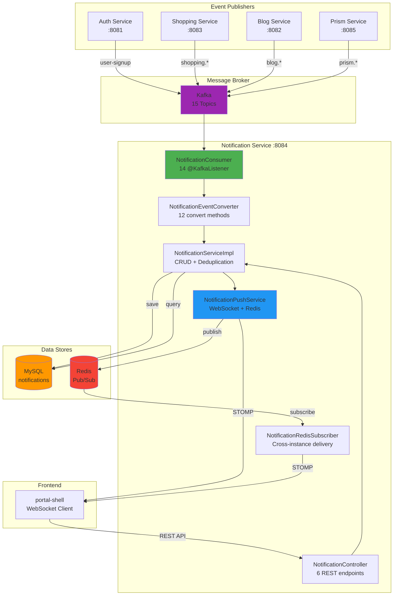
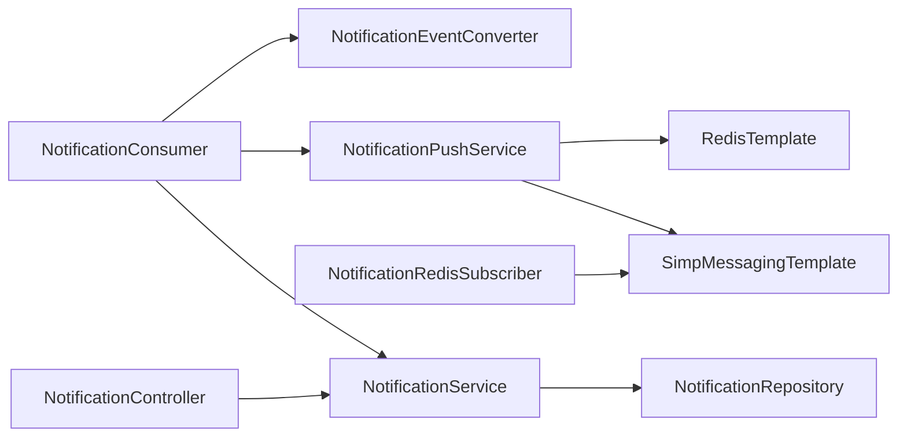

# Notification Service 시스템 아키텍처

## 📋 개요

Notification Service는 Portal Universe 플랫폼의 인앱 알림 전용 서비스입니다. 4개 도메인(Auth, Shopping, Blog, Prism)의 Kafka 이벤트를 소비하여 통합 알림으로 변환하고, WebSocket(STOMP) + Redis Pub/Sub를 통해 실시간으로 사용자에게 전달합니다.

| 항목 | 내용 |
|------|------|
| **범위** | Service |
| **주요 기술** | Spring Boot 3.5.5, Spring Kafka, WebSocket(STOMP), Redis Pub/Sub, MySQL, Flyway |
| **배포 환경** | Local, Docker Compose, Kubernetes |
| **관련 서비스** | auth-service, shopping-service, blog-service, prism-service |

### 핵심 역할

- **이벤트 수신**: 4개 도메인 15개 Kafka 토픽 구독 (14개 핸들러)
- **통합 변환**: 도메인별 이벤트를 `CreateNotificationCommand`로 통합 변환
- **Idempotent 저장**: `referenceId` + `referenceType` + `userId` 기반 중복 방지
- **실시간 푸시**: WebSocket(STOMP) + Redis Pub/Sub dual push
- **REST API**: 6개 엔드포인트로 알림 조회/관리

### 서비스 정보

- **Port**: 8084
- **Base Path**: `/api/v1/notifications`
- **WebSocket Endpoint**: `/ws/notifications` (SockJS)
- **Health Check**: `http://localhost:8084/actuator/health`

---

## 🎯 핵심 특징

### 1. 인앱 알림 전용

Email, SMS, Push 채널은 사용하지 않으며, 브라우저 내 실시간 알림에 집중합니다. 향후 채널 확장이 필요할 경우 `NotificationPushService` 레이어에서 확장 가능합니다.

### 2. Kafka Consumer (4개 도메인, 15개 토픽)

| 도메인 | 토픽 수 | 핸들러 | 비고 |
|--------|---------|--------|------|
| Auth | 1 | 1 | `user-signup` |
| Shopping | 8 | 8 | 주문, 결제, 배송, 쿠폰, 타임딜 |
| Blog | 4 | 4 | 좋아요, 댓글, 답글, 팔로우 |
| Prism | 2 | 2 | AI 태스크 완료/실패 |

### 3. Event-to-Notification 통합 변환

`NotificationEventConverter`가 12개 도메인 이벤트를 단일 `CreateNotificationCommand`로 변환합니다. 변환 시 title, message, link, referenceId, referenceType을 결정합니다.

### 4. WebSocket + Redis Pub/Sub Dual Push

- **WebSocket**: 같은 인스턴스에 연결된 사용자에게 즉시 전달
- **Redis Pub/Sub**: 다른 인스턴스에 연결된 사용자에게 cross-instance 전달

### 5. 수동 Offset 커밋 + DLQ

- `AckMode.RECORD`: 각 레코드 처리 완료 후 offset 커밋
- `FixedBackOff(1s, 3회)` 재시도 후 `.DLT` 토픽으로 이동

---

## 🏗️ High-Level Architecture



### 내부 컴포넌트 관계



---

## 📦 컴포넌트 상세

### 1. NotificationConsumer

**경로**: `com.portal.universe.notificationservice.consumer.NotificationConsumer`

**역할**: Kafka 메시지를 수신하는 진입점. 14개 `@KafkaListener` 핸들러로 구성됩니다.

**도메인별 핸들러**:

| 핸들러 | 토픽 | 이벤트 타입 | 발행자 |
|--------|------|-----------|--------|
| `handleUserSignup` | `user-signup` | `UserSignedUpEvent` | auth-service |
| `handleOrderCreated` | `shopping.order.created` | `OrderCreatedEvent` | shopping-service |
| `handleOrderCancelled` | `shopping.order.cancelled` | `OrderCancelledEvent` | shopping-service |
| `handlePaymentCompleted` | `shopping.payment.completed` | `PaymentCompletedEvent` | shopping-service |
| `handlePaymentFailed` | `shopping.payment.failed` | `PaymentFailedEvent` | shopping-service |
| `handleDeliveryShipped` | `shopping.delivery.shipped` | `DeliveryShippedEvent` | shopping-service |
| `handleCouponIssued` | `shopping.coupon.issued` | `CouponIssuedEvent` | shopping-service |
| `handleTimeDealStarted` | `shopping.timedeal.started` | `TimeDealStartedEvent` | shopping-service |
| `handlePostLiked` | `blog.post.liked` | `PostLikedEvent` | blog-service |
| `handleCommentCreated` | `blog.post.commented` | `CommentCreatedEvent` | blog-service |
| `handleCommentReplied` | `blog.comment.replied` | `CommentRepliedEvent` | blog-service |
| `handleUserFollowed` | `blog.user.followed` | `UserFollowedEvent` | blog-service |
| `handlePrismTaskCompleted` | `prism.task.completed` | `PrismTaskCompletedEvent` | prism-service |
| `handlePrismTaskFailed` | `prism.task.failed` | `PrismTaskFailedEvent` | prism-service |

> `handleUserSignup`은 인라인으로 `NotificationEvent`를 생성하며, `handleTimeDealStarted`는 broadcast 대상(구독 모델 미구현)으로 현재 skip 처리됩니다.

### 2. NotificationEventConverter

**경로**: `com.portal.universe.notificationservice.converter.NotificationEventConverter`

**역할**: 12개 도메인 이벤트를 `CreateNotificationCommand`로 변환합니다.

| 이벤트 | NotificationType | title | link 패턴 | referenceType |
|--------|-----------------|-------|----------|---------------|
| `OrderCreatedEvent` | `ORDER_CREATED` | 주문이 접수되었습니다 | `/shopping/orders/{orderNumber}` | `order` |
| `OrderCancelledEvent` | `ORDER_CANCELLED` | 주문이 취소되었습니다 | `/shopping/orders/{orderNumber}` | `order` |
| `PaymentCompletedEvent` | `PAYMENT_COMPLETED` | 결제가 완료되었습니다 | `/shopping/orders/{orderNumber}` | `payment` |
| `PaymentFailedEvent` | `PAYMENT_FAILED` | 결제가 실패했습니다 | `/shopping/orders/{orderNumber}` | `payment` |
| `DeliveryShippedEvent` | `DELIVERY_STARTED` | 배송이 시작되었습니다 | `/shopping/orders/{orderNumber}` | `delivery` |
| `CouponIssuedEvent` | `COUPON_ISSUED` | 쿠폰이 발급되었습니다 | `/shopping/coupons` | `coupon` |
| `PostLikedEvent` | `BLOG_LIKE` | 게시글에 좋아요가 달렸습니다 | `/blog/{postId}` | `like` |
| `CommentCreatedEvent` | `BLOG_COMMENT` | 게시글에 새 댓글이 달렸습니다 | `/blog/{postId}` | `comment` |
| `CommentRepliedEvent` | `BLOG_REPLY` | 댓글에 답글이 달렸습니다 | `/blog/{postId}#comment-{parentId}` | `reply` |
| `UserFollowedEvent` | `BLOG_FOLLOW` | 새 팔로워가 생겼습니다 | `/blog/users/{followeeId}/followers` | `follow` |
| `PrismTaskCompletedEvent` | `PRISM_TASK_COMPLETED` | AI 태스크가 완료되었습니다 | `/prism/boards/{boardId}/tasks/{taskId}` | `task` |
| `PrismTaskFailedEvent` | `PRISM_TASK_FAILED` | AI 태스크가 실패했습니다 | `/prism/boards/{boardId}/tasks/{taskId}` | `task` |

### 3. NotificationServiceImpl

**경로**: `com.portal.universe.notificationservice.service.NotificationServiceImpl`

**역할**: 알림 CRUD 및 deduplication 로직을 담당합니다.

**주요 기능**:
- **create**: `referenceId` + `referenceType` + `userId` 조합으로 중복 체크 후 저장
- **getNotifications**: 사용자별 알림 목록 조회 (페이지네이션, 최신순)
- **getUnreadNotifications**: 미읽음 알림만 조회
- **getUnreadCount**: 미읽음 알림 개수
- **markAsRead**: 개별 알림 읽음 처리
- **markAllAsRead**: 사용자의 모든 미읽음 알림 읽음 처리 (벌크 업데이트)
- **delete**: 알림 삭제

### 4. NotificationPushService

**경로**: `com.portal.universe.notificationservice.service.NotificationPushService`

**역할**: 알림 생성 후 실시간으로 사용자에게 전달합니다.

**Dual Push 메커니즘**:
1. **WebSocket 직접 전송**: `SimpMessagingTemplate.convertAndSendToUser()`로 같은 인스턴스에 연결된 사용자에게 즉시 전달
2. **Redis Pub/Sub 발행**: `notification:{userId}` 채널에 JSON 직렬화하여 publish. 다른 인스턴스의 `NotificationRedisSubscriber`가 수신하여 WebSocket으로 전달

### 5. NotificationRedisSubscriber

**경로**: `com.portal.universe.notificationservice.common.config.NotificationRedisSubscriber`

**역할**: Redis Pub/Sub 메시지를 수신하여 cross-instance WebSocket 전달을 담당합니다.

**동작 방식**:
1. `notification:*` 패턴으로 Redis 채널 구독
2. 채널명에서 userId 추출 (`notification:{userId}`)
3. JSON 역직렬화 후 `SimpMessagingTemplate`으로 해당 사용자에게 WebSocket 전송

### 6. NotificationController

**경로**: `com.portal.universe.notificationservice.controller.NotificationController`

**역할**: REST API를 통한 알림 조회 및 관리. 모든 엔드포인트는 `X-User-Id` 헤더를 요구합니다.

| Method | Path | 설명 |
|--------|------|------|
| `GET` | `/api/v1/notifications` | 알림 목록 조회 (페이지네이션) |
| `GET` | `/api/v1/notifications/unread` | 미읽음 알림 조회 |
| `GET` | `/api/v1/notifications/unread/count` | 미읽음 개수 조회 |
| `PUT` | `/api/v1/notifications/{id}/read` | 개별 읽음 처리 |
| `PUT` | `/api/v1/notifications/read-all` | 전체 읽음 처리 |
| `DELETE` | `/api/v1/notifications/{id}` | 알림 삭제 |

---

## 💾 데이터 모델

### notifications 테이블

Flyway 마이그레이션 V1, V2로 관리됩니다.

```sql
CREATE TABLE notifications (
    id          BIGINT AUTO_INCREMENT PRIMARY KEY,
    user_id     VARCHAR(36)  NOT NULL,
    type        VARCHAR(50)  NOT NULL,
    title       VARCHAR(255) NOT NULL,
    message     TEXT         NOT NULL,
    link        VARCHAR(500),
    status      VARCHAR(20)  NOT NULL DEFAULT 'UNREAD',
    reference_id   VARCHAR(100),
    reference_type VARCHAR(50),
    created_at  DATETIME,
    read_at     DATETIME
);
```

### 인덱스

| 인덱스 | 컬럼 | 용도 |
|--------|------|------|
| `idx_notification_user_status` | `user_id, status` | 미읽음 알림 조회 |
| `idx_notification_user_created` | `user_id, created_at DESC` | 최신순 목록 조회 |
| `idx_notification_ref` | `reference_id, reference_type, user_id` | Idempotent 중복 체크 (V2) |

### NotificationType enum (21개)

| 카테고리 | 값 | 기본 메시지 |
|----------|-----|-----------|
| **Order** | `ORDER_CREATED`, `ORDER_CONFIRMED`, `ORDER_CANCELLED` | 주문 접수/확정/취소 |
| **Delivery** | `DELIVERY_STARTED`, `DELIVERY_IN_TRANSIT`, `DELIVERY_COMPLETED` | 발송/배송중/배송완료 |
| **Payment** | `PAYMENT_COMPLETED`, `PAYMENT_FAILED`, `REFUND_COMPLETED` | 결제완료/실패/환불완료 |
| **Coupon** | `COUPON_ISSUED`, `COUPON_EXPIRING` | 쿠폰 발급/만료 임박 |
| **TimeDeal** | `TIMEDEAL_STARTING`, `TIMEDEAL_STARTED` | 타임딜 시작 예정/시작 |
| **Blog** | `BLOG_LIKE`, `BLOG_COMMENT`, `BLOG_REPLY`, `BLOG_FOLLOW`, `BLOG_NEW_POST` | 좋아요/댓글/답글/팔로우/새 글 |
| **Prism** | `PRISM_TASK_COMPLETED`, `PRISM_TASK_FAILED` | AI 태스크 완료/실패 |
| **System** | `SYSTEM` | 시스템 알림 |

### NotificationStatus enum

| 값 | 설명 |
|-----|------|
| `UNREAD` | 미읽음 (기본값) |
| `READ` | 읽음 |

---

## 🔧 기술적 결정

### 인앱 알림 전용 (Email/SMS/Push 없음)

현재 서비스는 브라우저 내 인앱 알림에 집중합니다. `NotificationPushService`에서 WebSocket + Redis 경로만 구현되어 있으며, Email/SMS/Push 채널이 필요할 경우 이 레이어에서 확장 가능한 구조입니다.

### WebSocket + Redis Pub/Sub Dual Mechanism

- **단일 인스턴스**: WebSocket 직접 전송만으로 충분
- **다중 인스턴스**: 사용자가 Instance A에 연결되어 있는데 이벤트가 Instance B에서 처리될 수 있으므로, Redis Pub/Sub를 통해 cross-instance 전달이 필요

### Idempotent 알림 생성

동일 이벤트가 재처리되더라도 중복 알림을 방지합니다.
- `referenceId` + `referenceType` + `userId` 조합이 고유 키
- `idx_notification_ref` 인덱스로 성능 보장
- `referenceId`가 null인 경우(SYSTEM 알림 등)는 dedup 체크를 건너뜀

### DLQ 패턴

- `FixedBackOff(1000ms, 3회)` 재시도
- 재시도 실패 시 `DeadLetterPublishingRecoverer`가 `.DLT` 접미사 토픽으로 이동
- `IllegalArgumentException`, `NullPointerException`은 non-retryable로 즉시 DLQ 이동

### 수동 Offset 커밋

- `enable-auto-commit: false` + `AckMode.RECORD`
- 각 레코드 처리 완료 후에만 offset 커밋하여 메시지 유실 방지

---

## ⚠️ 에러 처리

### NotificationErrorCode

| 코드 | HTTP 상태 | 설명 |
|------|----------|------|
| `N001` | 404 Not Found | 요청한 ID에 해당하는 알림 없음 |
| `N002` | 500 Internal Server Error | 알림 전송 실패 |
| `N003` | 400 Bad Request | 유효하지 않은 알림 타입 |

### Kafka 에러 처리 전략

| 에러 타입 | 재시도 | DLQ 전송 | 비고 |
|----------|--------|---------|------|
| `JsonProcessingException` (역직렬화 실패) | 3회 | O | `ErrorHandlingDeserializer`로 Consumer 중단 방지 |
| 비즈니스 로직 예외 | 3회 | O | Converter/Service 레이어 예외 |
| `IllegalArgumentException` | X | O | Non-retryable, 즉시 DLQ |
| `NullPointerException` | X | O | Non-retryable, 즉시 DLQ |

---

## 🛠 기술 스택

### 의존성 (build.gradle 기반)

| 카테고리 | 의존성 | 용도 |
|----------|--------|------|
| **Internal** | `common-library` | 공통 예외 처리, `ApiResponse` wrapper |
| **Internal** | `auth-events` | `UserSignedUpEvent` |
| **Internal** | `shopping-events` | `OrderCreatedEvent` 외 8개 이벤트 |
| **Internal** | `blog-events` | `PostLikedEvent` 외 3개 이벤트 |
| **Internal** | `prism-events` | `PrismTaskCompletedEvent`, `PrismTaskFailedEvent` |
| **Web** | `spring-boot-starter-web` | REST API, Health Check |
| **Database** | `spring-boot-starter-data-jpa`, `mysql-connector-j` | JPA + MySQL |
| **Database** | `flyway-core`, `flyway-mysql` | 스키마 마이그레이션 |
| **Messaging** | `spring-kafka` | Kafka Consumer/Producer |
| **Cache** | `spring-boot-starter-data-redis` | Redis Pub/Sub |
| **WebSocket** | `spring-boot-starter-websocket` | STOMP WebSocket |
| **Observability** | `spring-boot-starter-actuator` | Health Check, Metrics |
| **Observability** | `micrometer-registry-prometheus` | Prometheus 메트릭 |
| **Observability** | `micrometer-tracing-bridge-brave` | 분산 추적 |
| **Observability** | `zipkin-reporter-brave` | Zipkin 리포터 |

---

## ⚙️ 프로필별 설정

| 설정 | local | docker | kubernetes |
|------|-------|--------|------------|
| **MySQL** | `localhost:3307` | `mysql-db:3306` | 환경변수 |
| **Redis** | `localhost:6379` | `redis:6379` | 환경변수 |
| **Kafka** | `localhost:9092` | `kafka:29092` | `kafka:29092` |
| **WebSocket CORS** | `*` | `https://localhost:30000`, `https://portal-shell:30000` | `https://portal-universe.com`, `https://www.portal-universe.com` |
| **Zipkin** | 비활성 | `http://zipkin:9411` | `http://zipkin:9411` |
| **Health Probes** | 기본 | 기본 | liveness + readiness 활성화 |
| **로그 레벨** | `INFO` | `INFO` (Kafka/Hibernate: `WARN`) | `INFO` + traceId/spanId 포함 |

---

## 🚀 배포 및 확장

### Consumer Group 기반 수평 확장

- Kafka 토픽의 파티션 수만큼 Consumer 인스턴스를 배포할 수 있습니다.
- 모든 Consumer가 동일한 `notification-group` Group ID를 사용하므로, 파티션이 자동으로 분배됩니다.

### Redis Pub/Sub Multi-Instance

- 여러 인스턴스가 배포되어도 Redis Pub/Sub를 통해 모든 인스턴스의 WebSocket 연결에 알림이 전달됩니다.
- 각 인스턴스는 `notification:*` 패턴을 구독하여 자신에게 연결된 사용자의 알림을 수신합니다.

### Connection Pool

- **MySQL**: HikariCP, `maximum-pool-size: 10`
- **Redis**: Lettuce (기본)

---

## 📈 모니터링 및 관측성

### Health Check

- `/actuator/health`: 서비스 상태 (MySQL, Kafka, Redis 연결 포함)
- K8s: liveness/readiness probe 활성화 (`kubernetes` 프로필)

### Metrics (Prometheus)

- `/actuator/prometheus` 엔드포인트
- Kafka Consumer 메트릭: `kafka_consumer_records_consumed_total`, `kafka_consumer_records_lag`
- JVM, HTTP, DB 커넥션풀 메트릭

### Distributed Tracing (Zipkin)

- `docker`, `kubernetes` 프로필에서 활성화
- `management.tracing.sampling.probability: 1.0` (전수 추적)
- 로그 패턴에 `traceId`, `spanId` 포함 (`kubernetes` 프로필)

---

## 🔐 보안

### JWT via API Gateway

- 모든 REST API 요청은 API Gateway를 통해 JWT 검증 후 `X-User-Id` 헤더가 추가됩니다.
- Controller에서 `@RequestHeader("X-User-Id")`로 사용자 식별

### Data Ownership Validation

- `findByIdAndUserId()`로 다른 사용자의 알림에 접근할 수 없습니다.
- `deleteByUserIdAndId()`로 본인 알림만 삭제 가능

### WebSocket CORS

- 환경별 `app.websocket.allowed-origins` 설정으로 허용 도메인 제한
- `local`: `*` (개발용), `docker`/`kubernetes`: 특정 도메인만 허용

---

## 🔗 관련 문서

- [Data Flow Architecture](./data-flow.md)
- [Notification API 명세](../../api/notification-service/README.md)
- [Auth Service 아키텍처](../auth-service/system-overview.md)
- [Shopping Service 아키텍처](../shopping-service/system-overview.md)

---

## 📝 변경 이력

| 날짜 | 버전 | 변경 내용 | 작성자 |
|------|------|----------|--------|
| 2026-01-18 | 1.0 | 초기 문서 작성 | Laze |
| 2026-02-06 | 2.0 | 코드베이스 기반 전체 재작성 | Laze |
